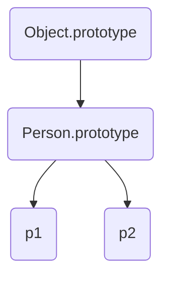

# 2. 기초 문법
**2.1 기본 문법 구조**

자바스크립트(JavaScript)는 웹 브라우저에서 가장 널리 사용되는 클라이언트 사이드 스크립트 언어로, 문서의 구조를 제어하고 동적인 기능을 구현하는 데 필수적입니다. 이 장에서는 자바스크립트가 어떤 방식으로 코드를 구성하고, HTML 문서와는 어떻게 연동되며, 실제 실행은 어떤 과정을 거쳐 이루어지는지 간단히 살펴보겠습니다.

---

## 자바스크립트 문장의 구성(Statement)

자바스크립트에서 ‘문장(Statement)’이란 특정 동작을 지시하는 코드의 한 줄 혹은 한 구문을 말합니다. 보통 한 문장은 세미콜론(`;`)으로 끝맺지만, 자바스크립트에서는 세미콜론을 생략해도 대부분의 경우 제대로 동작합니다. 다만 명시적으로 세미콜론을 사용함으로써 코드 가독성과 예측 가능성을 높일 수 있습니다.

아래는 자바스크립트 문장(Statement)의 기본 예시입니다.

```javascript
let x = 10;        // 변수 선언문(Variable Declaration Statement)
x = x + 5;         // 할당문(Assignment Statement)
console.log(x);    // 함수 호출문(Function Call Statement)
```

- **변수 선언문**: `let`, `const`, `var` 키워드를 사용하여 변수를 선언합니다.
- **할당문**: 선언된 변수에 값을 할당하거나 다시 대입합니다.
- **함수 호출문**: 이미 정의된 함수를 호출하여 코드를 실행합니다.
  
이러한 문장들이 모여 자바스크립트 프로그램을 구성하며, 자바스크립트 엔진은 한 줄씩 차례대로 해석해 나갑니다.

---

## 스크립트 태그를 통한 HTML과 연동

HTML 문서에서 자바스크립트를 사용하기 위해서는 `<script>` 태그를 활용합니다. `<script>` 태그는 두 가지 주요 방식으로 작성할 수 있습니다.

1. **HTML 내부에 직접 삽입(Inline Script)**  
   HTML 파일의 `<body>` 태그나 `<head>` 태그 안에 직접 자바스크립트 코드를 작성하는 방법입니다.

   ```html
   <!DOCTYPE html>
   <html>
   <head>
       <title>JavaScript Example</title>
   </head>
   <body>
       <h1>JavaScript Inline Script Example</h1>
       
       <script>
           // HTML 내부에서 직접 자바스크립트 코드를 작성
           console.log("Hello from inline script!");
       </script>
   </body>
   </html>
   ```

2. **외부 파일 로드(External Script)**  
   별도의 `.js` 파일에 자바스크립트 코드를 작성하고, `<script>` 태그의 `src` 속성을 통해 불러오는 방법입니다. 이 방식은 유지보수성과 재사용성을 높여줍니다.

   ```html
   <!DOCTYPE html>
   <html>
   <head>
       <title>External JavaScript Example</title>
       <!-- 외부 스크립트 파일 연결 -->
       <script src="app.js"></script>
   </head>
   <body>
       <h1>External JavaScript File Example</h1>
   </body>
   </html>
   ```
   ```javascript
   // app.js
   console.log("Hello from external script!");
   ```

- **사용 위치**: 
  - `<head>` 태그 안에 놓으면, HTML 문서가 모두 로드되기 전에 스크립트가 먼저 해석될 수 있습니다.
  - 일반적으로는 `<body>` 태그 끝부분에 스크립트를 배치해 HTML 요소가 먼저 렌더링된 뒤 스크립트가 실행되도록 하는 경우가 많습니다.
- **`defer`와 `async`** 속성: HTML5에서는 `<script>` 태그에 `defer`나 `async`를 사용해 스크립트가 로드되고 실행되는 시점을 제어할 수 있습니다. 
  - `defer`: HTML 해석이 끝난 뒤 스크립트를 순차적으로 실행합니다.
  - `async`: 로드가 끝난 스크립트를 바로 실행합니다(순서 보장 없음).

---

## 실행 흐름과 인터프리터 방식

자바스크립트는 *인터프리터(Interpreter)* 방식으로 동작합니다. 즉, 코드를 한 줄씩 해석하면서 실행을 진행합니다. 최신 자바스크립트 엔진(예: 구글 V8, 스파이더몽키, 차크라 등)은 단순한 인터프리터 방식뿐만 아니라 내부적으로 JIT(Just-In-Time) 컴파일 방식을 병행하여, 실행 성능을 높이기도 합니다.

1. **파싱(Parsing)**  
   자바스크립트 엔진은 코드(문자열 형태)를 받아들여, 구문 분석(파싱)을 통해 추상 구문 트리(AST)를 만듭니다.

2. **인터프리트 & 실행(Interpretation & Execution)**  
   AST를 바탕으로 엔진은 코드 한 줄씩 실행하며, 필요한 경우에는 즉석에서 컴파일을 거쳐 최적화하기도 합니다.

3. **결과 반영(Rendering & DOM 조작)**  
   실행 중 DOM 조작이 발생하면, 웹 브라우저는 문서 구조를 업데이트하고 재렌더링을 진행합니다.

자바스크립트 코드를 올바르게 작성했다면, 브라우저 혹은 런타임 환경(예: Node.js)에서 순차적으로 코드를 해석하여 곧바로 결과를 확인할 수 있습니다. 이러한 방식은 별도의 컴파일 과정이 거의 없기 때문에 빠른 개발-실행 사이클을 제공합니다.

---

## 정리

- **문장(Statement)**: 자바스크립트 코드의 기본 구성 요소로, 한 줄씩 동작을 지시하는 구문입니다. 보통 세미콜론(`;`)으로 종료하며, 가독성과 오류 방지를 위해 사용을 권장합니다.
- **HTML 연동**: `<script>` 태그를 통해 HTML과 쉽게 연동할 수 있으며, 내부 스크립트와 외부 스크립트(External file) 방식을 선택할 수 있습니다.
- **실행 흐름**: 자바스크립트는 인터프리터 방식을 기반으로 하지만, 최신 엔진들은 JIT 컴파일 기법을 적용해 빠른 실행 속도와 높은 효율을 지원합니다.

이러한 기본 문법 구조와 실행 방식에 대한 이해는 자바스크립트를 본격적으로 학습하기 전에 반드시 숙지해야 할 중요한 토대입니다. 다음 장(또는 다음 단원)에서는 자바스크립트의 변수와 데이터 타입에 대해 더욱 깊이 있게 알아보겠습니다.

**2.2 주석, 세미콜론, 코드 스타일**

자바스크립트를 이해하기 위해서는 단순히 문법뿐만 아니라 주석 작성법, 세미콜론 사용 규칙, 그리고 전반적인 코드 스타일에도 주의를 기울여야 합니다. 이 장에서는 코드 품질과 가독성을 높이는 데 필수적인 주석과 세미콜론, 그리고 일관성 있는 코드 스타일을 유지하기 위한 방법들을 자세히 살펴보겠습니다.

---

## 단일 주석(//)과 여러 줄 주석(/* ... */)

### 단일 주석 (Single-line Comment)

- **표기법**: `//`
- **예시**:
  ```javascript
  // 여기는 단일 주석입니다.
  const userName = "John"; // 변수에 사용자 이름을 저장
  ```
- **특징**: `//` 뒤에 오는 한 줄 전체를 주석으로 처리합니다. 주로 간단한 설명이나 임시 테스트용 주석을 작성할 때 사용합니다.

### 여러 줄 주석 (Multi-line Comment)

- **표기법**: `/* ... */`
- **예시**:
  ```javascript
  /* 
    여기는 여러 줄 주석입니다.
    코드의 목적이나 함수 설명 등을 자세히 기술할 때 유용합니다.
  */
  const userAge = 30;
  ```
- **특징**: `/*`와 `*/` 사이에 있는 모든 내용을 주석으로 처리합니다. 코드의 의도나 함수/클래스에 대한 자세한 설명을 제공할 때 사용합니다.

**좋은 주석 습관**  
- 주석은 코드 자체로는 부족한 의도나 배경 정보를 보충하는 수단입니다.  
- 지나치게 많거나, 의미 없는 주석은 오히려 코드 가독성을 떨어뜨릴 수 있으므로 ‘필요한 곳에만 적절히’ 사용하는 것이 좋습니다.

---

## 세미콜론 사용 규칙(자동 세미콜론 삽입)

자바스크립트에서는 문장(Statement)의 끝에 세미콜론(`;`)을 사용하는 것이 원칙입니다. 그러나 자바스크립트 엔진이 ‘자동 세미콜론 삽입(ASI, Automatic Semicolon Insertion)’ 기능을 제공하여, 세미콜론을 생략하더라도 코드를 해석하려고 시도합니다. 

아래 예시는 모두 정상적으로 동작합니다.

```javascript
// 세미콜론을 사용하는 경우
let x = 10;
console.log(x);

// 세미콜론을 생략하는 경우
let y = 20
console.log(y)
```

### 자동 세미콜론 삽입의 주의점

ASI는 편리하지만, 의도하지 않은 동작을 야기할 수 있으므로 주의가 필요합니다.  
예를 들어, 줄 바꿈 위치에 따라 코드를 다르게 해석하게 되는 사례가 있습니다.

```javascript
return // 자동으로 세미콜론이 삽입됨
{
  value: 10
}
```
위 코드는 실제로 다음과 같이 처리됩니다.

```javascript
return; // 즉시 함수 종료
{
  value: 10
}
```

결과적으로 `{ value: 10 }` 객체를 반환하려던 의도와 달리, 함수는 아무것도 반환하지 않고 종료됩니다. 이러한 예외 상황을 방지하기 위해서는 세미콜론을 명시적으로 사용하는 편이 좋습니다.

---

## 들여쓰기, 네이밍 컨벤션, 린트(Lint) 사용

자바스크립트 코드를 팀 단위로 협업하거나, 여러 개발자가 함께 유지보수하는 상황에서는 통일된 스타일 가이드가 필수적입니다. 다음은 가독성과 일관성을 위해 권장되는 기본 원칙들입니다.

### 1. 들여쓰기

- **스페이스(Space)** 또는 **탭(Tab)** 중 하나를 일관되게 사용합니다.
- 일반적으로는 2칸 또는 4칸 스페이스를 많이 사용합니다.
- 예:
  ```javascript
  function greet(name) {
      console.log("Hello, " + name);
  }
  ```

### 2. 네이밍 컨벤션(Naming Convention)

- **변수/함수명**: 소문자로 시작하는 `camelCase`를 주로 사용
  - 예: `userName`, `calculateTotal`
- **클래스/생성자 함수명**: 대문자로 시작하는 `PascalCase`
  - 예: `UserController`, `Car`, `Person`
- **상수(Constant)**: 대문자와 밑줄을 조합
  - 예: `MAX_VALUE`, `API_KEY`  
  (최근에는 자바스크립트에서 `const` 키워드를 사용하기 때문에 반드시 대문자로 작성할 필요는 없지만, 전통적인 스타일을 따르는 경우가 많습니다.)

### 3. 린트(Lint) 사용

- **린트(Linter)**: 코드 내 문법 오류, 스타일 위반 사항, 잠재적 버그 등을 자동으로 검출해 주는 도구입니다.
- 대표적인 자바스크립트 린트 도구: **ESLint**, **JSHint**, **TSLint**(TypeScript용)
- ESLint 예시 설정(`.eslintrc.json`):
  ```json
  {
    "env": {
      "browser": true,
      "es2021": true
    },
    "extends": "eslint:recommended",
    "rules": {
      "semi": ["error", "always"],
      "quotes": ["error", "double"],
      "indent": ["error", 2]
    }
  }
  ```
  - `semi`: 세미콜론(`;`) 사용을 강제
  - `quotes`: 큰따옴표 사용을 강제
  - `indent`: 2칸 들여쓰기 강제  
  등등, 다양한 규칙을 설정하여 팀 내 코드 스타일을 통일할 수 있습니다.

**장점**  
- 스타일 규칙을 자동으로 검사하여 코드 품질 향상
- 팀원 간 스타일 충돌을 최소화
- 잠재적 오류(예: 정의되지 않은 변수 사용) 사전 방지

---

## 정리

1. **주석**  
   - `//`(단일 주석)와 `/* ... */`(여러 줄 주석)를 적절하게 사용해, 코드 이해를 돕고 필요한 설명만 간결하게 작성합니다.

2. **세미콜론**  
   - 자동 세미콜론 삽입(ASI)이 존재하지만, 예외 상황을 방지하기 위해 세미콜론을 명시적으로 사용하는 것이 권장됩니다.

3. **코드 스타일**  
   - 들여쓰기, 네이밍 컨벤션, 린트 도구 등 다양한 방법을 통해 일관성 있고 가독성 높은 코드를 작성할 수 있습니다.
   - 특히, ESLint와 같은 린트 도구를 사용하면 프로젝트 전반에 걸쳐 손쉽게 스타일을 관리하고 오류를 예방할 수 있습니다.

이러한 규칙을 지키면, 협업 시 불필요한 충돌이나 버그를 줄이고 코드를 더욱 깔끔하게 유지할 수 있습니다. 다음 단원에서는 변수와 상수, 그리고 스코프(Scope)에 대해 보다 자세히 알아보겠습니다.

**2.3 식(Expressions)과 문(Statements)**

자바스크립트에서 코드를 작성하다 보면 “식(Expressions)”과 “문(Statements)”이라는 용어를 접하게 됩니다. 둘 다 프로그래밍 언어에서 매우 중요한 구성 요소이지만, 그 개념과 역할이 서로 다릅니다. 이 장에서는 표현식과 문을 구체적으로 구분해 보고, 관련된 사례들을 살펴본 뒤, 블록(`{ ... }`)과 스코프(Scope)의 기초 개념까지 알아보겠습니다.

---

## 1. 표현식(Expression)과 문의 차이

### 표현식(Expression)

- **정의**: 어떤 값을 만들어 내는 코드 조각  
- **예시**:
  - 단순 값: `10`, `"Hello"`, `true`
  - 변수 식: `userName`, `age`
  - 연산 식: `x + 5`, `a * b`
  - 함수 호출 식: `myFunction()`
  - 삼항 연산자: `condition ? value1 : value2`
  
표현식은 **반드시 값(value)을 생성**합니다. 그 값이 숫자, 문자열, 불리언 등 어떤 형태든 간에 표현식 자체가 평가(evaluate)되면 결과값이 도출됩니다.

### 문(Statement)

- **정의**: 특정 동작(행위)을 수행하는 코드 한 줄, 혹은 구문(구조체)  
- **예시**:
  - 선언문: `let x;`, `const name = "John";`
  - if문: 
    ```javascript
    if (x > 10) {
      console.log("x가 10보다 큽니다.");
    }
    ```
  - for문: 
    ```javascript
    for (let i = 0; i < 5; i++) {
      console.log(i);
    }
    ```
  - return문: `return x + 5;`

문(Statement)은 어떤 행위를 지시하는 데 초점을 맞추며, 평가 결과로 **즉시 반환되는 값이 없습니다.** (함수에서 `return` 문을 만나면 그 결과가 함수의 반환값이 되지만, ‘return 문’ 자체는 값이 아닌 동작을 지시하는 문장입니다.)

> **Tip:** 간단히 말해, *표현식은 값이 나오고, 문은 동작을 지시*합니다.

---

## 2. 다양한 표현식 사례

### 대입(할당) 연산

할당 연산(`=`)은 보통 문(Statement)으로 생각하기 쉽지만, 사실 할당식 자체는 **표현식**입니다. 예를 들어 다음 코드를 보겠습니다.

```javascript
let x;
x = 10;
```

위에서 `x = 10;`은 자바스크립트 엔진에서 ‘할당문’으로 분류되지만, 한편으로는 `x = 10` 자체가 값인 `10`을 반환하는 **표현식**이기도 합니다. 이 특성은 다음과 같은 체인 할당에서 분명하게 드러납니다.

```javascript
let a, b, c;
a = b = c = 5;
```

이 경우 `c = 5`가 먼저 평가되어 `5`가 되고, 그 뒤 `b = 5`가 평가되어 `5`가 되며, 마지막에 `a = 5`가 평가됩니다. 따라서 `a`, `b`, `c` 모두 `5`가 되는 것이죠.

### 함수 호출

함수 호출(`myFunction()`) 역시 그 자체가 표현식이 될 수 있습니다. 함수는 호출되면 반환 값을 제공하기 때문에, 이 반환값을 다른 연산에 사용할 수도 있습니다.

```javascript
function add(x, y) {
  return x + y;
}

let result = add(2, 3) * 5; // add(2, 3)은 5라는 값을 반환 -> 최종적으로 5 * 5 = 25
```

`add(2, 3)`이 ‘5’라는 값을 결과로 내놓기 때문에, 전체 표현식인 `add(2, 3) * 5`는 `25`라는 값을 얻게 됩니다. 이런 식으로 다른 연산의 일부로 사용이 가능하다는 점이 바로 ‘표현식’의 특징입니다.

### 삼항 연산자(조건부 연산자)

삼항 연산자(`?:`)는 조건에 따라 다른 값을 생성하는 대표적인 표현식입니다.

```javascript
const age = 20;
const isAdult = (age >= 18) ? "성인" : "미성년자";
```

위 예시에서 `age >= 18`의 결과가 `true`인지 `false`인지에 따라 `isAdult`는 `"성인"` 또는 `"미성년자"`가 됩니다. 모든 연산이 끝나면 최종적으로 “문자열 값”이 생성되므로, 삼항 연산자는 확실한 표현식의 예라고 할 수 있습니다.

---

## 3. 블록(Block)과 스코프의 기초 개념

### 블록(Block)

- 자바스크립트에서 블록이란 `{`와 `}`로 감싸진 코드 영역을 말합니다.
- 함수, 제어문(if, for, while 등), 클래스 등 다양한 곳에서 블록을 활용합니다.

```javascript
{
  let blockVar = "I am inside a block";
  console.log(blockVar);
}
```

위 예시에서 `{ ... }` 내부가 하나의 블록이며, 여기서 선언된 변수 `blockVar`는 블록 내에서만 유효합니다.

### 스코프(Scope)

- **스코프**는 변수나 함수 등이 유효(접근 가능)한 범위를 의미합니다.
- 자바스크립트에는 크게 **전역 스코프(Global Scope)**와 **블록 스코프(Block Scope)**, **함수 스코프(Function Scope)** 가 존재합니다.

#### 전역 스코프(Global Scope)

- 전역 범위에서 선언된 변수나 함수는 어디서든 접근 가능합니다.
- 웹 브라우저 환경에서는 전역 스코프가 곧 `window` 객체의 프로퍼티로 취급됩니다.

#### 함수 스코프(Function Scope)

- 함수 내부에서 `var` 키워드로 선언된 변수들은 오직 그 함수 내에서만 접근이 가능합니다.
- 함수가 종료되면 해당 변수들은 메모리에서 사라집니다.

#### 블록 스코프(Block Scope)

- ES6(ES2015)에서 도입된 `let`, `const` 키워드로 선언된 변수는 **블록 스코프**를 따릅니다.
- 블록(`{ ... }`) 내부에서만 유효하며, 바깥에서는 접근할 수 없습니다.
  
```javascript
let globalVar = "Global";

if (true) {
  let blockVar = "Block Scope";
  console.log(globalVar); // "Global" 출력
  console.log(blockVar);  // "Block Scope" 출력
}

console.log(globalVar); // "Global" 출력
console.log(blockVar);  // ReferenceError: blockVar is not defined
```

위 예시에서 `blockVar`는 if문의 블록 내부에서만 유효합니다. 블록을 벗어난 후에는 더 이상 접근할 수 없어 오류가 발생합니다.

---

## 정리

1. **표현식(Expression)**  
   - 값을 생성하는 코드 조각이며, 평가 결과로 반드시 값이 도출됩니다.  
   - 예: `x + 5`, `myFunction()`, 삼항 연산자 등

2. **문(Statement)**  
   - 어떤 동작을 지시하는 구문(코드 한 줄).  
   - 예: `if`, `for`, `return`, `let x = 10;` 등

3. **블록(Block)과 스코프(Scope)**  
   - `{ ... }`로 감싸진 부분을 ‘블록’이라 하며, 함수, 제어문 등에서 사용합니다.  
   - `let`과 `const`는 블록 스코프를, `var`는 함수 스코프를 가집니다.  
   - 전역 스코프, 함수 스코프, 블록 스코프의 개념을 잘 이해해야 변수 유효 범위를 적절히 관리할 수 있습니다.

표현식과 문을 올바르게 구분하고, 블록과 스코프를 적절히 활용할 수 있어야 자바스크립트 코드 구조를 더 명확하고 안전하게 설계할 수 있습니다. 이어지는 다음 내용에서는 좀 더 구체적인 변수 사용 방법과 데이터 타입에 대해 살펴볼 예정입니다.

---

# 3. 데이터 타입과 변수
**3.1 기본 데이터 타입**

자바스크립트에서 변수에 저장할 수 있는 값들은 크게 _원시 타입(Primitive Type)_과 _객체 타입(Object Type)_으로 나눌 수 있습니다. 이 장에서는 먼저 원시 타입과 그 특징을 살펴보고, ES2020에서 새롭게 추가된 `BigInt` 타입, 그리고 데이터 타입을 확인할 때 유용한 `typeof` 연산자에 대해 알아보겠습니다.

---

## 1. 원시 타입(Primitive)

**원시 타입**이란, 더 이상 분해할 수 없는 가장 기본적인 단일 값 형태를 의미합니다. 자바스크립트에는 아래와 같은 여섯 가지 원시 타입이 존재합니다.

1. **String**
2. **Number**
3. **Boolean**
4. **Null**
5. **Undefined**
6. **Symbol** (ES6에서 도입)

### 1.1 String

- 문자열을 나타내는 타입  
- 작은따옴표(`' '`), 큰따옴표(`" "`), 백틱(\`\`) 등을 사용하여 표현합니다.

  ```javascript
  const greeting = "Hello World";
  const singleQuote = 'Hello World';
  const templateLiteral = `Hello World`;
  ```
  
- **백틱(``` ` ```) 사용**: 템플릿 리터럴(Template Literal)을 통해 문자열 보간(String Interpolation)이나 여러 줄 문자열을 간편하게 작성할 수 있습니다.
  
  ```javascript
  const name = "Alice";
  const message = `안녕하세요, ${name}님!`; // 안녕하세요, Alice님!
  ```

### 1.2 Number

- 숫자를 나타내는 타입  
- 정수(Integer), 부동소수점(Floating point) 등을 구분하지 않고 모두 `number`라는 단일 타입으로 관리합니다.
  
  ```javascript
  const age = 30;         // 정수
  const pi = 3.14;        // 실수
  const exponent = 2e5;   // 200000 (지수 표기)
  ```

- **주의 사항**:  
  - 정밀도 문제: 자바스크립트의 `number`는 64비트 부동소수점 형식을 따르므로, 아주 큰 정수를 정확히 표현하지 못할 수 있습니다.  
  - `NaN`(Not a Number), `Infinity` 등도 `number` 타입에 속합니다.

### 1.3 Boolean

- 논리적 참(`true`)과 거짓(`false`)을 나타내는 타입입니다.
  
  ```javascript
  const isAdult = true;
  const isStudent = false;
  ```

- 조건문, 반복문 등에서 자주 활용되며, 비교 연산이나 논리 연산의 결과로도 얻을 수 있습니다.

  ```javascript
  const result = (10 > 5); // true
  ```

### 1.4 Null

- 의도적으로 “값이 없음”을 명시할 때 사용합니다.
- 변수에 `null`을 할당하면, 그 변수의 값이 “비어 있음”을 의미합니다.

  ```javascript
  let user = null;
  console.log(user);  // null
  ```

- `typeof null`을 수행하면 `"object"`가 반환되는 자바스크립트의 오래된 버그가 있으니 주의해야 합니다. (타입 자체는 원시 타입입니다.)

### 1.5 Undefined

- “정의되지 않음”을 의미하며, 보통 값을 부여하지 않은 변수를 나타낼 때 사용됩니다.
  
  ```javascript
  let address;
  console.log(address);  // undefined
  ```

- 함수에서 명시적으로 `return` 문을 사용하지 않을 때 반환되는 값도 `undefined`가 됩니다.

  ```javascript
  function noReturn() {
    // 별도의 return 문이 없음
  }
  console.log(noReturn()); // undefined
  ```

### 1.6 Symbol (ES6에서 도입)

- **고유하고 변경 불가능한(immutable) 식별자**를 만들 때 사용하는 타입입니다.
- 충돌을 방지하기 위해 유니크한 값이 필요할 때 활용됩니다.

  ```javascript
  const sym1 = Symbol('unique');
  const sym2 = Symbol('unique');
  console.log(sym1 === sym2); // false -> 서로 다른 고유한 심볼
  ```

- 객체의 프로퍼티 키로 사용하면, 다른 코드에서 임의로 덮어쓰여질 위험이 적습니다.

  ```javascript
  const MY_KEY = Symbol('myPrivateKey');
  
  const myObj = {
    [MY_KEY]: 12345
  };
  
  console.log(myObj[MY_KEY]); // 12345
  // 일반적인 방법으로 MY_KEY 프로퍼티에 접근하기 어려움
  ```

---

## 2. BigInt (ES2020)

기존 `number` 타입은 **2의 53제곱 - 1**(약 9,007,199,254,740,991)까지의 정수만 정밀하게 표현할 수 있습니다. 이 범위를 벗어나는 큰 정수를 다루기 위해 **ES2020**에서 `BigInt`가 도입되었습니다.

```javascript
// BigInt 생성
const bigNumber = 9007199254740991n;  // 숫자 리터럴 뒤에 'n'을 붙여 표현
const anotherBig = BigInt("9007199254740992");  // BigInt 함수 호출
```

- **끝에 `n`을 붙이는 형태**가 일반적이며, 이를 *BigInt 리터럴*이라고 부릅니다.
- 기본 연산(+, -, *, **)을 BigInt에 적용할 수 있지만, `number` 타입과 섞어 쓸 수는 없습니다.

  ```javascript
  const big1 = 123456789012345678901234567890n;
  const big2 = 987654321098765432109876543210n;
  console.log(big1 + big2); // 정상적인 큰 정수 연산 결과가 나옴
  
  // 하지만 다음 코드는 에러 발생(TypeError)
  // console.log(big1 + 10); 
  ```

- BigInt는 매우 큰 정수를 정확하게 다룰 수 있지만, 부동소수점 연산이 필요한 경우에는 사용할 수 없습니다.

---

## 3. typeof 연산자의 활용

자바스크립트에서 값의 타입을 확인할 때는 **`typeof` 연산자**를 사용합니다.

```javascript
console.log(typeof 123);        // "number"
console.log(typeof "Hello");    // "string"
console.log(typeof true);       // "boolean"
console.log(typeof null);       // "object" (자바스크립트의 오래된 버그)
console.log(typeof undefined);  // "undefined"
console.log(typeof Symbol());   // "symbol"
console.log(typeof 123n);       // "bigint"
```

- **주의**: `typeof null`이 `"null"`이 아닌 `"object"`로 나오는 것은 언어 설계상의 유물(버그)에 가깝습니다.
- `BigInt` 타입은 `"bigint"`라는 문자열을 반환하므로, ES2020 이후 환경에서만 가능합니다.

### typeof의 활용 예시

- **타입 분기 처리**: 변수의 타입에 따라 다른 로직을 실행하고 싶을 때
  ```javascript
  function checkValueType(val) {
    switch (typeof val) {
      case "string":
        console.log("문자열입니다.");
        break;
      case "number":
        console.log("숫자입니다.");
        break;
      case "boolean":
        console.log("불리언입니다.");
        break;
      case "object":
        console.log("객체나 null일 수 있습니다.");
        break;
      case "undefined":
        console.log("정의되지 않은 값입니다.");
        break;
      case "symbol":
        console.log("심볼 타입입니다.");
        break;
      case "bigint":
        console.log("BigInt 타입입니다.");
        break;
      default:
        console.log("알 수 없는 타입입니다.");
    }
  }
  ```

- **데이터 검증**: 함수에 전달된 파라미터 타입이 예상대로 들어왔는지 검사할 때  
  ```javascript
  function square(num) {
    if (typeof num !== "number") {
      throw new Error("숫자 타입만 가능합니다.");
    }
    return num * num;
  }
  ```

---

## 정리

1. **원시 타입(Primitive)**
   - 자바스크립트의 기본 데이터 타입으로, 더 이상 나눌 수 없는 단일 값입니다.
   - `String`, `Number`, `Boolean`, `Null`, `Undefined`, `Symbol`이 있으며, 각각 용도와 특징을 이해해야 합니다.

2. **BigInt (ES2020)**
   - 2의 53제곱 - 1을 넘어서는 큰 정수를 안전하게 다룰 수 있는 타입입니다.
   - `n` 접미사를 사용하거나 `BigInt()` 함수를 통해 생성합니다.

3. **typeof 연산자**
   - 변수 또는 값의 타입을 문자열로 반환해 줍니다.
   - 동적 타입 언어인 자바스크립트에서, 런타임에 타입을 확인할 때 유용하게 쓰입니다.
   - `null`에 대해서는 `"object"`가 반환되는 예외 사항이 있으므로 주의가 필요합니다.

이처럼 자바스크립트에서는 다양한 형태의 원시 타입을 활용해 데이터를 표현합니다. 원시 타입에 대한 정확한 이해는 이후 객체(Object)나 함수(Functional) 구조 등을 배울 때 중요한 토대가 됩니다. 다음에는 객체 타입, 배열, 그리고 객체의 내부 속성 등에 대해 좀 더 심도 있게 살펴보겠습니다.

**3.2 변수 선언과 스코프**

자바스크립트에서 변수를 선언하는 방식은 언어의 역사와 함께 꾸준히 발전해 왔습니다. 초기에는 `var`만 존재했지만, ES6(ECMAScript 2015)부터 `let`과 `const`가 추가되어 좀 더 안전하고 명확한 코드 작성이 가능해졌습니다. 이 장에서는 `var`, `let`, `const`의 차이점을 살펴보고, 자바스크립트 스코프의 개념인 전역 스코프(Global Scope), 함수 스코프(Function Scope), 블록 스코프(Block Scope)에 대해 알아보겠습니다. 또한 변수의 생존 범위와 메모리 할당이 어떻게 이뤄지는지도 간략히 살펴보겠습니다.

---

## 1. var, let, const 차이

### 1.1 var

- **함수 스코프(Function Scope)**  
  `var`로 선언된 변수는 오직 **함수 단위**로만 스코프가 구분됩니다.  
  ```javascript
  function example() {
    var x = 10;
    if (true) {
      var y = 20;
    }
    console.log(x); // 10
    console.log(y); // 20 (블록 내부가 아닌 함수 전체에서 유효)
  }
  console.log(x); // ReferenceError: x is not defined (함수 밖에서는 접근 불가)
  ```

- **호이스팅(Hoisting)**  
  `var`로 선언된 변수는 **선언이 최상위로 끌어올려지는(hoisting)** 현상이 발생합니다. 실제 실행 시점에 선언만 맨 위로 올라가고, 할당은 원래 위치에서 이뤄집니다.
  ```javascript
  console.log(a); // undefined (오류는 아님, 선언이 끌어올려져 있으므로)
  var a = 5;
  ```
  - 이는 “런타임 시 변수 선언이 스코프의 최상단으로 이동한다”는 것을 의미합니다.
  - 단, 값이 할당되기 전이므로 ‘정의되지 않음(undefined)’ 상태가 됩니다.

- **재선언 가능**  
  같은 스코프 내에서 `var` 키워드로 중복 선언할 수 있습니다. 이는 코드 가독성에 혼란을 줄 수 있으므로 주의가 필요합니다.
  ```javascript
  var a = 10;
  var a = 20; // 문법 오류 아님, 단 값이 덮어씌워짐
  ```

### 1.2 let

- **블록 스코프(Block Scope)**  
  `let` 키워드는 블록(`{ ... }`) 단위로 스코프가 구분됩니다.  
  ```javascript
  if (true) {
    let x = 10;
    console.log(x); // 10
  }
  console.log(x); // ReferenceError: x is not defined
  ```
  - 블록이 끝나면 해당 블록 내부에서 선언된 변수는 더 이상 유효하지 않습니다.

- **재선언 불가능(단, 같은 스코프 내)**  
  동일한 스코프 범위 내에서 동일 변수명을 `let`으로 중복 선언하면 문법 오류가 발생합니다.  
  ```javascript
  let y = 10;
  let y = 20; // SyntaxError: Identifier 'y' has already been declared
  ```
  - 하지만 상위 스코프와 하위 스코프에서 동일 이름을 사용할 수는 있습니다(“이름이 가려짐(Shadowing)” 현상 주의).

- **호이스팅과 ‘임시 사각지대(Temporal Dead Zone, TDZ)’**  
  `let` 역시 선언이 어느 정도 끌어올려지지만, ‘TDZ’에 의해 실제 코드가 선언문을 지나기 전에는 변수를 사용할 수 없습니다.  
  ```javascript
  console.log(z); // ReferenceError: Cannot access 'z' before initialization
  let z = 5;
  ```
  - 즉, **호이스팅 자체는 일어나지만, 선언문 이전에 접근할 경우 오류가 발생**한다는 점이 `var`와 다릅니다.

### 1.3 const

- **블록 스코프(Block Scope)**  
  `const`도 `let`처럼 블록 스코프를 갖습니다.
- **상수 선언**  
  `const`는 ‘상수(constant)’를 선언할 때 사용합니다. 한 번 할당한 값을 다시 변경할 수 없습니다.
  ```javascript
  const PI = 3.14;
  PI = 3.14159; // TypeError: Assignment to constant variable
  ```
- **초기화 필수**  
  `const`로 변수를 선언할 때는 **반드시 선언과 동시에 초기화**해야 합니다.  
  ```javascript
  const myVal; // SyntaxError: Missing initializer in const declaration
  ```
- **객체 참조 주의**  
  `const`로 선언된 객체나 배열은 참조(Reference)가 고정될 뿐, 객체 내부의 프로퍼티 변경이나 배열의 원소 변경은 가능합니다.
  ```javascript
  const obj = { name: "Alice" };
  obj.name = "Bob";    // 가능
  // obj = { name: "Charlie" }; // Error, 참조 자체를 바꾸는 것은 불가능
  ```

---

## 2. 전역 스코프, 함수 스코프, 블록 스코프

자바스크립트에서 스코프(Scope)란 변수나 함수가 **어디에서 접근할 수 있고, 어디에서 사라지는지**를 결정하는 범위입니다.  

### 2.1 전역 스코프(Global Scope)

- **설명**: 스크립트 전체, 또는 어떤 함수나 블록에도 속하지 않는 최상위 영역입니다.
- **특징**:
  - 전역 스코프에서 선언된 변수는 어느 곳에서든지 접근할 수 있습니다.
  - 전역 변수는 페이지나 프로그램이 종료될 때까지 메모리에 유지됩니다.
- **주의**: 전역 변수는 다른 스크립트나 라이브러리와 이름 충돌을 일으키기 쉽고, 메모리 사용 면에서도 비효율적일 수 있어 가급적 사용을 최소화하는 것이 좋습니다.

### 2.2 함수 스코프(Function Scope)

- **설명**: 함수 내부에서 `var` 키워드로 선언된 변수는 함수가 끝날 때까지 유효합니다.
- **특징**:
  - 함수가 호출될 때 변수와 함수 선언이 초기화되고, 함수 실행이 끝나면 메모리에서 해제됩니다(가비지 컬렉션 대상).
  - ES6 이후에는 `let`, `const`도 블록 스코프에 묶이지만, 함수를 기준으로 보면 함수가 끝나면 결국 사라지므로 비슷한 개념으로 볼 수도 있습니다.

### 2.3 블록 스코프(Block Scope)

- **설명**: `{ ... }`로 둘러싸인 구역(블록) 내에서만 유효한 스코프입니다.
- **특징**:
  - `let`과 `const`는 블록 스코프를 따르며, 블록이 끝나면 변수나 상수가 해제됩니다.
  - 제어문(if, for, while 등) 또는 함수, 클래스, 객체 리터럴 내부 등 다양한 곳에서 블록이 형성됩니다.

---

## 3. 변수의 생존 범위와 메모리 할당

### 3.1 변수 생존 범위(Lifetime)

- **전역 변수**: 자바스크립트 프로그램(또는 웹 페이지)이 로드되는 시점에 메모리에 할당되며, 페이지가 닫히거나 프로그램이 종료될 때 해제됩니다.
- **함수 스코프 변수(var)**: 함수가 호출될 때 생성되고, 함수 실행이 종료되면 사라집니다.
- **블록 스코프 변수(let, const)**: 블록이 실행되기 직전(호이스팅된 순간) 메모리에 잠깐 예약되지만, 실제로 선언문을 만나야 사용할 수 있습니다. 블록이 끝나면 해제됩니다.

### 3.2 메모리 할당과 가비지 컬렉션(Garbage Collection)

자바스크립트는 메모리 관리를 자동으로 처리하기 때문에, C나 C++처럼 개발자가 직접 메모리를 해제할 필요는 없습니다.  
- **할당**: 변수를 선언하면 자바스크립트 엔진이 적절히 메모리를 확보합니다.
- **가비지 컬렉션(GC)**: 더 이상 참조되지 않는 객체나 변수를 감지해 자동으로 메모리를 해제합니다.

> **주의**: 가비지 컬렉션은 자동이지만, **전역 스코프**에 변수가 남아있거나 함수 클로저로 인해 참조가 살아 있으면 쉽게 해제되지 않아 메모리 누수가 발생할 수 있습니다. 따라서 스코프 범위를 잘 이해하고 변수를 알맞게 선언하는 것이 중요합니다.

---

## 정리

1. **`var`, `let`, `const` 차이**  
   - `var`: 함수 스코프, 호이스팅 시 ‘선언만 끌어올려짐’, 재선언 가능  
   - `let`: 블록 스코프, 중복 선언 불가, TDZ로 인해 선언 전 사용 시 에러  
   - `const`: 블록 스코프, 재할당 및 재선언 불가(초기화 필수), 객체 참조는 변경 가능

2. **스코프의 종류**  
   - 전역 스코프(Global Scope): 프로그램 전체에서 접근 가능  
   - 함수 스코프(Function Scope): `var`로 선언한 변수는 함수 내부에서만 유효  
   - 블록 스코프(Block Scope): `{ ... }` 내부에서만 유효, `let`·`const` 키워드 적용

3. **변수 생존 범위와 메모리**  
   - 전역 변수는 프로그램 종료 시까지, 함수 스코프 변수는 함수 종료 시까지, 블록 스코프 변수는 블록이 끝나면 생명 주기가 종료됩니다.  
   - 자바스크립트 엔진은 가비지 컬렉션을 통해 자동으로 메모리를 해제하므로, 스코프 구조를 잘 설계하여 메모리 누수를 방지해야 합니다.

이러한 스코프와 변수 선언 규칙을 잘 이해하면 코드의 예측 가능성과 안정성을 높일 수 있습니다. 특히 블록 스코프와 `const`를 적절히 활용하면, 의도치 않은 변수 재선언이나 재할당으로 인한 버그를 크게 줄일 수 있습니다. 다음에는 데이터 타입과 변수 관련 추가 심화 개념(형변환, 타이핑 등)에 대해 더 알아보겠습니다.

**3.3 동적 타이핑과 타입 변환**

자바스크립트는 **동적 타이핑(Dynamic Typing)**을 사용하는 언어입니다. 즉, 변수를 선언할 때 별도로 타입을 지정하지 않고, 필요에 따라 값의 타입이 자동으로 변환(혹은 변환할 수 있음)되는 특징이 있습니다. 이러한 변환은 크게 **암묵적(Implicit)** 변환과 **명시적(Explicit)** 변환으로 나눌 수 있으며, 잘못 이해할 경우 예기치 못한 결과를 초래할 수도 있습니다. 이 장에서는 자바스크립트의 동적 타이핑이 구체적으로 어떻게 작동하는지, 그리고 `NaN`, `Infinity`와 같은 특수 숫자 값들에 대해 알아보겠습니다.

---

## 1. 암묵적(Implicit) 변환

자바스크립트 엔진은 문맥(Context)에 따라 자동으로 변수를 다른 타입으로 변경할 수 있습니다. 이를 *암묵적 형 변환* 또는 *타입 강제 변환(Type Coercion)*이라 합니다. 

### 1.1 문자열 ↔ 숫자 간 변환

#### 문자열 + 숫자

- **문자열 연결 연산**(`+`)을 사용할 때, 피연산자 중 하나라도 문자열이면 자바스크립트 엔진은 나머지 피연산자도 **문자열**로 변환합니다.  
  ```javascript
  console.log("Hello" + 5); // "Hello5"
  console.log("10" + 2);    // "102" (문자열 연결로 처리)
  ```
  
#### 숫자 연산자(-, *, /)와 문자열

- `+`를 제외한 산술 연산자(`-`, `*`, `/`, `%` 등)를 사용할 때, 문자열이 숫자로 해석될 수 있으면 **숫자**로 변환 후 연산을 수행합니다.  
  ```javascript
  console.log("10" - 2);  // 8
  console.log("6" * 3);   // 18
  console.log("4" / 2);   // 2
  ```
- 만약 문자열이 숫자로 해석될 수 없는 경우, 결과는 `NaN`이 됩니다.
  ```javascript
  console.log("abc" - 2); // NaN
  ```

### 1.2 Boolean 변환(Truthiness and Falsiness)

자바스크립트에서 **조건문**, **논리 연산** 등에서는 피연산자가 자동으로 불리언(Boolean) 값으로 변환됩니다. 다음 값들은 ‘거짓(Falsy)’로 평가됩니다.

- `0`
- `""` (빈 문자열)
- `null`
- `undefined`
- `NaN`
- `false`

위의 값들을 제외한 모든 값(숫자, 문자열, 객체 등)은 **참(Truthy)**으로 평가됩니다. 예를 들어:

```javascript
if ("") {
  console.log("참");
} else {
  console.log("거짓");  // 빈 문자열("")은 false로 변환
}

if ("Hello") {
  console.log("참");    // 빈 문자열이 아니므로 true로 변환
}

if (0) {
  console.log("참");
} else {
  console.log("거짓");  // 0은 false
}
```

---

## 2. 명시적(Explicit) 변환

암묵적 변환은 편리하지만, 가독성을 해치거나 의도하지 않은 결과를 낳을 수 있습니다. 따라서 필요한 경우에는 함수를 통해 **명시적으로** 타입을 변환하는 것이 안전하고 권장됩니다.

### 2.1 Number() 함수를 통한 숫자 변환

- **문자열 → 숫자**:  
  ```javascript
  console.log(Number("123"));  // 123
  console.log(Number("  123  ")); // 123 (문자열 양 옆 공백은 무시)
  console.log(Number("12.34")); // 12.34
  console.log(Number("abc"));   // NaN (숫자로 변환 불가능)
  ```
- **불리언 → 숫자**:  
  ```javascript
  console.log(Number(true));  // 1
  console.log(Number(false)); // 0
  ```
- `null`은 0, `undefined`는 `NaN`으로 변환됩니다.  
  ```javascript
  console.log(Number(null));      // 0
  console.log(Number(undefined)); // NaN
  ```

#### parseInt(), parseFloat()

숫자 변환 시 `parseInt()`, `parseFloat()` 함수를 사용해 정수나 실수 형태로 구문 분석할 수도 있습니다.
  
```javascript
console.log(parseInt("123.45"));   // 123
console.log(parseFloat("123.45")); // 123.45
console.log(parseInt("  50px"));   // 50 (문자와 함께 사용 시 앞 숫자만 해석)
console.log(parseFloat("abc"));    // NaN
```

### 2.2 String() 함수 또는 toString() 메서드를 통한 문자열 변환

- **String()** 함수를 직접 사용  
  ```javascript
  console.log(String(123));   // "123"
  console.log(String(true));  // "true"
  console.log(String(null));  // "null"
  ```
- **toString()** 메서드를 호출  
  ```javascript
  const num = 10;
  console.log(num.toString()); // "10"
  ```
  - 단, `null`과 `undefined`에는 `toString()` 메서드가 없으므로 에러가 발생합니다.

### 2.3 Boolean() 함수를 통한 불리언 변환

- **falsy** 값은 `false`, 나머지는 `true`로 변환됩니다.  
  ```javascript
  console.log(Boolean(0));        // false
  console.log(Boolean(""));       // false
  console.log(Boolean(undefined)); // false
  console.log(Boolean("Hello"));  // true
  console.log(Boolean(42));       // true
  ```

---

## 3. NaN, Infinity 등 특수 숫자 값

### 3.1 NaN (Not a Number)

- 자바스크립트에서 **숫자가 아닌 값** 또는 **숫자로 변환할 수 없는 상황**을 의미하는 특별한 숫자 값입니다.
- **타입**은 `number`이며, 다음과 같은 경우에 발생합니다.
  ```javascript
  console.log("abc" - 2);       // NaN
  console.log(parseInt("xyz")); // NaN
  ```
- `NaN`은 자기 자신과도 일치하지 않는 유일한 값입니다.
  ```javascript
  console.log(NaN === NaN); // false
  ```
- **검사 방법**:
  - `isNaN()` 함수를 사용하거나,
  - `Number.isNaN()` (ES6) 내장 함수를 사용하는 것을 권장합니다.
    ```javascript
    console.log(isNaN("abc"));        // true
    console.log(Number.isNaN("abc")); // false (문자열은 숫자 변환 시 NaN이 되므로, "abc"를 바로 NaN으로 보지 않음)
    console.log(Number.isNaN(NaN));   // true
    ```

### 3.2 Infinity / -Infinity

- 매우 큰 수를 나타낼 때, 자바스크립트에서 일정 범위를 초과하면 `Infinity` (양의 무한대) 또는 `-Infinity` (음의 무한대)로 표현됩니다.
- 이 또한 `typeof` 결과는 `number`입니다.
  ```javascript
  console.log(1 / 0);  // Infinity
  console.log(-1 / 0); // -Infinity
  console.log(Infinity + 1); // Infinity
  ```
- 실제 무한대가 아니라 오버플로우 범위를 넘어섰다는 표시이므로, 계산 시 주의가 필요합니다.

---

## 정리

1. **동적 타이핑(Dynamic Typing)**
   - 자바스크립트에서는 변수에 어떤 타입의 값이 들어가든 자유롭게 할당될 수 있으며, 상황에 따라 타입이 암묵적으로 변환됩니다.

2. **암묵적(Implicit) 변환**
   - 문자열 + 숫자 연산 시 문자열 연결 우선
   - `-`, `*`, `/` 등의 숫자 연산자 사용 시 문자열이 숫자로 변환
   - Boolean 변환 시 `falsy`(0, "", null, undefined, NaN, false) 이외는 모두 true로 취급

3. **명시적(Explicit) 변환**
   - `Number()`, `String()`, `Boolean()` 등을 사용하여 목적하는 타입으로 명시적으로 변환
   - `parseInt()`, `parseFloat()`로 숫자 구문 분석 가능

4. **NaN, Infinity 등 특수 숫자 값**
   - `NaN`: ‘숫자가 아닌 값’, 자기 자신과도 일치하지 않음
   - `Infinity` / `-Infinity`: 유효 숫자 범위를 넘어선 결과

자바스크립트의 동적 타이핑과 타입 변환 규칙을 정확히 이해하면, 예기치 못한 버그를 줄이고 코드의 안정성을 높일 수 있습니다. 특히 **암묵적 변환**이 발생할 상황을 피하거나, 필요한 경우에는 **명시적 변환**을 통해 의도를 분명히 드러내는 것이 베스트 프랙티스입니다. 다음 장에서는 객체, 배열, 함수 등의 참조 타입(객체 타입) 사용법을 알아보기 전에, 원시 타입을 더욱 활용하는 방법이나 주의사항을 좀 더 살펴보겠습니다.

---

# 4. 연산자
**4.1 산술 연산자**

자바스크립트에서 산술 연산자는 숫자(또는 숫자로 변환 가능한 값)에 대해 사칙연산, 나머지 연산, 지수 연산 등을 수행할 때 사용됩니다. 산술 연산자의 기본적인 종류와 동작 방식, 그리고 단항 연산자의 특성에 대해 자세히 살펴보겠습니다.

---

## 1. 주요 산술 연산자

### 1.1 덧셈(`+`)

- 두 수를 더하거나, 문자열과 만나면 문자열 연결 연산으로 사용됩니다.
- **숫자 + 숫자**는 산술 덧셈을 수행합니다.
  ```javascript
  console.log(5 + 2);       // 7
  console.log(3.14 + 1.86); // 5.0 (부동소수점 덧셈)
  ```
- **숫자 + 문자열**의 경우는 자동으로 문자열 변환이 일어나, 숫자가 문자열로 변환된 뒤 연결됩니다.
  ```javascript
  console.log("Hello" + 5);    // "Hello5"
  console.log("10" + 2);       // "102"
  ```

### 1.2 뺄셈(`-`)

- 두 수의 차를 구합니다.
- **숫자 - 문자열**인 경우, 문자열이 숫자로 변환될 수 있으면 연산을 수행하고, 변환 불가능하면 `NaN`이 됩니다.
  ```javascript
  console.log(5 - 2);      // 3
  console.log("10" - 3);   // 7 (문자열 "10" -> 숫자 10으로 변환)
  console.log("abc" - 1);  // NaN
  ```

### 1.3 곱셈(`*`)

- 두 수의 곱을 구합니다.
- 문자열이 숫자로 해석될 수 있으면 변환 후 곱셈을 수행합니다.  
  ```javascript
  console.log(4 * 5);     // 20
  console.log("6" * 3);   // 18
  console.log("abc" * 2); // NaN
  ```

### 1.4 나눗셈(`/`)

- 두 수를 나눈 결과를 반환합니다(실수로 계산).
- 정수 나눗셈이 따로 없으며, 결과는 부동소수점(Float) 형태가 될 수 있습니다.
  ```javascript
  console.log(10 / 2);    // 5
  console.log(7 / 2);     // 3.5
  console.log("9" / 3);   // 3 ("9" -> 9로 변환)
  console.log("abc" / 2); // NaN
  ```

### 1.5 나머지(`%`)

- 두 수를 나눈 뒤 **나머지**를 반환합니다.  
  ```javascript
  console.log(10 % 3); // 1 (10을 3으로 나눈 나머지 1)
  console.log(7 % 2);  // 1
  ```
- 피연산자가 실수 형태여도, 내부적으로 같은 계산 과정에서 나머지를 반환합니다.  
  ```javascript
  console.log(7.5 % 2); // 1.5
  ```

### 1.6 거듭제곱(`**`)

- ES2016(ES7)에서 도입된 연산자로, 왼쪽 피연산자를 오른쪽 피연산자만큼 거듭제곱 한 결과를 구합니다.
  ```javascript
  console.log(2 ** 3);  // 8 (2의 3제곱)
  console.log(5 ** 2);  // 25
  console.log(4 ** 0.5); // 2 (4의 0.5제곱, 즉 √4)
  ```
- 기존에는 `Math.pow()` 함수를 사용했으나, `**` 연산자로 간편하게 쓸 수 있습니다.

---

## 2. 정수 나눗셈과 실수 나눗셈 차이

다른 언어(C, Java 등)에서는 정수 나눗셈과 실수 나눗셈이 구분되어, 정수끼리 나누면 나머지를 버린 정수 몫만 반환하거나 에러가 발생하기도 합니다. 반면에 **자바스크립트에는 별도의 정수 타입이 없고(`number`는 모두 64비트 부동소수점)**, 나눗셈 연산(`/`) 자체가 **항상 실수 형태**로 결과를 나타냅니다.

```javascript
console.log(5 / 2); // 2.5 (정수 나눗셈이 아닌 실수 결과)
```

- 따라서 정수 나눗셈을 모사하고 싶다면, `Math.floor()` 함수를 적용해야 합니다.
  ```javascript
  const result = Math.floor(5 / 2); // 2
  ```
- 또는 `~~(x / y)`와 같은 이중 틸드(비트 연산) 기법도 있으나, 음수 처리 등에서 주의해야 합니다.

---

## 3. 단항 연산자(++, --)

### 3.1 증가 연산자(`++`)

- 피연산자의 값을 1 증가시킵니다.
- 위치에 따라 **전위 증가(++x)**와 **후위 증가(x++)**로 구분됩니다.

  ```javascript
  let x = 5;
  console.log(++x); // 전위 증가: x를 먼저 6으로 만든 뒤 출력 -> 6
  console.log(x);   // 6

  let y = 5;
  console.log(y++); // 후위 증가: 현재 y(5)를 먼저 반환 후, y를 6으로 증가 -> 5
  console.log(y);   // 6
  ```

### 3.2 감소 연산자(`--`)

- 피연산자의 값을 1 감소시킵니다.
- 마찬가지로 **전위 감소(--x)**와 **후위 감소(x--)** 형태가 있습니다.

  ```javascript
  let a = 3;
  console.log(--a); // 전위 감소: 먼저 2로 감소한 후 출력 -> 2
  console.log(a);   // 2

  let b = 3;
  console.log(b--); // 후위 감소: 현재 b(3)를 반환 후, b를 2로 감소 -> 3
  console.log(b);   // 2
  ```

> **주의**: 전위/후위 연산자를 사용할 때는 코드가 복잡해질 수 있으므로, 가독성을 위해 필요한 상황에서만 사용하길 권장합니다. 값을 업데이트하는 로직과 그 결과를 동시에 확인해야 하는 경우가 아니라면, 연산을 분리해서 작성하는 것이 좋습니다.

---

## 정리

1. **주요 산술 연산자**
   - `+`, `-`, `*`, `/`, `%`, `**` 등을 사용해 덧셈, 뺄셈, 곱셈, 나눗셈, 나머지, 거듭제곱 연산을 수행합니다.
   - 나눗셈(`/`)은 정수/실수를 구분하지 않으며, 항상 부동소수점 형태로 결과를 반환합니다.

2. **정수 나눗셈 vs. 실수 나눗셈**
   - 자바스크립트는 정수 타입이 존재하지 않으므로, `5 / 2`는 2.5처럼 실수 값을 반환합니다.
   - 정수 부분만 얻으려면 `Math.floor()`를 사용해야 합니다.

3. **단항 연산자(++, --)**
   - 변수의 값을 1 증가시키거나 감소시키는 연산자입니다.
   - 전위(`++x`, `--x`)와 후위(`x++`, `x--`) 방식에 따라 연산 순서와 반환값이 달라집니다.

이처럼 산술 연산자는 자바스크립트에서 기본적이고 자주 쓰이는 기능이며, 특히 **나눗셈 결과가 언제나 실수**로 표현된다는 점과 **전위/후위 증가·감소 연산자의 차이**를 정확히 이해해 두는 것이 중요합니다. 다음 단원에서는 비교 연산자, 논리 연산자 등을 배워 복합적인 조건을 다루는 방법을 살펴보겠습니다.

**4.2 할당 연산자**

할당 연산자는 변수나 상수에 값을 저장(할당)할 때 사용하는 연산자입니다. 자바스크립트에서는 기본적인 `=` 연산자 외에도 기존 값에 덧셈, 뺄셈, 곱셈, 나눗셈 등을 한 후 결과를 바로 할당하는 **복합 할당 연산자**를 제공합니다. 이 장에서는 대표적인 할당 연산자들과 복합 할당 연산자의 작동 방식을 살펴보겠습니다.

---

## 1. 기본 할당 연산자 (`=`)

- **문법**: `변수 = 값;`
- 왼쪽의 변수(혹은 프로퍼티)에 오른쪽의 값을 **할당**한다는 의미입니다.
  ```javascript
  let x;
  x = 10;      // x에 10을 할당
  console.log(x); // 10
  ```

- 변수를 선언(`let x;`)한 후, 할당(`x = 10;`) 단계를 나누어 작성할 수 있으며, 동시에 선언과 할당을 할 수도 있습니다.
  ```javascript
  let y = 20;  // 선언과 동시에 20 할당
  ```

---

## 2. 복합 할당 연산자

복합 할당 연산자는 **기존 값에 어떤 연산**을 수행한 뒤, **그 결과를 다시 해당 변수에 할당**합니다. 자바스크립트에서 자주 사용하는 복합 할당 연산자는 아래와 같습니다.

1. **`+=`**: 덧셈 후 할당  
2. **`-=`**: 뺄셈 후 할당  
3. **`*=`**: 곱셈 후 할당  
4. **`/=`**: 나눗셈 후 할당  
5. **`%=`**: 나머지 연산 후 할당  
6. (추가) **`**=`**: 거듭제곱 후 할당 (ES2016)  

> `**=`(거듭제곱 후 할당)는 `x = x ** value;` 형태를 축약한 것입니다. ES2016(ES7)에서 추가되었으나 여기서는 주요 5가지 연산에 초점을 맞추겠습니다.

### 2.1 `+=` (덧셈 후 할당)

```javascript
let a = 5;
a += 3; // a = a + 3;
console.log(a); // 8
```

- 기존 변수 `a`에 3을 더한 후, 그 결과를 다시 `a`에 저장합니다.

### 2.2 `-=` (뺄셈 후 할당)

```javascript
let b = 10;
b -= 4; // b = b - 4;
console.log(b); // 6
```

- 기존 변수 `b`에서 4를 뺀 후, 그 결과를 다시 `b`에 저장합니다.

### 2.3 `*=` (곱셈 후 할당)

```javascript
let c = 6;
c *= 2; // c = c * 2;
console.log(c); // 12
```

- 기존 변수 `c`에 2를 곱한 후, 그 결과를 다시 `c`에 저장합니다.

### 2.4 `/=` (나눗셈 후 할당)

```javascript
let d = 20;
d /= 5; // d = d / 5;
console.log(d); // 4
```

- 기존 변수 `d`를 5로 나눈 후, 그 결과를 다시 `d`에 저장합니다.  
- 결과는 항상 **부동소수점** 형태가 될 수 있다는 점(정수 나눗셈 없음)을 유의하세요.

### 2.5 `%=` (나머지 연산 후 할당)

```javascript
let e = 17;
e %= 3; // e = e % 3;
console.log(e); // 2
```

- 기존 변수 `e`를 3으로 나눈 뒤, **나머지**를 다시 `e`에 저장합니다.

---

## 3. 복합 할당 연산자의 작동 방식

복합 할당 연산자는 **연산 후 값 할당**이라는 2단계를 한 번에 처리하도록 축약한 문법입니다. 예를 들어 `x += y` 구문은 내부적으로 다음과 같이 동작합니다.

1. **연산 수행**: `x + y`  
2. **할당**: `x = (x + y)`  

나머지 연산자도 동일한 패턴으로 생각하면 이해하기 쉽습니다.

> **주의:**  
> - 복합 할당 연산자를 사용할 때도 `+`, `-`, `*`, `/`, `%` 등에 의한 **암묵적 형 변환(문자열 ↔ 숫자)** 이 발생할 수 있습니다.  
> - 예:  
>   ```javascript
>   let str = "5";
>   str += 10;  // 실제로는 str = str + 10; -> "5" + 10 -> "510"
>   console.log(str); // "510"
>   ```
> - 따라서 연산 전 변수가 어떤 타입인지, 그리고 무엇을 기대하는지 명확히 해둬야 합니다.

---

## 정리

1. **기본 할당 연산자(`=`)**  
   - 변수 또는 상수에 값을 저장하는 가장 기본적인 연산자입니다.

2. **복합 할당 연산자**  
   - `+=, -=, *=, /=, %=` 등을 사용해 **연산 후 결과를 다시 같은 변수**에 할당합니다.
   - `x += 3` 는 `x = x + 3`와 같은 의미입니다.

3. **작동 방식**  
   - 내부적으로는 먼저 연산(`x + y`)을 수행한 뒤, 그 결과를 변수(`x`)에 다시 넣는 과정을 한 번에 처리합니다.
   - 산술 연산 중 문자열과 결합될 경우, **문자열 연결**(+) 또는 `NaN` 발생 등 예기치 못한 결과가 나올 수 있으므로 주의가 필요합니다.

복합 할당 연산자를 적절히 사용하면 코드를 간결하게 유지할 수 있지만, **타입 변화**와 **연산 우선순위**에 주의해야 합니다. 다음 장에서는 비교 연산자와 논리 연산자 등을 학습하여, 조건부 로직을 처리하는 방법을 구체적으로 알아보겠습니다.

**4.3 비교 연산자**

조건문이나 반복문을 구성할 때 가장 먼저 등장하는 핵심 요소 중 하나가 바로 **비교 연산자**입니다. 자바스크립트에서는 두 값의 동등성을 비교할 때 `==`와 `===` 두 가지 연산자를 모두 제공하며, 그 외에도 숫자나 문자열 사이의 대소 관계를 비교하는 다양한 연산자를 지원합니다. 이 장에서는 자바스크립트 비교 연산자의 종류와 특징을 차례대로 살펴보겠습니다.

---

## 1. 동등 연산자: `==` vs `===`

자바스크립트에서는 **동등(Equality) 연산자**가 두 종류가 있습니다.

1. **`==`** (느슨한 동등, loose equality)
2. **`===`** (엄격한 동등, strict equality)

### 1.1 `==` (느슨한 동등)

- 두 값이 **타입 변환을 거친 후**에 같다면 `true`, 그렇지 않으면 `false`를 반환합니다.
- 즉, 비교 과정에서 **암묵적(Implicit) 형 변환**이 발생합니다.

```javascript
console.log(2 == "2");   // true (문자열 "2"가 숫자 2로 변환되어 비교)
console.log(true == 1);  // true (true가 숫자 1로 변환되어 비교)
console.log(false == 0); // true
console.log(null == undefined); // true (자바스크립트에서 둘 다 '값이 없다'고 간주)
```

하지만 이러한 암묵적 변환은 예측하기 어려운 결과를 초래할 수 있습니다. 예를 들어,

```javascript
console.log(" " == 0); // true (공백 문자열 -> 0 변환)
console.log(" \t\n" == 0); // true (공백, 탭, 줄바꿈 문자가 0으로 변환)
```

와 같이, 공백 문자로만 이루어진 문자열도 숫자 0으로 변환되어 일치하는 결과를 낼 수 있습니다.

> **주의**: `==`는 편리하지만, 예측 불가능한 상황을 만들기 쉬우므로 보통은 `===`를 사용하는 것이 권장됩니다.

### 1.2 `===` (엄격한 동등)

- **타입이 다르면** 무조건 `false`를 반환합니다.
- 타입이 같을 경우, **값이 정확히 동일**하면 `true`, 그렇지 않으면 `false`입니다.

```javascript
console.log(2 === "2");   // false (타입이 다름: number vs string)
console.log(true === 1);  // false (boolean vs number)
console.log(null === undefined); // false (타입이 다름)
```

- `===` 연산자를 사용하면 **불필요한 암묵적 변환**이 일어나지 않으므로, 코드의 일관성과 예측 가능성을 높일 수 있습니다.

> **결론**:  
> 대부분의 경우, `===`(엄격한 동등 연산자)를 사용하는 것이 좋습니다.  
> 단, `null`과 `undefined`를 같은 것으로 취급해야 하는 **특수 상황**에서만 `==`를 의도적으로 사용할 수 있습니다.

---

## 2. 부정 연산자: `!=` vs `!==`

동등 연산자의 반대(부정) 역시 느슨한 동등 `!=`와 엄격한 동등 `!==` 두 가지로 나뉩니다.

- **느슨한 부정(`!=`)**: `==`의 반대. 암묵적 타입 변환 후 같지 않으면 `true`
  ```javascript
  console.log(2 != "2"); // false (동등하다고 판단)
  ```
- **엄격한 부정(`!==`)**: `===`의 반대. 타입이 다르거나 값이 다르면 `true`
  ```javascript
  console.log(2 !== "2"); // true (타입이 다름)
  ```

일반적으로 `!=`보다는 `!==`를 사용해 엄격한 비교를 하는 편이 안전합니다.

---

## 3. 크기 비교 연산자(>, <, >=, <=)

숫자(또는 숫자로 변환 가능한 문자열) 간의 대소를 비교할 때 사용합니다.

- **`>`** : 왼쪽 값이 오른쪽 값보다 큰지 비교
- **`<`** : 왼쪽 값이 오른쪽 값보다 작은지 비교
- **`>=`**: 왼쪽 값이 오른쪽 값보다 크거나 같은지 비교
- **`<=`**: 왼쪽 값이 오른쪽 값보다 작거나 같은지 비교

```javascript
console.log(5 > 3);   // true
console.log(2 < 1);   // false
console.log(4 >= 4);  // true
console.log(4 <= 4);  // true
```

### 문자열을 이용한 비교

자바스크립트에서 **문자열**끼리 대소 비교를 하면 **유니코드(Unicode) 순서**에 따라 비교합니다. 즉, 문자열을 구성하는 문자의 코드 포인트(code point) 값이 순차적으로 비교됩니다.

```javascript
console.log("apple" < "banana");    // true
console.log("Cat" < "cat");         // true? false?
```

- `"Cat" < "cat"`의 결과는 일반적으로 **true**입니다. 왜냐하면 `'C'`의 유니코드 값(67)이 `'c'`의 유니코드 값(99)보다 작기 때문입니다.
- 문자열 길이가 다르더라도, **앞에서부터 차례대로** 비교하며, 비교가 결정되면 더 이상 확인하지 않습니다.

예) `"ab" < "abc"`  
- `a == a` (같음) → 다음 문자 비교  
- `b == b` (같음) → `"ab"` 끝에 도달했고 `"abc"`는 아직 문자가 남았으므로 `"ab"` < `"abc"`는 true 로 결정

> **참고**: 문자열 비교는 사전(Dictionary) 순서와 유사하지만, 완전히 같다고 볼 수는 없습니다. 대소문자나 일부 특수 문자의 유니코드 순서가 예상과 다를 수 있으니 주의해야 합니다.

---

## 4. 예시와 주의사항

### 4.1 숫자 vs 문자열 비교

숫자와 문자열을 비교(`>`, `<` 등)하면, 문자열이 숫자로 변환될 수 있으면 **숫자로 변환**한 뒤 비교가 이루어집니다.

```javascript
console.log("10" < 2); // true인가? false인가?
// "10" -> 10 (number), 따라서 10 < 2 는 false
```

만약 문자열이 숫자로 변환될 수 없으면, `NaN`과 비교하는 것이 되어 **항상 false**로 간주됩니다.

```javascript
console.log("abc" < 5); // false ("abc" -> NaN, NaN < 5 -> false)
```

### 4.2 문자열 비교 시 대소문자 주의

문자열 비교는 **유니코드(ASCII) 값 순서**에 영향을 받습니다. 대문자와 소문자가 섞여 있는 문자열을 비교할 때는, 사전 순서와 결과가 다를 수 있습니다.

```javascript
console.log("Z" < "a"); // true ("Z"의 코드 90, "a"의 코드 97)
console.log("Hello" < "hello"); // true? ("H": 72, "h": 104)
```

문자열을 사전 순서(알파벳 순)로 비교하고 싶다면, **소문자로 변환해서 비교**하는 방법 등을 사용합니다.

```javascript
const str1 = "Hello".toLowerCase();
const str2 = "hello".toLowerCase();
console.log(str1 === str2); // true
```

---

## 정리

1. **동등 연산자**  
   - `==`: 암묵적 타입 변환 후 비교 (느슨한 동등)  
   - `===`: 타입이 다르면 바로 false (엄격한 동등)  
   - 일반적으로 예측 가능성과 안전성을 위해 `===` 사용을 권장합니다.

2. **부정 연산자**  
   - `!=`: `==`의 반대  
   - `!==`: `===`의 반대 (엄격 부정)  
   - 마찬가지로 `!==`가 더 안전합니다.

3. **크기 비교(>, <, >=, <=)**  
   - 숫자를 비교할 때는 단순 산술 비교. 문자열을 비교할 때는 유니코드 순서에 기반하여 비교합니다.  
   - 문자열 vs 숫자 비교 시 문자열이 숫자로 변환될 수 있으면 숫자 비교를, 없으면 `NaN`으로 간주하여 항상 false.

4. **문자열 비교와 유니코드 순서**  
   - 대소문자 구분에 주의해야 하며, `"Z" < "a"`처럼 예측과 다른 결과가 나올 수 있습니다.

비교 연산자는 자바스크립트 프로그램에서 조건 분기(조건문, 반복문 등)를 구성할 때 핵심적인 역할을 합니다. 특히 **동등 연산자(== vs ===)**의 차이를 명확히 이해하고, **문자열 비교 시의 유니코드 순서**를 염두에 두면 의도하지 않은 버그를 줄일 수 있습니다. 다음 장에서는 논리 연산자(`&&`, `||`, `!`)를 통해 여러 조건을 결합하는 방법을 배워보겠습니다.

**4.4 논리 연산자**

비교 연산자가 두 값의 관계를 판별하는 데 쓰인다면, **논리 연산자**는 이러한 비교 결과(또는 불리언 값들)를 결합해서 보다 복잡한 조건을 표현할 수 있도록 해줍니다. 자바스크립트에서는 **`&&`(AND)**, **`||`(OR)**, **`!`(NOT)** 세 가지 논리 연산자를 제공하며, **단축 평가(Short-circuit Evaluation)** 방식으로 효율적인 연산을 수행합니다. 이 장에서는 논리 연산자의 기본 원리와 단축 평가, 그리고 조건문에서의 활용 예시를 알아봅니다.

---

## 1. 논리 연산자의 종류

### 1.1 `&&` (AND 연산자)

- **두 피연산자 모두 `true`일 때** 결과가 `true`, 그렇지 않으면 `false`를 반환합니다.
  
  ```javascript
  console.log(true && true);   // true
  console.log(true && false);  // false
  console.log(false && true);  // false
  console.log(false && false); // false
  ```

- **단축 평가**  
  - 왼쪽 피연산자가 `false`(또는 falsy)로 평가되면, 오른쪽은 **평가하지 않고** 곧바로 결과를 반환합니다(`false`).
  - 예:  
    ```javascript
    const result = (5 > 10) && someFunction(); 
    // 5 > 10은 false -> AND 연산이 이미 false이므로 someFunction()은 호출되지 않음
    ```

### 1.2 `||` (OR 연산자)

- **두 피연산자 중 하나라도 `true`이면** 결과가 `true`, 모두 `false`면 `false`를 반환합니다.

  ```javascript
  console.log(true || true);   // true
  console.log(true || false);  // true
  console.log(false || true);  // true
  console.log(false || false); // false
  ```

- **단축 평가**  
  - 왼쪽 피연산자가 `true`(또는 truthy)로 평가되면, 오른쪽 피연산자는 **평가하지 않고** 결과를 즉시 반환합니다(`true`).
  - 예:  
    ```javascript
    const result = (5 < 10) || anotherFunction(); 
    // 5 < 10은 true -> OR 연산이 이미 true이므로 anotherFunction()은 호출되지 않음
    ```

### 1.3 `!` (NOT 연산자)

- 불리언 값을 **반대로** 뒤집습니다. `true` → `false`, `false` → `true`.
- 다른 타입의 피연산자는 **불리언으로 변환**한 뒤에 반전을 적용합니다.
  ```javascript
  console.log(!true);        // false
  console.log(!false);       // true
  console.log(!0);           // true  (0은 falsy -> !0은 true)
  console.log(!"Hello");     // false ("Hello"는 truthy -> !true -> false)
  ```

---

## 2. 단축 평가(Short-circuit Evaluation)와 반환값

자바스크립트의 논리 연산자 `&&`와 `||`는 **불리언**만 반환하지 않고, **피연산자(값) 자체**를 반환할 수도 있습니다. 이 동작 방식을 이용해 ‘**기본값 설정**’ 등의 패턴을 구현하기도 합니다.

### 2.1 `||` 연산자에서의 단축 평가

- `||` 연산자는 **왼쪽**이 truthy면 **왼쪽 값을** 반환, 그렇지 않으면 **오른쪽 값을** 반환합니다.

  ```javascript
  console.log("Hello" || "World");  // "Hello" (왼쪽이 truthy이므로 반환)
  console.log("" || "World");       // "World" (왼쪽이 falsy -> 오른쪽 반환)
  ```

#### 기본값 설정 패턴

```javascript
function greet(name) {
  // name이 falsy("", undefined, null, 0 등)이면 "Guest"로 대체
  name = name || "Guest";
  console.log("Hello, " + name);
}

greet("Alice"); // "Hello, Alice"
greet("");      // "Hello, Guest"
```

이처럼 `||`를 이용하여 falsy 값이 들어오면 기본값을 할당하는 기법을 흔히 사용합니다.  
(ES2020 이후에는 **Null 병합 연산자**(`??`)가 추가되어 좀 더 명확한 기본값 설정을 지원하지만, 여기서는 `||`에만 집중합니다.)

### 2.2 `&&` 연산자에서의 단축 평가

- `&&` 연산자는 **왼쪽**이 falsy면 **왼쪽 값을** 반환, 그렇지 않으면 **오른쪽 값을** 반환합니다.

  ```javascript
  console.log("Hello" && "World");  // "World" (왼쪽 truthy -> 오른쪽 반환)
  console.log("" && "World");       // "" (왼쪽 falsy -> 왼쪽 반환)
  ```

#### 조건부 실행 패턴

```javascript
const person = {
  name: "Bob",
  greet: function () {
    console.log("Hi, I'm " + this.name);
  }
};

// person이 truthy하면, person.greet() 호출
person && person.greet();  
```

위 예시에서 `person`이 `null`이거나 `undefined`라면 `&&` 연산에서 `person`이 falsy로 평가되어 다음 식은 실행되지 않습니다. 이 방법을 통해 에러가 날 수 있는 함수를 안전하게 호출할 수 있죠.

---

## 3. 논리 연산자와 조건문 활용

### 3.1 if 문에서의 활용

```javascript
let age = 25;
if (age >= 18 && age < 65) {
  console.log("성인입니다.");
} else if (age >= 65) {
  console.log("노인입니다.");
} else {
  console.log("미성년자입니다.");
}
```

- `&&`을 이용해 두 가지 조건을 모두 만족해야만 `if` 블록이 실행되도록 만들 수 있습니다.

### 3.2 다중 조건 처리

```javascript
const user = {
  name: "Alice",
  isActive: true,
  role: "admin"
};

if (user.isActive && (user.role === "admin" || user.role === "manager")) {
  console.log("관리자 화면에 접근 가능합니다.");
} else {
  console.log("권한이 부족합니다.");
}
```

- `&&`, `||` 연산자를 조합해, `user`가 활성화 상태이면서 관리자 혹은 매니저 역할을 가진 경우에만 특정 로직을 허용할 수 있습니다.

### 3.3 단축 평가를 통한 옵션 활성화

```javascript
let debugMode = false;
debugMode && console.log("디버그 로그 출력");  // 실행되지 않음

debugMode = true;
debugMode && console.log("디버그 로그 출력");  // 실행됨
```

- `debugMode`가 `true`일 때만 뒤의 콘솔 실행문이 실행됩니다. 이런 간단한 패턴도 자주 볼 수 있습니다.

---

## 정리

1. **논리 연산자**  
   - **AND(`&&`)**: 둘 다 `true`여야 `true`  
   - **OR(`||`)**: 둘 중 하나라도 `true`면 `true`  
   - **NOT(`!`)**: 불리언 값을 반전  

2. **단축 평가(Short-circuit Evaluation)**  
   - `&&`: 왼쪽이 falsy면 **왼쪽 값**, 아니면 **오른쪽 값**을 반환  
   - `||`: 왼쪽이 truthy면 **왼쪽 값**, 아니면 **오른쪽 값**을 반환  
   - 이를 이용해 기본값 설정, 안전한 함수 호출, 조건부 실행 등을 구현할 수 있습니다.

3. **조건문 활용**  
   - if 문 등에서 논리 연산자를 활용해 복합 조건을 처리할 수 있습니다.
   - 논리 연산자와 조건문을 조합할 때는 **조건의 순서**, **단축 평가** 규칙을 숙지해 예기치 않은 부작용을 피해야 합니다.

논리 연산자는 프로그램에서 **조건 분기와 흐름 제어**를 다루는 데 필수적입니다. 특히 단축 평가를 적절히 활용하면 코드를 간결하게 작성하면서도 **에러 방지**나 **기본값 설정** 같은 효과적인 패턴을 구현할 수 있습니다. 다음에는 조건문과 함께 사용하는 **삼항 연산자**, **switch문** 등 다양한 분기 구문을 자세히 살펴보겠습니다.

**4.5 문자열 연산자**

자바스크립트에서 문자열을 다룰 때 가장 기본적인 방법은 **`+` 연산자를 통한 문자열 결합**입니다. 또한 ES6(ES2015)에서 도입된 **템플릿 리터럴(Template Literal)**을 사용하면, 여러 변수를 연결하거나 줄바꿈을 처리하는 과정을 훨씬 간결하게 표현할 수 있습니다. 이 장에서는 문자열 연산자의 활용법, 그리고 템플릿 리터럴을 이용한 **문자열 보간(String Interpolation)** 방법을 구체적으로 살펴보겠습니다.

---

## 1. `+` 연산자를 통한 문자열 결합

자바스크립트에서 `+` 연산자는 **숫자끼리는 덧셈**을, **문자열이 포함된 경우 문자열 연결**을 수행합니다.

### 1.1 기본 문자열 결합

```javascript
let greeting = "Hello" + " " + "World";
console.log(greeting); // "Hello World"
```

- 문자열과 공백 문자열 `" "`을 중간에 끼워 넣어 문장이나 단어를 자연스럽게 연결할 수 있습니다.

### 1.2 변수와 문자열 결합

```javascript
let userName = "Alice";
let message = "Hello, " + userName + "!";
console.log(message); // "Hello, Alice!"
```

- 다른 타입(숫자, 불리언 등)을 문자열과 더하면, 자바스크립트 엔진이 **숫자나 불리언을 문자열로 변환**한 뒤 연결합니다.
  ```javascript
  let age = 25;
  let text = "Age: " + age;  // "Age: 25"
  ```

### 1.3 주의 사항: 숫자 연산 vs. 문자열 연산

- 만약 `+` 연산에 문자열과 숫자가 동시에 등장하는 경우, **문자열 결합**이 우선되므로 예기치 못한 결과가 나올 수 있습니다.
  ```javascript
  console.log("2" + 2);   // "22" (문자열 연결)
  console.log("2" * 2);   // 4   (곱셈 시 "2"가 숫자 2로 변환)
  ```
- 문자열 결합을 의도하지 않는다면, **숫자 연산자**(`-`, `*`, `/`, `%`) 등을 사용해 정확하게 산술 연산을 수행해야 합니다.

---

## 2. 템플릿 리터럴(Template Literal)

ES6에서 도입된 템플릿 리터럴은 기존 문자열 작성 방식을 획기적으로 개선했습니다. **백틱( ` )** 으로 문자열을 감싸고, **`${변수}`** 구문을 통해 원하는 값을 쉽게 삽입할 수 있습니다.

### 2.1 기본 사용법

```javascript
let name = "Bob";
let welcomeMsg = `Hello, ${name}!`;
console.log(welcomeMsg); // "Hello, Bob!"
```

- **백틱(``` ` ```)** 으로 감싸면, 문자열 안에 `${}` 구문을 사용하여 **문자열 보간(String Interpolation)** 을 수행할 수 있습니다.
- **`${...}`** 안에는 단순 변수뿐 아니라, **표현식(Expression)** 을 직접 넣을 수도 있습니다.
  ```javascript
  let a = 10;
  let b = 5;
  console.log(`a + b = ${a + b}`); // "a + b = 15"
  ```

### 2.2 여러 줄 문자열

기존 문자열은 여러 줄을 표현하기 위해 줄바꿈 문자를 직접 넣거나, `\n` 을 사용해야 했습니다. 반면 템플릿 리터럴은 **백틱 내부에서 줄바꿈**을 자유롭게 허용합니다.

```javascript
let multiLine = `이 문장은
여러 줄로
표현됩니다.`;
console.log(multiLine);
/*
이 문장은
여러 줄로
표현됩니다.
*/
```

- 백틱 내부에서 그대로 줄바꿈을 사용하면, 실제 문자열에서도 줄바꿈이 유지됩니다.

### 2.3 복잡한 문자열 생성 시 편의성

템플릿 리터럴은 긴 문자열을 여러 변수나 표현식과 혼합해야 할 때도 가독성을 크게 높여줍니다.

```javascript
let user = "Charlie";
let age = 30;
let info = `Name: ${user}
Age: ${age}
Welcome!`;
console.log(info);
/*
Name: Charlie
Age: 30
Welcome!
*/
```

- 불필요한 `+` 연산자나 작은따옴표(`'`, `"`)를 여러 번 사용할 필요가 없어 코드가 간결해집니다.

---

## 3. 문자열 연산과 템플릿 리터럴 비교

### 3.1 전통적인 방식(문자열 연결)

```javascript
let firstName = "Alice";
let lastName = "Smith";
let fullName = firstName + " " + lastName;
console.log(fullName); // "Alice Smith"
```

- **장점**: 모든 자바스크립트 환경에서 지원
- **단점**: 많은 연결이 필요한 경우 가독성이 낮아지고, 문자열 중간에 줄바꿈을 넣기가 번거로움

### 3.2 템플릿 리터럴 사용

```javascript
let firstName2 = "Bob";
let lastName2 = "Johnson";
let fullName2 = `${firstName2} ${lastName2}`;
console.log(fullName2); // "Bob Johnson"
```

- **장점**:  
  1. 문자열 보간이 직관적 (`${변수}` 형식)  
  2. 여러 줄 문자열 작성이 편리  
  3. 표현식을 직접 넣을 수 있어 유연함  
- **단점**: ES6 이상 환경을 지원하지 않는 일부 구형 브라우저에서는 폴리필이나 트랜스파일(예: Babel)이 필요할 수 있음

---

## 정리

1. **문자열 결합**  
   - `+` 연산자를 통해 간단히 연결 가능  
   - 숫자 등 다른 타입과 섞일 경우 자동으로 문자열 변환이 일어날 수 있으니 주의

2. **템플릿 리터럴(Template Literal)**  
   - 백틱(\`)으로 문자열을 감싸고, `${표현식}`을 통해 값을 동적으로 삽입  
   - 여러 줄 문자열, 복합 표현식, 줄바꿈 등을 간편하게 처리  
   - 코드 가독성을 높이고, 직관적으로 문자열을 구성할 수 있음

템플릿 리터럴은 자바스크립트 코드를 더욱 깔끔하고 유지보수하기 쉽게 만들어 주는 중요한 문법 요소입니다. 특히 **여러 변수를 한꺼번에 문자열로 만들어야 하는 상황**이나, **UI 문자열에 변수를 동적으로 삽입해야 하는 상황**에서 그 진가를 발휘합니다. 다음에는 이러한 문자열 작업을 조건문, 반복문 등과 결합하여 더 복합적인 로직을 구현하는 방법을 배워보겠습니다.

**4.6 기타(삼항 연산자, 지수 연산자 등)**

자바스크립트에는 우리가 흔히 사용하는 산술, 비교, 논리 연산자 외에도 다양한 연산자들이 존재합니다. 이 장에서는 그중에서도 자주 사용되는 **삼항 연산자**와 **지수 연산자**, 그리고 언뜻 사용 빈도가 낮아 보이지만 특정 상황에서 유용한 **콤마 연산자**, `delete`, `typeof`, `in`, `instanceof` 등을 함께 살펴보겠습니다.

---

## 1. 삼항 연산자 (?:)

삼항 연산자(조건부 연산자)는 자바스크립트에서 **유일하게 피연산자를 세 개** 가지는 연산자입니다. 보통 ‘**if-else의 간결한 버전**’으로 이해하면 쉽습니다.

### 1.1 기본 문법

```javascript
condition ? expressionIfTrue : expressionIfFalse
```

- `condition`이 `true`로 평가되면 `expressionIfTrue`, 그렇지 않으면 `expressionIfFalse`를 반환합니다.
- 불리언 평가가 일어나므로, `condition` 부분에 **truthy/falsy** 규칙이 적용됩니다.

### 1.2 사용 예시

```javascript
let age = 20;
let category = (age >= 18) ? "성인" : "미성년자";
console.log(category); // "성인"
```

- 삼항 연산자는 **결과값**을 반환하므로, 그 값을 변수에 바로 대입할 수 있습니다.
- 복잡한 조건문을 한 줄로 처리하고 싶을 때 자주 사용됩니다.

#### 중첩 삼항 연산자

삼항 연산자를 중첩해서 쓸 수도 있지만, **가독성이 떨어질 수 있으므로** 권장되지 않습니다.

```javascript
let score = 85;
let grade = (score >= 90) 
  ? "A" 
  : (score >= 80) 
    ? "B" 
    : "C";
```

- 간단한 상황에서는 유용하지만, 조건이 길어질수록 if-else 블록이 더 명확할 수 있습니다.

---

## 2. 지수 연산자 (**)

ES2016(ES7)에서 도입된 **지수 연산자**는 **거듭제곱**을 간단히 표현할 수 있게 해줍니다. 기존에는 `Math.pow(x, y)` 함수를 사용했지만, `x ** y` 구문으로 대체 가능합니다.

### 2.1 기본 사용법

```javascript
console.log(2 ** 3);  // 8  (2의 3제곱)
console.log(4 ** 0.5); // 2 (4의 0.5제곱 → 제곱근)
```

- 지수부(`y`)가 정수일 필요는 없으며, 실수 거듭제곱도 가능합니다.

### 2.2 복합 할당 연산자와 결합

```javascript
let x = 3;
x **= 2; // x = x ** 2;
console.log(x); // 9
```

- `**=`는 다른 산술 복합 할당 연산자(`+=`, `-=`, `*=` 등)와 유사하게 작동합니다.

---

## 3. ,(콤마) 연산자

콤마(,) 연산자는 한 줄에서 **여러 표현식을 평가**하고, **마지막 표현식의 결과**를 반환하는 특수한 연산자입니다. 다른 언어(C, C++ 등)에서도 비슷한 연산자가 존재하지만, 자바스크립트에서 사용 빈도는 낮은 편입니다.

### 3.1 사용 예시

```javascript
let a, b;
a = (b = 2, b * 3);
console.log(a); // 6
console.log(b); // 2
```

- `(b = 2, b * 3)`는 `b = 2`를 먼저 실행한 뒤, `b * 3` 결과 `6`을 반환합니다. 
- 최종적으로 `a`에 `6`이 할당됩니다.

> **주의**: 가독성을 해치므로, 특별한 이유가 없다면 잘 사용하지 않습니다.

---

## 4. `delete` 연산자

`delete` 연산자는 **객체의 프로퍼티**를 제거할 때 사용합니다. 배열의 원소나 변수 자체를 삭제하는 목적에는 적합하지 않습니다.

### 4.1 객체 프로퍼티 제거

```javascript
let obj = { name: "Alice", age: 25 };
delete obj.age;
console.log(obj); // { name: "Alice" }
```

- `obj.age` 프로퍼티만 제거되고, `obj` 자체는 유지됩니다.

### 4.2 배열 원소 삭제 (비추)

```javascript
let arr = [1, 2, 3];
delete arr[1];
console.log(arr); // [1, empty, 3]
```

- 배열의 2번 인덱스가 **빈 슬롯**이 되어 길이가 변하지 않습니다.  
- 이는 대부분의 경우 원치 않는 결과이므로, **배열에서 원소를 제거**할 때는 `splice()` 같은 메서드를 쓰는 것이 바람직합니다.

---

## 5. `typeof` 연산자

`typeof`는 **값의 데이터 타입**을 문자열 형태로 반환합니다.  
이미 데이터 타입 관련 파트에서 언급했지만, 다시 간략히 요약해보면:

```javascript
console.log(typeof 123);      // "number"
console.log(typeof "Hello");  // "string"
console.log(typeof true);     // "boolean"
console.log(typeof undefined);// "undefined"
console.log(typeof null);     // "object" (자바스크립트의 오래된 버그)
console.log(typeof {});       // "object"
console.log(typeof Symbol()); // "symbol"
console.log(typeof 10n);      // "bigint"
```

- `null`인 경우 `"object"`를 반환하는 것은 자바스크립트 초기 설계상의 오류입니다.
- ES2020에서는 `BigInt` 타입에 대해 `"bigint"`가 반환됩니다.

---

## 6. `in` 연산자

`in` 연산자는 **객체나 배열, 혹은 특별한 오브젝트(예: DOM 노드, Map 등)에서 특정 프로퍼티나 인덱스가 존재하는지**를 확인합니다.

### 6.1 객체 프로퍼티 확인

```javascript
let person = { name: "Bob", age: 30 };
console.log("name" in person); // true
console.log("email" in person); // false
```

- `"프로퍼티 이름" in 객체` 구문으로 사용하며, 프로토타입 체인에 있는 프로퍼티도 `true`를 반환합니다.

### 6.2 배열 인덱스 확인

```javascript
let arr = [10, 20, 30];
console.log(0 in arr); // true (인덱스 0이 존재)
console.log(3 in arr); // false (인덱스 3은 없음)
```

---

## 7. `instanceof` 연산자

`instanceof`는 **객체가 특정 생성자 함수(또는 클래스)로부터 생성되었는지**를 확인할 때 사용합니다.

### 7.1 기본 사용법

```javascript
function Person(name) {
  this.name = name;
}

let alice = new Person("Alice");
console.log(alice instanceof Person); // true
```

### 7.2 클래스와 함께 사용

```javascript
class Car {
  constructor(model) {
    this.model = model;
  }
}

let myCar = new Car("Tesla");
console.log(myCar instanceof Car); // true
```

- `myCar`의 프로토타입 체인이 `Car.prototype`을 포함하면 `true`를 반환합니다.

### 7.3 내장 객체와 함께 사용

```javascript
let arr = [1, 2, 3];
console.log(arr instanceof Array);    // true
console.log(arr instanceof Object);   // true (Array는 Object를 상속)
```

- 배열은 자바스크립트의 내장 객체 `Array`로부터 생성되었으므로 `true`가 됩니다.
- `Array` 또한 `Object`를 상속하므로, `arr instanceof Object`도 `true`입니다.

---

## 정리

1. **삼항 연산자 (?:)**  
   - `condition ? expressionIfTrue : expressionIfFalse` 형태로, 한 줄에 간단한 조건 분기를 처리할 수 있음

2. **지수 연산자 (**)**  
   - `x ** y` → `Math.pow(x, y)` 대신 사용  
   - 복합 할당 연산자 `**=`로도 활용 가능

3. **콤마 연산자 (,)**  
   - 여러 표현식을 한 번에 평가한 뒤, 마지막 표현식의 결과를 반환  
   - 가독성을 떨어뜨릴 수 있어 잘 쓰이지 않음

4. **delete**  
   - 객체 프로퍼티를 삭제  
   - 배열 원소에 사용 시 ‘빈 슬롯’을 만들어 비추

5. **typeof**  
   - 값의 타입을 문자열로 반환  
   - `null`을 `"object"`로 표시하는 예외가 있음

6. **in**  
   - `"프로퍼티(or 인덱스)" in 객체(or 배열)` → 존재 여부 확인

7. **instanceof**  
   - 객체가 특정 생성자 함수(또는 클래스)로부터 생성되었는지 검사  
   - 프로토타입 체인을 확인해 결과를 반환

이런 연산자들은 상황에 따라 **간결한 조건 분기**, **프로퍼티 제어**, **타입 확인** 등을 가능케 해줍니다. 특히 삼항 연산자와 지수 연산자는 매우 자주 사용되고, `delete`, `in`, `instanceof` 등은 객체 지향적 프로그래밍 또는 데이터 구조 처리 시 꼭 알아두어야 할 개념입니다. 앞으로의 프로젝트에서 적절히 사용하여 코드를 더욱 유연하고 효율적으로 작성해 보세요!

---

# 5. 제어문 (흐름 제어)
**5.1 if, if…else, if…else if**

자바스크립트에서 **조건문**은 프로그램의 흐름을 제어하는 핵심 도구입니다. 특정 조건이 참(`true`)인지 거짓(`false`)인지에 따라 다른 코드를 실행할 수 있게 해 줍니다. 가장 기본적인 조건문은 `if`이지만, 상황에 따라 `else`, `else if`를 함께 사용하여 **여러 갈래로 분기**할 수 있습니다. 이 장에서는 `if`, `if…else`, `if…else if` 구문의 문법과 사용 시 주의사항, 그리고 실제로 다양한 분기를 처리하는 여러 패턴에 대해 살펴보겠습니다.

---

## 1. 기본 구조: if 문

### 1.1 문법

```javascript
if (조건) {
  // 조건이 참일 때 실행할 코드
}
```

- **조건**: 자바스크립트 엔진은 이 조건식을 **불리언(Boolean)** 으로 평가합니다.  
  - 숫자, 문자열, 객체 등이 올 수도 있으며, 내부적으로 **truthy/falsy** 규칙이 적용됩니다.
- **블록**: `{ ... }` 안에 조건이 참일 경우 실행될 구문을 배치합니다.

### 1.2 예시

```javascript
const age = 20;

if (age >= 18) {
  console.log("성인입니다."); // age가 18 이상이면 이 문장이 실행됨
}
```

- `age >= 18`이 `true`일 때만 `"성인입니다."`가 출력됩니다.

---

## 2. if…else 구문

단순히 한 갈래로 분기하는 것이 아니라, **조건이 거짓**일 때 실행할 코드를 작성하려면 `else` 구문을 사용할 수 있습니다.

### 2.1 문법

```javascript
if (조건) {
  // 조건이 참일 때 실행
} else {
  // 조건이 거짓일 때 실행
}
```

### 2.2 예시

```javascript
let isLoggedIn = false;

if (isLoggedIn) {
  console.log("로그인 상태입니다.");
} else {
  console.log("로그인이 필요합니다.");
}
```

- `isLoggedIn`이 `true`라면 `"로그인 상태입니다."`를,
- `false`라면 `"로그인이 필요합니다."`를 실행하게 됩니다.

---

## 3. if…else if 문 (다중 분기)

여러 조건을 순차적으로 검사해야 할 때는 `if…else if` 패턴을 사용합니다. 

### 3.1 문법

```javascript
if (조건1) {
  // 조건1이 참일 때 실행
} else if (조건2) {
  // 조건1이 거짓이고, 조건2가 참일 때 실행
} else if (조건3) {
  // 조건1, 조건2가 거짓이고, 조건3이 참일 때 실행
} else {
  // 위 조건들이 모두 거짓일 때 실행 (선택적)
}
```

- 다중 분기에서는 **처음으로 참(`true`)이 되는 조건**의 블록만 실행하고, 나머지는 건너뜁니다.
- 모든 조건이 거짓이면 `else` 블록(있다면)이 실행됩니다.

### 3.2 예시

```javascript
const score = 85;
let grade;

if (score >= 90) {
  grade = "A";
} else if (score >= 80) {
  grade = "B";
} else if (score >= 70) {
  grade = "C";
} else {
  grade = "F";
}

console.log(`점수: ${score}, 학점: ${grade}`);
```

- `score`가 85이므로, `score >= 90`은 `false`, `score >= 80`은 `true`이므로 해당 블록만 실행되고 이후 조건들은 평가되지 않습니다.
- 최종 `grade`는 `"B"`가 됩니다.

---

## 4. 조건문 작성 시 주의사항

### 4.1 블록 `{}` 사용

- 자바스크립트에서 **if 문 다음에 단 한 줄의 구문**만 있을 경우 `{}`를 생략할 수 있지만, **가독성과 유지보수**를 위해 항상 블록을 사용하는 것이 좋습니다.
  ```javascript
  // 블록 생략 버전 (비권장)
  if (condition) console.log("참일 때");
  else console.log("거짓일 때");
  ```
- 블록을 명시적으로 작성하면, 추후 코드 라인을 추가할 때 생길 오류를 방지할 수 있습니다.

### 4.2 조건 판별 시 정확성

- **동등 연산자**: `===`(엄격 동등)를 사용하는 것이 예측 가능성을 높여 줍니다.
  ```javascript
  if (x == "10") { ... }   // (비권장) 암묵적 변환 발생
  if (x === 10) { ... }    // (권장) 타입 일치까지 체크
  ```
- **논리 연산자**와 결합 시**: `&&`, `||`, `!` 등으로 복합 조건을 구성할 때, 단축 평가(Short-circuit) 규칙에 유의하세요.

### 4.3 else if 순서

- 다중 분기에서 **조건의 순서**가 중요합니다.  
  - 범위 조건을 검사할 때, 넓은 범위를 먼저 체크하면 좁은 범위 조건이 무시될 수 있습니다.  
  - 예:  
    ```javascript
    if (score >= 70) {
      // ...
    } else if (score >= 90) {
      // ... (도달 불가능)
    }
    ```
    - 90 이상인 경우도 이미 `score >= 70`에서 참으로 처리되어, `score >= 90` 블록은 무의미합니다.
- 따라서 **우선순위가 높은(더 엄격한) 조건**부터 검사하도록 순서를 배치해야 합니다.

---

## 5. 다중 분기 처리 패턴

### 5.1 if…else if…else 패턴

가장 기본적인 다중 분기 구문으로, 앞에서 언급한 대로 여러 조건을 순서대로 검사합니다.

```javascript
const day = "Sat";
let dayType;

if (day === "Mon") {
  dayType = "평일";
} else if (day === "Tue") {
  dayType = "평일";
} else if (day === "Sat" || day === "Sun") {
  dayType = "주말";
} else {
  dayType = "기타";
}
console.log(dayType); // "주말"
```

### 5.2 조건문 간소화 (얼리 리턴, 가드 Clauses)

경우에 따라 if 문을 중첩해서 쓰는 대신, **초반에 조건을 검사**하여 빠르게 종료(early return)하는 방법도 있습니다.

```javascript
function checkAge(age) {
  if (age < 0) {
    console.log("잘못된 나이입니다.");
    return;
  }
  if (age < 18) {
    console.log("미성년자입니다.");
    return;
  }
  console.log("성인입니다.");
}

// 여러 조건을 간단히 가드 클로즈로 처리
checkAge(-5); // "잘못된 나이입니다."
checkAge(15); // "미성년자입니다."
checkAge(20); // "성인입니다."
```

- 중첩 if를 사용해도 되지만, 가독성이 떨어질 수 있습니다.  
- 함수형 프로그래밍이나 클린 코드 관점에서는 “**중첩보다 빠른 종료**”가 나은 경우가 많습니다.

### 5.3 switch문과 비교

- **다중 분기**를 좀 더 간결하게 표현하기 위해 `switch`문을 사용하기도 합니다.  
  - 값이 특정 케이스 중 하나와 일치할 때 해당 블록을 실행합니다.
- 단, `switch`문은 **연속된 범위 검사**에 적합하지 않으며, 주로 **정확히 일치하는 여러 상수 값**을 분기할 때 사용합니다(다음 장에서 자세히 다룸).

---

## 6. 정리

1. **if 문**: 조건이 참일 경우에만 특정 블록을 실행하는 가장 기본적인 조건문  
2. **if…else**: 조건이 거짓이면 대안 코드를 실행  
3. **if…else if**: 여러 조건을 순차적으로 검사해 다양하게 분기  
4. **작성 시 주의사항**  
   - 블록 `{}` 사용: 가독성, 안전성 향상  
   - 조건 우선순위: 더 세부적인 조건을 먼저 체크  
   - 엄격 동등(`===`), 논리 연산자 결합 시 주의  
5. **다중 분기 처리 패턴**  
   - 중첩 if, if…else if…else  
   - 조건이 복잡해지면 **가드 Clauses(얼리 리턴)** 적용  
   - 상황에 따라 `switch`문 사용 고려

이처럼 자바스크립트에서 조건문은 프로그램 흐름을 제어하는 데 필수적인 요소입니다. **다양한 조건을 어떤 순서와 방식으로 검사할지** 미리 계획해 두면, **코드 가독성**과 **유지보수성** 모두 크게 향상될 것입니다. 다음 장에서는 값이 특정 케이스 중 하나에 해당할 때 분기처리를 도와주는 `switch`문을 다뤄보겠습니다.

**5.2 switch문**

`switch`문은 **하나의 표현식 결과**가 특정 “케이스(case)”에 해당하는지를 차례대로 검사하여, 그에 맞는 분기를 실행해 주는 제어 구문입니다. 여러 개의 `if…else if` 구문을 사용하는 것보다 **동일 변수(또는 표현식)에 대한 다중 분기**를 더 간결하고 명확하게 나타낼 수 있습니다. 특히 비교 대상이 **상수**이거나 **여러 변수가 아니라 하나의 표현식** 결과로 한정될 때 효과적입니다.

---

## 1. 기본 구조

```javascript
switch (표현식) {
  case 값1:
    // 표현식 === 값1일 때 실행
    break;
  case 값2:
    // 표현식 === 값2일 때 실행
    break;
  ...
  default:
    // 위의 값들과 일치하지 않을 때 실행 (선택적)
}
```

- **표현식**: 보통 변수, 혹은 변수 연산(예: `x % 3`) 결과가 들어갑니다.
- **`case 값`**: `표현식 === 값` 과 같은 엄격 동등 비교를 수행합니다.
- **`break`**: 해당 케이스를 실행한 뒤 **switch 문을 종료**합니다.  
  - `break`를 쓰지 않으면 **다음 case로 넘어가서 연달아 실행**(Fall through)되는 특성이 있으므로, 특별한 의도가 없다면 작성해야 합니다.
- **`default`**: 어떤 case와도 일치하지 않았을 때 실행됩니다 (선택적).

---

## 2. 여러 케이스 분기 처리

### 2.1 간단한 예시

```javascript
let day = "Thu";

switch (day) {
  case "Mon":
    console.log("월요일입니다.");
    break;
  case "Tue":
    console.log("화요일입니다.");
    break;
  case "Wed":
    console.log("수요일입니다.");
    break;
  case "Thu":
    console.log("목요일입니다.");
    break;
  case "Fri":
    console.log("금요일입니다.");
    break;
  default:
    console.log("주말 혹은 잘못된 요일입니다.");
}
```

- `day`의 값이 `"Thu"`이므로, `case "Thu"` 블록이 실행되고 `break`를 만나 **switch**문을 즉시 빠져나옵니다.
- 어떤 케이스와도 일치하지 않으면 `default` 블록이 실행됩니다.

### 2.2 여러 케이스를 묶기

`switch` 구문에서 **여러 케이스**가 같은 처리를 해야 한다면, **연속해서 배치**하고 마지막 케이스에만 코드를 작성할 수 있습니다.

```javascript
let userInput = 1;
switch (userInput) {
  case 0:
  case 1:
  case 2:
    console.log("0, 1, 2 중 하나입니다.");
    break;
  case 3:
  case 4:
    console.log("3 또는 4입니다.");
    break;
  default:
    console.log("그 외의 숫자입니다.");
}
```

- `case 0`, `case 1`, `case 2`가 모두 “같은 코드”를 실행하도록 처리했습니다.
- `userInput`이 `1`이면, `case 1:` 이후의 로직이 실행되면서 `"0, 1, 2 중 하나입니다."`가 출력됩니다.

---

## 3. default 처리, break의 중요성

### 3.1 default 처리

- 어떤 `case`에도 해당되지 않았을 때 실행할 구문을 `default` 블록에 둡니다.
- `default` 절은 선택적이지만, **필요할 때** 사용하면 에러 처리를 쉽게 할 수 있습니다.

```javascript
switch (menuChoice) {
  case "start":
    startGame();
    break;
  case "exit":
    exitGame();
    break;
  default:
    console.log("잘못된 선택입니다.");
}
```

### 3.2 break 생략 시 발생하는 Fall through

- **`break`를 생략**하면, 해당 case의 코드가 끝난 뒤 **계속 다음 case로 넘어가서 실행**이 이뤄집니다. 이를 **Fall through**라고 합니다.
- Fall through가 의도된 것이라면 괜찮지만, 대부분의 경우 **오류**나 **예상치 못한 동작**을 일으킬 수 있습니다.

```javascript
let color = "green";
switch (color) {
  case "red":
    console.log("빨간색");
  case "green":
    console.log("초록색");
  case "blue":
    console.log("파란색");
  default:
    console.log("기타 색상");
}
```

- 위 예시에서 `color`가 `"green"`일 때, `"초록색"`, `"파란색"`, `"기타 색상"`까지 모두 출력됩니다.  
- 의도적으로 이 로직을 원하는 게 아니라면, 각 case마다 `break`를 써줘야 합니다.

---

## 4. if 문과 비교

`switch`문은 **동일 변수(혹은 표현식)의 여러 값**에 따라 분기할 때 가독성이 좋습니다.  
- 예를 들어 요일, 메뉴 선택, 점수 구간별 등 **명확한 상수** 범위의 분기 시 유용합니다.
- 한편, **범위 조건**(예: `x > 10 && x < 20`)이나 **복합 조건**(여러 변수 비교 등)이 필요한 경우에는 `switch`보다 `if…else if`가 더 적합합니다.

| 구분          | if…else if                         | switch                 |
|---------------|-------------------------------------|------------------------|
| **주요 용도** | 조건이 다양하거나 복잡한 논리      | 하나의 표현식 결과가 일정한 값(case) 중 하나일 때 |
| **가독성**    | 범위·논리 연산자 활용에 유리        | 명확한 상수 매칭 시 간결 |
| **특징**      | 중첩 if로 복잡해질 수 있음          | break 누락 주의, default 활용 |

---

## 5. 정리

1. **switch문의 기본 구조**  
   - `switch (표현식) { case 값1: ...; break; case 값2: ...; break; ... default: ... }`  
   - `break`가 없으면 **다음 case로 넘어가는** Fall through 현상이 발생하므로, 일반적으로 각 case마다 `break`를 넣는 것이 안전합니다.

2. **default 처리**  
   - 어떤 case에도 해당되지 않을 때의 동작을 지정  
   - 예외 상황이나 에러 처리를 간단히 수행할 수 있음

3. **여러 케이스 묶기**  
   - 동일 로직이 필요한 경우 연속된 case를 두고 마지막 case에 코드 작성 및 `break` 사용  
   - 가독성과 유지보수 측면에서 유리

4. **if 문과 비교**  
   - `switch`는 **하나의 표현식** 결과가 여러 개의 **상수** 값 중 어느 것과 일치하는지 확인할 때 유용  
   - 범위 검사나 복합 조건은 `if…else if`가 나을 수 있음

이처럼 `switch`문은 **단일 표현식**의 결과를 여러 값들과 매칭해야 하는 상황에서 코드를 읽기 좋게 구성해 줍니다. `if…else if`와 용도를 구분하여 적절히 활용한다면, 복잡한 분기 로직도 쉽게 다룰 수 있을 것입니다. 다음에는 반복문(while, for, for…of, for…in)에 대해 알아봄으로써, 코드를 여러 번 실행하는 다양한 방식을 배워보겠습니다.

**5.3 for, while, do…while 반복문**

프로그래밍에서 **반복문(Loop)** 은 같은 코드를 여러 번 실행하기 위해 사용합니다. 자바스크립트에는 `for`, `while`, `do…while` 같은 반복문이 존재하며, 각자 쓰임새나 특징이 조금씩 다릅니다. 또한 ECMAScript 2015(ES6) 이후에는 객체, 배열 등을 효율적으로 순회하기 위해 `for…in`, `for…of` 구문이 추가되었습니다. 이 장에서는 전통적인 `for`문부터 `while`, `do…while`, 그리고 `for…in`, `for…of` 반복문을 차례로 살펴보겠습니다.

---

## 1. for문

### 1.1 전통적인 for문

가장 기본적인 형태의 `for`문 구조는 아래와 같습니다.

```javascript
for (초기식; 조건식; 증감식) {
  // 반복 실행할 코드
}
```

- **초기식(initializer)**: 루프 시작 전, 변수를 초기화하는 구문  
- **조건식(condition)**: 각 반복 전에 평가되며, `true`면 루프 본문을 실행, `false`면 반복 종료  
- **증감식(iterator)**: 루프 본문 실행 후마다 실행되어, 변수를 업데이트

### 1.1.1 예시

```javascript
for (let i = 0; i < 5; i++) {
  console.log(`i: ${i}`);
}
// 출력: 0, 1, 2, 3, 4
```

- `i`를 0으로 초기화한 뒤, `i < 5`가 `true`인 동안 `{}` 내부 코드를 실행하고, 매 반복마다 `i++`로 `i`를 1씩 증가
- `i`가 5가 되면 `i < 5` 조건이 `false`가 되어 루프 종료

### 1.1.2 반복문 내에서의 조건 처리

- 반복문 내부에서 **if 문** 등을 사용해 특정 조건을 추가로 검사할 수 있습니다.
  
  ```javascript
  for (let i = 1; i <= 10; i++) {
    if (i % 2 === 0) {
      console.log(`${i}는 짝수입니다.`);
    }
  }
  ```
  
- 경우에 따라 **`break`** (반복문 완전 종료)나 **`continue`** (이번 반복만 스킵)를 이용해 흐름을 제어할 수도 있습니다.

---

## 2. for…in, for…of

ES6 이후 자바스크립트에는 객체나 배열을 순회하는 데 특화된 **`for…in`**, **`for…of`** 구문이 추가되었습니다.

### 2.1 for…in

- **객체** 또는 **배열**의 **열거 가능한(enumerable) 프로퍼티**를 순회하며, **프로퍼티 키(key)** 를 반환합니다.
- 주로 **객체의 속성**을 순회할 때 사용합니다.

```javascript
const person = { name: "Alice", age: 25, city: "Seoul" };

for (let key in person) {
  console.log(`${key}: ${person[key]}`);
}
// 출력
// name: Alice
// age: 25
// city: Seoul
```

- 배열에서도 사용할 수 있지만, **배열 인덱스 순회** 용도로는 `for…of`를 권장합니다.  
  - `for…in`은 배열 요소 외에도 **프로토타입 체인**에 있는 속성까지 순회하는 경우가 있으므로 의도치 않은 결과를 초래할 수 있습니다.

### 2.2 for…of

- **반복 가능한(Iterable) 객체**(배열, 문자열, Map, Set 등)를 순회하며, **각 요소의 값**을 반환합니다.
- 배열 순회에 매우 유용합니다.

```javascript
const fruits = ["apple", "banana", "cherry"];

for (let fruit of fruits) {
  console.log(fruit);
}
// 출력:
// apple
// banana
// cherry
```

- 문자 단위로 순회 가능하기 때문에, 문자열에 대해서도 사용할 수 있습니다.

```javascript
const greeting = "Hello";
for (let char of greeting) {
  console.log(char);
}
// 출력:
// H
// e
// l
// l
// o
```

---

## 3. while문, do…while문

### 3.1 while문

```javascript
while (조건) {
  // 조건이 참이면 실행
}
```

- **조건식**이 `true`인 동안 무한히 반복하며, 반복이 시작하기 전에 **조건**을 검사하는 형태
- 조건을 만족하지 않으면 **처음부터** 반복문을 실행하지 않습니다(0회 반복 가능).

#### 예시

```javascript
let i = 0;
while (i < 5) {
  console.log(`i: ${i}`);
  i++;
}
```

- `i`가 5 미만인 동안 반복. 5가 되면 `while(i < 5)`가 false가 되어 종료

### 3.2 do…while문

```javascript
do {
  // 우선 한 번은 실행
} while (조건);
```

- **조건을 나중에** 검사하기 때문에, **최소 1회는 무조건** 실행됩니다.
- 구문 뒤에 `;` (세미콜론)을 붙이는 것에 유의하세요.

#### 예시

```javascript
let j = 0;
do {
  console.log(`j: ${j}`);
  j++;
} while (j < 5);
```

- 루프 본문을 **먼저** 한 번 실행한 뒤, `j < 5`인지 검사
- `do…while`은 “반드시 한 번 이상 실행해야 하는 로직”에서 유용

---

## 4. 반복문 내에서의 조건 처리

### 4.1 break와 continue

- **`break`**: 반복문을 **즉시 종료**하고, 이후 코드를 진행
  ```javascript
  for (let i = 0; i < 10; i++) {
    if (i === 5) break; // i가 5가 되면 루프 탈출
    console.log(i);
  }
  // 출력: 0, 1, 2, 3, 4
  ```
- **`continue`**: **이번 반복만 건너뛰고**, 다음 반복을 진행
  ```javascript
  for (let i = 1; i <= 5; i++) {
    if (i % 2 === 0) continue; // 짝수면 그냥 스킵
    console.log(i);
  }
  // 출력: 1, 3, 5
  ```

### 4.2 중첩 반복문에서 break

반복문을 중첩해서 사용할 때, **특정 조건에서 외부 루프**까지 빠져나가고 싶다면, **레이블(label)** 을 사용할 수도 있습니다. (자주 쓰이진 않지만, 알아두면 좋습니다.)

```javascript
outerLoop: for (let i = 0; i < 3; i++) {
  for (let j = 0; j < 3; j++) {
    if (i === 1 && j === 1) break outerLoop;
    console.log(`i=${i}, j=${j}`);
  }
}
```

- `break outerLoop`가 선언되면 **outerLoop 레이블이 달린 for 루프** 자체를 탈출  
- 결과적으로 `i=1, j=1` 조건이 되면 **모든 반복**이 종료됩니다.

---

## 정리

1. **전통적인 for문**  
   - `for (초기식; 조건식; 증감식) { ... }` 형태  
   - 반복 횟수가 명확할 때 주로 사용  
   - 반복문 안에서 추가 조건(예: `if`)이나 `break`, `continue`로 흐름을 제어할 수 있음

2. **for…in, for…of**  
   - **for…in**: 객체의 열거 가능한 프로퍼티(키)를 순회  
   - **for…of**: 배열, 문자열 등 **Iterable** 객체의 **값**을 직접 순회 (ES6 이상)  

3. **while, do…while**  
   - **while(조건)**: 조건을 **먼저** 검사 → `true`면 반복. 0회 이상 실행 가능  
   - **do…while(조건)**: 블록을 **먼저** 실행 → 그 뒤 조건 검사. 최소 1회 이상 실행  

4. **반복문 내 조건 처리**  
   - **`break`**: 현재 반복문을 완전히 빠져나감  
   - **`continue`**: 현재 반복만 스킵하고 다음 반복으로 넘어감  
   - 필요 시 중첩 루프에서 **레이블(label)** 과 함께 `break` 사용 가능

반복문은 프로그램에서 “**반복적인 작업**”을 효율적으로 처리하는 핵심 도구입니다. 어떤 반복문을 사용할지는 **반복 조건의 형태**와 **코드 가독성**을 기준으로 선택하면 됩니다. 예를 들어 배열을 순회할 때는 `for…of`가 직관적이고, 객체 속성을 순회할 때는 `for…in`이 간편하며, 명확한 범위가 있을 때는 전통적인 `for` 또는 `while`을 활용하는 식으로 상황에 맞게 사용해 보세요.

**5.4 break, continue**

반복문을 사용하다 보면 특정 조건을 만족하거나 만족하지 않을 때, **반복을 조기 종료**하거나 **일부 반복만 건너뛰고 계속 진행**해야 하는 상황이 생길 수 있습니다. 이때 사용하는 제어 키워드가 바로 **`break`**와 **`continue`**입니다. 이 장에서는 왜 이러한 반복문 제어가 필요한지, 그리고 특히 **중첩 반복문**에서 `break`와 `continue`를 어떻게 활용할 수 있는지 살펴보겠습니다.

---

## 1. 반복문 제어의 필요성

### 1.1 조기 종료 (early termination)

- 반복을 진행하던 중, **더 이상 반복할 필요**가 없다는 결론이 나오면 **반복을 즉시 그만두는 것**이 효율적입니다.
- 예: 찾고자 하는 값을 찾았을 때 더 이상 반복할 필요가 없는 경우, 성능 최적화 측면에서 즉시 중단(`break`).

```javascript
const numbers = [1, 3, 7, 9, 11];
const target = 7;

for (let i = 0; i < numbers.length; i++) {
  if (numbers[i] === target) {
    console.log(`찾았다! 인덱스: ${i}`);
    break; // 반복 중단
  }
}
// "찾았다! 인덱스: 2" (발견 이후에는 루프 탈출)
```

### 1.2 일부 반복 건너뛰기 (skip iteration)

- 전체 반복은 계속 진행해야 하지만, **특정 조건**에 해당하는 경우 **그 회차는 건너뛰고 다음 반복으로 넘어가야** 할 때가 있습니다.
- 예: 짝수 처리만 건너뛰기, 에러가 나는 케이스 무시하고 진행하기 등.

```javascript
for (let i = 1; i <= 5; i++) {
  if (i % 2 === 0) {
    continue; // 짝수라면 스킵
  }
  console.log(`홀수만 출력: ${i}`);
}
// 출력: 1, 3, 5
```

---

## 2. 중첩 반복문에서의 break, continue

### 2.1 break로 중첩 루프 완전히 탈출

중첩된 반복문을 사용하다가, **내부 루프**에서 특정 조건을 만족했을 때 **바깥쪽 루프까지 완전히 종료**하고 싶을 수 있습니다.  
- 일반 `break`를 사용하면 **내부 루프**만 탈출합니다.
- **레이블(label)** 문법을 활용하면, 바깥 루프를 지정해 그 루프까지 빠져나갈 수 있습니다.

```javascript
outerLoop: for (let i = 0; i < 3; i++) {
  for (let j = 0; j < 3; j++) {
    if (i === 1 && j === 1) {
      break outerLoop; // 바깥쪽 루프까지 탈출
    }
    console.log(`i=${i}, j=${j}`);
  }
}
```

#### 동작 과정

1. `i=0, j=0` → `console.log('i=0, j=0')`
2. `i=0, j=1` → `console.log('i=0, j=1')`
3. `i=0, j=2` → `console.log('i=0, j=2')`
4. `i=1, j=0` → `console.log('i=1, j=0')`
5. `i=1, j=1`에서 `if` 조건 성립 → `break outerLoop;`
6. **바깥쪽(`outerLoop`) for**까지 완전히 중단 → 남은 반복(`i=1, j=2` / `i=2, ...`)은 수행 안 함

결과 출력:
```
i=0, j=0
i=0, j=1
i=0, j=2
i=1, j=0
```

> **주의**: 레이블을 사용하는 코드는 가독성을 해칠 수 있으므로, 꼭 필요한 경우에만 사용하는 것이 좋습니다.

### 2.2 continue로 내부 루프만 넘어가기

중첩 루프 내에서 `continue`를 만나면, 기본적으로 **가장 안쪽 루프**의 반복만 건너뛰고 **해당 루프를 계속 수행**합니다.

```javascript
for (let i = 0; i < 2; i++) {
  for (let j = 0; j < 5; j++) {
    if (j === 2) {
      continue; // j=2인 경우만 건너뜀
    }
    console.log(`i=${i}, j=${j}`);
  }
}
```

- `j`가 2가 될 때마다, 그 루프의 해당 회차만 스킵  
- `i` 루프(바깥 루프)는 영향을 받지 않으며, `j` 루프도 다음 값(`j=3`)부터 이어서 진행

---

## 3. break, continue 사용 시 주의사항

1. **필요한 경우에만** 사용
   - 코드 흐름을 너무 복잡하게 만들 수 있으니, 다른 방법(예: 조건문에서 return)으로 대체 가능하면 고려해 보는 것도 좋습니다.
2. **중첩 루프에서 레이블 활용**  
   - 중첩 루프를 한번에 탈출해야 할 때는 레이블을 붙이지만, 가독성 문제가 있어 필수적일 때만 사용을 권장합니다.
3. **명확한 조건 수립**  
   - `break`나 `continue`를 사용하는 조건은 **분명히 “더 이상 반복이 필요 없다”** 또는 “**이 케이스만은 건너뛰고 다음으로 넘어간다**”라는 로직이 확실해야 합니다.

---

## 4. 예시 종합

아래는 중첩 반복문에서 **숫자 쌍의 합**이 특정 값을 초과할 때 **즉시 루프를 종료**하는 예입니다.

```javascript
let limit = 10;
outer: for (let x = 1; x <= 5; x++) {
  for (let y = 1; y <= 5; y++) {
    if (x + y > limit) {
      console.log(`x + y가 ${limit}을 초과! (x=${x}, y=${y})`);
      break outer; // 바깥쪽 루프까지 탈출
    }
    console.log(`x=${x}, y=${y}, 합=${x + y}`);
  }
}
```

- `x=1, y=1`부터 반복을 시작  
- 어느 순간 `(x + y) > 10`이 되면 **바깥 루프**까지 탈출  
- 이 로직을 다른 방법으로 구현하려면 **if (x + y > 10) return** 같은 방식을 사용하되, 모든 코드를 함수로 감싸야 할 것입니다. 상황에 따라 선택할 수 있습니다.

---

## 정리

1. **break**
   - 현재 반복문을 **즉시 종료**하고 빠져나옴
   - 중첩 루프에서 완전히 빠져나가려면 **레이블(label)** 과 함께 사용

2. **continue**
   - 현재 반복문의 **해당 회차만 건너뛰고** 다음 회차로 진행
   - 주로 특정 조건을 충족하는 경우는 건너뛰고, 나머지는 수행하고 싶을 때

3. **중첩 반복문에서 활용**
   - 여러 겹의 루프가 있을 때, **내부 루프**에서 조건이 성립했을 때 **바깥 루프**까지 종료해야 하는 상황도 존재  
   - 레이블을 사용해 바깥 루프에 `break`를 걸 수 있지만, **가독성**에 주의

4. **코드 가독성과 로직 명확성**
   - `break`, `continue`는 반복문 제어에 유용하지만 남용하면 흐름을 읽기 어렵게 만듭니다.  
   - 조건이 명확하거나 성능상 큰 이점이 있는 경우에 적절히 사용하세요.

이상으로 자바스크립트에서 **반복문 제어**를 위한 `break`, `continue` 키워드의 개념과 중첩 반복문에서의 활용 예시를 알아보았습니다. 코드를 작성할 때, “어떤 조건에서 반복을 즉시 끝내야 하는지”, “어떤 케이스는 실행을 건너뛰어야 하는지”를 정확히 정의하면, 보다 효율적인 루프를 설계할 수 있습니다.

---

# 6. 함수
**6.1 함수 선언과 표현식**

자바스크립트에서 **함수(Function)**는 재사용 가능한 코드 블록을 정의하고 실행하는 핵심 구조입니다. 함수를 선언하는 방법에는 크게 두 가지, **함수 선언문(선언적 함수)** 과 **함수 표현식** 이 있습니다. 또한, 즉시 실행 함수(IIFE)를 사용하면 함수 선언과 동시에 즉시 실행시키는 패턴을 구현할 수 있습니다. 이번 장에서는 각 방법의 문법적 차이와 특징을 자세히 살펴보겠습니다.

---

## 1. 함수 선언문 (선언적 함수)

### 1.1 기본 문법

```javascript
function 함수이름(파라미터1, 파라미터2, ...) {
  // 함수가 호출될 때 실행될 코드
  // 필요하다면 return 키워드를 통해 값을 반환
}
```

- **함수 이름**: 파스칼케이스나 카멜케이스를 주로 사용합니다. (예: `calculateTotal`, `sumNumbers`)
- **파라미터**(매개변수): 함수 내부에서 사용할 변수를 함수 정의 시 선언
- **return**: 함수를 종료하고, 호출한 곳에 값을 돌려주는 키워드.  
  - `return` 문이 없으면 `undefined`가 반환됩니다.

### 1.2 예시

```javascript
function greet(name) {
  return `Hello, ${name}!`;
}

console.log(greet("Alice")); // "Hello, Alice!"
```

- `greet` 함수는 `name`이라는 파라미터를 받고, `"Hello, ${name}!"` 문자열을 반환합니다.

### 1.3 호이스팅(Hosting) 특징

- 함수 선언문으로 정의된 함수는 **호이스팅**될 때, **전체 코드에서 가장 먼저 메모리에 할당**됩니다.
- 따라서 함수 선언문이 실제 코드 작성 위치보다 위로 끌어올려지기 때문에, **선언문보다 앞에서 해당 함수를 호출**해도 정상적으로 동작합니다.

```javascript
// 함수 선언문보다 앞에서 호출
console.log(sayHi("Bob")); // 정상 작동: "Hi, Bob!"

function sayHi(name) {
  return `Hi, ${name}!`;
}
```

- 이는 언어적인 편의성 제공을 위해 설계된 특징이지만, 코드 흐름을 직관적으로 이해하기 어렵게 만들 수도 있습니다.  
- 일반적으로는 **함수 선언문을 코드 상단** 혹은 **명확한 위치**에 배치해 사용 의도를 분명히 나타내는 편이 좋습니다.

---

## 2. 함수 표현식 (Function Expression)

### 2.1 기본 문법

```javascript
const 변수이름 = function (파라미터1, 파라미터2, ...) {
  // 함수 실행 로직
  // 필요시 return
};
```

- **익명 함수(Anonymous Function)** 형태가 기본: 함수에 별도의 이름을 붙이지 않고, 변수에 함수를 할당
- 함수의 이름이 별도로 필요한 경우, **기명 함수 표현식(Named Function Expression)** 도 가능하지만, 일반적이진 않습니다. (예: `const foo = function bar() { … }`)

### 2.2 예시

```javascript
const add = function (x, y) {
  return x + y;
};

console.log(add(2, 3)); // 5
```

- 함수 표현식에 의해 `add`라는 변수에 함수가 할당됨.
- `add(2, 3)`을 호출할 때, 내부 로직이 실행되어 5를 반환합니다.

### 2.3 호이스팅 차이

- 함수 **표현식**도 변수 선언 자체는 호이스팅되지만, **할당(함수 생성)은 실제 코드가 해당 구문에 도달했을 때** 이뤄집니다.
- 따라서 함수 표현식으로 선언된 함수를 **정의하기 전에 호출**하면 `ReferenceError`나 `TypeError`가 발생합니다.

```javascript
console.log(multiply(2, 3)); 
// 오류: multiply is not defined

const multiply = function (x, y) {
  return x * y;
};
```

- 이처럼 함수 표현식은 **선언보다 앞에서 호출**하면 문제가 생기므로, 코드 작성 순서를 주의해야 합니다.

---

## 3. 즉시 실행 함수 (IIFE, Immediately Invoked Function Expression)

### 3.1 개념

- **즉시 실행 함수**는 함수를 정의하자마자 **바로 한 번 실행**하도록 만든 패턴입니다.
- ES5까지는 **블록 스코프**가 제대로 지원되지 않았던 환경에서 **지역 스코프**를 만들거나, 변수 충돌을 피하기 위한 용도로 많이 사용되었습니다.

### 3.2 문법

```javascript
(function () {
  // 여기는 즉시 실행 함수의 내부
  console.log("즉시 실행 함수가 호출되었습니다!");
})();
```

- 함수 표현식 부분을 `()`로 감싸고, 끝에 추가 `()`를 붙이면 정의와 동시에 실행
- 주로 **익명 함수** 형태로 사용

### 3.3 예시와 사용 이유

```javascript
(function () {
  let temp = "I am local to this IIFE";
  console.log(temp);
})();
// "I am local to this IIFE"

// console.log(temp); // ReferenceError: temp is not defined
```

- IIFE 내부에서 선언된 변수 `temp`는 **외부에서 접근할 수 없는 지역 변수**로 존재
- **전역 변수 오염**을 막을 수 있어, 라이브러리 개발 등에서 유용하게 사용됨
- ES6(ES2015) 이후에는 `let`, `const`를 통해 블록 스코프를 쉽게 만들 수 있어, 예전만큼 많이 사용되진 않지만, 여전히 특정 상황에서 가볍게 스코프를 격리할 때 쓰이는 편입니다.

---

## 4. 함수 선언문 vs 함수 표현식 비교

| 구분                         | 함수 선언문                     | 함수 표현식                                  |
|-----------------------------|--------------------------------|--------------------------------------------|
| **문법**                     | `function foo() { ... }`        | `const foo = function() { ... };`          |
| **호이스팅(Hosting)**        | 전체 코드 로드 시 최우선 할당     | 변수 선언은 호이스팅되지만, 함수 할당은 코드 실행 시점에 발생 |
| **사용 시점**                | 선언 위치와 상관없이 먼저 호출 가능 | 반드시 함수 정의 후에 호출해야 함               |
| **가독성/선호도**            | 전역으로 노출할 함수에서 많이 사용  | 모듈화, 클로저, 콜백 등에서 자주 사용            |
| **이름(네이밍)**             | 함수 이름 필수                  | 익명 함수(대부분), 또는 기명 함수 표현식 사용 가능 |

- ES6+ 환경에서는 **화살표 함수(Arrow Function)**가 추가되어, 콜백이나 간단한 함수 정의 시 함수 표현식을 대체하는 경우가 많습니다. (예: `const foo = (x) => x + 1;`)

---

## 5. 정리

1. **함수 선언문 (선언적 함수)**  
   - `function 함수이름(…){ … }` 형태  
   - 호이스팅 시 최우선적으로 로드되어, 선언 전에 호출 가능  
   - 전역적·범용적 함수 선언에 자주 사용

2. **함수 표현식 (Function Expression)**  
   - `const 변수 = function(…){ … }` 형태  
   - 변수에 함수를 할당, **익명 함수**가 일반적  
   - 호이스팅 시 함수가 할당되지 않으므로, 반드시 선언 이후에 호출  
   - 콜백, 모듈 패턴 등에서 널리 사용

3. **즉시 실행 함수 (IIFE)**  
   - `(function(){ … })();`  
   - 정의와 동시에 한 번 실행, **지역 스코프** 확보  
   - 블록 스코프가 없던 시대에 전역 변수 오염을 방지하는 주요 패턴이었으나, `let`/`const`가 보급된 현재도 특정 상황에서 유용

프로그래밍에서는 함수가 **코드 재사용성**과 **구조화**의 핵심적 역할을 합니다. 어떤 형태를 사용할지는 프로젝트 스타일이나 함수의 사용 범위에 따라 달라집니다.  
- **전역적**으로 활용할 중요한 함수나 라이브러리는 **함수 선언문**을 선호하기도 하고,  
- **콜백**이나 **모듈성**을 강조할 때는 **함수 표현식**과 **IIFE**가 자주 사용됩니다.

이러한 다양한 함수 정의 방법을 숙지하면, 자바스크립트 코드 구조를 보다 유연하게 설계할 수 있을 것입니다. 다음 장에서는 매개변수, 스코프, 클로저 같은 함수 심화 개념을 다루어 보겠습니다.

**6.2 매개변수와 인자**  

자바스크립트에서 함수를 정의할 때는 **매개변수(Parameter)** 를 선언하고, 함수를 호출할 때는 **인자(Argument)** 를 전달하여 함수를 실행합니다. 특히 자바스크립트는 다른 언어와 달리 함수 호출 시 **인자의 개수를 엄격히 검사하지 않으며**, 필요에 따라 **여분의 인자를 받아 처리**하거나 **부족한 인자를 기본값으로 대체**하는 등 유연한 특성을 갖습니다. 이 장에서는 매개변수와 인자의 차이, 그리고 인자의 개수가 유동적일 때 사용하는 **arguments 객체**와 **나머지 매개변수(Rest parameter)**에 대해 자세히 살펴봅니다.

---

## 1. 매개변수(Parameter)와 인자(Argument)의 차이

1. **매개변수(Parameter)**  
   - 함수를 **정의**할 때 함수 선언부(또는 표현식)에서 괄호 안에 나열하는 변수들입니다.  
   - 함수 내부에서는 이 변수들로 **인자로부터 전달된 값**을 참조할 수 있습니다.  
   - 예시:
     ```javascript
     function greet(name) {  // name은 매개변수
       console.log("Hello, " + name);
     }
     ```

2. **인자(Argument)**  
   - 함수를 **호출**할 때 괄호 안에 전달하는 실제 값들입니다.  
   - 함수 내부의 매개변수가 이 인자들을 순서대로 받아서 사용하게 됩니다.  
   - 예시:
     ```javascript
     greet("Alice");  // "Alice"는 인자
     ```

> 간단히, **함수를 정의할 때 선언하는 것**이 *매개변수*, **함수를 호출할 때 넘기는 실제 값**이 *인자*라고 구분할 수 있습니다.

---

## 2. 인자의 유연한 처리

자바스크립트 함수는 **정의된 매개변수보다 많은 인자**가 전달돼도 오류가 발생하지 않습니다. 또한 **매개변수보다 인자가 적을 경우**에는 전달되지 않은 부분이 `undefined`가 됩니다.

### 2.1 초과 인자

```javascript
function printInfo(name, age) {
  console.log("이름:", name);
  console.log("나이:", age);
}

printInfo("Bob", 30, "Extra"); 
// 결과:
// 이름: Bob
// 나이: 30
// 초과된 "Extra"는 무시
```

- `"Extra"` 인자는 무시되지만, 내부적으로 `arguments` 객체나 나머지 매개변수를 통해 사용할 수도 있습니다(아래 설명 참조).

### 2.2 부족한 인자

```javascript
printInfo("Charlie");
// 결과:
// 이름: Charlie
// 나이: undefined
```

- `age` 인자를 전달하지 않았으므로 `age`는 `undefined`

> 이처럼 자바스크립트는 인자 개수를 엄격히 체크하지 않으므로, **인자가 부족**할 경우에는 함수 내부에서 **기본값을 설정**하거나 예외 처리를 하는 관행이 자리 잡았습니다.

---

## 3. arguments 객체

### 3.1 개념

- **`arguments`** 객체는 모든 자바스크립트 함수 내부에서 암묵적으로 제공되며, **함수에 전달된 모든 인자를 유사 배열 형태**로 담고 있습니다.  
- ES6 이전에는 가변 인자를 처리하기 위해 주로 `arguments`를 사용했습니다.

### 3.2 예시

```javascript
function showArgs() {
  console.log(arguments);
}

showArgs(1, 2, 3); 
// [Arguments] { '0': 1, '1': 2, '2': 3 }
```

- 함수 내부에서 `arguments`를 참조하면, **인덱스**를 통해 각 인자에 접근할 수 있습니다.
  ```javascript
  function sumAll() {
    let sum = 0;
    for (let i = 0; i < arguments.length; i++) {
      sum += arguments[i];
    }
    return sum;
  }

  console.log(sumAll(1, 2, 3, 4)); // 10
  ```
- **주의**: `arguments`는 **유사 배열 객체**이지 배열이 아니므로, 배열 메서드(`map`, `forEach`, `slice` 등)를 직접 사용할 수 없습니다(물론 `Array.prototype.slice.call(arguments)` 같은 방식으로 변환 가능).

### 3.3 단점

- 화살표 함수(`=>`) 에서는 `arguments` 객체를 지원하지 않습니다. (화살표 함수는 자체적인 `arguments`가 없고, 외부 스코프의 `arguments`를 참조)
- ES6 이후에는 **나머지 매개변수**를 활용하는 방법이 더욱 권장됩니다.

---

## 4. 나머지 매개변수(Rest parameter)

ES6에서 도입된 **나머지 매개변수(Rest parameter)** 문법을 사용하면, **가변 인자를 배열 형태**로 간편하게 받을 수 있습니다.

### 4.1 기본 문법

```javascript
function 함수이름(고정파라미터, ...나머지) {
  // ...
}
```

- `...`(spread 연산자) 뒤에 오는 매개변수 이름(예: `args`)이 **가변 인자**들을 자동으로 **배열** 형태로 받습니다.
- `arguments`와 달리, **진짜 배열**이므로 배열 메서드를 사용할 수 있습니다.

### 4.2 예시

```javascript
function sumAll(...numbers) {
  return numbers.reduce((acc, cur) => acc + cur, 0);
}

console.log(sumAll(1, 2, 3, 4)); // 10
```

- 인자가 몇 개가 들어오든 `numbers`라는 배열로 받음  
- `reduce` 메서드를 바로 적용 가능

### 4.3 고정 파라미터와 혼합 사용

나머지 매개변수는 **마지막 위치**에만 선언할 수 있습니다. (문법적 제약)  
예를 들어, `function foo(a, b, ...rest) { ... }` 형태는 가능하지만, `function foo(...rest, a, b) {}`는 에러가 발생합니다.

```javascript
function introduce(firstName, lastName, ...hobbies) {
  console.log(`이름: ${firstName} ${lastName}`);
  console.log(`취미: ${hobbies.join(", ")}`);
}

introduce("Alice", "Kim", "Reading", "Cooking", "Traveling");
// 이름: Alice Kim
// 취미: Reading, Cooking, Traveling
```

- 여기서 `firstName`, `lastName`은 **고정 파라미터**에 할당, 나머지는 **hobbies** 배열로 집합 처리

---

## 5. 매개변수 기본값(Default Parameter)

ES6에서는 **매개변수에 기본값**을 지정할 수 있게 되어, 인자가 부족할 때 `undefined` 대신 원하는 기본값을 대체할 수 있습니다.

```javascript
function greet(name = "Guest") {
  console.log(`Hello, ${name}`);
}

greet("Bob");   // "Hello, Bob"
greet();        // "Hello, Guest" (인자가 없으므로 기본값 "Guest")
```

- **기본값 표현식**도 허용됩니다. (예: `function foo(x = 1 + 2) { ... }` → 기본값 3)

> 이 문법은 과거에 `name = name || "Guest";` 와 같이 처리하던 패턴을 대체해 줍니다.

---

## 6. 정리

1. **매개변수 vs 인자**  
   - 매개변수(Parameter): 함수를 선언할 때 정의하는 변수 목록  
   - 인자(Argument): 함수를 호출할 때 실제로 전달되는 값

2. **인자의 유연성**  
   - 자바스크립트는 인자가 더 많거나 적어도 에러가 나지 않음  
   - 초과된 인자는 기본 매개변수를 통해 접근할 수 없지만, `arguments` 혹은 나머지 매개변수로 활용 가능  
   - 부족한 인자는 `undefined`로 할당 → 기본값 설정 문법 또는 수동 처리 가능

3. **`arguments` 객체**  
   - ES6 이전에 가변 인자를 처리하던 전통적인 방식  
   - **유사 배열**이므로 배열 메서드 직접 사용 불가  
   - 화살표 함수에는 없음

4. **나머지 매개변수(Rest parameter)**  
   - `function foo(...args) { ... }` 형태로, 넘치는 인자들을 **배열**로 받음  
   - 배열 메서드를 바로 사용할 수 있어 편리  
   - 고정 파라미터와 조합 가능, **반드시 마지막에** 선언

5. **매개변수 기본값**  
   - `function greet(name = "Guest") { ... }`  
   - 인자가 전달되지 않거나 `undefined`일 때 기본값 사용  
   - 구식 `||` 패턴보다 직관적이고 확실

이러한 다양한 방식과 문법을 이해하면, 자바스크립트 함수에서 인자를 보다 유연하고 안전하게 처리할 수 있습니다. 특히 **나머지 매개변수와 매개변수 기본값**은 현대 자바스크립트에서 필수적으로 사용되는 패턴이므로, 제대로 익혀 두면 반복적인 인자 처리 로직을 간소화할 수 있습니다. 다음 장에서는 **함수 스코프(Scope)**, 그리고 함수와 관련된 심화 개념인 **클로저(Closure)**에 대해 알아보겠습니다.

**6.3 기본 매개변수(default parameters)**

함수를 선언할 때 **매개변수에 기본값**(초기값)을 설정해 두면, 함수가 호출될 때 인자를 전달받지 않거나 `undefined`가 넘어오는 경우에 해당 기본값을 사용하게 됩니다. 이 기능은 **ES6**(ES2015)부터 본격적으로 표준에 도입되어, 함수를 더욱 간결하고 안전하게 작성할 수 있도록 해 줍니다. 이 장에서는 기본 매개변수를 설정하는 여러 방식과, ES6 이전 버전에서는 어떤 대안을 사용했는지 알아보겠습니다.

---

## 1. 매개변수 초기값 설정 방식 (ES6 이후)

### 1.1 기본 문법

```javascript
function 함수이름(매개변수 = 기본값, ...) {
  // ...
}
```

- 매개변수 뒤에 `=` 기호를 두고 원하는 **기본값**을 지정하면 됩니다.
- 함수가 호출될 때 이 매개변수에 **인자가 넘어오지 않거나 `undefined`가 넘어오면**, 지정된 기본값이 적용됩니다.

#### 예시

```javascript
function greet(name = "Guest") {
  console.log(`안녕하세요, ${name}님!`);
}

greet();             // "안녕하세요, Guest님!"
greet("Alice");      // "안녕하세요, Alice님!"
greet(undefined);    // "안녕하세요, Guest님!"
greet(null);         // "안녕하세요, null님!"
```

- **주의**: `null`은 기본값 적용 조건이 아닙니다. 즉, `null`이 인자로 넘어오면 그대로 `null`이 사용됩니다.
- `undefined`만이 “값이 없음”을 의미하여 기본값이 대체됩니다.

### 1.2 기본값 표현식 가능

기본값을 **단순 상수**가 아니라, 다른 매개변수를 활용하거나 함수를 호출하는 **표현식**으로도 설정할 수 있습니다.

```javascript
function createUser(name, age = getDefaultAge()) {
  // age 인자를 생략하거나 undefined로 전달하면,
  // getDefaultAge() 함수를 호출해 반환된 값을 기본값으로 사용
  return { name, age };
}

function getDefaultAge() {
  console.log("기본 나이 계산 중...");
  return 20;
}

console.log(createUser("Bob"));  
// "기본 나이 계산 중..." 콘솔 출력 후 -> { name: 'Bob', age: 20 }
```

- 이처럼 **기본값**을 동적으로 생성할 수도 있습니다.  
- 실제 **함수 호출 시점**에 평가되므로, 불필요한 계산을 사전에 하지 않고 필요할 때만 계산이 이뤄집니다.

---

## 2. ES6 도입 이전 대안 방식

ES6 이전에는 **매개변수 기본값** 문법이 없었으므로, 자바스크립트 개발자들은 **조건문**이나 **논리 연산자**를 활용해 기본값을 직접 설정했습니다.

### 2.1 OR 연산자(`||`) 활용

가장 흔히 볼 수 있는 패턴이 다음과 같습니다.

```javascript
function greet(name) {
  // name이 falsy(0, '', null, undefined, false 등)하면 'Guest'로 대체
  name = name || "Guest";
  console.log("안녕하세요, " + name + "님!");
}

greet();          // "안녕하세요, Guest님!"
greet("Alice");   // "안녕하세요, Alice님!"
greet("");        // "안녕하세요, Guest님!" (빈 문자열도 falsy로 처리)
```

- **단점**: `0`, `""`, `false` 등도 falsy이므로 원치 않은 상황에서 기본값이 적용될 수 있습니다.

### 2.2 조건문 활용

```javascript
function greet(name) {
  if (name === undefined) {
    name = "Guest";
  }
  console.log("안녕하세요, " + name + "님!");
}

greet(); // "안녕하세요, Guest님!"
```

- `name`이 `undefined`인지 직접 검사하고 기본값을 지정
- falsy 문제는 없으나, 코드가 다소 장황해집니다.

### 2.3 매개변수가 여러 개인 경우

```javascript
function createUser(name, age) {
  // OR 연산자를 활용해 각각 기본값 설정
  name = (name !== undefined) ? name : "No Name";
  age  = (age !== undefined) ? age : 0;
  
  return { name, age };
}

console.log(createUser());         // { name: 'No Name', age: 0 }
console.log(createUser("Bob"));    // { name: 'Bob', age: 0 }
console.log(createUser("Alice", 25)); // { name: 'Alice', age: 25 }
```

- ES6 이전에는 이렇게 매개변수별로 조건 처리를 하는 코드가 많았지만,  
- **ES6 이후**에는 `function createUser(name = "No Name", age = 0) { ... }` 형태로 더욱 간단하게 작성할 수 있게 되었습니다.

---

## 3. 종합 요약

1. **ES6 기본 매개변수 문법**  
   - `function funcName(param = defaultValue) { ... }`  
   - 인자가 전달되지 않거나 `undefined`일 때 `defaultValue` 사용  
   - `null`이나 `false` 등 다른 falsy 값은 그대로 적용

2. **기본값 표현식**  
   - `defaultValue` 자리에 다른 함수 호출, 연산 등 **동적 표현식**을 넣을 수 있음  
   - 함수 호출 시점에 평가되므로 필요할 때만 계산 수행

3. **ES6 이전 대안**  
   - `param = param || "default";` OR 연산자 활용  
     - 하지만 `param`이 0, `""` 등의 값이면 의도치 않게 기본값이 적용되는 문제가 있음  
   - `if (param === undefined) param = "default";` 식으로 조건문 처리  
   - 코드가 장황하거나 falsy 처리 문제로 인해 불편했지만, ES6 도입 후에는 이러한 패턴이 상당 부분 대체되었음

기본 매개변수를 활용하면, **함수 사용자가 인자를 생략했을 때** 예상치 못한 `undefined` 에러를 줄이고, **보다 직관적이고 안전하게** 함수를 설계할 수 있습니다. 특히 여러 개의 매개변수를 가질 때, 각각의 매개변수에 대해 조건 처리를 따로 작성하던 번거로움을 간단히 해소할 수 있어, 최신 자바스크립트 환경에서는 적극적으로 사용하는 것이 좋습니다.

**6.4 화살표 함수(Arrow Function)**

자바스크립트 ES6(ES2015)에서 도입된 **화살표 함수(Arrow Function)**는 기존의 함수 표현식을 간결하게 작성할 수 있는 문법적 개선점입니다. 또한 화살표 함수는 **`this` 바인딩이 기존 함수와 다르게 동작**한다는 중요한 특징이 있습니다. 이 장에서는 화살표 함수를 정의하는 방법과, **한 줄로 반환할 때**, **객체 리터럴을 반환할 때** 주의해야 할 점을 살펴봅니다.

---

## 1. 화살표 함수의 기본 문법

### 1.1 간단한 형태

```javascript
// 매개변수 1개인 경우 괄호도 생략 가능
const square = x => x * x;

console.log(square(5)); // 25
```

- 매개변수가 1개이면 `()`를 생략할 수 있고, 함수 몸체가 **한 줄**로 식(Expression)만 있으면 중괄호(`{}`)와 `return`을 생략할 수 있습니다.
- 이런 경우 **화살표 오른쪽에 있는 표현식의 결과값**이 암묵적으로 반환됩니다.

### 1.2 일반적인 형태

```javascript
const add = (x, y) => {
  return x + y;
};

console.log(add(2, 3)); // 5
```

- 매개변수가 여러 개이거나, 함수 몸체가 여러 줄이라면 `()`와 `{}`를 써야 합니다.  
- 이 경우 명시적으로 `return` 문을 사용해야 반환값을 줄 수 있습니다.

### 1.3 매개변수 0개일 때

```javascript
const sayHi = () => console.log("Hi!");
sayHi(); // "Hi!"
```

- 매개변수가 없으면 빈 괄호 `()`를 사용합니다.

---

## 2. this 바인딩 특성

화살표 함수에서는 기존의 함수와 달리 **자신만의 `this` 바인딩을 가지지 않습니다.** 대신 **상위 스코프(lexical scope)에 있는 `this`**를 그대로 사용합니다.

### 2.1 예시: 객체 메서드에서의 차이

```javascript
const person = {
  name: "Alice",
  age: 25,
  // 일반 함수 메서드
  sayName: function() {
    console.log("My name is " + this.name);
  },
  // 화살표 함수 메서드
  sayAge: () => {
    console.log("My age is " + this.age);
  }
};

person.sayName(); // "My name is Alice"
person.sayAge();  // "My age is undefined"
```

- `sayName`: 일반 함수이므로, 호출 시점의 `this`가 `person` 객체로 바인딩됩니다.
- `sayAge`: 화살표 함수이므로, `this`가 **전역 범위**(브라우저에서는 `window`, Node.js에서는 `global`)를 참조하거나, 엄격 모드에서는 `undefined`가 됩니다.

> **결론**: 객체의 메서드를 정의할 때는 화살표 함수로 작성하면 `this`가 객체를 가리키지 못하므로 의도치 않은 동작이 발생할 수 있습니다.

### 2.2 콜백 내부에서의 활용

예전에는 콜백 함수 내부에서 `this`가 바뀌지 않도록 별도의 변수(`_this` 또는 `that`)에 저장하거나, `bind` 메서드를 사용하는 패턴이 많았습니다. 화살표 함수를 사용하면 이런 번거로운 작업 없이 상위 스코프의 `this`를 안전하게 사용 가능합니다.

```javascript
class User {
  constructor(name) {
    this.name = name;
  }

  delayedLog() {
    setTimeout(() => {
      // 화살표 함수: this는 상위 스코프(여기서는 User 인스턴스)를 유지
      console.log(this.name);
    }, 1000);
  }
}

const u = new User("Bob");
u.delayedLog(); // 1초 후 "Bob"
```

- `setTimeout` 콜백을 화살표 함수로 작성하면, `this`는 `User` 인스턴스를 가리키게 됩니다.

---

## 3. 한 줄 반환과 객체 반환

### 3.1 한 줄 반환(Implicit return)

화살표 함수에서 **함수 몸체를 `{}` 대신 하나의 식(Expression)**으로 작성하면, **그 식의 결과를 자동으로 반환**(implicit return)합니다.

```javascript
// 한 줄로 작성
const multiply = (x, y) => x * y;

console.log(multiply(2, 3)); // 6
```

- 중괄호(`{}`)가 없고, `return` 문을 생략해도 **식의 결과**가 반환됩니다.

### 3.2 객체 리터럴 반환 시 주의사항

객체 리터럴을 그대로 반환하고 싶다면, **소괄호 `( )`**로 감싸줘야 합니다. 그렇지 않으면 중괄호 `{}`가 **함수 본체**로 인식되어 에러가 나거나 `undefined`가 반환될 수 있습니다.

```javascript
// 객체 반환 예시
const createUser = (name, age) => ({ name, age });
// -> 소괄호로 감싸서 반환하는 객체임을 명시

console.log(createUser("Alice", 25)); 
// { name: "Alice", age: 25 }
```

- 만약 다음과 같이 작성하면 문제가 생깁니다:

  ```javascript
  const createUser = (name, age) => { name, age };
  // Error 또는 undefined
  // 중괄호가 함수 블록으로 해석되어, return되지 않음
  ```

> **Tip**: 중괄호를 본문이 아닌 **객체 리터럴**로 사용하려면 `({ ... })` 식을 써야 합니다.

---

## 4. 화살표 함수 vs 일반 함수

| 구분                | 화살표 함수                                  | 일반 함수                                 |
|---------------------|---------------------------------------------|-------------------------------------------|
| **문법**             | 간결 (`() => {}`), 매개변수 1개시 괄호 생략 가능 | `function name() {}` 또는 `const name = function() {}` 등 |
| **this 바인딩**      | 자체적인 `this`가 없음 (상위 스코프를 참조)      | 함수를 호출할 때 동적으로 바인딩 (`obj.method()` 등) |
| **arguments 객체**   | 없음 (상위 스코프의 `arguments`를 참조)          | 함수 내부에서 `arguments` 사용 가능                 |
| **return**           | 한 줄 표현식 사용 시 `return` 생략 가능         | 반드시 `return` 문을 작성해야 반환                 |
| **사용 사례**        | 콜백, 간단한 연산, 상위 스코프의 this 유지시 유리 | 객체 메서드, 프로토타입 메서드 등 기존 this 바인딩 필요 시 유리 |

---

## 5. 정리

1. **간결한 문법**  
   - 매개변수가 0개 → `()`  
   - 1개 → 괄호 생략 가능 (예: `x => x + 1`)  
   - 함수 몸체가 한 줄만 있을 때 `{}`와 `return` 생략 가능 (암묵적 반환)

2. **this 바인딩**  
   - 화살표 함수는 **자신만의 `this`를 가지지 않고**, 상위 스코프의 `this`를 그대로 사용  
   - 콜백 함수나 클래스 메서드 내부 콜백으로 사용 시 유용  
   - 반면, 객체 메서드로는 부적합 (주어진 객체를 가리키지 않음)

3. **객체 리터럴 반환 시 괄호 주의**  
   - `const fn = () => ({ name: "Alice" });` 처럼 **소괄호**로 객체를 감싸야 함  
   - 그렇지 않으면 중괄호가 코드 블록으로 해석되어 `undefined` 반환

4. **arguments 객체**  
   - 화살표 함수는 자체 `arguments`가 없으므로, 가변 인자를 받으려면 **나머지 매개변수(Rest parameter)** 사용  
   - 또는 상위 스코프의 `arguments`를 참조

화살표 함수는 짧고 가독성이 높은 코드 작성에 아주 유용하며, **`this` 바인딩**을 명확하게 유지할 수 있어 콜백이나 고차 함수 사용 시 자주 쓰입니다. 다만, 메서드로 사용하거나 `this`가 필요한 로직에는 일반 함수가 더 적합한 경우가 있습니다. 화살표 함수와 일반 함수를 상황에 맞게 구분해 쓰면, 더욱 깔끔한 자바스크립트 코드를 작성할 수 있습니다.

**6.5 콜백 함수(Callback)**

자바스크립트는 **비동기(Asynchronous) 방식**으로 동작하는 대표적인 언어 중 하나입니다. 브라우저나 Node.js 환경에서 여러 동작(서버 통신, 파일 입출력, 타이머 등)이 동시에 이루어지기 때문에, 개발자는 이러한 비동기 작업의 **결과**를 특정 시점에 받아서 처리해야 합니다. 이때 자바스크립트가 가장 전통적으로 사용했던 방식이 바로 **콜백 함수(Callback Function)**입니다. 이 장에서는 콜백 함수가 무엇이며, **비동기 흐름 제어**에 어떻게 쓰이는지 알아보고, 콜백 함수로 인해 발생할 수 있는 문제점(콜백 지옥)에 대해서도 살펴봅니다.

---

## 1. 콜백 함수의 개념

### 1.1 정의

- **콜백 함수**란, **어떤 함수(또는 메서드)의 인자로 전달되는 함수**를 말합니다.  
- 주로 비동기 로직이 완료된 뒤에 실행할 코드를 미리 등록해두는 용도로 사용됩니다.

```javascript
function doSomethingAsync(callback) {
  // 비동기 작업 시뮬레이션
  setTimeout(() => {
    const result = "결과값";
    // 작업이 끝난 후 콜백 함수 호출
    callback(result);
  }, 1000);
}

// 콜백 함수 정의
function onDone(result) {
  console.log("비동기 작업 완료:", result);
}

// 호출 시점에 콜백 함수 전달
doSomethingAsync(onDone);
```

- `doSomethingAsync` 내부에서 1초 뒤에 `callback(result)`가 호출됩니다.  
- 함수 호출 시 `onDone`을 콜백으로 넘김으로써, **비동기 작업 완료 시점**에 실행할 로직을 등록할 수 있습니다.

### 1.2 비동기 흐름 제어

- 자바스크립트는 **단일 스레드**로 동작하므로, **blocking** 연산을 지양하고 **비동기** 방식을 통해 효율적으로 여러 작업을 처리합니다.
- 예: AJAX(서버 요청) → 응답이 도착할 때 **콜백 함수**를 실행, 파일 읽기 → 완료 시점에 콜백 호출 등  
- **이벤트 기반** UI 처리(예: 버튼 클릭 → 콜백 실행)에서도 콜백이 필수적으로 사용됩니다.

---

## 2. 비동기 흐름에서의 콜백 예시

### 2.1 `setTimeout` 예시

```javascript
console.log("시작");

// 2초 뒤에 실행할 콜백 함수를 등록
setTimeout(() => {
  console.log("2초 경과 후 실행");
}, 2000);

console.log("종료");
```

- `setTimeout`에 넘긴 화살표 함수(콜백)는 2초 후에 실행됩니다.
- 콘솔 출력 순서:  
  1. "시작"  
  2. "종료"  
  3. (2초 후) "2초 경과 후 실행"

### 2.2 이벤트 핸들러 예시

```html
<button id="myBtn">클릭</button>
<script>
  const btn = document.getElementById("myBtn");
  btn.addEventListener("click", function() {
    alert("버튼이 클릭되었습니다!");
  });
</script>
```

- `addEventListener`의 두 번째 인자로 전달된 **익명 함수**가 **콜백 함수**입니다.
- 버튼이 클릭될 때마다 콜백이 호출되어 알림 창을 띄웁니다.

---

## 3. 콜백 함수에서 발생하는 문제점: 콜백 지옥(Callback Hell)

### 3.1 콜백 지옥이란?

비동기 작업이 여러 단계로 이어지거나, 순차적으로 실행되어야 할 때, **콜백을 중첩**해서 작성하다 보면 코드가 **피라미드**처럼 깊어지는 현상이 발생합니다. 이를 **콜백 지옥**(또는 **콜백 헬**)이라고 부릅니다.

```javascript
// 예시: 연쇄적인 비동기 호출
doTaskA((resultA) => {
  doTaskB(resultA, (resultB) => {
    doTaskC(resultB, (resultC) => {
      doTaskD(resultC, (resultD) => {
        console.log("최종 결과:", resultD);
      });
    });
  });
});
```

- 각 단계가 이전 단계의 결과를 받아서 다음 단계의 비동기 작업을 수행해야 하는 경우,  
- 콜백이 **안으로 안으로** 중첩되어 가며, 가독성이 급격히 떨어집니다.

### 3.2 문제점

1. **가독성 저하**  
   - 깊은 중첩으로 인해 코드가 **피라미드** 모양을 띠며, 로직을 이해하기 어렵게 만듭니다.
2. **에러 처리 난해**  
   - 비동기 호출 중간 어딘가에서 에러가 발생하면, 콜백 내부에서 일일이 에러 처리를 하거나 중첩된 모든 콜백에 예외 처리 로직을 기술해야 해 복잡해집니다.
3. **유지보수 어려움**  
   - 로직이 조금만 변경돼도 중첩된 콜백 구조를 다시 뜯어고쳐야 할 수 있습니다.

---

## 4. 콜백 지옥에 대한 대안 (미리 보기)

콜백 지옥 문제를 해결하기 위해, 자바스크립트는 **ES6(2015)**에 **Promise**를 도입했고, 이후 **async/await**(ES8) 문법이 추가되어 훨씬 간결하게 비동기 흐름을 표현할 수 있게 되었습니다.  

예를 들어, 위의 콜백 지옥 코드는 **Promise 체인** 또는 **async/await**로 바꾸면 다음과 같이 깔끔해질 수 있습니다.

### 4.1 Promise 체인 (간략 예시)

```javascript
doTaskA()
  .then(resultA => doTaskB(resultA))
  .then(resultB => doTaskC(resultB))
  .then(resultC => doTaskD(resultC))
  .then(resultD => {
    console.log("최종 결과:", resultD);
  })
  .catch(error => {
    console.error("에러 발생:", error);
  });
```

### 4.2 async/await (간략 예시)

```javascript
async function doAllTasks() {
  try {
    const resultA = await doTaskA();
    const resultB = await doTaskB(resultA);
    const resultC = await doTaskC(resultB);
    const resultD = await doTaskD(resultC);
    console.log("최종 결과:", resultD);
  } catch (error) {
    console.error("에러 발생:", error);
  }
}
```

- 코드 가독성이 높아지고, 에러 처리를 한 곳에서 수월하게 할 수 있습니다.

> 콜백 함수를 전혀 쓰지 않는 것은 아니지만, **비동기 흐름 제어**가 복잡해질 때는 이제 콜백 대신 Promise나 async/await가 주류가 되었습니다.

---

## 정리

1. **콜백 함수**  
   - 어떤 함수의 인자로 전달되는 함수로, **비동기 완료 시점** 또는 **특정 이벤트 발생 시점**에 실행  
   - `setTimeout`, `addEventListener`, AJAX 요청 등 비동기 로직에서 널리 사용

2. **콜백 지옥(Callback Hell)**  
   - 여러 비동기 작업을 **연쇄**하거나 **중첩**해야 할 때, 콜백이 계속 깊어져 코드 가독성이 떨어지고 유지보수가 어려워짐  
   - 에러 처리와 흐름 제어가 복잡해짐

3. **대안**  
   - **Promise**와 **async/await**  
   - 복잡한 비동기 로직을 직관적이고 깔끔하게 표현 가능  
   - 콜백 지옥 문제를 크게 완화

콜백 함수는 자바스크립트의 **비동기적 특성**을 이해하는 데 핵심 개념이며, 오랫동안 자바스크립트에서 필수적으로 사용돼 왔습니다. 다만, 대규모 로직이나 다단계 비동기 처리를 할 때는 **콜백 지옥** 문제가 생길 수 있으므로, 더 현대적인 방법(Promise, async/await)도 함께 고려해야 합니다. 이어지는 내용에서 **Promise**와 **async/await** 등을 배우면, 복잡한 콜백 구조를 훨씬 깔끔하게 재구성할 수 있게 될 것입니다.

**6.6 재귀 함수(Recursive Function)**

**재귀(Recursion)**란 함수가 **자기 자신을 다시 호출**하는 프로그래밍 기법을 말합니다. 어떤 문제를 **보다 작은 하위 문제**로 쪼개서 해결할 수 있을 때, 재귀 함수를 사용하면 간결하고 직관적인 코드를 작성할 수 있습니다. 대표적인 예로 **팩토리얼**, **피보나치 수열**, **트리 구조 순회** 등이 있으며, 이 장에서는 재귀 함수의 기본 구조, 종료 조건, 그리고 흔히 예로 사용되는 재귀 알고리즘을 살펴보겠습니다.

---

## 1. 재귀 함수의 기본 구조

### 1.1 형태

```javascript
function recursive(param) {
  // 종료(기저) 조건 확인
  if (/* 종료 조건 */) {
    return /* 종료 시 결과 */;
  }
  
  // 재귀 호출
  return recursive( /* 더 작은 문제로 만들어 전달 */ );
}
```

1. **종료 조건(기저 조건, Base Case)**  
   - 재귀 호출이 **언젠가는 멈춰야** 합니다. 이를 위해 특정 조건이 되면 함수가 재귀 호출을 하지 않고 **결과를 반환**하는 로직을 넣습니다.  
2. **더 작은 문제로 만들기**  
   - 문제를 조금 줄이거나(숫자를 1 감소시키거나, 배열을 슬라이스하거나 등), 자료구조를 내려가는 식으로 자기 자신을 다시 호출합니다.  
   - 이때, 매 호출 시마다 문제 규모가 점점 줄어들어야 종료 조건에 도달할 수 있습니다.

### 1.2 예시 (간단한 형태)

```javascript
function countdown(num) {
  if (num <= 0) {
    console.log("끝");
    return;
  }
  console.log(num);
  countdown(num - 1); // 자기 자신을 호출
}

countdown(5);
// 출력:
// 5
// 4
// 3
// 2
// 1
// 끝
```

- `num`이 0 이하가 되면 재귀 호출을 중단(종료 조건)
- 종료되지 않고 계속 감소시키면서 자기 자신을 호출

---

## 2. 팩토리얼(Factorial) 예시

### 2.1 팩토리얼 정의

- **n! (n 팩토리얼)** 은 `1 * 2 * 3 * ... * n`을 의미합니다.
- 예: `4! = 1 * 2 * 3 * 4 = 24`
- 특별히, `0! = 1`로 정의합니다.

### 2.2 재귀 함수로 구현

```javascript
function factorial(n) {
  // 종료 조건
  if (n <= 1) {
    return 1;
  }
  // 재귀 호출
  return n * factorial(n - 1);
}

console.log(factorial(4));  // 24
console.log(factorial(5));  // 120
```

- `n <= 1`일 때 함수를 중단하고 `1`을 반환(0!와 1!은 1로 처리)
- 그렇지 않으면 `n * factorial(n - 1)`을 재귀 호출  
- 재귀 호출이 끝나면 결과가 순차적으로 올라가면서 최종 결과를 산출합니다.

---

## 3. 피보나치 수열(Fibonacci) 예시

### 3.1 피보나치 정의

피보나치 수열은 보통 다음과 같이 정의됩니다.  
- `F(0) = 0`, `F(1) = 1`  
- `F(n) = F(n-1) + F(n-2)` (n >= 2)

즉, 0과 1을 시작으로 이전 두 항의 합이 다음 항이 되는 수열입니다. 예:  
```
0, 1, 1, 2, 3, 5, 8, 13, 21, ...
```

### 3.2 재귀 함수로 구현

```javascript
function fibonacci(n) {
  // 종료 조건
  if (n < 2) {
    return n; // 0 또는 1을 그대로 반환
  }
  // 재귀 호출
  return fibonacci(n - 1) + fibonacci(n - 2);
}

console.log(fibonacci(0)); // 0
console.log(fibonacci(1)); // 1
console.log(fibonacci(5)); // 5
console.log(fibonacci(7)); // 13
```

- `n`이 0 또는 1이면 그 값을 그대로 반환 (기저 조건)
- 그렇지 않다면, `fibonacci(n-1)`과 `fibonacci(n-2)`의 합을 반환

#### 3.2.1 성능 주의

- 재귀로 구현한 피보나치는 **중복 계산**이 많아, 큰 `n`에 대해서는 성능이 매우 떨어집니다(지수 복잡도).
- 메모이제이션(Memoization) 또는 반복문 방식(동적 계획법, DP)으로 최적화할 수 있습니다.

---

## 4. 재귀를 이용한 알고리즘 활용

### 4.1 트리(Tree) 순회

- 트리 구조(HTML DOM, 파일 시스템, 조직도 등)를 순회할 때 **재귀적 접근**이 유용합니다.
- 각 노드를 방문하고, 자식 노드가 있으면 재귀 호출을 통해 다시 깊이 들어가는 방식.

```javascript
function traverseTree(node) {
  console.log(node.value);
  for (let child of node.children) {
    traverseTree(child);
  }
}
```

### 4.2 하노이의 탑(Tower of Hanoi)

- 세 개의 기둥에 원판을 옮기는 퍼즐 문제.  
- 이 역시 재귀 패턴으로 유명한 알고리즘 예시 중 하나입니다.
- 개념은 “n-1개를 다른 기둥으로 옮긴 뒤, 가장 큰 원판을 목표 기둥으로 옮기고, 다시 n-1개를 옮기는” 과정을 재귀적으로 반복합니다.

```javascript
function hanoi(n, start, end, temp) {
  if (n === 1) {
    console.log(`${start}에서 ${end}로 이동`);
    return;
  }
  // n-1개를 임시로 옮김
  hanoi(n - 1, start, temp, end);
  
  // 가장 큰 원판 옮김
  console.log(`${start}에서 ${end}로 이동`);
  
  // 임시 기둥에 옮겼던 n-1개를 다시 end로 옮김
  hanoi(n - 1, temp, end, start);
}

hanoi(3, "A", "C", "B");
// A에서 C로 이동
// A에서 B로 이동
// C에서 B로 이동
// A에서 C로 이동
// B에서 C로 이동
// B에서 A로 이동
// C에서 A로 이동
// ...
```

---

## 5. 재귀 함수 작성 시 주의사항

1. **반드시 종료 조건(Base Case)을 설정해야 함**  
   - 종료 조건이 없으면 무한 반복으로 인해 **스택 오버플로우(Stack Overflow)**가 발생합니다.
2. **문제를 점차 줄이거나 단계적으로 해결하는 방식**  
   - 매 번 호출 시 인수를 변경하거나, 자료 구조의 크기를 줄여 **언젠가 종료 조건**에 도달하도록 설계.
3. **성능 고려**  
   - 일부 문제(피보나치 등)는 재귀로 인한 중복 호출이 많을 수 있으므로, **메모이제이션**이나 **반복문(동적 계획법)** 방식으로 최적화할 수 있습니다.
4. **가독성**  
   - 재귀 함수를 이해하기 어려운 초보자도 있으므로, 주석이나 설명을 잘 달아두면 좋습니다.  
   - 재귀가 더 명확한 경우(예: 트리 순회)와 반복문이 더 명확한 경우를 구분해 선택해야 합니다.

---

## 정리

1. **재귀 함수(Recursive Function)**  
   - 함수가 자기 자신을 호출하는 방식으로 문제 해결  
   - **종료 조건**(기저 조건)을 통해 재귀호출이 끝날 시점을 명확히 설정

2. **대표적 예시**  
   - **팩토리얼**: `n * factorial(n-1)`  
   - **피보나치**: `fibonacci(n-1) + fibonacci(n-2)`  
   - **트리 순회**, **하노이의 탑** 등 복잡한 구조를 단계적으로 해결할 때 유용

3. **장단점**  
   - **장점**: 코드가 직관적이고 간결해질 수 있으며, 트리나 그래프 같은 구조 순회에 효과적  
   - **단점**: 스택 오버플로우 가능성, 대규모 중복 계산, 성능 이슈 등  
   - 반복문 또는 동적 계획법으로 대체 가능한 경우, 성능과 가독성을 비교해 결정

재귀 함수는 적절히 사용하면 **알고리즘을 단순명료**하게 표현할 수 있지만, 설계가 잘못되면 **무한 루프**나 **성능 저하**로 이어지기도 합니다. 따라서 **종료 조건**과 **문제 분해 방식**을 정확히 파악하고, 상황에 따라 **반복문이나 메모이제이션**을 고려하여 최적의 방법을 선택하는 것이 중요합니다.

---

# 7. 객체
**7.1 객체 리터럴과 속성**

자바스크립트에서 **객체(Object)** 는 키-값 쌍(프로퍼티)들의 집합으로, 데이터와 기능을 구조적으로 묶는 핵심적인 자료 구조입니다. 특히 **객체 리터럴(Object Literal)** 은 가장 간단하고 직관적인 객체 생성 방법으로, 중괄호 `{}` 안에 프로퍼티 키와 값을 직접 작성해 만드는 방식입니다. 이 장에서는 객체 리터럴의 기본 문법과 함께, 프로퍼티를 다루는 여러 가지 방법(점 표기법, 대괄호 표기법, 프로퍼티 축약, 계산된 프로퍼티 이름)을 살펴보겠습니다.

---

## 1. 객체 리터럴의 기본 구조

### 1.1 프로퍼티 키와 값

객체 리터럴은 중괄호 `{ ... }` 안에 **프로퍼티**를 정의함으로써 생성됩니다. 각 프로퍼티는 **키(key)** 와 **값(value)** 로 구성되며, 다음 형태를 가집니다:

```javascript
const person = {
  name: "Alice",
  age: 25
};
```

- `name`, `age`는 프로퍼티 키
- `"Alice"`, `25`는 프로퍼티 값  
- 키와 값 사이에는 콜론(`:`)을 씁니다.
- 여러 프로퍼티는 쉼표(`,`)로 구분합니다.

#### 프로퍼티 키의 자료형
- 보통 문자열(식별자)이나 Symbol을 키로 쓸 수 있으며, 문자열 키는 따옴표를 생략할 수 있습니다.
- 숫자를 포함하는 키, 공백이 있는 키 등은 반드시 따옴표로 감싸야 합니다.
  ```javascript
  const obj = {
    "full name": "Bob", // 공백 때문에 따옴표 필요
    1: "하나",          // 숫자 키도 문자열처럼 처리
    age: 30
  };
  ```

---

## 2. 객체 프로퍼티 접근: 점(dot) 표기법과 대괄호([]) 표기법

### 2.1 점 표기법 (dot notation)

```javascript
const person = {
  name: "Alice",
  age: 25
};

console.log(person.name); // "Alice"
console.log(person.age);  // 25
person.age = 26;          // 값 변경
console.log(person.age);  // 26
```

- **객체이름.프로퍼티키** 형태로 접근합니다.
- 키가 **유효한 식별자**이고, **공백**이나 **특수 문자**가 없다면 주로 점 표기법을 사용합니다.

### 2.2 대괄호 표기법 (bracket notation)

```javascript
const person = {
  name: "Alice",
  "full address": "Seoul",
  1: "NumberKey"
};

console.log(person["name"]);         // "Alice"
console.log(person["full address"]); // "Seoul"
console.log(person[1]);             // "NumberKey"
```

- **객체이름["프로퍼티 키"]** 형태로 접근합니다.
- 키에 **공백**이나 **숫자**, **특수 문자**가 포함되어 있거나, **동적으로 키를 설정**해야 할 때 유용합니다.

#### 동적 키 접근
```javascript
const keyName = "age";
person[keyName] = 30;      // person["age"] = 30
console.log(person.age);   // 30
```

- 키를 변수로 관리하거나, 문자열 합성 등을 통해 **런타임에 결정**할 수 있습니다.

---

## 3. 프로퍼티 축약(Shorthand property names)

### 3.1 변수 이름과 프로퍼티 키가 같을 때

ES6 이후, 객체 리터럴에서 **변수 이름**과 **프로퍼티 키**가 동일하면 **축약 문법**을 사용할 수 있습니다. 예를 들어:

```javascript
const name = "Charlie";
const age = 28;

// 프로퍼티 축약 전
const person1 = {
  name: name,
  age: age
};

// 프로퍼티 축약 후
const person2 = {
  name,
  age
};
```

- `name: name`, `age: age`를 각각 `name`, `age`로 간단히 줄일 수 있습니다.
- JS 엔진은 해당 변수 이름을 프로퍼티 키로 사용하고, 변수 값을 프로퍼티 값으로 할당합니다.

### 3.2 축약된 메서드 정의

**객체 메서드**를 정의할 때도 축약 문법을 적용할 수 있습니다.

```javascript
const person = {
  name: "Alice",
  // 기존 방식
  greet: function() {
    console.log("Hello, " + this.name);
  },
  // 축약 방식
  sayHi() {
    console.log("Hi, " + this.name);
  }
};

person.greet();  // "Hello, Alice"
person.sayHi();  // "Hi, Alice"
```

- `sayHi: function() { ... }` 대신 `sayHi() { ... }` 형태로 간결하게 작성 가능합니다.

---

## 4. 계산된 프로퍼티 이름(Computed property names)

### 4.1 동적인 키 생성

ES6에서는 객체 리터럴에서 **계산된 프로퍼티 이름**을 사용해, **표현식**으로 키를 정의할 수 있습니다. 이때는 키 부분을 **대괄호 `[ ]`**로 감싸 표현합니다.

```javascript
const dynamicKey = "favoriteColor";

const user = {
  name: "Bob",
  [dynamicKey]: "blue"      // 계산된 프로퍼티
};

console.log(user.name);           // "Bob"
console.log(user.favoriteColor);  // "blue"
```

- `[dynamicKey]`가 `"favoriteColor"` 문자열로 평가되어, 프로퍼티 키 `"favoriteColor"`가 생성됩니다.

### 4.2 복잡한 표현식도 가능

```javascript
const i = 10;
const obj = {
  ["key" + i]: "value"   // "key10": "value"
};
console.log(obj.key10);  // "value"
```

- 키 부분에 **문자열 연결**, **함수 호출 결과**, **삼항 연산자** 등 다양한 표현식을 사용할 수 있습니다.
- 기존에는 객체 생성 후 대괄호 표기법을 통해 할당해야 했지만, 계산된 프로퍼티 이름으로 **객체 리터럴** 작성 시점에 동적 키를 간편하게 정의할 수 있습니다.

---

## 5. 종합 예시

```javascript
const baseKey = "score";
const scoreType = "Final";

function createUser(name, age, scoreValue) {
  return {
    // 프로퍼티 축약
    name,
    age,
    // 계산된 프로퍼티 이름
    [baseKey + scoreType]: scoreValue,
    // 메서드 축약
    printInfo() {
      console.log(`이름: ${this.name}, 나이: ${this.age}, 점수: ${this[baseKey + scoreType]}`);
    }
  };
}

const user1 = createUser("Alice", 25, 95);
console.log(user1.name);               // "Alice"
console.log(user1["scoreFinal"]);      // 95 (동적 키 접근)
user1.printInfo();                     // "이름: Alice, 나이: 25, 점수: 95"
```

- **프로퍼티 축약**과 **계산된 프로퍼티 이름**을 조합하면, 동적으로 프로퍼티 키를 생성하면서도 코드가 간결해집니다.

---

## 정리

1. **객체 리터럴 기본**  
   - `{ key1: value1, key2: value2, ... }` 형식  
   - 키와 값 사이에 `:`, 프로퍼티 간에는 `,`로 구분  
   - 숫자, 공백, 특수 문자가 포함된 키는 따옴표로 감싸야 함

2. **프로퍼티 접근 방법**  
   - **점 표기법**: `obj.key` (키가 유효한 식별자일 때 편리)  
   - **대괄호 표기법**: `obj["key"]` 또는 `obj[변수]` (키가 동적이거나 문자열 형태일 때)

3. **프로퍼티 축약**  
   - 변수 이름과 키가 동일하면 `{ key }` 형태로 축약  
   - 메서드 정의 시에도 `sayHi() { ... }` 형태로 간단히 사용 가능

4. **계산된 프로퍼티 이름**  
   - `[표현식]`을 키로 사용하여 **동적 프로퍼티 생성**  
   - 객체 리터럴 작성 단계에서 복잡한 키를 미리 정의할 수 있음

자바스크립트의 **객체 리터럴** 문법은 계속해서 발전해 왔으며, **프로퍼티 축약**과 **계산된 프로퍼티 이름**을 적절히 활용하면 코드를 더 깔끔하고 유연하게 작성할 수 있습니다.  
다음 장에서는 이렇게 생성된 객체를 좀 더 깊이 다루는 방법(프로토타입, 메서드, 속성 기술자 등)을 알아보겠습니다.

**7.2 `this` 키워드 이해**

자바스크립트에서 `this` 키워드는 **현재 실행되는 컨텍스트(context)를 가리키는 참조**로, 함수나 메서드가 어떻게 호출되었는지에 따라 그 값이 달라집니다. 전역 영역에서의 `this`, 메서드 내부에서의 `this`, 엄격 모드(`'use strict'`)에서의 동작 방식, 그리고 함수 호출 방식에 따른 `this` 바인딩 규칙을 순서대로 살펴보겠습니다.

---

## 1. 전역에서의 `this`

### 1.1 브라우저 환경
브라우저의 전역 스코프(전역 컨텍스트)에서 `this`는 **전역 객체**(`window`)를 가리킵니다.

```javascript
console.log(this === window); // true (브라우저 환경에서)
```

### 1.2 Node.js 환경
Node.js 환경에서는 전역 스코프의 `this`는 **모듈 범위**에서 `module.exports`와는 별개로, 기본적으로 **빈 객체**(`{}`)에 해당합니다. 다만, 모듈 시스템이 적용된 스코프 구조상 브라우저와는 다르게 전역 객체(`global`)와 직접 연결되지 않습니다.

```javascript
console.log(this); // {}
```

- Node.js REPL 환경에서는 다를 수 있으니, 일반 .js 파일 실행과 구분해야 합니다.

### 1.3 엄격 모드 전역에서
아래에서 다루겠지만, **전역 스코프**에서는 엄격 모드(`'use strict'`)라도 `this`가 전역 객체가 될 수 있습니다(브라우저의 스크립트 전체 적용 여부, 모듈 스크립트 여부 등 문맥에 따라). 그러나 함수 내부에서는 엄격 모드에서 달라집니다.

---

## 2. 메서드 내부에서의 `this`

객체의 메서드를 호출할 때, **메서드를 소유한 객체**가 `this`로 바인딩됩니다.

```javascript
const user = {
  name: "Alice",
  greet: function() {
    console.log(`Hello, I'm ${this.name}`);
  }
};

user.greet(); 
// "Hello, I'm Alice"
// 메서드를 호출한 주체 `user`가 this가 됨
```

- 점(dot) 표기법이나 대괄호(`[]`) 표기법으로 객체의 프로퍼티로 함수를 호출하면, 그 **호출된 객체**가 `this`가 됩니다.

#### 주의: 메서드를 다른 변수에 담아 호출하면?
```javascript
const greetFn = user.greet;
greetFn(); // this가 전역 객체나 undefined(엄격 모드)로 바뀔 수 있음
```
- 함수가 객체로부터 분리되어 호출될 경우, 더 이상 메서드가 아닌 **단순 함수** 호출로 간주되므로 `this`가 변질됩니다.

---

## 3. 엄격 모드(‘use strict’)에서의 `this`

### 3.1 함수 내부에서

- **전통적인(비엄격) 모드**에서, 함수가 단순 호출(기명/익명 함수 등)될 경우 `this`는 전역 객체(`window` 등)로 바인딩됩니다.
- **엄격 모드**(`"use strict"` 혹은 ES 모듈 환경)에서, **단순 함수 호출** 시 `this`는 `undefined`가 됩니다.

```javascript
"use strict";

function foo() {
  console.log(this); 
}

foo(); // undefined (엄격 모드)
// 비엄격 모드라면 window(브라우저) 또는 global(특정 환경) 같은 전역 객체
```

### 3.2 메서드, 생성자에는 영향 없음

- `obj.method()` 형태의 호출에서, 엄격 모드든 아니든 `this`는 `obj`를 가리킵니다.
- 생성자 함수(`new` 키워드 사용)에서도 `this`는 새로 생성되는 인스턴스를 가리키므로, 엄격 모드와 상관없이 동일하게 동작합니다.

---

## 4. 함수 호출 방식에 따른 `this` 바인딩

자바스크립트에서는 함수를 어떻게 호출하느냐에 따라 `this`가 달라집니다. 대표적으로 다음 네 가지 방식을 들 수 있습니다.

1. **함수(단순) 호출**  
2. **메서드 호출**  
3. **생성자 함수(또는 클래스) 호출**  
4. **`call`, `apply`, `bind`를 이용한 명시적 바인딩**  

### 4.1 함수(단순) 호출
```javascript
function foo() {
  console.log(this);
}

foo(); 
```
- **비엄격 모드**: 전역 객체(`window` 등)를 가리킴  
- **엄격 모드**: `undefined`

### 4.2 메서드 호출
```javascript
const obj = {
  data: 123,
  bar: function() {
    console.log(this.data);
  }
};

obj.bar(); // this -> obj
```
- `obj.bar()`처럼 **객체 프로퍼티로서 호출**하면, 해당 객체가 `this`가 됨

### 4.3 생성자 함수 호출
```javascript
function Person(name) {
  this.name = name;
}

const p = new Person("Alice");
console.log(p.name); // "Alice"
```
- `new` 키워드로 함수를 호출하면, 내부적으로 **새로운 객체**가 만들어지고 `this`는 이 새 객체를 가리킵니다.  
- 반환값이 명시되지 않았다면 암묵적으로 `this`(새 객체)가 반환됩니다.

### 4.4 `call`, `apply`, `bind`를 이용한 명시적 바인딩
함수 자체는 같더라도, `call`, `apply`, `bind` 메서드를 통해 **직접 `this`를 지정**할 수 있습니다.

```javascript
function greet() {
  console.log(`Hello, I'm ${this.name}`);
}

const user1 = { name: "Bob" };
const user2 = { name: "Charlie" };

greet.call(user1);    // Hello, I'm Bob
greet.apply(user2);   // Hello, I'm Charlie

const greetUser2 = greet.bind(user2);
greetUser2();         // Hello, I'm Charlie
```

- `call`과 `apply`는 함수를 **즉시** 실행하며, 첫 번째 인자로 `this`로 사용할 객체를 넘깁니다.  
  - `call`: 나머지 인자를 **쉼표로 구분**  
  - `apply`: 나머지 인자를 **배열**로 전달  
- `bind`: **새로운 함수**를 반환하며, 이후에 그 함수를 호출하면 지정된 객체가 `this`로 고정됩니다.

---

## 5. 화살표 함수에서의 `this`

화살표 함수(Arrow Function)는 **자신만의 `this`를 가지지 않고**, 상위 스코프의 `this`를 **렉시컬(lexical)하게** 참조합니다.  
- 즉, **어떤 환경에서 선언되었는지**에 따라 `this`가 결정되며, **호출 방식**은 영향을 주지 않습니다.

```javascript
const obj = {
  data: 10,
  arrow: () => {
    console.log(this.data); 
    // 화살표 함수의 this는 상위 스코프(전역 또는 외부 함수)의 this를 가리킴
  },
  method: function() {
    console.log(this.data); // 정상적으로 obj를 가리킴
  }
};

obj.arrow();  // undefined (일반적으로 전역 객체나 strict 모드에선 undefined)
obj.method(); // 10
```

따라서 객체의 메서드로는 **화살표 함수**가 적합하지 않을 수 있음을 기억해야 합니다.

---

## 정리

1. **전역에서의 this**  
   - 브라우저 비엄격 모드에서는 `window`, Node.js에서는 `{}`나 글로벌 문맥에 따라 다름

2. **엄격 모드(‘use strict’)에서의 this**  
   - 함수(단순) 호출 시 `this`가 `undefined`가 되며, 전역 객체에 바인딩되지 않음  
   - 메서드, 생성자 등은 기존 바인딩 규칙 유지

3. **함수 호출 방식에 따른 this 바인딩**  
   1) **단순 호출**: 비엄격 모드에서 전역 객체, 엄격 모드에서 `undefined`  
   2) **메서드 호출**: 호출된 객체가 `this`  
   3) **생성자 호출**: 새로 생성되는 인스턴스가 `this`  
   4) **명시적 바인딩(`call`, `apply`, `bind`)**: 지정한 객체가 `this`

4. **화살표 함수의 this**  
   - 자체 `this` 없음. **상위 스코프**의 `this`를 그대로 사용  
   - 객체 메서드로는 부적합할 수 있지만, 콜백 등에서 유용하게 활용

자바스크립트의 `this`는 “**함수가 어떤 방식으로 호출되었는가**”에 따라 달라지는 동적인 특성을 갖습니다. 이러한 특징을 정확히 이해해야 **예상치 못한 `this` 참조 문제**를 방지하고, 객체 지향 패턴이나 콜백 함수, 클래스 문법 등 다양한 상황에서 올바르게 활용할 수 있습니다.

**7.3 생성자 함수와 프로토타입(Prototype)**

자바스크립트는 독특하게도 **프로토타입(Prototype)** 기반 언어입니다. 즉, 객체가 또 다른 객체를 상속받아 그 객체의 속성과 메서드를 사용할 수 있는 방식을 **프로토타입 체인(Prototype Chain)** 이라고 합니다. 이 장에서는 `new` 키워드를 사용해 **생성자 함수**로 객체를 만드는 방법과, 생성된 객체가 어떻게 프로토타입 체인을 통해 상속 구조를 형성하는지 살펴보겠습니다.

---

## 1. 생성자 함수와 `new` 키워드

### 1.1 생성자 함수의 개념

- **생성자 함수(Constructor Function)**는 객체를 생성하기 위한 템플릿 함수입니다.
- 보통 함수 이름을 **대문자**(PascalCase)로 시작해, 일반 함수와 구분합니다.

```javascript
function Person(name, age) {
  // this = {} (암묵적으로 새로운 객체가 생성)
  this.name = name;
  this.age = age;
  // return this; (암묵적으로 this가 반환)
}
```

### 1.2 `new` 키워드 사용

```javascript
const p1 = new Person("Alice", 25);
const p2 = new Person("Bob", 30);

console.log(p1.name); // "Alice"
console.log(p2.age);  // 30
```

- `new Person(...)`을 호출하면, 내부적으로 **새로운 빈 객체**가 만들어지고 함수 본문에서 `this`가 그 객체를 가리킵니다.
- 마지막에 `this`(새 객체)를 암묵적으로 반환하여, `p1`, `p2`가 생성자 함수의 인스턴스가 됩니다.

### 1.3 생성자 함수의 작동 과정 (요약)

1. 빈 객체(`{}`)를 생성하고, `this`에 바인딩  
2. 함수 본문 실행: `this.name = name` 등 프로퍼티 추가  
3. 명시적 `return`이 없으면 암묵적으로 `this`(새 객체)를 반환

---

## 2. 프로토타입 체인(Prototype Chain)

### 2.1 프로토타입(Prototype)

- 자바스크립트의 모든 객체는 **[[Prototype]]** 이라는 내부 링크를 통해 다른 객체(프로토타입)를 참조합니다.
- 프로토타입 객체에는 공통으로 사용할 메서드나 속성을 정의해놓고, 여러 인스턴스가 이를 물려받아 쓸 수 있습니다.

```javascript
function Person(name) {
  this.name = name;
}

// 프로토타입 객체에 메서드 추가
Person.prototype.sayHello = function() {
  console.log(`Hi, I'm ${this.name}`);
};

const p1 = new Person("Alice");
p1.sayHello(); // "Hi, I'm Alice"

const p2 = new Person("Bob");
p2.sayHello(); // "Hi, I'm Bob"
```

- `Person.prototype`에 정의된 `sayHello` 메서드는 `p1`, `p2`가 직접 갖고 있지 않더라도, **프로토타입 체인**을 통해 자동으로 찾아서 사용할 수 있습니다.

### 2.2 프로토타입 체인 동작 방식

1. 객체 프로퍼티를 읽거나 호출하려고 할 때, 우선 **객체 자신**에게 해당 프로퍼티가 있는지 확인합니다.
2. 만약 없다면, **프로토타입(객체의 `[[Prototype]]`)** 으로 올라가서 검색합니다.
3. 거기서도 없으면, **그 프로토타입의 프로토타입**을 계속 올라가며 찾습니다.  
4. 최종적으로 `Object.prototype`까지 올라가도 없으면 `undefined`가 됩니다.

```javascript
p1.sayHello();
// p1 자체에 sayHello가 없으니, p1의 [[Prototype]]인 Person.prototype에서 검색
// Person.prototype에 존재 -> 호출 성공
```

---

## 3. `Object.prototype`과 상속 구조

### 3.1 최상위 프로토타입: `Object.prototype`

- 자바스크립트의 **모든 객체**는 궁극적으로 `Object.prototype`을 상속받습니다.
- `Object.prototype`에는 `toString()`, `hasOwnProperty()`, `valueOf()` 같은 기본 메서드들이 정의되어 있어, 거의 모든 객체에서 사용할 수 있습니다.

```javascript
console.log(p1.toString());          // [object Object]
console.log(p1.hasOwnProperty("name")); // true
```

- `p1`이나 `Person.prototype` 어디에도 `toString`, `hasOwnProperty`가 정의되지 않았지만, **프로토타입 체인을 통해** `Object.prototype`까지 올라가서 찾을 수 있습니다.

### 3.2 상속 구조 예시



- `p1`의 [[Prototype]] → `Person.prototype`  
- `Person.prototype`의 [[Prototype]] → `Object.prototype`  
- `Object.prototype`의 [[Prototype]]은 `null`이며, 그 이상은 없으므로 탐색이 종료됩니다.

---

## 4. 사용자 정의 메서드와 프로토타입

### 4.1 인스턴스 vs 프로토타입 메서드

- **인스턴스 프로퍼티**는 생성자 함수 내부에서 `this.prop = value` 방식으로 정의합니다.
- **인스턴스 메서드**를 매번 생성하고 싶다면, 마찬가지로 생성자 내에서 `this.method = function() {}` 식으로 정의할 수 있습니다.  
  - 하지만 모든 인스턴스가 동일한 메서드를 별도로 갖게 되어 **메모리 낭비**가 발생할 수 있습니다.
- 따라서 메서드는 보통 **프로토타입**에 정의하여, 모든 인스턴스가 공유하도록 만듭니다.

```javascript
function Person(name) {
  this.name = name; // 인스턴스 프로퍼티
}

// 프로토타입 메서드
Person.prototype.greet = function() {
  console.log(`Hello, I'm ${this.name}`);
};
```

### 4.2 ES6 클래스 문법과 프로토타입

- ES6의 `class` 문법은 내부적으로 프로토타입을 사용하는 **문법적 설탕(Syntactic Sugar)**입니다.  
- `class Person { constructor(name) { this.name = name; } greet() { ... } }` 형태와 동일한 프로토타입 원리를 기반으로 동작합니다.

---

## 5. 정리

1. **생성자 함수와 `new`**  
   - `function Person(name) { this.name = name; }`  
   - `new Person("Alice")` → 새 객체가 생성되고 `this`에 바인딩

2. **프로토타입 체인**  
   - 인스턴스가 **해당 프로퍼티**를 직접 갖지 않으면, **프로토타입**을 순차적으로 탐색  
   - 최종적으로 `Object.prototype`까지 올라갈 수 있음

3. **`Object.prototype`**  
   - 모든 객체의 최상위 프로토타입  
   - `toString()`, `hasOwnProperty()` 등 자주 쓰이는 기본 메서드 보유

4. **메서드 정의 위치**  
   - 인스턴스 프로퍼티는 생성자 내부에서 `this.prop = value`  
   - 메서드는 **프로토타입**에 정의하여 인스턴스가 공유(메모리 절약)

5. **상속 구조**  
   - `p1` → `Person.prototype` → `Object.prototype` → `null`  
   - 연쇄(Chain) 구조로 프로퍼티 탐색을 수행

프로토타입 기반 상속은 자바스크립트의 독특한 특징 중 하나로, ES6 `class` 문법이 등장했음에도 내부 동작은 여전히 **프로토타입**을 기반으로 동작합니다. 생성자 함수를 통해 객체(인스턴스)를 생성하고, **프로토타입 체인**을 활용해 필요한 메서드나 속성을 상속받는 구조를 잘 이해하면, 자바스크립트 객체 지향 프로그래밍에 큰 도움이 됩니다.

아래 내용은 **객체(Object)**를 다루는 여러 가지 방법과 **클래스(Class) 문법**을 통한 객체지향적 패턴에 대해 다룹니다. 우선 자바스크립트의 **Object 내장 메서드**와 얕은 복사, 깊은 복사 개념을 살펴본 뒤, ES6+에서 추가된 **클래스 문법**과 상속 방식, 정적 메서드, `super` 키워드를 하나씩 알아보겠습니다.

---

# 7.4 Object 내장 메서드

자바스크립트의 `Object`는 모든 객체에 적용되는 **정적(static) 메서드**들을 제공하며, 이를 통해 객체의 키·값을 추출하거나 객체를 복사하는 작업 등을 손쉽게 할 수 있습니다.

## 1. `Object.assign()`

### 1.1 기본 동작

- `Object.assign(target, ...sources)` 는 **소스 객체(sources)의 프로퍼티**를 **타겟 객체(target)** 에 복사하여, 타겟 객체를 반환합니다.
- **동일한 키**가 존재하면 **나중에 오는 소스 객체**의 프로퍼티가 덮어씌워집니다.

```javascript
const target = { a: 1, b: 2 };
const source1 = { b: 3, c: 4 };
const source2 = { c: 5 };

Object.assign(target, source1, source2);
console.log(target);  // { a: 1, b: 3, c: 5 }
```

- `b`는 `source1`에 의해 3으로, `c`는 `source1` → `source2` 순서로 갱신되어 최종 5가 됩니다.
- 반환값도 `target` 객체이므로, 체이닝이 가능합니다.

### 1.2 얕은 복사(Shallow Copy)

`Object.assign()`은 **객체의 프로퍼티**를 **얕은 복사** 방식으로 복사합니다.
- 원시 값(문자열, 숫자 등)은 문제없이 복사되지만,
- 객체나 배열 같은 참조형 프로퍼티는 **참조**만 복사됩니다.

```javascript
const original = { x: { y: 1 } };
const copy = Object.assign({}, original);

copy.x.y = 999;
console.log(original.x.y); // 999 (copy.x와 original.x는 같은 객체를 참조)
```

- `copy.x`와 `original.x`는 같은 중첩 객체를 가리키므로, 한쪽을 수정하면 다른 쪽도 영향을 받습니다.

## 2. `Object.keys()`, `Object.values()`, `Object.entries()`

이들은 객체의 **열거 가능한(enumerable) 프로퍼티**를 순회하여 **키**, **값**, **[키, 값] 쌍**을 배열로 반환합니다.

```javascript
const obj = { name: "Alice", age: 25, city: "Seoul" };

console.log(Object.keys(obj));   
// ["name", "age", "city"]

console.log(Object.values(obj)); 
// ["Alice", 25, "Seoul"]

console.log(Object.entries(obj));
// [["name", "Alice"], ["age", 25], ["city", "Seoul"]]
```

### 2.1 활용 예시

- `Object.keys(obj)` → 배열로 반환된 키들을 이용해 **반복문**(`for`, `for…of`)에서 객체를 순회하기 편리
- `Object.entries(obj)`를 사용하면 키와 값이 쌍으로 들어있는 이중 배열을 얻을 수 있으므로, **`map`** 같은 배열 메서드로 처리하기도 좋습니다.

```javascript
Object.entries(obj).forEach(([k, v]) => {
  console.log(`Key: ${k}, Value: ${v}`);
});
```

## 3. 얕은 복사 vs. 깊은 복사

### 3.1 얕은 복사(Shallow Copy)

- **1단계** 프로퍼티(직접 소유한 프로퍼티)만 복사하고, 중첩된 객체나 배열은 **참조**를 복사하는 방식
- `Object.assign()`, `Array.prototype.slice()`, 스프레드 문법(`{ ...obj }`, `[...arr]`) 등 대부분의 기본 복사 방식은 얕은 복사

### 3.2 깊은 복사(Deep Copy)

- 객체 내부에 **중첩된 모든 객체**까지 **새로운 객체**로 복사
- 자바스크립트에서 **내장 메서드**로는 간단히 지원되지 않으며, 보통 **라이브러리**(예: Lodash의 `_.cloneDeep`)나 **사용자 정의 함수** 또는 **구조화된 클론 API**(browser, Node 최신 지원) 등을 이용
- 간단한 JSON 호환 객체에 한해서는 `JSON.parse(JSON.stringify(obj))` 방식도 사용 가능(단, `Date`, `Map`, `Set`, 순환 참조 등은 문제 발생)

---

# 7.5 클래스(Class) 문법과 상속(ES6+)

ES6(ECMAScript 2015)에서 도입된 **클래스(Class)** 문법은 자바스크립트의 **프로토타입 기반 상속**을 더 직관적으로 표현하기 위한 **문법적 설탕(Syntactic Sugar)** 입니다. 내부 동작은 기존 프로토타입과 생성자 함수를 통해 이뤄지지만, 개발자가 코드를 작성할 때는 **클래스** 개념을 좀 더 명확히 사용할 수 있습니다.

## 1. `class` 선언과 `constructor` 메서드

### 1.1 기본 문법

```javascript
class Person {
  // 생성자
  constructor(name, age) {
    this.name = name;
    this.age = age;
  }
  
  // 인스턴스 메서드
  greet() {
    console.log(`Hello, I'm ${this.name}`);
  }
}

const p1 = new Person("Alice", 25);
p1.greet(); // "Hello, I'm Alice"
```

1. **`constructor`**  
   - 클래스 인스턴스를 생성할 때(즉, `new Person(...)`) 호출되는 메서드  
   - 여기서 `this`를 사용해 인스턴스 프로퍼티를 정의  
2. **인스턴스 메서드**  
   - 클래스 블록 내부에 메서드를 작성하면, 자동으로 **프로토타입**에 정의됨
3. **호출 방식**  
   - `new Person(...)`을 통해 인스턴스 생성  
   - 내부 동작은 기존의 생성자 함수 + 프로토타입 원리와 동일

### 1.2 클래스 표현식

```javascript
const Person = class {
  constructor(name, age) {
    this.name = name;
    this.age = age;
  }
  greet() {
    console.log(`Hi, I'm ${this.name}`);
  }
};

const p2 = new Person("Bob", 30);
p2.greet(); // "Hi, I'm Bob"
```

- 함수 표현식처럼 클래스를 **변수에 할당**하는 방법  
- 이름이 없는 익명 클래스도 가능하며, 필요하다면 기명 클래스로 할 수도 있습니다.

## 2. `extends`를 통한 상속 구현

### 2.1 서브클래스(자식 클래스) 정의

`class Child extends Parent` 구문을 통해 **부모 클래스를 상속**받을 수 있습니다.

```javascript
class Animal {
  constructor(name) {
    this.name = name;
  }
  speak() {
    console.log(`${this.name} makes a noise.`);
  }
}

class Dog extends Animal {
  constructor(name, breed) {
    super(name); // 부모 클래스의 constructor 호출
    this.breed = breed;
  }
  
  speak() {
    console.log(`${this.name} barks!`);
  }
}

const dog1 = new Dog("Rex", "Golden Retriever");
dog1.speak(); // "Rex barks!"
```

1. **부모 클래스(`Animal`)** 의 생성자를 호출하기 위해 `super()`를 사용해야 합니다.  
2. **자식 클래스(`Dog`)**는 부모 클래스의 메서드를 물려받으며, 필요시 **오버라이드(override)** 가 가능합니다 (`speak()` 예시).

### 2.2 `super` 키워드

1. **생성자에서 `super(...)`**  
   - 부모 클래스의 **생성자**를 호출  
   - 자식 클래스에서 **`this`를 사용하기 전에** `super()`를 반드시 호출해야 합니다. 그렇지 않으면 에러 발생
2. **메서드에서 `super.method()`**  
   - 부모 클래스의 **메서드를 직접** 호출하고 싶을 때 사용

```javascript
class Cat extends Animal {
  constructor(name) {
    super(name);
  }
  speak() {
    super.speak(); // 부모의 speak() 호출
    console.log(`${this.name} meows!`);
  }
}

const cat1 = new Cat("Kitty");
cat1.speak(); 
// Kitty makes a noise.
// Kitty meows!
```

## 3. 정적 메서드(`static`)

클래스 내부에 `static` 키워드를 붙이면, **인스턴스가 아닌 클래스 자체**에 바인딩되는 **정적 메서드**를 정의할 수 있습니다. (예: 도우미 함수, 유틸 메서드)

```javascript
class MathHelper {
  static add(a, b) {
    return a + b;
  }
}

console.log(MathHelper.add(2, 3)); // 5
// 인스턴스가 아닌 클래스 자체를 통해 호출
const mh = new MathHelper();
// mh.add(...) 는 없음 (정적 메서드는 인스턴스 접근 불가)
```

- 정적 메서드는 생성된 인스턴스에서 사용할 수 없고, 클래스 이름을 통해 직접 호출합니다.

---

## 정리

### 7.4 Object 내장 메서드

1. **`Object.assign(target, ...sources)`**  
   - 여러 소스 객체의 프로퍼티를 **얕은 복사**로 타겟 객체에 병합  
   - 중첩 객체를 복사할 때 주의 (참조 공유)

2. **`Object.keys(obj)`, `Object.values(obj)`, `Object.entries(obj)`**  
   - 키 배열, 값 배열, `[키, 값]`의 배열을 반환  
   - 객체 순회나 변환 로직에 유용

3. **얕은 복사 vs 깊은 복사**  
   - 얕은 복사: 참조형 데이터는 복사된 객체가 **같은 참조**를 가리킴  
   - 깊은 복사: 중첩된 객체도 전부 새로운 복사본  
   - 자바스크립트 기본 함수는 주로 얕은 복사. 깊은 복사는 추가 도구 필요

### 7.5 클래스(Class) 문법과 상속

1. **class 선언과 constructor**  
   - `class MyClass { constructor(...) { ... } ... }`  
   - `new MyClass(...)`로 인스턴스 생성  
   - 내부적으로 **프로토타입** 기반 동작

2. **extends로 상속**  
   - `class Child extends Parent` → `super()`로 부모 생성자 호출  
   - 부모 메서드 상속 및 오버라이드 가능

3. **정적 메서드(static)**  
   - `static methodName(...) { ... }`  
   - 클래스 레벨에서 호출 (인스턴스에서 접근 불가)

4. **super 키워드**  
   - 생성자에서 `super(...)`로 부모 생성자 호출  
   - 메서드에서 `super.methodName()`으로 부모 메서드 호출

자바스크립트의 **객체 지향** 개념은 **프로토타입**이 핵심이지만, **클래스 문법**(ES6+)을 이용하면 더 익숙한 문법으로 객체와 상속 구조를 표현할 수 있습니다.  
- **Object 내장 메서드**를 이용해 객체를 복사, 병합, 순회하는 방법을 이해하면 개발 생산성이 높아집니다.  
- **클래스와 상속**을 적절히 활용하면 코드 구조를 명확히 하고 재사용성을 높일 수 있습니다.  
- 단, 내부 동작은 여전히 **프로토타입** 기반이라는 점을 기억해 두면, 디버깅이나 심화 로직 작성 시 큰 도움이 됩니다.

---

# 8. 배열
**8.1 배열 생성과 접근**

자바스크립트에서 **배열(Array)** 은 순서가 있는 데이터를 효율적으로 관리할 수 있는 핵심 자료 구조입니다. 이 장에서는 배열을 생성하는 다양한 방법과, 배열의 요소에 접근하고 길이를 확인하는 기본적인 사용법, 그리고 “희소 배열(Sparse Array)” 개념을 소개합니다.

---

## 1. 배열 생성 방식

### 1.1 배열 리터럴 표기법

가장 간단하고 흔히 쓰이는 방법은 **배열 리터럴**(`[]`)을 이용하는 것입니다.

```javascript
const fruits = ["apple", "banana", "cherry"];
console.log(fruits); // ["apple", "banana", "cherry"]
```

- 대괄호(`[]`) 안에 요소들을 쉼표(`,`)로 구분합니다.
- 어떤 타입의 값이든 함께 넣을 수 있습니다. (문자열, 숫자, 객체, 함수 등)

```javascript
const mixed = ["Hello", 42, true, { name: "Alice" }, [1, 2]];
console.log(mixed);
// ["Hello", 42, true, { name: "Alice" }, [1, 2]]
```

### 1.2 `Array()` 생성자

`Array()` 함수를 호출해 **배열 인스턴스**를 생성할 수도 있습니다.

```javascript
const arr1 = new Array("red", "green", "blue");
console.log(arr1); // ["red", "green", "blue"]

const arr2 = new Array(5);
console.log(arr2); // [empty × 5] (길이가 5인 빈 배열 생성)
```

- **인자가 한 개**이면서 숫자 타입이면, 해당 숫자를 길이로 하는 “길이가 정해진 빈 배열”을 생성한다는 점에 주의하세요. 
  - 예: `new Array(3)` → `[empty × 3]`
- **인자가 여러 개** 또는 숫자 이외의 타입이면, 해당 인자들을 요소로 하는 배열이 생성됩니다.
- 최근에는 **배열 리터럴**을 쓰는 편이 더 직관적이어서, 생성자 방식은 특정 상황을 제외하고는 잘 쓰이지 않습니다.

---

## 2. 인덱스 접근과 배열 길이

### 2.1 인덱스(Index) 접근

자바스크립트 배열은 **0부터 시작하는 인덱스**(번호)를 사용하며, `배열이름[인덱스]`로 요소에 접근합니다.

```javascript
const numbers = [10, 20, 30, 40];
console.log(numbers[0]); // 10
console.log(numbers[1]); // 20

numbers[2] = 300;       // 요소값 변경
console.log(numbers[2]); // 300
```

- **인덱스 범위를 벗어난** 요소에 접근하면, `undefined`가 반환됩니다.
- **대괄호 표기**를 사용해 배열 요소를 읽거나 쓸 수 있습니다.

### 2.2 배열 길이(`length`)

배열에는 특별한 프로퍼티 **`length`** 가 존재하며, 배열의 **현재 요소 개수**(가장 높은 인덱스 + 1)를 나타냅니다.

```javascript
const colors = ["red", "green", "blue"];
console.log(colors.length); // 3

colors[3] = "yellow";
console.log(colors.length); // 4
```

- **주의**: `length` 프로퍼티에 직접 값을 할당하여 **배열 크기를 줄이거나 늘릴 수** 있습니다.

```javascript
const arr = [1, 2, 3, 4];
arr.length = 2;  
console.log(arr); // [1, 2] (뒤 요소가 잘려나감)

arr.length = 5;
console.log(arr); // [1, 2, empty × 3] (중간 요소 없이 길이만 증가)
```

- 길이를 **줄이면** 기존 배열 중 **줄어진 길이 밖의 요소**가 삭제됩니다.
- 길이를 **늘리면** 사이즈는 커지지만 새 요소는 생성되지 않고, **"empty"** 상태가 됩니다(실제로는 인덱스 접근 시 `undefined`).

---

## 3. 희소 배열(Sparse Array) 개념

### 3.1 희소 배열이란?

“희소 배열(Sparse Array)”이란 **배열 길이에 비해 실제 할당된 요소가 적은 배열**을 말합니다. 다시 말해, **중간 중간에 요소가 비어있는 상태(홀)를 갖는 배열**입니다.

```javascript
const sparse = [];
sparse[0] = "a";
sparse[10] = "b";
console.log(sparse);
// ["a", empty × 9, "b"]
console.log(sparse.length); // 11
```

- 인덱스 1~9까지가 **비어있는 상태**입니다(실제 요소로 `undefined`가 있는 게 아니라, **할당조차 되지 않은** 상태).

### 3.2 희소 배열의 특징

1. **length는 최댓값 인덱스+1**을 반영  
   - 위 예시에서 가장 큰 인덱스는 10이므로 `length`는 11  
   - 하지만 실제 할당된 요소는 2개뿐입니다.
2. **배열 메서드 일부 동작이 다름**  
   - 예를 들어 `forEach`나 `map` 같은 배열 메서드는 **존재하지 않는(empty) 요소**를 건너뛸 수 있습니다(반복이 수행되지 않음). 
3. **성능상의 주의**  
   - 희소 배열을 잘못 사용하면, 예기치 않은 결과가 나올 수 있고, 배열을 객체처럼 다루는 것과 비슷해져서 성능이 떨어질 수 있습니다. 
   - 보통은 **의도적으로 희소 배열을 만드는 일**은 드물며, 중간 인덱스를 건너뛰지 않고 연속적으로 관리하는 게 일반적입니다.

```javascript
const sparseArray = [1, , 3];  
// 중간에 요소 생략 -> 희소 배열
console.log(sparseArray[1]); // undefined (인덱스 1이 할당되지 않음)
console.log(sparseArray.length); // 3

sparseArray.forEach((x, i) => {
  console.log(i, x);
});
// 출력:
// 0 1
// 2 3
// (인덱스 1은 건너뜀)
```

---

## 정리

1. **배열 생성**  
   - **배열 리터럴**: `const arr = [요소1, 요소2, ...];`  
     - 가장 자주 쓰이는 방법  
   - **`Array()` 생성자**: `const arr = new Array(3);` → 길이가 3인 빈 배열; `new Array("x", "y")` → ["x", "y"]  
     - 실수로 `new Array(3)`처럼 의도치 않은 빈 배열을 만들지 않도록 주의

2. **인덱스 접근과 `length`**  
   - 인덱스는 **0부터** 시작, `arr[index]`로 접근  
   - `arr.length`는 현재 배열 길이  
   - `length`를 줄이면 요소가 삭제, 늘리면 빈 슬롯이 생김

3. **희소 배열(Sparse Array)**  
   - 배열 길이에 비해 **실제 할당된 요소**가 중간중간 비어있는 경우  
   - 배열 메서드가 비어있는 슬롯을 건너뛸 수 있으며, 일반적으로 이런 상태는 권장되지 않음  
   - 보통은 요소들이 연속된 인덱스로 관리되는 **밀집 배열**이 더 사용하기 안정적

자바스크립트 배열은 사실상 **“객체”**에 가깝지만, 내부 구현에서 최적화를 통해 많은 기능과 편의성을 제공합니다. 기본적인 생성·접근 방식을 정확히 이해하면, 이후 배열 메서드(`push`, `pop`, `map`, `filter`, `reduce` 등)를 배울 때 훨씬 수월해질 것입니다.

**8.2 배열 메서드**

자바스크립트 배열은 각종 내장 메서드를 제공하여, 요소를 추가하거나 제거하고 배열을 조작하며 검색 기능까지 수행할 수 있게 해 줍니다. 이 장에서는 **배열 기본 메서드**(push, pop, shift, unshift)부터 **배열 조작 메서드**(slice, splice, concat)와 **검색/확인 메서드**(indexOf, includes)까지 차례로 살펴보겠습니다.

---

## 1. 기본 메서드: push, pop, shift, unshift

### 1.1 push

- **배열의 끝**에 새 요소를 **추가**하고, 배열의 **새 길이**를 반환
- 기존 배열을 **직접 변경**(mutate)

```javascript
const fruits = ["apple", "banana"];
const newLength = fruits.push("cherry");

console.log(fruits);     // ["apple", "banana", "cherry"]
console.log(newLength);  // 3
```

### 1.2 pop

- **배열의 끝**에서 요소를 **제거**하고, 제거된 요소를 반환
- 기존 배열을 **직접 변경**

```javascript
const fruits = ["apple", "banana", "cherry"];
const popped = fruits.pop();

console.log(popped);   // "cherry"
console.log(fruits);   // ["apple", "banana"]
```

### 1.3 shift

- **배열의 앞**(첫 번째 요소)에서 요소를 **제거**하고, 제거된 요소를 반환
- 기존 배열을 **직접 변경**

```javascript
const numbers = [1, 2, 3];
const firstItem = numbers.shift();

console.log(firstItem); // 1
console.log(numbers);   // [2, 3]
```

### 1.4 unshift

- **배열의 앞**에 새 요소를 **추가**하고, 배열의 **새 길이**를 반환
- 기존 배열을 **직접 변경**

```javascript
const numbers = [2, 3];
const newLen = numbers.unshift(1); 

console.log(numbers); // [1, 2, 3]
console.log(newLen);  // 3
```

> **주의**: `shift`와 `unshift`는 **배열의 앞**을 조작하므로, 내부 요소들을 전부 한 칸씩 이동해야 하므로 성능상 비용이 더 큽니다(특히 길이가 큰 배열에서). 반면 `push`와 `pop`은 배열의 끝을 조작하므로 상대적으로 효율적입니다.

---

## 2. 배열 조작 메서드: slice, splice, concat

### 2.1 slice

- `arr.slice([start], [end])`  
- **기존 배열을 변경하지 않고**, **일부 구간**만 잘라 **새 배열**을 반환

```javascript
const animals = ["ant", "bison", "camel", "duck", "elephant"];
const sliced = animals.slice(1, 4); 
// 인덱스 1부터 4 직전(인덱스 3)까지 추출

console.log(sliced);   // ["bison", "camel", "duck"]
console.log(animals);  // 원본 변함 없음
```

- `start` 또는 `end`가 생략되면, 배열의 처음 또는 끝까지를 포함
- 음수 인덱스로 뒤에서부터 센 위치를 지정할 수도 있습니다.

### 2.2 splice

- `arr.splice(start, deleteCount, ...itemsToAdd)`  
- **배열을 직접 변경**하는 메서드
1. `start`부터 `deleteCount`만큼 요소를 제거  
2. 제거된 자리부터 `itemsToAdd`를 삽입(옵션)  
3. **제거된 요소**의 배열을 반환

```javascript
const arr = ["apple", "banana", "cherry", "date"];
const removed = arr.splice(1, 2, "blueberry", "coconut");
// 인덱스 1부터 2개의 요소("banana", "cherry") 제거
// 그 자리에 "blueberry", "coconut" 삽입

console.log(removed); // ["banana", "cherry"]
console.log(arr);     // ["apple", "blueberry", "coconut", "date"]
```

- **삽입만** 하려면 `deleteCount`를 0으로
- **삭제만** 하려면 `itemsToAdd`를 지정하지 않거나 비우면 됨

### 2.3 concat

- `arr.concat(otherArr, ...)`  
- **두 배열(또는 여러 배열)** 을 **합쳐 새로운 배열**을 반환
- 기존 배열은 변하지 않음(immutable)

```javascript
const arr1 = [1, 2];
const arr2 = [3, 4];
const combined = arr1.concat(arr2);

console.log(combined);  // [1, 2, 3, 4]
console.log(arr1);      // [1, 2] (원본 변함 없음)
```

- 여러 인수를 넣으면, 순서대로 합쳐서 반환

---

## 3. 검색/확인 메서드: indexOf, includes

### 3.1 indexOf

- `arr.indexOf(searchElement, fromIndex?)`
- **배열에서 특정 요소**(searchElement)가 **처음으로 등장하는 인덱스**를 반환
- 못 찾으면 `-1`을 반환
- `fromIndex`를 지정하면 해당 인덱스부터 검색

```javascript
const arr = ["a", "b", "c", "b"];
console.log(arr.indexOf("b"));     // 1 (처음으로 등장하는 "b")
console.log(arr.indexOf("b", 2));  // 3 (인덱스 2부터 검색하니 3에서 발견)
console.log(arr.indexOf("z"));     // -1 (존재하지 않음)
```

### 3.2 includes

- `arr.includes(searchElement, fromIndex?)`
- 배열에 `searchElement`가 있으면 `true`, 없으면 `false`
- ES2016(ES7)에서 도입된 메서드

```javascript
const colors = ["red", "green", "blue"];
console.log(colors.includes("green"));  // true
console.log(colors.includes("yellow")); // false
```

- `indexOf()`와 달리, 단순히 요소가 배열 내에 **포함**되어 있는지 여부만 확인할 때 유용

---

## 정리

1. **기본 메서드**  
   - `push` / `pop`: 배열 **끝**에 요소 추가 / 제거 (더 효율적)  
   - `shift` / `unshift`: 배열 **앞**에 요소 제거 / 추가 (상대적으로 비효율적)

2. **배열 조작 메서드**  
   - `slice`: 일부 구간을 **잘라**(복사) 새 배열 반환 (원본은 그대로)  
   - `splice`: 원본 배열을 **직접** 잘라내거나 삽입 (원본 변형)  
   - `concat`: 두 배열 이상을 **합쳐** 새 배열 반환 (원본 변형 없음)

3. **검색/확인 메서드**  
   - `indexOf`: 특정 요소의 **인덱스** 찾기 (없으면 -1)  
   - `includes`: 특정 요소가 배열에 **포함**되어 있는지 (boolean)

자바스크립트 배열은 매우 유연해서, 위 메서드들만 알아도 상당수의 리스트 조작과 검색 기능을 구현할 수 있습니다. 다만 **원본 배열을 변경(mutating)** 하는 메서드(`pop`, `push`, `splice` 등)와 **새 배열을 반환**하는 메서드(`slice`, `concat` 등)를 구분해 사용하는 것이 중요합니다. 다음에는 이러한 배열 메서드를 **고차 함수**(forEach, map, filter, reduce 등)와 함께 사용해 더욱 복잡한 변환과 연산을 쉽게 처리하는 방법을 살펴보겠습니다.

**8.3 고차 함수(Higher-order Function)**

자바스크립트 배열에는 **고차 함수**라고 부르는 여러 메서드들이 내장되어 있습니다.  
이들 메서드는 **함수를 인자로 받거나 함수를 반환**하여, 코드의 추상화와 재사용성을 높이고 **함수형 프로그래밍 패턴**의 기초를 제공합니다.  
여기서는 대표적으로 사용되는 `forEach`, `map`, `filter`, `reduce`, `some`, `every` 메서드의 역할과 사용법을 살펴보겠습니다.

---

## 1. forEach

- **목적**: 배열의 각 요소를 순회하면서, 주어진 **콜백 함수를 실행**합니다.
- **특징**:  
  - 반환값이 없으며, 단순 반복 작업(부수 효과)을 위해 사용  
  - 원본 배열은 변경되지 않습니다(단, 콜백 내에서 외부 변수를 수정할 수 있음)

```javascript
const numbers = [1, 2, 3, 4];
numbers.forEach((num, index) => {
  console.log(`인덱스 ${index}: ${num}`);
});
// 출력:
// 인덱스 0: 1
// 인덱스 1: 2
// 인덱스 2: 3
// 인덱스 3: 4
```

---

## 2. map

- **목적**: 배열의 **각 요소를 변환**하여, **새로운 배열**을 반환합니다.
- **특징**:  
  - 원본 배열은 변경되지 않으며, 반환 배열의 길이는 원본과 동일  
  - 콜백 함수의 반환값이 새 배열의 요소로 채워집니다.

```javascript
const numbers = [1, 2, 3, 4];
const doubled = numbers.map(num => num * 2);
console.log(doubled); // [2, 4, 6, 8]
```

---

## 3. filter

- **목적**: 배열의 각 요소에 대해 **조건을 검사**하고, 조건을 만족하는 요소들로 **새 배열**을 생성합니다.
- **특징**:  
  - 콜백 함수가 `true`를 반환하는 요소만 포함  
  - 반환 배열의 길이는 원본보다 작거나 같음

```javascript
const numbers = [1, 2, 3, 4, 5, 6];
const evenNumbers = numbers.filter(num => num % 2 === 0);
console.log(evenNumbers); // [2, 4, 6]
```

---

## 4. reduce

- **목적**: 배열의 모든 요소를 **누적(accumulate)** 하여, 하나의 **단일 값**으로 축약합니다.
- **특징**:  
  - 콜백 함수는 누적값과 현재 값을 인자로 받아서 새로운 누적값을 반환  
  - 초기값을 지정할 수 있으며, 지정하지 않으면 배열의 첫 번째 요소가 초기값으로 사용됨

```javascript
const numbers = [1, 2, 3, 4];
const sum = numbers.reduce((acc, cur) => acc + cur, 0);
console.log(sum); // 10
```

- 다른 예: 평균값, 최대/최소값, 객체 병합 등 다양한 계산에 활용

---

## 5. some

- **목적**: 배열의 **하나 이상의 요소가** 주어진 조건을 만족하는지 검사하여, **true/false** 값을 반환합니다.
- **특징**:  
  - 조건을 만족하는 요소를 찾으면 즉시 `true`를 반환  
  - 모든 요소를 검사할 필요가 없으므로, 효율적일 수 있음

```javascript
const numbers = [1, 3, 5, 7];
const hasEven = numbers.some(num => num % 2 === 0);
console.log(hasEven); // false
```

---

## 6. every

- **목적**: 배열의 **모든 요소가** 주어진 조건을 만족하는지 검사하여, **true/false** 값을 반환합니다.
- **특징**:  
  - 하나라도 조건에 맞지 않으면 즉시 `false`를 반환  
  - 모든 요소를 검사할 필요 없이 조건 위반 시 종료

```javascript
const numbers = [2, 4, 6, 8];
const allEven = numbers.every(num => num % 2 === 0);
console.log(allEven); // true
```

---

## 7. 함수형 프로그래밍 패턴의 기초

이들 고차 함수는 **함수형 프로그래밍**의 여러 개념(불변성, 순수 함수, 선언적 코드)을 지원합니다.  
- **선언적 코드**: 어떻게 처리할지보다 무엇을 처리할지 **명시**  
  - 예를 들어, `map`을 이용하여 각 요소를 변환하는 코드는 반복문보다 **더 간결하고 읽기 쉬움**
- **불변성**: 고차 함수는 일반적으로 원본 배열을 변경하지 않고 **새로운 배열이나 값을 반환**하여, 데이터 변형을 최소화합니다.
- **순수 함수**: 콜백 함수들은 입력값에 따른 **예측 가능한 출력**을 생성, 부수 효과를 최소화하도록 작성됩니다.

이런 패턴을 익히면, 복잡한 데이터 처리 로직을 **함수의 조합**으로 쉽게 표현할 수 있게 되어, 코드의 **유지보수성과 가독성**이 크게 향상됩니다.

---

## 정리

- **forEach**: 배열의 각 요소에 대해 반복 실행, 부수 효과에 적합  
- **map**: 각 요소를 변환하여 새 배열을 생성  
- **filter**: 조건에 따라 요소를 걸러내어 새 배열 생성  
- **reduce**: 배열을 하나의 값으로 축약  
- **some**: 조건을 만족하는 요소가 하나라도 있으면 true  
- **every**: 모든 요소가 조건을 만족하면 true

이러한 고차 함수들은 자바스크립트에서 **함수형 프로그래밍**을 구현하는 데 핵심 역할을 하며, 배열 데이터를 보다 선언적으로 다루는 방법을 제공해 줍니다.

**8.4 다차원 배열**

자바스크립트 배열은 기본적으로 1차원 배열을 다루지만, 배열의 요소로 또 다른 배열을 포함시켜 **2차원 이상의 다차원 배열**을 구현할 수 있습니다. 이를 통해 행렬, 테이블, 격자 등 복잡한 데이터 구조를 표현하고 조작할 수 있습니다.

---

## 1. 다차원 배열의 구조

### 1.1 2차원 배열
- **2차원 배열**은 보통 **배열의 배열** 형태로 구성됩니다.
- 각 내부 배열은 행(row)을 나타내며, 내부 배열의 각 요소는 열(column)의 값을 의미합니다.

```javascript
const matrix = [
  [1, 2, 3],
  [4, 5, 6],
  [7, 8, 9]
];

console.log(matrix[0]);      // 첫 번째 행: [1, 2, 3]
console.log(matrix[1][2]);   // 두 번째 행의 세 번째 열: 6
```

### 1.2 그 이상의 차원
- 3차원 배열은 배열 내부에 2차원 배열을 포함하는 방식으로, 데이터가 **층(layer)** 또는 **큐브** 형태로 구성될 수 있습니다.
- 다차원 배열은 상황에 따라 배열을 중첩하여 사용하며, 각 단계마다 인덱스 접근(`arr[i][j][k]` 등)을 통해 원하는 데이터를 추출할 수 있습니다.

---

## 2. 배열을 이용한 테이블 데이터 처리

### 2.1 테이블 데이터 표현
- **테이블** 데이터를 배열로 표현하면, 각 행(row)을 내부 배열로 구성하고, 각 행의 요소는 열(column)의 데이터를 나타냅니다.
- 예를 들어, 학생의 성적표를 표현할 때 각 행은 한 학생의 데이터를, 열은 이름, 점수, 학년 등 여러 속성을 나타낼 수 있습니다.

```javascript
const students = [
  ["이름", "학년", "점수"],
  ["홍길동", 10, 85],
  ["김철수", 11, 90],
  ["이영희", 10, 78]
];

console.log(students[1][0]); // "홍길동"
console.log(students[2][2]); // 90
```

### 2.2 테이블 데이터 조작
- **반복문**을 사용하여 테이블의 모든 행 또는 특정 열에 대해 작업할 수 있습니다.
- 예를 들어, 모든 학생의 점수를 합산하거나, 특정 학년의 학생만 선별하는 등의 작업에 유용합니다.

```javascript
// 학생들의 점수 평균 계산 (헤더 제외)
const studentScores = students.slice(1); // 첫 번째 행은 헤더이므로 제외
let total = 0;

studentScores.forEach(row => {
  total += row[2]; // 점수가 3번째 열(인덱스 2)
});

const average = total / studentScores.length;
console.log("평균 점수:", average); // 평균 점수 출력
```

- **map, filter** 등의 고차 함수도 중첩 배열을 처리할 때 유용하게 사용할 수 있습니다.

---

## 정리

- **다차원 배열**은 배열의 요소로 배열을 포함하여 2차원 이상의 데이터를 표현할 수 있으며, `arr[row][column]` 형태로 접근합니다.
- **테이블 데이터 처리**: 행과 열로 구성된 테이블 데이터를 배열로 표현하고, 반복문이나 고차 함수를 통해 데이터를 검색, 집계, 필터링하는 등의 작업을 수행할 수 있습니다.
- 다차원 배열은 데이터 구조를 계층적으로 표현하기 때문에, 상황에 따라 인덱스의 범위나 배열 길이가 다를 수 있어 주의 깊은 처리와 검증이 필요합니다.

이와 같이 다차원 배열은 복잡한 데이터 구조를 효과적으로 관리할 수 있도록 해주며, 테이블 데이터 처리 및 행렬 연산 등 다양한 응용에 활용할 수 있습니다.

---

# 9. 문자열과 정규표현식
**9.1 문자열 메서드**

자바스크립트에서 문자열은 불변(immutable) 객체로, 다양한 내장 메서드를 통해 문자열의 길이 확인, 부분 문자열 추출, 분할, 치환 등 여러 작업을 수행할 수 있습니다. 또한, 문자열 비교 시 로케일(locale)별 정렬 기준을 고려하는 `localeCompare` 메서드도 제공합니다. 아래에서 대표적인 문자열 메서드들을 살펴보겠습니다.

---

## 1. 기본 문자열 메서드

### 1.1 length

- 문자열의 **문자 수(길이)** 를 반환하는 프로퍼티입니다.
  
```javascript
const str = "Hello, World!";
console.log(str.length); // 13
```

---

### 1.2 charAt

- 지정한 인덱스의 **문자(character)** 를 반환합니다.
- 인덱스는 0부터 시작합니다.

```javascript
const str = "Hello";
console.log(str.charAt(1)); // "e"
```

- **주의**: `str[1]`처럼 대괄호 표기법으로 접근해도 같은 결과를 얻을 수 있습니다.

---

### 1.3 substring

- **부분 문자열**을 추출합니다.
- 문법: `str.substring(startIndex, endIndex)`  
  - `startIndex`: 시작 인덱스 (포함)
  - `endIndex`: 종료 인덱스 (포함되지 않음)
- 인덱스의 순서가 바뀌어도 내부적으로 올바르게 처리합니다.

```javascript
const str = "JavaScript";
console.log(str.substring(4, 10)); // "Script"
console.log(str.substring(10, 4)); // "Script" (순서 상관없이 작동)
```

---

### 1.4 slice

- `substring`과 유사하게 부분 문자열을 추출하지만, **음수 인덱스**를 지원합니다.
- 문법: `str.slice(startIndex, endIndex)`

```javascript
const str = "Hello, World!";
console.log(str.slice(7, 12));   // "World"
console.log(str.slice(-6, -1));  // "World"
```

- 음수 인덱스는 문자열의 끝에서부터의 위치를 나타냅니다.

---

### 1.5 split

- 문자열을 **구분자(separator)** 를 기준으로 분할하여 배열로 반환합니다.
- 문법: `str.split(separator, limit)`
  - `separator`: 구분자로, 정규 표현식도 사용 가능
  - `limit`: 반환할 최대 조각 수

```javascript
const str = "apple,banana,cherry";
const fruits = str.split(",");
console.log(fruits); // ["apple", "banana", "cherry"]

// 공백 기준 분할
const sentence = "Hello World!";
console.log(sentence.split(" ")); // ["Hello", "World!"]
```

---

### 1.6 replace

- 문자열에서 **일치하는 부분을 찾아** 다른 문자열로 치환한 **새로운 문자열**을 반환합니다.
- 문법: `str.replace(searchValue, newValue)`
  - `searchValue`: 문자열 또는 정규 표현식
  - `newValue`: 대체할 문자열 (또는 함수)
- **주의**: 기본적으로 첫 번째로 일치한 항목만 교체합니다. 전역 교체를 원하면 정규 표현식에 `g` 플래그를 사용합니다.

```javascript
const str = "I love cats. Cats are great!";
const newStr = str.replace("cats", "dogs");
console.log(newStr); // "I love dogs. Cats are great!"

// 대소문자 구분, 전역 교체 예시
const newStr2 = str.replace(/cats/gi, "dogs");
console.log(newStr2); // "I love dogs. dogs are great!"
```

---

## 2. 문자열 비교와 로케일 관련 메서드

### 2.1 localeCompare

- 두 문자열을 **로케일(지역) 별 정렬 기준**에 따라 비교합니다.
- 문법: `str1.localeCompare(str2, locales?, options?)`
  - 반환 값:  
    - `-1`: `str1`이 `str2`보다 앞에 있음  
    - `0`: 두 문자열이 동일함  
    - `1`: `str1`이 `str2`보다 뒤에 있음

```javascript
const a = "äpfel";
const b = "apple";

// 독일어 로케일 비교
console.log(a.localeCompare(b, "de")); // 결과에 따라 -1, 0, 또는 1

// 기본 로케일(보통 브라우저 환경의 로케일)에서 비교
console.log(a.localeCompare(b)); 
```

- `locales`와 `options` 매개변수를 통해 대소문자 민감도, 숫자 정렬 방식 등 세부 옵션을 지정할 수 있습니다.
- 다양한 언어의 정렬 기준이나 특수 문자의 처리에 유용합니다.

---

## 정리

- **length**: 문자열 길이 확인
- **charAt**: 지정 인덱스의 문자 반환
- **substring & slice**: 부분 문자열 추출  
  - `slice`는 음수 인덱스 지원
- **split**: 구분자를 기준으로 문자열 분할 → 배열 반환
- **replace**: 문자열의 일부분을 치환하여 새 문자열 생성
- **localeCompare**: 로케일 기준 문자열 비교, 정렬 순서 결정

이러한 문자열 메서드를 활용하면, 문자열 데이터를 다양한 방식으로 조작하고 비교할 수 있으며, 특히 `localeCompare`를 통해 국제화된 애플리케이션에서도 올바른 정렬 및 비교를 수행할 수 있습니다.

**9.2 템플릿 리터럴(Template Literals)**

템플릿 리터럴은 ES6(ES2015)에서 도입된 문자열 작성 방식으로, 기존의 작은따옴표('')나 큰따옴표("") 대신 **백틱(`)** 을 사용합니다. 템플릿 리터럴은 다음과 같은 주요 장점들을 제공합니다.

---

## 1. 백틱(`)을 이용한 문자열

- 백틱으로 감싼 문자열은 **일반 문자열과 동일하게 동작**하지만, 백틱을 사용하면 문자열 내에 줄바꿈이나 공백이 그대로 유지됩니다.
- 예시:

  ```javascript
  const message = `Hello, World!`;
  console.log(message); // "Hello, World!"
  ```

---

## 2. 표현식 삽입 (${expression})

- 템플릿 리터럴에서는 `${...}` 구문을 사용해 **문자열 내부에 변수나 표현식을 삽입**할 수 있습니다.
- 이 기능을 **문자열 보간**(interpolation)이라고 하며, 복잡한 표현식도 직접 삽입할 수 있습니다.
- 예시:

  ```javascript
  const name = "Alice";
  const age = 25;
  const greeting = `안녕하세요, ${name}님! 당신의 나이는 ${age}세입니다.`;
  console.log(greeting); 
  // "안녕하세요, Alice님! 당신의 나이는 25세입니다."
  ```

- 표현식 안에서는 함수 호출이나 산술 연산 등 **임의의 자바스크립트 표현식**을 사용할 수 있습니다.

  ```javascript
  const a = 10, b = 5;
  console.log(`a + b = ${a + b}`); // "a + b = 15"
  ```

---

## 3. 여러 줄 문자열 처리

- 템플릿 리터럴은 **여러 줄의 문자열**을 작성할 때 매우 유용합니다.
- 기존 문자열은 여러 줄을 표현하기 위해 `\n` 이 필요하지만, 백틱으로 감싼 문자열은 작성한 그대로 줄바꿈을 포함합니다.
- 예시:

  ```javascript
  const poem = `첫 번째 줄
두 번째 줄
세 번째 줄`;
  console.log(poem);
  /* 출력:
  첫 번째 줄
  두 번째 줄
  세 번째 줄
  */
  ```

 이를 통해 코드의 가독성이 향상되고, 복잡한 문자열을 보다 쉽게 관리할 수 있습니다.

---

## 정리

- **백틱(`)**: 템플릿 리터럴은 백틱으로 감싸 문자열을 작성하며, 기존의 인용 부호보다 유연함.
- **표현식 삽입**: `${expression}` 구문을 사용해 변수, 연산 결과, 함수 호출 등 동적 값을 문자열에 삽입할 수 있음.
- **여러 줄 문자열**: 백틱 내에 줄바꿈이 그대로 유지되어, 여러 줄에 걸친 문자열을 손쉽게 작성 가능.

템플릿 리터럴은 문자열 조작을 간결하고 직관적으로 만들어 주므로, 다양한 상황에서 적극적으로 활용할 수 있습니다.
```

**9.3 정규표현식(RegExp) 기초**

정규표현식은 문자열 내에서 특정 패턴을 찾거나, 검사, 치환, 분리하는 데 사용되는 강력한 도구입니다. 자바스크립트에서는 정규표현식을 사용하여 텍스트 데이터에서 원하는 패턴을 효과적으로 처리할 수 있습니다.

---

## 1. 정규표현식의 기본 문법

정규표현식은 **리터럴 표기법**과 **생성자 함수**를 통해 만들 수 있지만, 여기서는 주로 리터럴 표기법을 중심으로 설명합니다.

- **리터럴 표기법**: `/pattern/flags`

  - **패턴(pattern)**: 찾고자 하는 문자열 패턴을 정의합니다.
  - **플래그(flags)**: 패턴 검색의 동작을 제어하는 옵션들입니다. 대표적인 플래그는 다음과 같습니다.
    - **g (global)**: 문자열 내에서 모든 일치 항목을 찾습니다.
    - **i (ignore case)**: 대소문자를 구분하지 않고 검색합니다.
    - **m (multiline)**: 여러 줄에 걸쳐 검색하며, `^`와 `$`가 각 행의 시작과 끝에 대응하도록 합니다.

**예시:**

```javascript
const regex = /hello/gi;
const text = "Hello world! hello everyone!";
console.log(text.match(regex)); // ["Hello", "hello"]
```

---

## 2. 메타문자와 특수기호

정규표현식 패턴 내에서 메타문자와 특수기호들은 특별한 의미를 갖습니다. 주요 기호들을 살펴보면:

- **`.` (점)**
  - **의미**: 개행 문자를 제외한 **임의의 한 문자**와 일치합니다.
  - **예시**: `/h.t/`는 "hat", "hot", "hit" 등과 일치합니다.

- **`*` (별표)**
  - **의미**: **0번 이상의 반복**을 의미합니다.
  - **예시**: `/go*d/`는 "gd", "god", "good", "goood" 등과 일치합니다.

- **`+` (플러스)**
  - **의미**: **1번 이상의 반복**을 의미합니다.
  - **예시**: `/go+d/`는 "god", "good", "goood" 등과 일치하지만, "gd"는 일치하지 않습니다.

- **`?` (물음표)**
  - **의미**: **0 또는 1번** 반복되거나, 양식(quantifier) 뒤에 붙어 **비탐욕적(non-greedy)** 검색을 수행합니다.
  - **예시**: `/colou?r/`는 "color"와 "colour" 모두와 일치합니다.

- **`^` (캐럿)**
  - **의미**: 문자열의 **시작 부분**을 의미합니다.
  - **예시**: `/^Hello/`는 "Hello world"와 일치하지만, "He said Hello"와는 일치하지 않습니다.

- **`$` (달러)**
  - **의미**: 문자열의 **끝 부분**을 의미합니다.
  - **예시**: `/world!$/`는 "Hello world!"와 일치합니다.

- **`[]` (대괄호)**
  - **의미**: **문자 집합**을 지정하며, 안에 나열된 문자들 중 하나와 일치합니다.
  - **예시**: `/[abc]/`는 "a", "b", "c" 중 하나와 일치합니다.
  - 범위를 지정할 수도 있습니다. 예: `/[a-z]/`는 소문자 알파벳 하나와 일치합니다.

- **`{}` (중괄호)**
  - **의미**: 반복 횟수를 지정합니다.
  - **예시**: `/a{3}/`는 "aaa"와 일치하며, `/a{2,4}/`는 "aa", "aaa", "aaaa"에 일치합니다.

- **기타 메타문자**
  - **`|` (파이프)**: **논리 OR**을 의미하여, 여러 패턴 중 하나와 일치합니다.
    - 예: `/cat|dog/`는 "cat" 또는 "dog"와 일치합니다.
  - **`()` (소괄호)**: **그룹화** 및 캡처(capture)를 위한 구문입니다.
    - 예: `/(\d{3})-(\d{4})/`는 3자리 숫자와 4자리 숫자를 하이픈으로 구분하여 캡처합니다.
  - **`\` (백슬래시)**: **이스케이프 문자**로, 메타문자의 특별한 의미를 제거하여 일반 문자로 취급하게 합니다.
    - 예: `/\./`는 마침표를 의미합니다.

---

## 정리

- **정규표현식 기본 문법**: `/pattern/flags` 형태로, 패턴과 선택적 플래그로 구성됩니다.
- **메타문자와 특수기호**:
  - `.`: 임의의 한 문자
  - `*`: 0번 이상의 반복
  - `+`: 1번 이상의 반복
  - `?`: 0 또는 1번 반복, 또는 비탐욕적 검색
  - `^`: 시작 부분
  - `$`: 끝 부분
  - `[]`: 문자 집합
  - `{}`: 반복 횟수 지정
  - `|`: OR 연산
  - `()`: 그룹화 및 캡처
  - `\`: 이스케이프 처리

정규표현식을 효과적으로 사용하면 문자열 검색, 검증, 치환 등 다양한 작업을 간결하게 처리할 수 있습니다. 다양한 메타문자와 플래그를 조합하여 원하는 패턴을 정의해 보세요.

**9.4 정규표현식 활용 예시**

정규표현식은 문자열 내에서 패턴을 찾거나 대체하고, 입력 값의 유효성을 검사하는 데 매우 유용합니다. 여기서는 문자열 검색 및 치환, 유효성 검사 등 실무에서 자주 사용되는 정규표현식 활용 예시와 함께, RegExp 객체의 대표 메서드인 **test**와 **exec**에 대해 알아보겠습니다.

---

## 1. 문자열 검색, 대체, 유효성 검사

### 1.1 문자열 검색

정규표현식을 사용하면 문자열 내에서 특정 패턴을 쉽게 검색할 수 있습니다. 예를 들어, 이메일 주소나 전화번호의 일부 패턴을 찾는 경우가 있습니다.

```javascript
const text = "문의는 support@example.com 또는 sales@example.com 으로 보내주세요.";
const emailPattern = /[a-zA-Z0-9._%+-]+@[a-zA-Z0-9.-]+\.[a-z]{2,}/g;
const emails = text.match(emailPattern);
console.log(emails);  
// 출력: ["support@example.com", "sales@example.com"]
```

- 여기서는 `/[a-zA-Z0-9._%+-]+@[a-zA-Z0-9.-]+\.[a-z]{2,}/g` 정규표현식을 사용하여 이메일 패턴을 찾았습니다.
- `match` 메서드는 정규표현식에 일치하는 모든 항목을 배열로 반환합니다.

---

### 1.2 문자열 대체

정규표현식을 이용해 문자열 내의 특정 부분을 다른 문자열로 치환할 수 있습니다. 예를 들어, 민감한 정보나 특정 단어를 마스킹할 때 유용합니다.

```javascript
const sentence = "비밀번호는 1234abcd 입니다. 비밀번호를 안전하게 보관하세요.";
// "비밀번호" 단어를 "[MASK]"로 대체
const masked = sentence.replace(/비밀번호/g, "[MASK]");
console.log(masked);
// 출력: "[MASK]는 1234abcd 입니다. [MASK]를 안전하게 보관하세요."
```

- `/비밀번호/g` 정규표현식은 "비밀번호"라는 단어를 전역에서 찾아 대체합니다.

---

### 1.3 유효성 검사

입력값이 특정 형식에 맞는지 검증하는 데 정규표현식을 활용할 수 있습니다. 예를 들어, 전화번호나 우편번호, 이메일 형식 검증이 이에 해당합니다.

```javascript
const email = "user@example.com";
const emailRegex = /^[a-zA-Z0-9._%+-]+@[a-zA-Z0-9.-]+\.[a-z]{2,}$/;
const isValidEmail = emailRegex.test(email);
console.log(isValidEmail); // true
```

- 정규표현식 앞뒤에 `^`와 `$`를 사용해 **전체 문자열**이 패턴과 일치하는지 확인합니다.
- `test` 메서드는 정규표현식과 일치하면 `true`, 아니면 `false`를 반환합니다.

---

## 2. RegExp 객체 메서드: test, exec

자바스크립트의 RegExp 객체는 패턴을 검사하고 일치하는 정보를 추출할 수 있는 다양한 메서드를 제공합니다.

### 2.1 test 메서드

- **용도**: 문자열이 정규표현식 패턴과 **일치하는지 여부**를 단순히 검사하여 `true` 또는 `false`를 반환합니다.
- **예시**:

  ```javascript
  const pattern = /\d{3}-\d{4}/; // 예: 123-4567 형태의 패턴
  const phone = "연락처: 010-1234";
  const result = pattern.test(phone);
  console.log(result); // true (문자열 내에 "010-1234"와 유사한 패턴이 포함되어 있음)
  ```

  - `test`는 일치 여부만 반환하기 때문에, 단순한 유효성 검사에 적합합니다.

### 2.2 exec 메서드

- **용도**: 정규표현식과 일치하는 **문자열 정보를 배열**로 반환합니다.
- **특징**:
  - 첫 번째 요소는 일치한 전체 문자열.
  - 이후 인덱스에는 캡처 그룹(capturing group) 결과가 담깁니다.
  - 일치하는 항목이 없으면 `null`을 반환합니다.
- **예시**:

  ```javascript
  const regex = /(\d{3})-(\d{4})/;
  const str = "내 번호는 010-1234입니다.";
  const match = regex.exec(str);
  
  console.log(match);
  /*
    출력:
    [
      "010-1234", // 전체 매치된 문자열
      "010",      // 첫 번째 캡처 그룹
      "1234",     // 두 번째 캡처 그룹
      index: 6,   // 매치가 시작되는 인덱스
      input: "내 번호는 010-1234입니다."
    ]
  */
  ```

  - `exec`는 반복 호출 시 전역 플래그(`g`)가 설정된 정규표현식의 경우, **다음 일치 항목**을 순차적으로 반환하는 데에도 사용됩니다.

---

## 정리

- **문자열 검색**: `match` 메서드와 정규표현식을 이용해 특정 패턴을 찾을 수 있습니다.
- **문자열 대체**: `replace` 메서드로 패턴에 일치하는 부분을 다른 문자열로 치환합니다.
- **유효성 검사**: `test` 메서드를 사용하여 전체 입력이 정규표현식과 일치하는지 확인합니다.
- **RegExp 객체 메서드**
  - **test**: 단순히 패턴 일치 여부를 boolean으로 반환
  - **exec**: 일치하는 문자열과 캡처 그룹 정보를 배열로 반환하며, 세부 정보를 확인할 수 있음

정규표현식을 활용하면 복잡한 문자열 처리 작업을 매우 효율적으로 처리할 수 있으며, 유효성 검사, 데이터 추출, 텍스트 치환 등 다양한 용도에 적용할 수 있습니다.

---

# 10. 스코프와 호이스팅
**10.1 함수 스코프와 블록 스코프**

자바스크립트에서 변수를 선언할 때 사용하는 `var`, `let`, `const`는 각각 **스코프(scope)** 에서 다르게 동작합니다.  
여기서는 `var`가 가지는 **함수 스코프**와, ES6에서 도입된 `let`과 `const`가 가지는 **블록 스코프**의 차이, 그리고 함수 내부와 외부에서 변수에 접근하는 방법의 차이에 대해 알아보겠습니다.

---

## 1. var의 함수 스코프

- **함수 스코프(Function Scope)**:  
  `var`로 선언된 변수는 **함수 내부**에서 선언되면 그 함수 전체에서 유효하며, 블록(예: if, for, while) 내부에서 선언하더라도 함수 전체에서 접근할 수 있습니다.

- **예시:**

  ```javascript
  function exampleVar() {
    if (true) {
      var x = 10;
    }
    console.log(x); // 10 → if 블록 내부에서 선언했지만, 함수 전체에서 접근 가능
  }

  exampleVar();
  // console.log(x); // ReferenceError: x is not defined (함수 외부에서는 접근 불가)
  ```

- **호이스팅(hoisting)**:  
  `var`로 선언된 변수는 함수 시작 시점으로 끌어올려지지만, 할당은 원래 위치에서 이루어지므로, 선언 전에 접근하면 `undefined`가 될 수 있습니다.

  ```javascript
  function hoistingExample() {
    console.log(a); // undefined, 선언은 호이스팅되었으므로 에러가 발생하지 않음
    var a = 5;
    console.log(a); // 5
  }
  ```

---

## 2. let/const의 블록 스코프

- **블록 스코프(Block Scope)**:  
  `let`과 `const`는 `{}`로 감싸진 **블록 단위**에서만 유효합니다. 따라서 if, for, while 등의 블록 내에서 선언된 변수는 그 블록 외부에서 접근할 수 없습니다.

- **예시:**

  ```javascript
  function exampleLetConst() {
    if (true) {
      let y = 20;
      const z = 30;
      console.log(y); // 20
      console.log(z); // 30
    }
    // console.log(y); // ReferenceError: y is not defined
    // console.log(z); // ReferenceError: z is not defined
  }

  exampleLetConst();
  ```

- **호이스팅과 임시 사각지대(Temporal Dead Zone, TDZ)**:  
  `let`과 `const`도 호이스팅되지만, 선언되기 전에 접근하면 TDZ에 의해 에러가 발생합니다.

  ```javascript
  function tdzExample() {
    // console.log(a); // ReferenceError: Cannot access 'a' before initialization
    let a = 100;
    console.log(a); // 100
  }

  tdzExample();
  ```

---

## 3. 함수 내부와 외부에서의 변수 접근 차이

### 3.1 함수 내부에서의 접근

- **var**:  
  함수 내부에서 `var`로 선언된 변수는 해당 함수 전체에서 접근 가능합니다.

  ```javascript
  function func() {
    var localVar = "I am local";
    console.log(localVar); // "I am local"
  }
  func();
  // console.log(localVar); // ReferenceError: localVar is not defined
  ```

- **let/const**:  
  블록 내에 선언된 변수는 그 블록 내에서만 접근할 수 있으므로, 함수 내라도 블록이 다르면 접근 불가합니다.

  ```javascript
  function checkScope() {
    if (true) {
      let blockVar = "I am block-scoped";
      console.log(blockVar); // "I am block-scoped"
    }
    // console.log(blockVar); // ReferenceError: blockVar is not defined
  }
  checkScope();
  ```

### 3.2 함수 외부에서의 접근

- **전역 변수**:  
  함수 외부에서 선언된 변수는 전역 스코프를 가지며, 어디서든 접근 가능합니다. 단, 전역 변수를 너무 많이 사용하면 네임스페이스 충돌이나 유지보수에 어려움이 생길 수 있습니다.

  ```javascript
  var globalVar = "I am global";
  let globalLet = "I am global too";

  function showGlobals() {
    console.log(globalVar); // "I am global"
    console.log(globalLet); // "I am global too"
  }

  showGlobals();
  console.log(globalVar); // "I am global"
  console.log(globalLet); // "I am global too"
  ```

- **주의**: 함수 내부에서 선언된 변수는 함수 외부에서 접근할 수 없으며, 블록 스코프 변수 역시 해당 블록 밖에서는 접근할 수 없습니다.

---

## 정리

- **`var`**:  
  - **함수 스코프**를 가지며, 함수 내부 어디서든 접근 가능  
  - 호이스팅에 의해 선언은 최상위로 끌어올려지지만, 할당은 원래 위치에서 발생  
- **`let`과 `const`**:  
  - **블록 스코프**를 가지므로, `{}`로 감싼 영역 내에서만 유효  
  - 선언 전에 접근하면 **임시 사각지대(TDZ)**로 인해 에러 발생  
- **함수 내부와 외부**:  
  - 함수 내부에서 선언된 변수는 외부에서 접근 불가  
  - 전역에 선언된 변수는 모든 곳에서 접근 가능하지만, 전역 변수 남발은 피해야 함

이러한 스코프의 차이를 이해하면, 변수를 적절히 선언하여 **의도치 않은 변수 오염**이나 **값 충돌**을 방지하고, 코드의 가독성과 유지보수를 높일 수 있습니다.

**10.2 var, let, const의 호이스팅 차이**

자바스크립트에서는 변수와 함수 선언이 실행 컨텍스트의 최상위로 끌어올려지는 **호이스팅(hoisting)** 개념이 있습니다. 하지만 `var`, `let`, `const`는 호이스팅 동작과 초기화 시점에서 서로 차이가 있습니다. 아래에서 각각의 특징과 TDZ(Temporal Dead Zone)의 개념, 그리고 `var` 사용 시 주의점을 살펴보겠습니다.

---

## 1. 호이스팅의 기본 개념

- **호이스팅(Hoisting)**:  
  자바스크립트 엔진은 코드 실행 전에 **변수 선언과 함수 선언**을 해당 스코프의 최상위로 끌어올립니다.
  
- **중요한 점**:  
  - **선언**은 호이스팅되지만, **할당(초기화)** 은 원래 코드 순서에서 실행됩니다.
  - 함수 선언은 완전히 호이스팅되므로, 함수 정의 전에 호출해도 정상적으로 작동합니다.

---

## 2. var와 let/const의 호이스팅 차이

### 2.1 var

- **호이스팅 방식**:  
  - `var`로 선언된 변수는 함수 스코프 내에서 **호이스팅**되어 선언 부분이 최상위로 끌어올려집니다.
  - 단, **초기화(할당)**는 원래 코드 순서에 따라 이루어집니다.
  
- **예시:**

  ```javascript
  console.log(a); // undefined, 선언은 호이스팅되었지만 아직 할당되지 않음
  var a = 10;
  console.log(a); // 10
  ```

- **주의점**:  
  - `var`는 같은 스코프 내에서 **중복 선언**이 가능하여, 의도치 않은 값 덮어쓰기나 혼란을 야기할 수 있습니다.
  - 전역 변수로 사용 시, 전역 객체의 프로퍼티로 등록되어 충돌 위험이 있습니다.

### 2.2 let과 const

- **호이스팅 방식**:  
  - `let`과 `const`로 선언된 변수 역시 호이스팅되지만, **TDZ(Temporal Dead Zone)** 라는 개념이 적용되어 **실제 초기화 이전에 접근하면 오류**가 발생합니다.
  - 이 때문에 변수 선언문이 실행되기 전까지는 해당 변수에 접근할 수 없습니다.

- **예시:**

  ```javascript
  // "use strict";
  console.log(b); // ReferenceError: Cannot access 'b' before initialization
  let b = 20;
  console.log(b); // 20
  ```

  ```javascript
  console.log(c); // ReferenceError: Cannot access 'c' before initialization
  const c = 30;
  console.log(c); // 30
  ```

- **TDZ(Temporal Dead Zone)**:  
  - 변수 선언은 호이스팅되지만, 초기화가 이루어지기 전까지의 구간을 **TDZ**라고 부릅니다.
  - TDZ 내에서 해당 변수에 접근하면 **ReferenceError**가 발생합니다.
  - 이는 let/const가 보다 안전한 스코프 관리를 가능하게 하여, 의도치 않은 초기화 전 사용을 방지합니다.

---

## 3. var 사용 시 주의점

- **중복 선언 가능성**:  
  `var`는 같은 스코프 내에서 여러 번 선언할 수 있어, 의도치 않게 값이 덮어쓰여질 수 있습니다.

  ```javascript
  var num = 1;
  var num = 2; // 에러 없이 num이 2로 변경
  console.log(num); // 2
  ```

- **전역 변수 오염**:  
  전역 스코프에서 `var`로 선언된 변수는 전역 객체의 프로퍼티가 되어, 다른 코드와 충돌할 위험이 있습니다.

- **예상치 못한 호이스팅**:  
  변수 선언이 코드의 실제 위치보다 위로 끌어올려지기 때문에, 초기화 이전에 해당 변수를 참조하면 `undefined`가 반환되어 논리적 오류가 발생할 수 있습니다.

  ```javascript
  function hoistExample() {
    console.log(foo); // undefined
    var foo = "bar";
  }
  hoistExample();
  ```

---

## 정리

1. **호이스팅**:  
   - 모든 변수와 함수 선언은 실행 컨텍스트 시작 시 최상위로 끌어올려집니다.
   - 함수 선언은 전체가 호이스팅되지만, 변수 선언은 초기화 없이 호이스팅됩니다.

2. **var**:  
   - 함수 스코프를 가지며, 호이스팅 후 초기화 전에는 `undefined`로 취급.
   - 중복 선언과 전역 변수 오염 등으로 인한 부작용 주의.

3. **let/const**:  
   - 블록 스코프를 가지며, TDZ(Temporal Dead Zone)가 존재하여 초기화 전에 접근하면 ReferenceError 발생.
   - 이러한 특성 덕분에, 변수 사용 전에 반드시 초기화되었음을 보장할 수 있어 보다 안전하게 사용.

4. **TDZ(Temporal Dead Zone)**:  
   - let/const 변수가 선언된 후 초기화되기 전까지의 영역.
   - TDZ 내에서 변수를 참조하면 오류 발생.

이러한 차이를 이해하면, 적절한 상황에 맞게 `var`, `let`, `const`를 선택하여 예기치 않은 버그와 혼란을 줄이고, 더 안정적인 코드를 작성할 수 있습니다.

**10.3 스코프 체인 이해**

자바스크립트에서 **스코프 체인(Scope Chain)** 은 변수를 검색할 때, 현재 스코프부터 상위 스코프(전역 스코프까지)로 이어지는 **탐색 경로**를 말합니다. 스코프 체인을 이해하면 변수의 유효 범위와, 함수 내에서 선언된 변수와 외부 변수에 어떻게 접근하는지 알 수 있습니다.

---

## 1. 스코프의 종류

### 1.1 전역 스코프 (Global Scope)

- **정의**: 코드 전체에서 접근할 수 있는 가장 넓은 범위입니다.
- 전역에서 선언된 변수는 **전역 객체(브라우저의 경우 window)**의 프로퍼티가 됩니다.
- 예시:

  ```javascript
  var globalVar = "전역 변수";
  
  function showGlobal() {
    console.log(globalVar); // "전역 변수" 접근 가능
  }
  
  showGlobal();
  console.log(globalVar);   // 전역에서도 접근 가능
  ```

### 1.2 함수 스코프 (Function Scope)

- **정의**: 함수 내부에서 선언된 변수는 해당 함수 내에서만 유효합니다.
- 함수가 호출되면 새로운 실행 컨텍스트가 생성되고, 그 안에 선언된 변수들은 **지역 변수(Local Variable)**가 됩니다.
- 예시:

  ```javascript
  function example() {
    var localVar = "지역 변수";
    console.log(localVar); // "지역 변수"
  }
  
  example();
  // console.log(localVar); // ReferenceError: localVar is not defined
  ```

### 1.3 중첩 스코프 (Nested Scope)

- **정의**: 함수 내부에 또 다른 함수를 선언하면, 내부 함수는 외부 함수의 변수에 접근할 수 있습니다.
- 중첩 함수 내부에서는 **자신의 스코프**와, **상위 함수의 스코프**에 선언된 변수들에 접근할 수 있으며, 최종적으로 **전역 스코프**까지 탐색됩니다.
- 예시:

  ```javascript
  function outer() {
    var outerVar = "외부 변수";
    
    function inner() {
      var innerVar = "내부 변수";
      console.log(outerVar); // 상위 스코프의 변수 접근 가능
      console.log(innerVar); // "내부 변수"
    }
    
    inner();
    // console.log(innerVar); // ReferenceError: innerVar is not defined (내부 함수 변수는 외부에서 접근 불가)
  }
  
  outer();
  ```

---

## 2. 상위 스코프 탐색 규칙 (Scope Chain)

- **변수 검색 순서**: 함수나 코드 블록 내에서 변수를 참조할 때, 자바스크립트 엔진은 **현재 스코프**에서 해당 변수를 찾습니다.
  - 만약 현재 스코프에 없다면, **상위 스코프(부모 스코프)**로 올라가서 검색합니다.
  - 이 과정은 전역 스코프에 도달할 때까지 계속됩니다.
  - 상위 스코프에서도 찾지 못하면, **ReferenceError**가 발생합니다.

- **예시**:

  ```javascript
  var globalVar = "전역 변수";
  
  function outer() {
    var outerVar = "외부 변수";
    
    function inner() {
      var innerVar = "내부 변수";
      console.log(innerVar);   // "내부 변수": inner 스코프에서 찾음
      console.log(outerVar);   // "외부 변수": inner 스코프에 없으므로 outer 스코프로 이동
      console.log(globalVar);  // "전역 변수": outer에도 없으므로 전역 스코프로 이동
    }
    
    inner();
  }
  
  outer();
  ```

- **스코프 체인**:  
  위 예시에서 `inner` 함수는 자기 자신, `outer` 함수, 그리고 전역 스코프를 **연결한 체인**을 통해 변수를 탐색합니다. 이를 **스코프 체인**이라고 부릅니다.

---

## 정리

- **전역 스코프**: 모든 코드에서 접근 가능한 가장 넓은 범위.
- **함수 스코프**: 함수 내부에서 선언된 변수는 해당 함수 내에서만 유효.
- **중첩 스코프**: 함수 내부에 또 다른 함수가 있을 때, 내부 함수는 상위 함수의 변수에 접근할 수 있음.
- **스코프 체인**: 변수를 참조할 때, 현재 스코프부터 시작해 상위 스코프(전역 스코프까지)를 차례로 탐색하는 규칙.

스코프 체인을 이해하면, 변수의 유효 범위와 의도치 않은 변수 충돌을 방지하며, 클로저(Closure)와 같은 고급 개념을 쉽게 다룰 수 있습니다.

---

# 11. 비동기 처리 (Asynchronous JavaScript)
**11.1 동기 vs 비동기 처리 개념**

자바스크립트는 **싱글 스레드(single-threaded)** 언어로, 한 번에 한 가지 작업만 처리할 수 있습니다. 하지만, 비동기 처리 방식을 통해 동시에 여러 작업을 수행하는 것처럼 보이게 할 수 있습니다. 이를 이해하기 위해서는 **콜 스택(Call Stack)**, **태스크 큐(Task Queue)**, 그리고 **이벤트 루프(Event Loop)**의 역할을 알아야 합니다.

---

## 1. 싱글 스레드와 이벤트 루프

- **싱글 스레드**:  
  자바스크립트는 한 번에 한 작업만 실행할 수 있는 단일 실행 흐름을 가집니다. 즉, 동시에 여러 코드가 동시에 실행되지는 않습니다.

- **이벤트 루프(Event Loop)**:  
  비동기 작업을 관리하기 위한 메커니즘으로, 현재 실행 중인 작업(콜 스택)이 비어 있으면, 태스크 큐에 대기 중인 비동기 작업을 콜 스택으로 가져와 실행합니다. 이를 통해 비동기 작업이 마치 동시에 실행되는 것처럼 보이게 합니다.

---

## 2. 콜 스택(Call Stack)

- **정의**:  
  현재 실행 중인 함수들이 쌓이는 **LIFO(후입선출)** 구조의 자료구조입니다.

- **동작 방식**:  
  함수가 호출되면 콜 스택에 추가되고, 함수 실행이 완료되면 스택에서 제거됩니다.
  
- **예시**:

  ```javascript
  function first() {
    console.log("첫 번째 함수");
    second();
    console.log("첫 번째 함수 종료");
  }
  
  function second() {
    console.log("두 번째 함수");
  }
  
  first();
  // 출력:
  // "첫 번째 함수"
  // "두 번째 함수"
  // "첫 번째 함수 종료"
  ```

  - `first()` 호출 시, 먼저 콜 스택에 `first`가 쌓이고, 그 안에서 `second()` 호출 시 `second`가 쌓입니다.  
  - `second()` 실행 후 콜 스택에서 제거되고, 다시 `first()`의 남은 부분이 실행됩니다.

---

## 3. 태스크 큐(Task Queue)

- **정의**:  
  비동기 작업(예: `setTimeout`, 네트워크 요청, 이벤트 핸들러 등)들이 완료되면, 그 콜백 함수들이 **태스크 큐**에 대기하게 됩니다.

- **동작 방식**:  
  이벤트 루프는 콜 스택이 비어 있을 때 태스크 큐에서 대기 중인 작업을 가져와 실행합니다.

- **예시**:

  ```javascript
  console.log("A");

  setTimeout(() => {
    console.log("B");
  }, 0);

  console.log("C");

  // 출력 순서:
  // A → C → B
  ```

  - "A"와 "C"는 동기적으로 실행되어 콜 스택에서 바로 처리되고, `setTimeout` 콜백은 일정 시간 후(여기서는 0ms 지연 후) 태스크 큐에 들어갑니다.  
  - 콜 스택이 모두 비워진 후 이벤트 루프가 태스크 큐에서 `setTimeout`의 콜백을 가져와 실행하므로 "B"가 마지막에 출력됩니다.

---

## 4. 정리

- **동기 처리**:  
  - 코드가 **순차적**으로 실행되며, 한 작업이 완료되어야 다음 작업을 실행합니다.
  - 콜 스택에 의해 제어되며, 실행 순서가 예측 가능함.

- **비동기 처리**:  
  - 시간이 오래 걸리는 작업이나 I/O 작업 등은 **비동기**로 처리되어, 콜백 함수가 태스크 큐에 들어갑니다.
  - 이벤트 루프가 콜 스택이 비었을 때 태스크 큐에서 작업을 가져와 실행함으로써, 효율적으로 여러 작업을 처리할 수 있습니다.

- **싱글 스레드와 이벤트 루프**:  
  - 자바스크립트는 단일 스레드에서 동작하지만, 이벤트 루프와 태스크 큐를 활용하여 비동기 작업을 관리하고, 사용자 인터랙션이나 네트워크 응답 등 비동기 이벤트를 효과적으로 처리합니다.

이와 같이, 자바스크립트의 동기 및 비동기 처리 개념은 **콜 스택**, **태스크 큐**, 그리고 **이벤트 루프**라는 구조를 통해 이루어지며, 이를 이해하면 비동기 코드의 실행 순서와 동작 방식을 보다 쉽게 파악할 수 있습니다.

**11.2 콜백 지옥과 해결 방법**

비동기 작업을 처리하기 위해 콜백 함수를 중첩해서 사용하면, 코드가 너무 깊게 중첩되어 가독성이 떨어지고 유지보수가 어려운 "콜백 지옥(Callback Hell)" 현상이 발생합니다. 이러한 문제를 해결하기 위해 Promise와 async/await 같은 현대적인 비동기 제어 방법이 도입되었습니다.

---

## 1. 콜백 지옥의 문제점

- **가독성 저하**:  
  여러 단계의 비동기 작업을 위해 콜백을 중첩하게 되면, 코드의 들여쓰기가 깊어지며 전체적인 흐름 파악이 어렵습니다.

- **에러 처리 어려움**:  
  각 콜백마다 별도의 에러 처리를 해야 하므로, 중간에 발생한 에러를 상위 레벨에서 통합적으로 관리하기 어렵습니다.

- **유지보수 및 확장성 저하**:  
  중첩된 구조로 인해, 코드 수정 시 어느 부분을 변경해야 하는지 파악하기 어려워지고, 새로운 비동기 로직을 추가하는 것도 복잡해집니다.

- **의존성 증가**:  
  각 단계가 이전 콜백의 결과에 의존하게 되면, 하나의 에러가 전체 체인에 영향을 미치게 됩니다.

**예시 (콜백 중첩 구조):**

```javascript
doTaskA(function(resultA) {
  doTaskB(resultA, function(resultB) {
    doTaskC(resultB, function(resultC) {
      doTaskD(resultC, function(resultD) {
        console.log("최종 결과:", resultD);
      });
    });
  });
});
```

위와 같이 중첩된 콜백 구조는 "피라미드" 형태가 되어, 코드의 흐름을 이해하기 어렵게 만듭니다.

---

## 2. Promise로의 전환

Promise는 비동기 작업을 **객체로 표현**하여, 콜백 지옥을 피하고 **에러 처리를 통합**할 수 있는 방법을 제공합니다.  
Promise는 성공 시 `resolve`, 실패 시 `reject`를 호출하며, `.then()`과 `.catch()` 메서드를 통해 체인 방식으로 코드를 구성할 수 있습니다.

**예시 (Promise 체인):**

```javascript
doTaskA()
  .then(resultA => doTaskB(resultA))
  .then(resultB => doTaskC(resultB))
  .then(resultC => doTaskD(resultC))
  .then(resultD => {
    console.log("최종 결과:", resultD);
  })
  .catch(error => {
    console.error("에러 발생:", error);
  });
```

- **장점**:
  - 코드가 **평평하게(flat)** 구성되어 가독성이 향상됩니다.
  - 에러 처리가 체인 전체에 걸쳐 **통합적으로 관리**됩니다.

---

## 3. async/await로의 전환

async/await는 Promise를 **더 간결하고 동기적인 코드 스타일**로 작성할 수 있게 해줍니다.  
`async` 함수 내부에서 `await` 키워드를 사용하면, Promise가 해결될 때까지 기다린 후 결과를 반환받을 수 있으므로, 코드를 **동기적인 흐름**처럼 읽을 수 있습니다.

**예시 (async/await):**

```javascript
async function processTasks() {
  try {
    const resultA = await doTaskA();
    const resultB = await doTaskB(resultA);
    const resultC = await doTaskC(resultB);
    const resultD = await doTaskD(resultC);
    console.log("최종 결과:", resultD);
  } catch (error) {
    console.error("에러 발생:", error);
  }
}

processTasks();
```

- **장점**:
  - 코드가 **동기적**으로 보이므로, 이해하기 쉽고 디버깅이 편리합니다.
  - 에러 처리는 `try...catch` 구문으로 통합 관리할 수 있습니다.

---

## 정리

- **콜백 지옥 문제점**: 가독성 저하, 복잡한 에러 처리, 유지보수 어려움 등  
- **Promise**: 중첩된 콜백 대신 체인 방식으로 비동기 작업을 처리하여 코드 구조를 평평하게 만들고, 에러 처리를 통합함  
- **async/await**: Promise 기반의 비동기 처리를 동기적인 코드 스타일로 작성할 수 있게 하여, 가독성과 디버깅을 향상시킴

이처럼, 현대 자바스크립트에서는 Promise와 async/await를 사용하여 복잡한 비동기 로직을 보다 간결하고 안정적으로 관리할 수 있습니다.

**11.3 프로미스(Promise)**

프로미스는 자바스크립트에서 비동기 작업을 보다 체계적이고 깔끔하게 처리할 수 있도록 도와주는 객체입니다. 프로미스는 주어진 비동기 작업의 완료 또는 실패를 나타내는 상태와 그에 따른 결과값을 관리합니다.

---

## 1. Promise 객체의 상태

프로미스는 세 가지 주요 상태를 가집니다.

- **Pending (대기)**  
  - 프로미스가 생성된 직후의 상태입니다.  
  - 아직 완료(resolve)나 실패(reject)되지 않은 상태입니다.

- **Fulfilled (이행)**  
  - 프로미스가 성공적으로 완료되어 **값이 반환된 상태**입니다.  
  - 보통 `resolve()` 함수를 통해 이행됩니다.

- **Rejected (거부)**  
  - 프로미스가 실패하여 **오류가 발생한 상태**입니다.  
  - 보통 `reject()` 함수를 통해 거부됩니다.

---

## 2. then, catch, finally 메서드 활용

프로미스는 비동기 작업이 완료되었을 때 후속 작업을 수행하기 위해 **`then`**, **`catch`**, **`finally`** 메서드를 제공합니다.

### 2.1 then

- **용도**: 프로미스가 이행(Fulfilled)되었을 때, 결과값을 받아 후속 작업을 처리합니다.
- **예시**:

  ```javascript
  const promise = new Promise((resolve, reject) => {
    setTimeout(() => resolve("Success!"), 1000);
  });

  promise.then(result => {
    console.log(result); // 1초 후 "Success!" 출력
  });
  ```

### 2.2 catch

- **용도**: 프로미스가 거부(Rejected)되었을 때, 발생한 오류를 처리합니다.
- **예시**:

  ```javascript
  const promise = new Promise((resolve, reject) => {
    setTimeout(() => reject(new Error("Something went wrong")), 1000);
  });

  promise.catch(error => {
    console.error(error.message); // 1초 후 "Something went wrong" 출력
  });
  ```

### 2.3 finally

- **용도**: 프로미스의 최종 상태(이행 또는 거부)에 관계없이 **반드시 실행**해야 할 작업이 있을 때 사용합니다.
- **예시**:

  ```javascript
  const promise = new Promise((resolve, reject) => {
    setTimeout(() => resolve("All done!"), 1000);
  });

  promise
    .then(result => console.log(result))
    .catch(error => console.error(error))
    .finally(() => console.log("Promise has been settled."));
  // 출력:
  // 1초 후 "All done!"
  // 그 후 "Promise has been settled."
  ```

---

## 3. Promise Chaining

Promise chaining은 여러 비동기 작업을 순차적으로 연결하여, 각 작업의 결과를 다음 작업에 전달하는 패턴입니다.

- **특징**:  
  - 각 `.then()` 메서드는 이전 프로미스의 결과를 받아 새로운 프로미스를 반환합니다.
  - 체인에서 발생한 오류는 `.catch()`로 한 번에 처리할 수 있습니다.

- **예시**:

  ```javascript
  function taskA() {
    return new Promise(resolve => {
      setTimeout(() => resolve("Result A"), 500);
    });
  }

  function taskB(resultA) {
    return new Promise(resolve => {
      setTimeout(() => resolve(resultA + " & Result B"), 500);
    });
  }

  function taskC(resultB) {
    return new Promise(resolve => {
      setTimeout(() => resolve(resultB + " & Result C"), 500);
    });
  }

  // Promise 체인 사용 예시
  taskA()
    .then(resultA => {
      console.log(resultA);
      return taskB(resultA);
    })
    .then(resultB => {
      console.log(resultB);
      return taskC(resultB);
    })
    .then(resultC => {
      console.log("최종 결과:", resultC);
    })
    .catch(error => {
      console.error("에러 발생:", error);
    });
  ```

  - 위 예시에서 각 작업은 순차적으로 실행되며, 이전 작업의 결과가 다음 작업의 인자로 전달됩니다.
  - 체인 도중 어느 한 단계에서 오류가 발생하면 `.catch()`가 호출되어 전체 에러를 처리할 수 있습니다.

---

## 정리

- **프로미스의 상태**:  
  - **Pending**: 아직 완료되지 않은 상태  
  - **Fulfilled**: 성공적으로 완료되어 값이 반환된 상태  
  - **Rejected**: 실패하여 오류가 발생한 상태

- **핵심 메서드**:  
  - **then**: 이행 시 결과값 처리  
  - **catch**: 거부 시 에러 처리  
  - **finally**: 최종 처리 (이행/거부 상관없이 실행)

- **Promise Chaining**:  
  - 여러 비동기 작업을 순차적으로 연결하여, 각 결과를 다음 작업에 전달  
  - 체인의 에러는 한 번의 `.catch()`로 처리 가능

Promise와 이를 활용한 체이닝은 복잡한 비동기 로직을 명확하고 관리하기 쉽게 만들어 주며, 이후 async/await와 함께 사용하면 더욱 직관적인 코드 구성이 가능합니다.

**11.4 async/await**

async/await는 Promise 기반의 비동기 처리를 더욱 간결하고, 동기 코드처럼 읽히도록 만들어 주는 문법입니다. 이를 통해 복잡한 Promise 체인보다 가독성이 높은 코드를 작성할 수 있으며, 에러 처리를 try…catch 구문으로 통합하여 쉽게 관리할 수 있습니다.

---

## 1. Promise를 간결하게 표현

- **async 함수**:  
  함수 선언 앞에 `async` 키워드를 붙이면, 해당 함수는 항상 Promise를 반환합니다.  
  ```javascript
  async function fetchData() {
    return "데이터";
  }
  
  // 위 함수는 내부적으로 Promise.resolve("데이터")를 반환합니다.
  fetchData().then(data => console.log(data)); // "데이터"
  ```
  
- **await 키워드**:  
  async 함수 내에서 Promise가 해결될 때까지 기다렸다가, 그 결과값을 반환합니다.  
  ```javascript
  async function getData() {
    const result = await fetchData();
    console.log(result); // "데이터"
  }
  
  getData();
  ```
  
- **동기 코드처럼 표현**:  
  여러 비동기 작업을 순차적으로 작성할 때, Promise 체인의 .then() 대신, 일반적인 변수 할당 및 순차적 흐름처럼 코드를 작성할 수 있습니다.

---

## 2. 에러 처리 (try…catch)

- async 함수 내부에서 await로 대기하는 Promise가 거부되면, 해당 에러는 try…catch 구문으로 포착할 수 있습니다.
- Promise 체인에서 .catch()를 사용하는 것보다, try…catch 블록을 통해 **동기 코드와 같은 방식으로 에러 처리가 가능**합니다.

```javascript
async function processData() {
  try {
    const result = await someAsyncOperation();
    console.log("결과:", result);
  } catch (error) {
    console.error("에러 발생:", error);
  }
}

processData();
```

- 에러 발생 시, catch 블록 내부에서 한 곳에서 모든 에러를 처리할 수 있어 코드가 깔끔해집니다.

---

## 3. async 함수를 활용한 비동기 로직 간소화

- 여러 비동기 작업을 순차적으로 실행하거나, 서로 의존하는 작업을 처리할 때, async/await를 사용하면 코드 흐름이 명확해집니다.
- 예를 들어, 다음과 같이 Promise 체인으로 작성했던 코드를 async/await로 전환하면:

**Promise 체인:**

```javascript
doTaskA()
  .then(resultA => doTaskB(resultA))
  .then(resultB => doTaskC(resultB))
  .then(resultC => {
    console.log("최종 결과:", resultC);
  })
  .catch(error => {
    console.error("에러 발생:", error);
  });
```

**async/await:**

```javascript
async function processTasks() {
  try {
    const resultA = await doTaskA();
    const resultB = await doTaskB(resultA);
    const resultC = await doTaskC(resultB);
    console.log("최종 결과:", resultC);
  } catch (error) {
    console.error("에러 발생:", error);
  }
}

processTasks();
```

- **장점**:
  - 코드가 **동기 코드처럼 읽히며** 비동기 작업의 흐름을 쉽게 파악할 수 있습니다.
  - 에러 처리를 try…catch로 일괄적으로 관리할 수 있어, 개별 콜백에서 에러 처리를 분산시킬 필요가 없습니다.

---

## 정리

- **async/await는 Promise를 간결하게 표현**하여, 복잡한 비동기 로직을 보다 직관적으로 관리할 수 있습니다.
- **await**는 Promise가 해결될 때까지 기다린 후 결과값을 반환하며, 코드 흐름을 동기적인 스타일로 만듭니다.
- **try…catch 구문을 사용하여** async 함수 내에서 발생하는 에러를 통합적으로 처리할 수 있습니다.
- 여러 비동기 작업을 순차적으로 실행하거나, 서로 의존하는 작업들을 간단하게 표현할 수 있어, async/await는 현대 자바스크립트에서 매우 유용한 패턴입니다.

async/await를 활용하면 복잡한 비동기 코드를 더욱 깔끔하게 관리할 수 있으며, 디버깅과 유지보수도 용이해집니다.

**11.5 HTTP 통신: Ajax, Fetch API, Axios 등**

자바스크립트에서는 서버와의 HTTP 통신을 위해 여러 가지 방법을 사용할 수 있습니다. 전통적인 **XMLHttpRequest(XHR)** 방식부터 최신의 **Fetch API**와, 편리하게 사용 가능한 **Axios** 라이브러리까지 각각의 특성과 사용법이 다릅니다. 아래에서 각 방식의 기초 개념과 문법, 동작 방식을 살펴보겠습니다.

---

## 1. XMLHttpRequest(XHR) 기초

XMLHttpRequest(XHR)는 자바스크립트에서 **Ajax(Asynchronous JavaScript and XML)** 통신을 구현하는 전통적인 방법입니다.

### 1.1 기본 흐름

1. **객체 생성**: `new XMLHttpRequest()`로 XHR 객체를 생성합니다.
2. **요청 설정**: `open(method, url, async)` 메서드를 사용하여 HTTP 메서드(GET, POST 등)와 URL, 비동기 여부를 설정합니다.
3. **이벤트 핸들러 등록**: `onreadystatechange` 또는 `addEventListener("load", ...)`를 사용해 응답을 처리할 콜백을 등록합니다.
4. **요청 전송**: `send([data])` 메서드로 요청을 서버에 보냅니다.
5. **응답 처리**: 상태(state)와 HTTP 상태 코드를 확인하여 데이터를 처리합니다.

### 1.2 간단한 예시

```javascript
const xhr = new XMLHttpRequest();
xhr.open("GET", "https://api.example.com/data", true);

xhr.onreadystatechange = function () {
  if (xhr.readyState === 4) { // 4: 요청 완료
    if (xhr.status >= 200 && xhr.status < 300) {
      // 응답 성공
      console.log("응답 데이터:", xhr.responseText);
    } else {
      // 응답 실패
      console.error("오류 발생:", xhr.status);
    }
  }
};

xhr.send(); // 요청 전송
```

- **readyState**: 0(초기), 1(연결됨), 2(요청 수신됨), 3(처리 중), 4(완료)
- **status**: HTTP 응답 상태 코드 (200번대: 성공)

---

## 2. Fetch API 문법과 동작 방식

Fetch API는 XHR보다 **더 간결하고 Promise 기반**으로 HTTP 통신을 처리할 수 있게 도와줍니다.

### 2.1 기본 문법

```javascript
fetch("https://api.example.com/data")
  .then(response => {
    if (!response.ok) {
      throw new Error("네트워크 응답에 문제가 있습니다: " + response.status);
    }
    return response.json(); // JSON 데이터를 파싱하여 반환
  })
  .then(data => {
    console.log("데이터:", data);
  })
  .catch(error => {
    console.error("Fetch 오류:", error);
  });
```

- **fetch(url, options?)**: URL과 선택적 옵션 객체(method, headers, body 등)를 인자로 받습니다.
- **응답 객체(Response)**: HTTP 응답 상태와 데이터를 포함하며, body를 파싱하는 메서드(`json()`, `text()`, `blob()` 등)를 제공합니다.
- **Promise 기반**: 비동기 작업을 간결하게 체이닝하여 처리할 수 있습니다.

### 2.2 async/await와 함께 사용

```javascript
async function getData() {
  try {
    const response = await fetch("https://api.example.com/data");
    if (!response.ok) {
      throw new Error("네트워크 오류: " + response.status);
    }
    const data = await response.json();
    console.log("데이터:", data);
  } catch (error) {
    console.error("Fetch 오류:", error);
  }
}

getData();
```

- async/await를 사용하면 동기식 코드처럼 작성할 수 있어 가독성이 좋습니다.

---

## 3. Axios 라이브러리 사용법

Axios는 Promise 기반의 HTTP 클라이언트 라이브러리로, Fetch API보다 **더 많은 기능과 간편한 API**를 제공합니다.

### 3.1 설치

- 브라우저 환경이나 Node.js 환경에서 사용 가능하며, 보통 npm이나 CDN을 통해 설치합니다.

```bash
npm install axios
```

또는 HTML 파일에서 CDN을 통해 포함:

```html
<script src="https://cdn.jsdelivr.net/npm/axios/dist/axios.min.js"></script>
```

### 3.2 기본 사용법

```javascript
axios.get("https://api.example.com/data")
  .then(response => {
    console.log("응답 데이터:", response.data);
  })
  .catch(error => {
    console.error("Axios 오류:", error);
  });
```

- `axios.get(url, config?)`: GET 요청
- `axios.post(url, data, config?)`: POST 요청 등 다른 HTTP 메서드도 지원

### 3.3 async/await와 함께 사용

```javascript
async function fetchData() {
  try {
    const response = await axios.get("https://api.example.com/data");
    console.log("응답 데이터:", response.data);
  } catch (error) {
    console.error("Axios 오류:", error);
  }
}

fetchData();
```

### 3.4 Axios의 장점

- **간결한 API**: 요청 및 응답 인터셉터, 자동 JSON 데이터 변환, 헤더 설정 등 다양한 기능 제공.
- **에러 처리**: HTTP 상태 코드에 따른 에러 처리가 내장되어 있으며, 응답 객체에서 추가 정보를 쉽게 확인할 수 있습니다.
- **브라우저와 Node.js 모두에서 사용 가능**.

---

## 정리

- **XMLHttpRequest (XHR)**:  
  - 전통적인 Ajax 통신 방법.  
  - 콜백 기반으로 작동하며, 코드가 다소 장황할 수 있음.
  
- **Fetch API**:  
  - Promise 기반으로 간결하게 HTTP 요청을 처리.  
  - 응답 객체를 통해 다양한 데이터를 파싱할 수 있으며, async/await와 함께 사용하면 더욱 읽기 쉬운 코드 작성 가능.
  
- **Axios**:  
  - Promise 기반 HTTP 클라이언트 라이브러리.  
  - 간편한 API와 추가 기능(인터셉터, 자동 JSON 파싱 등)을 제공하여, 비동기 HTTP 통신을 더욱 효율적으로 처리할 수 있음.

이처럼 자바스크립트에서는 다양한 HTTP 통신 방식을 활용하여 서버와 데이터를 주고받을 수 있으며, 각각의 방식은 사용 환경과 요구 사항에 맞춰 선택할 수 있습니다.

---

# 12. 에러 처리와 디버깅
**12.1 에러의 종류**

자바스크립트에서 에러는 코드 실행 중에 예상치 못한 상황이 발생했을 때 발생하며, 크게 두 가지로 분류할 수 있습니다.

- **런타임 에러**:  
  - 코드가 실행되는 도중 발생하는 에러  
  - 예: 존재하지 않는 변수 접근, 잘못된 함수 호출 등  
  - 대표적 에러:
    - **ReferenceError**: 존재하지 않는 변수를 참조할 때 발생합니다.  
      ```javascript
      console.log(nonExistentVar); // ReferenceError
      ```
    - **TypeError**: 변수나 값의 타입이 예상과 다를 때 발생합니다. 예를 들어, 함수가 아닌 것을 함수처럼 호출하거나, undefined 값에 접근할 때 발생합니다.
      ```javascript
      const num = 123;
      num(); // TypeError: num is not a function
      ```
    - **RangeError**: 숫자 값이 허용 범위를 벗어나거나, 재귀 호출 등에서 호출 스택이 너무 깊어졌을 때 발생합니다.
      ```javascript
      function recursive() {
        recursive();
      }
      recursive(); // RangeError: Maximum call stack size exceeded
      ```

- **SyntaxError**:  
  - 코드의 문법적 오류가 있을 때 발생합니다.  
  - 코드를 실행하기 전 파싱 단계에서 검출되므로, 프로그램 실행 자체가 시작되지 않습니다.
    ```javascript
    // 예: 괄호가 맞지 않으면
    console.log("Hello world" // SyntaxError: missing ) after argument list
    ```

- **논리 에러**:  
  - 코드의 문법에는 문제가 없지만, 프로그래머의 **로직 오류**로 인해 의도한 결과가 나오지 않는 경우입니다.  
  - 실행 중에는 에러가 발생하지 않아 디버깅이 어렵지만, 결과가 잘못되어 나타납니다.

---

**12.2 try…catch…finally**

try…catch…finally 구문은 실행 중 발생하는 에러를 **잡아내어** 프로그램이 중단되지 않고 에러를 처리할 수 있도록 도와줍니다.

- **구조와 동작 방식**:

  ```javascript
  try {
    // 에러가 발생할 수 있는 코드 영역
  } catch (error) {
    // try 블록 내에서 에러가 발생하면, 즉시 점프하여 실행되는 블록
    console.error("에러 발생:", error);
  } finally {
    // 에러 발생 여부와 관계없이 항상 실행되는 블록 (자원 해제, 정리 작업 등에 유용)
  }
  ```

  - **try**: 에러가 발생할 수 있는 코드를 감싸며, 실행 도중 에러가 발생하면 해당 시점에서 실행 흐름이 **catch** 블록으로 점프합니다.
  - **catch**: try 블록에서 발생한 에러를 인자로 받아 처리합니다. 에러가 발생하지 않으면 실행되지 않습니다.
  - **finally**: try와 catch의 실행 후에 항상 실행되며, 에러 처리 여부와 상관없이 자원 해제 등 **마무리 작업**에 사용됩니다.

- **중첩 try…catch 사용 주의사항**:
  - 중첩된 try…catch 구조는 코드의 복잡도를 증가시키고, 에러가 어디서 처리되는지 파악하기 어려워질 수 있습니다.
  - 에러를 잡아내는 **최상위에서 일괄 처리**하는 것이 유지보수 측면에서 좋으며, 중첩된 try 문 내부에서 에러를 다시 던져(throw) 상위 try…catch로 넘기는 방법도 고려해야 합니다.
  - 중첩 구조를 사용할 경우, 각 try…catch 블록이 담당하는 역할과 에러 처리 범위를 명확히 하고, 불필요한 중복 처리를 피하는 것이 중요합니다.

---

**정리**

- **에러의 종류**:  
  - **SyntaxError**: 문법 오류로, 코드 실행 전에 파싱 단계에서 발생  
  - **ReferenceError, TypeError, RangeError 등**: 런타임 도중 발생하는 에러  
  - **논리 에러**: 문법에는 문제가 없지만, 의도한 결과와 다른 로직 오류

- **try…catch…finally**:  
  - **try**: 에러 발생 가능 코드 영역  
  - **catch**: 에러 발생 시 해당 에러를 처리  
  - **finally**: 에러 발생 여부와 관계없이 항상 실행 (자원 정리 등)  
  - 중첩 try…catch는 복잡성을 높일 수 있으므로, 필요할 때만 사용하고, 에러 처리 범위를 명확하게 정의하는 것이 중요합니다.

이러한 에러 처리 기법을 활용하면, 프로그램이 예기치 않게 종료되는 것을 방지하고, 에러에 따른 후속 작업이나 자원 정리 등을 보다 체계적으로 관리할 수 있습니다.

**12.3 throw 문법**

자바스크립트에서는 `throw` 문을 사용하여 **사용자 정의 에러**를 던질 수 있습니다. 이는 코드 실행 중 특정 조건이 만족되지 않을 때, 명시적으로 예외를 발생시켜 에러 처리를 유도하는 데 사용됩니다.

---

## 1. 사용자 정의 에러 던지기

- **throw** 키워드를 사용하여 예외를 발생시킵니다.
- 보통 조건문이나 검사 로직에서 잘못된 값이나 상태가 감지되었을 때 사용합니다.

```javascript
function checkAge(age) {
  if (age < 0) {
    throw new Error("나이는 음수가 될 수 없습니다.");
  }
  return age;
}

try {
  console.log(checkAge(-5));
} catch (error) {
  console.error("에러 발생:", error.message); // "나이는 음수가 될 수 없습니다."
}
```

- 위 예제에서 음수 나이가 입력되면 `Error` 객체를 생성하여 던지고, try…catch 구문으로 에러를 잡아내어 처리합니다.

---

## 2. 에러 객체 생성: Error 및 Custom Error

### 2.1 기본 Error 객체

- **Error 객체**는 내장 에러 객체로, `new Error(message)`를 사용하여 생성할 수 있습니다.
- 주요 프로퍼티:
  - `message`: 에러에 대한 설명
  - `name`: 에러 이름 (기본은 `"Error"`)
  - `stack`: 호출 스택 정보 (디버깅에 유용)

```javascript
throw new Error("일반 에러 발생");
```

### 2.2 사용자 정의(Custom) 에러

- 필요한 경우, Error 클래스를 확장하여 **사용자 정의 에러 클래스**를 만들 수 있습니다.
- 사용자 정의 에러를 통해 에러의 이름과 추가 정보를 명시할 수 있습니다.

```javascript
class ValidationError extends Error {
  constructor(message) {
    super(message);
    this.name = "ValidationError";
  }
}

function validate(value) {
  if (!value) {
    throw new ValidationError("유효하지 않은 값입니다.");
  }
  return value;
}

try {
  validate(null);
} catch (error) {
  console.error(error.name);    // "ValidationError"
  console.error(error.message); // "유효하지 않은 값입니다."
}
```

- 위 예제처럼 사용자 정의 에러는 특정 상황에 맞는 에러 메시지와 이름을 부여하여, 에러를 좀 더 구체적으로 구분할 수 있도록 합니다.

---

**12.4 브라우저 디버깅 도구 (Chrome DevTools 등)**

브라우저 디버깅 도구는 코드를 실시간으로 분석하고 문제를 파악하는 데 매우 유용합니다. 여기서는 Chrome DevTools를 중심으로 주요 기능을 설명합니다.

---

## 1. 소스(Source) 패널을 이용한 브레이크포인트 설정

- **브레이크포인트(Breakpoint)**: 특정 코드 라인에서 실행을 일시 중지하여 변수 값과 실행 흐름을 조사할 수 있는 기능입니다.
- **설정 방법**:
  - Chrome DevTools의 **Sources** 탭을 엽니다.
  - 디버깅하려는 자바스크립트 파일을 찾고, 코드 라인 번호를 클릭하여 브레이크포인트를 설정합니다.
  - 브레이크포인트가 설정되면 해당 라인에 빨간 점이 표시됩니다.
  - 코드가 해당 라인에 도달하면 실행이 일시 중지되고, **Call Stack**, **Scope**, **Watch** 패널을 활용하여 변수 값을 확인할 수 있습니다.

---

## 2. Watch, Call Stack, Scope 활용

- **Watch**:  
  - **Watch Expressions** 패널을 사용하여, 특정 변수나 표현식의 값을 실시간으로 모니터링할 수 있습니다.
  - 디버깅 중에 새로운 표현식을 추가하여 해당 값이 어떻게 변하는지 확인합니다.

- **Call Stack**:  
  - **Call Stack** 패널은 현재 중단된 시점까지 호출된 함수들의 스택을 보여줍니다.
  - 이 패널을 통해 함수 호출 순서를 파악하고, 에러가 발생한 위치와 그 경로를 이해할 수 있습니다.

- **Scope**:  
  - **Scope** 패널은 현재 실행 컨텍스트 내에서 사용 가능한 변수와 그 값을 보여줍니다.
  - 전역 스코프, 함수 스코프, 블록 스코프 등 각 스코프에서 선언된 변수들을 한눈에 확인할 수 있습니다.

---

## 3. 콘솔(Console) 패널로 로그 확인

- **Console**:  
  - **Console** 탭은 `console.log()`, `console.error()` 등의 로그를 확인할 수 있으며, 자바스크립트 코드를 직접 실행할 수도 있는 인터랙티브 환경입니다.
  - 디버깅 중에 변수의 값을 출력하거나, 코드 조각을 실행해 빠르게 결과를 확인할 수 있습니다.

- **활용 예시**:
  - 에러 메시지나 경고를 출력하여 문제의 원인을 신속하게 파악합니다.
  - `console.table()`을 사용하여 배열이나 객체 데이터를 표 형태로 확인할 수 있습니다.

---

**정리**

- **throw 문법**:  
  - `throw`를 사용하여 사용자 정의 에러를 던질 수 있으며, 주로 에러 상황에서 `Error` 객체나 이를 확장한 **Custom Error**를 사용합니다.
- **Chrome DevTools**:  
  - **Sources 패널**에서 브레이크포인트를 설정해 코드 실행을 중단하고, **Watch, Call Stack, Scope** 패널을 통해 실행 흐름과 변수 상태를 조사합니다.
  - **Console 패널**은 로그 확인, 직접 코드 실행, 그리고 추가 디버깅 명령어 입력 등 다양한 용도로 활용됩니다.

이러한 도구와 문법들을 활용하면, 코드의 문제를 신속하게 진단하고 해결할 수 있으며, 복잡한 비동기 및 에러 처리를 보다 체계적으로 관리할 수 있습니다.

---

# 13. DOM과 BOM
**13.1 Document Object Model(DOM)의 구조**

DOM은 HTML 문서의 구조를 계층적(트리)으로 표현한 인터페이스입니다.  
문서의 각 구성 요소는 **노드(node)** 로 표현되며, 이들 노드는 크게 다음과 같이 분류됩니다.

- **요소(Element) 노드**: HTML 태그에 해당하는 노드입니다. 예를 들어, `<div>`, `<p>`, `` 등이 요소 노드입니다.
- **텍스트(Text) 노드**: 요소 내부에 포함된 실제 텍스트를 나타냅니다.
- **속성(Attribute) 노드**: 요소의 속성(예: `class`, `id`, `src` 등)을 나타내지만, 최신 DOM에서는 요소 객체의 프로퍼티로 직접 접근합니다.
- **주석(Comment) 노드**: HTML 주석(`<!-- ... -->`)을 나타냅니다.

DOM 트리는 루트 노드(브라우저에서는 보통 `<html>` 요소)를 기준으로 하위의 요소, 텍스트, 주석 등이 **계층적으로 연결**되어 있으며, 이를 통해 문서의 구조를 탐색하고 조작할 수 있습니다.

- **document 객체**:  
  - 전역에서 접근할 수 있는 DOM의 진입점입니다.  
  - HTML 문서 전체에 대한 정보를 담고 있으며, DOM의 루트 역할을 합니다.  
  - document 객체를 사용해 요소를 선택하거나, 새 요소를 생성, 삽입, 삭제하는 등의 작업을 수행할 수 있습니다.

---

**13.2 DOM 조작**

DOM 조작은 웹 페이지의 내용을 동적으로 변경하거나 업데이트할 때 사용됩니다. 여기서는 주요 DOM 선택 메서드와 노드 조작, 스타일 및 클래스 변경 방법을 살펴봅니다.

## 1. DOM 선택

- **querySelector / querySelectorAll**:  
  - CSS 선택자 문법을 이용하여 요소를 선택합니다.  
  - `querySelector`는 일치하는 첫 번째 요소를, `querySelectorAll`은 모든 일치 요소를 NodeList로 반환합니다.

  ```javascript
  // 예시
  const firstDiv = document.querySelector("div"); // 첫 번째 div 요소
  const items = document.querySelectorAll(".item"); // 클래스가 "item"인 모든 요소
  ```

- **getElementById**:  
  - 특정 ID를 가진 요소를 반환합니다.
  
  ```javascript
  const header = document.getElementById("header");
  ```

- **getElementsByClassName / getElementsByTagName**:  
  - 클래스 이름이나 태그 이름으로 요소 집합을 HTMLCollection 형태로 반환합니다.
  
  ```javascript
  const listItems = document.getElementsByClassName("list-item");
  const paragraphs = document.getElementsByTagName("p");
  ```

## 2. 노드 생성, 삽입, 제거, 속성 변경

- **노드 생성**:  
  - `document.createElement(tagName)`을 사용해 새 요소를 생성할 수 있습니다.
  
  ```javascript
  const newParagraph = document.createElement("p");
  newParagraph.textContent = "새로운 문단입니다.";
  ```

- **노드 삽입**:  
  - `appendChild()`, `insertBefore()` 등의 메서드를 사용해 생성한 요소를 기존 DOM에 삽입합니다.
  
  ```javascript
  // 부모 요소 선택
  const container = document.getElementById("container");
  // 생성한 요소를 부모의 마지막 자식으로 삽입
  container.appendChild(newParagraph);
  
  // 또는 특정 노드 앞에 삽입
  const referenceNode = document.getElementById("ref");
  container.insertBefore(newParagraph, referenceNode);
  ```

- **노드 제거**:  
  - `removeChild()` 또는 최근에 지원되는 `element.remove()` 메서드를 사용합니다.
  
  ```javascript
  // 기존 방식: 부모 요소에서 제거
  container.removeChild(newParagraph);
  
  // 또는 요소 자체에서 제거 (모던 브라우저)
  newParagraph.remove();
  ```

- **속성 변경**:  
  - `setAttribute()`와 `getAttribute()`를 사용하거나, 직접 요소의 프로퍼티를 수정합니다.
  
  ```javascript
  newParagraph.setAttribute("class", "highlight");
  // 또는
  newParagraph.className = "highlight";
  ```

## 3. 스타일 조작과 클래스 추가/제거

- **스타일 조작**:  
  - 요소의 `style` 프로퍼티를 이용해 인라인 스타일을 직접 설정할 수 있습니다.
  
  ```javascript
  newParagraph.style.color = "blue";
  newParagraph.style.fontSize = "16px";
  ```

- **클래스 추가/제거**:  
  - `classList` API를 사용하여 클래스 목록을 쉽게 조작할 수 있습니다.
  
  ```javascript
  // 클래스 추가
  newParagraph.classList.add("new-class");
  
  // 클래스 제거
  newParagraph.classList.remove("old-class");
  
  // 클래스 토글: 있으면 제거, 없으면 추가
  newParagraph.classList.toggle("active");
  
  // 클래스 포함 여부 확인
  if (newParagraph.classList.contains("highlight")) {
    console.log("highlight 클래스가 존재합니다.");
  }
  ```

---

**정리**

- **DOM 선택**: `querySelector`, `getElementById` 등 다양한 메서드를 사용해 원하는 요소를 선택합니다.
- **노드 생성 및 조작**:  
  - `document.createElement()`로 새 요소를 만들고, `appendChild`나 `insertBefore`로 DOM에 삽입합니다.
  - `removeChild` 또는 `remove()`로 요소를 제거하며, `setAttribute`나 직접 프로퍼티 수정으로 속성을 변경합니다.
- **스타일 및 클래스 조작**:  
  - `style` 프로퍼티를 이용하여 인라인 스타일을 조작하고, `classList` API로 클래스 추가/제거 및 토글 등을 간편하게 수행할 수 있습니다.

DOM 조작을 통해 웹 페이지의 내용을 동적으로 변경할 수 있으며, 이러한 기법은 사용자 인터랙션, AJAX 응답 처리 등 다양한 웹 애플리케이션의 핵심 기능을 구현하는 데 필수적입니다.

13.3 이벤트 모델(Event Capturing/Bubbling, 이벤트 위임)
아래는 "13.3 이벤트 모델(Event Capturing/Bubbling, 이벤트 위임)"에 대한 자세하고 명확하며 가독성 높은 설명입니다.

---

### 1. 이벤트 흐름: 캡처링과 버블링

웹 브라우저에서 발생하는 이벤트는 **이벤트 흐름(Event Flow)** 을 통해 전파됩니다. 이 흐름은 크게 세 단계로 나뉩니다.

- **캡처링 단계 (Capturing Phase)**
  - **정의:** 이벤트가 최상위 노드(document)부터 실제 이벤트가 발생한 대상 요소(target element)까지 내려가는 과정입니다.
  - **특징:** 이 단계에서는 부모 요소부터 차례로 이벤트가 전달됩니다.
  - **사용 예:** 특정 부모 요소가 자식 요소에서 발생하는 이벤트를 미리 가로채 처리할 때 유용합니다.

- **타깃 단계 (Target Phase)**
  - **정의:** 이벤트가 실제 이벤트가 발생한 요소에 도달하는 단계입니다.
  - **특징:** 이 단계에서는 해당 요소에서 이벤트 리스너가 실행됩니다.
  
- **버블링 단계 (Bubbling Phase)**
  - **정의:** 이벤트가 발생한 요소에서 다시 부모 요소 방향으로 거슬러 올라가는 과정입니다.
  - **특징:** 대부분의 이벤트는 버블링을 지원하여, 하위 요소에서 발생한 이벤트를 상위 요소에서도 감지할 수 있게 합니다.
  - **사용 예:** 여러 자식 요소에 개별적으로 이벤트 리스너를 추가하지 않고, 공통 부모 요소에 한 번만 이벤트를 처리할 때 활용됩니다.

> **예제:**  
> HTML 요소 구조가 `<html> > <body> > <div> > <button>` 인 경우, 버튼을 클릭하면 이벤트는 document부터 body, div를 거쳐 버튼까지 캡처링 되고, 버튼에서 발생한 후 다시 div, body, document 방향으로 버블링됩니다.

---

### 2. addEventListener와 removeEventListener

자바스크립트에서는 `addEventListener` 메서드를 사용해 이벤트를 등록하고, `removeEventListener` 메서드를 통해 등록한 이벤트 리스너를 제거할 수 있습니다.

- **addEventListener**
  - **기본 문법:**  
    ```javascript
    element.addEventListener(eventType, callback, useCapture);
    ```
  - **매개변수 설명:**
    - `eventType`: 이벤트의 종류(예: "click", "mouseover" 등).
    - `callback`: 이벤트 발생 시 실행할 함수.
    - `useCapture`: 불리언 값 또는 옵션 객체를 전달할 수 있는데, `true`로 설정하면 캡처링 단계에서 이벤트가 처리되고, 기본값 `false`이면 버블링 단계에서 처리됩니다.
  - **옵션 객체 사용 예:**  
    ```javascript
    element.addEventListener('click', function(event) {
      console.log('버튼 클릭!');
    }, { capture: true, once: true });
    ```
    - `capture`: 캡처링 단계 사용 여부.
    - `once`: 이벤트가 한 번 발생한 후 자동으로 리스너 제거.
    - `passive`: 이벤트 핸들러가 `preventDefault`를 호출하지 않을 것임을 브라우저에 알림.

- **removeEventListener**
  - **기본 문법:**  
    ```javascript
    element.removeEventListener(eventType, callback, useCapture);
    ```
  - **주의점:**  
    - 이벤트를 제거하려면 `addEventListener` 등록 시 사용한 동일한 함수 참조와 옵션(특히 `useCapture` 값)을 전달해야 합니다.
    - 익명 함수로 등록한 이벤트는 나중에 제거할 수 없으므로, 반드시 함수 참조(변수에 저장한 함수)를 사용하는 것이 좋습니다.

---

### 3. 이벤트 위임 활용 패턴

**이벤트 위임(Event Delegation)** 은 하나의 상위 요소에 이벤트 리스너를 등록해, 그 하위의 여러 요소들에서 발생하는 이벤트를 한 곳에서 처리하는 패턴입니다.

- **왜 사용하는가?**
  - **성능 향상:** 다수의 자식 요소에 개별 이벤트 리스너를 등록하는 대신, 하나의 부모 요소에 리스너를 등록하여 메모리 사용량과 초기화 비용을 줄일 수 있습니다.
  - **동적 요소 처리:** 동적으로 추가되는 자식 요소에도 별도의 이벤트 리스너를 등록할 필요 없이, 상위 요소에 등록된 리스너가 모든 이벤트를 처리할 수 있습니다.

- **실제 활용 예제:**
  - 예를 들어, `<ul>` 태그 내부에 `<li>` 항목들이 있고, 각 항목을 클릭했을 때 특정 동작을 수행해야 한다면, `<ul>` 요소에 한 번의 클릭 이벤트 리스너를 등록하고 이벤트의 `target` 속성을 통해 실제 클릭된 `<li>` 요소를 식별할 수 있습니다.
  
  ```javascript
  const list = document.querySelector('ul');

  list.addEventListener('click', function(event) {
    // 클릭된 요소가 <li>인지 확인
    if (event.target && event.target.nodeName === 'LI') {
      console.log('선택한 항목:', event.target.textContent);
      // 추가 로직 처리
    }
  });
  ```
  - **작동 원리:**  
    1. 사용자가 `<li>` 항목을 클릭하면, 이벤트는 버블링을 통해 상위의 `<ul>` 요소까지 도달합니다.
    2. `<ul>` 요소에 등록된 클릭 이벤트 리스너는 `event.target` 속성을 통해 실제 클릭된 요소를 확인합니다.
    3. 조건문을 통해 원하는 요소인지 판별한 후, 해당 요소에 대한 처리를 진행합니다.

- **주의사항:**
  - 이벤트 위임은 모든 이벤트에 적합한 것은 아닙니다. 예를 들어, `focus`나 `blur` 같은 이벤트는 버블링을 지원하지 않으므로 위임 패턴을 사용할 수 없습니다.
  - 상위 요소에 너무 많은 역할을 부여하면 코드 복잡도가 증가할 수 있으므로, 적절한 수준에서 사용하는 것이 좋습니다.

---

이와 같이 **이벤트 모델**은 캡처링과 버블링 단계로 구분되며, `addEventListener`와 `removeEventListener`를 통해 이벤트 등록 및 해제가 가능합니다. 또한, 이벤트 위임 패턴을 활용하면 효율적인 이벤트 처리가 가능해집니다. 이러한 개념들을 잘 이해하고 활용하면, 보다 구조적이고 유지보수하기 쉬운 자바스크립트 애플리케이션을 개발할 수 있습니다.

13.4 Browser Object Model(BOM)과 window 객체
아래는 **13.4 Browser Object Model(BOM)과 window 객체**에 대한 자세하고 명확하며 가독성 높은 설명입니다.

---

### 1. BOM(Browser Object Model) 개요

- **BOM의 역할:**  
  BOM은 HTML 문서 외의 브라우저 환경 자체와 상호작용할 수 있도록 해주는 객체들의 집합입니다.  
  이를 통해 개발자는 브라우저 창, 히스토리, URL, 네비게이터 정보 등 HTML 문서 외부의 다양한 기능을 제어할 수 있습니다.

- **DOM과의 차이점:**  
  DOM(Document Object Model)이 HTML 문서의 구조와 콘텐츠를 다루는 반면, BOM은 브라우저 창 자체와 관련된 정보를 제공하고 제어하는 데 초점을 맞춥니다.

---

### 2. 주요 BOM 객체와 기능

#### 2.1 window 객체

- **글로벌 객체:**  
  브라우저에서 실행되는 모든 자바스크립트 코드는 기본적으로 `window` 객체의 하위에 있습니다.  
  예를 들어, `alert()`, `setTimeout()` 등은 실제로 `window.alert()`, `window.setTimeout()`의 축약형입니다.

- **기본 기능:**  
  - **창 제어:** `window.open()`, `window.close()`, `window.resizeTo()`, `window.moveTo()` 등으로 새 창 열기, 닫기, 크기 변경 및 위치 이동 등이 가능합니다.
  - **타이머 기능:** `setTimeout()`, `setInterval()`을 통해 일정 시간 후 실행하거나 반복 실행을 구현할 수 있습니다.
  - **팝업 및 대화상자:** `alert()`, `confirm()`, `prompt()`와 같은 내장 대화상자를 통해 사용자와 상호작용할 수 있습니다.

#### 2.2 navigator 객체

- **브라우저 및 시스템 정보 제공:**  
  `navigator` 객체는 사용 중인 브라우저와 운영체제 관련 정보를 제공합니다.
  
- **주요 속성 및 기능:**  
  - `navigator.userAgent`: 브라우저의 사용자 에이전트 문자열을 반환합니다.
  - `navigator.platform`: 사용 중인 플랫폼(운영체제)에 대한 정보를 제공합니다.
  - `navigator.language`: 기본 브라우저 언어 설정 정보를 반환합니다.
  - **추가 기능:** 네트워크 연결 상태 확인, 미디어 장치 접근 등 최신 API들을 통해 확장된 기능 제공.

#### 2.3 history 객체

- **세션 히스토리 관리:**  
  사용자가 브라우저에서 방문한 페이지의 기록을 관리하는 객체입니다.
  
- **주요 메서드:**  
  - `history.back()`: 이전 페이지로 이동.
  - `history.forward()`: 다음 페이지로 이동.
  - `history.go(n)`: n이 양수이면 앞으로, 음수이면 뒤로 지정된 수 만큼 이동.
  
- **보안 및 제한:**  
  히스토리 객체는 사용자가 방문한 페이지의 기록을 포함하지만, 보안상의 이유로 기록의 상세 내용은 접근할 수 없습니다.

#### 2.4 location 객체

- **현재 URL 정보 제공 및 제어:**  
  `location` 객체는 현재 페이지의 URL을 구성하는 각 요소를 제공하며, URL 이동을 위한 다양한 메서드를 포함합니다.

- **주요 속성:**  
  - `location.href`: 전체 URL 문자열을 나타냅니다.
  - `location.protocol`: 프로토콜 (예: "http:" 또는 "https:").
  - `location.hostname`: 도메인 이름.
  - `location.port`: 포트 번호.
  - `location.pathname`: 경로.
  - `location.search`: 쿼리 문자열.
  - `location.hash`: 해시(#) 값.

- **주요 메서드:**  
  - `location.assign(url)`: 지정된 URL로 이동.
  - `location.replace(url)`: 현재 페이지를 새로운 페이지로 대체하며, 히스토리 기록에 남지 않습니다.
  - `location.reload()`: 현재 페이지를 새로 고침.

#### 2.5 screen 객체 및 브라우저 제어 기능

- **화면 정보 제공:**  
  `screen` 객체는 사용자의 디스플레이 해상도 및 기타 화면 관련 정보를 제공합니다.
  - `screen.width`, `screen.height`: 화면의 가로, 세로 크기.
  - `screen.availWidth`, `screen.availHeight`: 작업 표시줄 등 시스템 UI를 제외한 사용 가능한 화면 크기.

- **브라우저 제어 기능:**  
  BOM의 여러 기능을 통해 브라우저 창의 크기, 위치, 상태 등을 제어할 수 있습니다.
  - **창 크기 조절 및 위치 이동:**  
    `window.resizeTo(width, height)`와 `window.moveTo(x, y)`를 사용하여 창의 크기와 위치를 조정할 수 있습니다.
  - **새 창 열기 및 닫기:**  
    `window.open(url, name, specs)`를 사용하여 새 창이나 탭을 열고, 필요 시 `window.close()`를 통해 닫을 수 있습니다.
  - **팝업 관리:**  
    팝업 차단 설정이나 사용자 경험 개선을 위해 팝업의 생성 및 제어가 가능합니다.

---

### 3. 실습 예제

#### 3.1 현재 URL 정보 출력하기

```javascript
console.log("전체 URL: ", window.location.href);
console.log("프로토콜: ", window.location.protocol);
console.log("호스트명: ", window.location.hostname);
console.log("경로: ", window.location.pathname);
```

#### 3.2 새 창 열기 및 현재 창 크기 조절

```javascript
// 새 창 열기
const newWindow = window.open('https://www.example.com', 'exampleWindow', 'width=600,height=400');

// 현재 창 크기 조절
window.resizeTo(1024, 768);
```

---

### 4. 결론

BOM과 관련된 객체들은 HTML 문서 외부의 브라우저 환경을 제어하는 강력한 도구입니다.  
- **window** 객체는 모든 BOM 기능의 기본이 되며, 전역 함수와 변수들을 포함합니다.  
- **navigator**는 브라우저와 시스템에 대한 정보를 제공하고,  
- **history**와 **location**은 사용자의 페이지 이동 기록과 현재 URL 제어에 중점을 둡니다.  
- **screen** 및 창 제어 기능은 사용자 인터페이스와 관련된 다양한 제어를 가능하게 합니다.

이러한 BOM의 다양한 기능을 이해하고 적절하게 활용하면, 보다 동적인 웹 애플리케이션과 사용자 친화적인 인터페이스를 개발할 수 있습니다.

13.5 웹 API
아래는 **13.5 웹 API**에 대한 자세하고 명확하며 가독성 높은 설명입니다.

---

### 1. 웹 API란?

웹 API는 브라우저가 제공하는 다양한 내장 기능과 인터페이스를 통해 HTML 문서 외부의 브라우저 환경과 상호작용할 수 있도록 해주는 도구입니다. 이를 활용하면 개발자는 사용자 위치 정보 획득, 데이터 저장, 그래픽 렌더링, 멀티미디어 제어 등 다양한 기능을 웹 애플리케이션에 손쉽게 통합할 수 있습니다.

---

### 2. 주요 웹 API 소개

#### 2.1 Geolocation API

- **개요:**  
  Geolocation API는 사용자의 장치 위치(위도, 경도 등)를 비동기적으로 조회할 수 있게 해줍니다.  
- **특징:**  
  - 사용자에게 위치 정보 사용에 대한 권한을 요청합니다.  
  - GPS, Wi-Fi, IP 주소 등 다양한 방법으로 위치를 판단합니다.  
- **예제 코드:**

  ```javascript
  if ("geolocation" in navigator) {
    navigator.geolocation.getCurrentPosition(
      (position) => {
        console.log("Latitude:", position.coords.latitude);
        console.log("Longitude:", position.coords.longitude);
      },
      (error) => {
        console.error("위치 정보를 가져오지 못했습니다:", error);
      }
    );
  } else {
    console.log("Geolocation API를 지원하지 않는 브라우저입니다.");
  }
  ```

---

#### 2.2 Web Storage API (localStorage, sessionStorage)

- **개요:**  
  Web Storage API는 데이터를 키-값 쌍으로 브라우저에 저장할 수 있게 해주며, 두 가지 주요 저장소를 제공합니다.
  
- **localStorage:**  
  - **특징:**  
    데이터가 영구적으로 저장되며, 브라우저를 종료해도 유지됩니다.
  - **사용 예제:**
    ```javascript
    localStorage.setItem("username", "JohnDoe");
    const username = localStorage.getItem("username");
    console.log(username); // "JohnDoe"
    ```

- **sessionStorage:**  
  - **특징:**  
    데이터가 현재 세션 동안만 저장되며, 브라우저 탭이나 창을 닫으면 사라집니다.
  - **사용 예제:**
    ```javascript
    sessionStorage.setItem("sessionId", "abc123");
    const sessionId = sessionStorage.getItem("sessionId");
    console.log(sessionId); // "abc123"
    ```

---

#### 2.3 Canvas API

- **개요:**  
  HTML의 `<canvas>` 요소와 Canvas API는 2D 및 3D 그래픽을 동적으로 렌더링할 수 있는 강력한 도구입니다.
  
- **특징:**  
  - 픽셀 단위의 그래픽 제어가 가능하여 게임, 애니메이션, 데이터 시각화 등에 활용됩니다.
  - WebGL을 이용하면 3D 그래픽 렌더링도 지원합니다.
  
- **예제 코드:**
  
  HTML 부분:
  ```html
  <canvas id="myCanvas" width="300" height="150"></canvas>
  ```
  
  JavaScript 부분:
  ```javascript
  const canvas = document.getElementById("myCanvas");
  const ctx = canvas.getContext("2d");
  ctx.fillStyle = "green";
  ctx.fillRect(10, 10, 100, 50);
  ```

---

#### 2.4 Audio/Video API

- **개요:**  
  HTML5의 `<audio>` 및 `<video>` 요소와 관련 API는 멀티미디어 콘텐츠를 웹 페이지에 쉽게 통합하고 제어할 수 있도록 도와줍니다.
  
- **특징:**  
  - 내장 컨트롤러를 통해 사용자가 재생, 일시정지, 볼륨 조절 등을 할 수 있습니다.
  - JavaScript를 사용해 재생 상태, 이벤트, 커스텀 플레이어 등을 제어할 수 있습니다.
  
- **예제 코드:**
  
  HTML 부분:
  ```html
  <video id="myVideo" width="320" height="240" controls>
    <source src="movie.mp4" type="video/mp4">
    브라우저가 video 태그를 지원하지 않습니다.
  </video>
  ```
  
  JavaScript 부분:
  ```javascript
  const video = document.getElementById("myVideo");
  video.addEventListener("play", () => {
    console.log("비디오가 재생됩니다.");
  });
  ```

---

#### 2.5 기타 웹 API 개념

웹 API는 위에서 소개한 기능 외에도 다양한 영역에서 사용됩니다. 몇 가지 추가적으로 자주 사용되는 API는 다음과 같습니다.

- **Web Workers:**  
  백그라운드 스레드를 사용하여 메인 스레드와 별도로 스크립트를 실행함으로써 복잡한 연산 작업이 사용자 인터페이스의 응답성을 저해하지 않도록 합니다.

- **WebSockets:**  
  서버와 클라이언트 간의 실시간 양방향 통신을 가능하게 하여, 채팅 애플리케이션이나 실시간 데이터 피드 등에 활용됩니다.

- **Fetch API:**  
  기존의 XMLHttpRequest를 대체하며, 프로미스(Promise)를 기반으로 네트워크 요청을 보다 간결하고 직관적으로 수행할 수 있게 해줍니다.

- **Drag and Drop API:**  
  사용자가 웹 페이지 내에서 요소를 드래그하고 드롭할 수 있도록 지원하여, 인터랙티브한 UI를 구현할 수 있습니다.

- **Notification API:**  
  웹 애플리케이션이 사용자의 데스크톱에 시스템 알림을 표시할 수 있게 해줍니다.

- **Service Workers:**  
  오프라인 지원, 캐싱, 백그라운드 동기화 등 네트워크 요청을 제어하여 사용자 경험을 향상시킵니다.

---

### 3. 결론

웹 API는 브라우저의 내장 기능을 활용하여 더욱 풍부하고 상호작용적인 웹 애플리케이션을 개발할 수 있게 해줍니다.  
- **Geolocation API**를 통해 사용자의 위치 정보를 활용할 수 있고,  
- **Web Storage API**를 이용해 데이터를 효율적으로 저장·관리할 수 있습니다.  
- **Canvas API**는 동적 그래픽 및 애니메이션 구현에,  
- **Audio/Video API**는 멀티미디어 콘텐츠 제어에 적합합니다.  
또한, 다양한 기타 API들은 웹 개발의 범위를 확장하여 보다 복잡한 기능들을 쉽게 구현할 수 있도록 돕습니다.

이와 같이 각 웹 API의 개념과 사용법을 잘 이해하면, 보다 사용자 친화적이고 기능이 풍부한 웹 애플리케이션을 제작하는 데 큰 도움이 됩니다.

---

# 14. ES6+ (ECMAScript 2015 이상) 주요 기능
아래는 **14.1 let, const, 화살표 함수, 템플릿 리터럴 복습**과 **14.2 스프레드 연산자(…연산자)**에 대한 자세하고 명확하며 가독성 높은 설명입니다.

---

## 14.1 let, const, 화살표 함수, 템플릿 리터럴 복습  
**ES6 이전 코드와 비교**

### 1. 변수 선언: var vs let & const

- **ES5 (var):**  
  - **스코프:** 함수 스코프(function-scoped)  
  - **호이스팅:** 선언이 호이스팅되지만, 초기화는 그렇지 않음  
  - **문제점:** 블록 스코프가 없어서 의도치 않은 변수 재할당 및 충돌 발생 가능  
  ```javascript
  // ES5
  var count = 1;
  if (true) {
    var count = 2; // 같은 변수가 다시 선언되어 전체 스코프에서 값이 변경됨
    console.log(count); // 2
  }
  console.log(count); // 2
  ```

- **ES6 (let, const):**  
  - **스코프:** 블록 스코프(block-scoped)  
  - **let:** 재할당이 가능한 변수  
  - **const:** 상수(재할당 불가, 단 객체나 배열의 내부 값은 변경 가능)  
  ```javascript
  // ES6
  let count = 1;
  if (true) {
    let count = 2; // 블록 내부에서만 유효
    console.log(count); // 2
  }
  console.log(count); // 1

  const PI = 3.14159;
  // PI = 3.15; // 에러 발생 (재할당 불가)
  ```

### 2. 함수 선언: 일반 함수 vs 화살표 함수

- **ES5 (일반 함수):**
  ```javascript
  var numbers = [1, 2, 3];
  var doubled = numbers.map(function(num) {
    return num * 2;
  });
  console.log(doubled); // [2, 4, 6]
  ```
  - **특징:** 일반 함수는 자신의 `this` 바인딩을 가짐

- **ES6 (화살표 함수):**
  ```javascript
  const numbers = [1, 2, 3];
  const doubled = numbers.map(num => num * 2);
  console.log(doubled); // [2, 4, 6]
  ```
  - **특징:**  
    - 더 간결한 문법  
    - 상위 스코프의 `this`를 그대로 사용 (lexical this)
    - 생성자 함수로 사용할 수 없음

### 3. 문자열 처리: 템플릿 리터럴

- **ES5 (문자열 연결):**
  ```javascript
  var name = "Alice";
  var greeting = "Hello, " + name + "!";
  console.log(greeting); // "Hello, Alice!"
  ```

- **ES6 (템플릿 리터럴):**
  ```javascript
  const name = "Alice";
  const greeting = `Hello, ${name}!`;
  console.log(greeting); // "Hello, Alice!"
  ```
  - **장점:**  
    - 변수 및 표현식 쉽게 삽입 가능  
    - 여러 줄에 걸친 문자열을 작성할 수 있음

---

## 14.2 스프레드 연산자(…연산자)  
**배열, 객체의 복사와 병합 & 함수 인자에서의 활용(Rest 파라미터)**

### 1. 배열 복사 및 병합

- **배열 복사:**  
  스프레드 연산자를 사용하면 기존 배열의 요소들을 새로운 배열에 쉽게 복사할 수 있습니다.
  ```javascript
  const originalArray = [1, 2, 3];
  const copiedArray = [...originalArray];
  console.log(copiedArray); // [1, 2, 3]
  ```

- **배열 병합:**  
  여러 배열을 하나로 결합할 때 사용합니다.
  ```javascript
  const arr1 = [1, 2];
  const arr2 = [3, 4];
  const mergedArray = [...arr1, ...arr2];
  console.log(mergedArray); // [1, 2, 3, 4]
  ```

### 2. 객체 복사 및 병합

- **객체 복사:**  
  객체의 얕은 복사를 위해 스프레드 연산자를 사용할 수 있습니다.
  ```javascript
  const originalObj = { a: 1, b: 2 };
  const copiedObj = { ...originalObj };
  console.log(copiedObj); // { a: 1, b: 2 }
  ```

- **객체 병합:**  
  두 개 이상의 객체를 하나로 병합할 수 있으며, 동일한 키가 존재할 경우 나중 객체의 값이 우선합니다.
  ```javascript
  const obj1 = { a: 1, b: 2 };
  const obj2 = { b: 3, c: 4 };
  const mergedObj = { ...obj1, ...obj2 };
  console.log(mergedObj); // { a: 1, b: 3, c: 4 }
  ```

### 3. 함수 인자와 Rest 파라미터

- **배열의 요소를 함수 인자로 전달:**  
  스프레드 연산자를 사용해 배열의 요소를 개별 인자로 전달할 수 있습니다.
  ```javascript
  const numbers = [1, 2, 3, 4];
  console.log(Math.max(...numbers)); // 4
  ```

- **Rest 파라미터:**  
  함수 정의 시 남은 인수들을 배열로 수집할 때 사용합니다.
  ```javascript
  function sum(...args) {
    return args.reduce((acc, cur) => acc + cur, 0);
  }
  console.log(sum(1, 2, 3, 4)); // 10
  ```
  - **차이점:** 스프레드 연산자는 배열이나 객체를 '펼치기' 위한 것이고, Rest 파라미터는 함수의 인자를 '모으기' 위한 문법입니다.

---

## 결론

- **ES6의 새로운 문법들(let, const, 화살표 함수, 템플릿 리터럴)** 은 코드의 가독성과 안정성을 크게 향상시킵니다.  
  - 변수의 스코프를 명확히 하고, 간결한 문법으로 작성할 수 있으며, 문자열 처리가 훨씬 편리해졌습니다.
- **스프레드 연산자와 Rest 파라미터**는 배열과 객체의 복사, 병합 및 함수 인자 처리에서 매우 강력한 도구로 활용되어 코드의 유연성을 높여줍니다.

이러한 ES6 기능들을 익히면 이전 ES5 코드 대비 더욱 직관적이고 유지보수가 용이한 코드를 작성할 수 있습니다.

14.3 디스트럭처링(Destructuring) 할당
아래는 **14.3 디스트럭처링(Destructuring) 할당**에 대한 자세하고 명확하며 가독성 높은 설명입니다.

---

## 1. 디스트럭처링 할당 개요

디스트럭처링 할당은 ES6에서 도입된 문법으로, 배열이나 객체의 값을 추출하여 각각의 변수에 쉽게 할당할 수 있게 해줍니다. 이를 통해 코드의 가독성을 높이고, 불필요한 반복을 줄일 수 있습니다.

---

## 2. 배열 디스트럭처링

### 기본 문법
배열의 요소를 순서대로 변수에 할당합니다.
```javascript
const numbers = [10, 20, 30];
const [a, b, c] = numbers;
console.log(a); // 10
console.log(b); // 20
console.log(c); // 30
```

### 기본값 할당
배열의 길이가 짧을 때 기본값을 제공할 수 있습니다.
```javascript
const numbers = [10];
const [a, b = 5] = numbers;
console.log(a); // 10
console.log(b); // 5 (기본값 할당)
```

### 나머지(Rest) 요소
배열의 나머지 요소들을 하나의 배열로 모을 수 있습니다.
```javascript
const numbers = [1, 2, 3, 4, 5];
const [first, second, ...others] = numbers;
console.log(first);   // 1
console.log(second);  // 2
console.log(others);  // [3, 4, 5]
```

---

## 3. 객체 디스트럭처링

### 기본 문법
객체의 프로퍼티 이름과 변수명을 동일하게 사용하여 값을 추출합니다.
```javascript
const person = {
  name: "Alice",
  age: 30,
  city: "Seoul"
};

const { name, age, city } = person;
console.log(name); // "Alice"
console.log(age);  // 30
console.log(city); // "Seoul"
```

### 변수명 변경
프로퍼티 이름과 다른 변수명을 사용할 수 있습니다.
```javascript
const person = {
  name: "Bob",
  age: 25
};

const { name: fullName, age: years } = person;
console.log(fullName); // "Bob"
console.log(years);    // 25
```

### 기본값 할당
객체의 프로퍼티가 없을 경우 기본값을 지정할 수 있습니다.
```javascript
const person = {
  name: "Charlie"
};

const { name, age = 40 } = person;
console.log(name); // "Charlie"
console.log(age);  // 40 (기본값 할당)
```

### 나머지(Rest) 프로퍼티
나머지 프로퍼티들을 하나의 객체로 모을 수 있습니다.
```javascript
const person = {
  name: "Diana",
  age: 28,
  city: "Busan",
  job: "Developer"
};

const { name, ...others } = person;
console.log(name);   // "Diana"
console.log(others); // { age: 28, city: "Busan", job: "Developer" }
```

---

## 4. 중첩 구조 해체

배열이나 객체가 중첩된 구조일 때, 내부 값에 접근하여 변수로 추출할 수 있습니다.

### 중첩 배열 디스트럭처링
```javascript
const numbers = [1, [2, 3], 4];
const [first, [second, third], fourth] = numbers;
console.log(first);  // 1
console.log(second); // 2
console.log(third);  // 3
console.log(fourth); // 4
```

### 중첩 객체 디스트럭처링
```javascript
const person = {
  name: "Eve",
  address: {
    city: "Incheon",
    zip: 12345
  }
};

const { name, address: { city, zip } } = person;
console.log(name); // "Eve"
console.log(city); // "Incheon"
console.log(zip);  // 12345
```

### 혼합 사용 예제
배열과 객체가 혼합된 경우도 쉽게 해체할 수 있습니다.
```javascript
const data = {
  title: "ES6 디스트럭처링",
  items: [10, 20, 30]
};

const { title, items: [firstItem, secondItem, thirdItem] } = data;
console.log(title);      // "ES6 디스트럭처링"
console.log(firstItem);  // 10
console.log(secondItem); // 20
console.log(thirdItem);  // 30
```

---

## 5. 결론

디스트럭처링 할당은  
- **배열**과 **객체**의 값을 쉽게 분해하여 변수에 할당할 수 있도록 하며,  
- **기본값 할당**을 통해 예상치 못한 `undefined` 값을 방지하고,  
- **중첩 구조 해체**를 활용하여 복잡한 데이터 구조에서도 필요한 정보를 간편하게 추출할 수 있습니다.

이러한 문법들을 잘 활용하면 코드가 더욱 직관적이고 간결해져, 유지보수와 가독성이 크게 향상됩니다.

14.4 클래스(Class) 문법
아래는 **14.4 클래스(Class) 문법**에 대한 자세하고 명확하며 가독성 높은 설명입니다.

---

## 1. 클래스의 개요

ES6부터 도입된 클래스 문법은 객체 지향 프로그래밍(OOP) 패러다임을 보다 직관적으로 구현할 수 있도록 도와줍니다.  
클래스는 객체의 청사진(blueprint) 역할을 하며, 생성자와 메서드를 통해 객체의 상태와 동작을 정의합니다.

---

## 2. 생성자와 메서드 정의

### 2.1 생성자 (Constructor)

- **정의:**  
  클래스 내에서 `constructor` 메서드는 새 객체가 생성될 때 호출되며, 객체의 초기 상태를 설정합니다.
- **특징:**  
  - 반드시 한 클래스에 하나의 생성자만 정의할 수 있습니다.
  - 인스턴스 프로퍼티를 초기화하는 역할을 합니다.

- **예제:**
  ```javascript
  class Person {
    constructor(name, age) {
      this.name = name;
      this.age = age;
    }
  }

  const person1 = new Person("Alice", 30);
  console.log(person1.name); // "Alice"
  console.log(person1.age);  // 30
  ```

### 2.2 메서드 정의

- **정의:**  
  클래스 내부에서 함수를 정의할 때, 메서드로서 작성합니다.  
- **특징:**  
  - 프로토타입 메서드로 등록되어 인스턴스들이 공유합니다.
  - 화살표 함수 형태로 정의하지 않고 일반 함수 형태로 정의합니다.
  
- **예제:**
  ```javascript
  class Person {
    constructor(name, age) {
      this.name = name;
      this.age = age;
    }
    
    // 인스턴스 메서드
    introduce() {
      console.log(`안녕하세요, 제 이름은 ${this.name}이고 나이는 ${this.age}살입니다.`);
    }
  }

  const person1 = new Person("Bob", 25);
  person1.introduce(); // "안녕하세요, 제 이름은 Bob이고 나이는 25살입니다."
  ```

---

## 3. 상속(extends)과 super 호출

클래스는 다른 클래스로부터 상속받아 확장할 수 있으며, 이를 통해 코드의 재사용성과 유지보수성을 높일 수 있습니다.

### 3.1 상속 (extends)

- **정의:**  
  `extends` 키워드를 사용하여 부모 클래스로부터 모든 속성과 메서드를 상속받을 수 있습니다.
- **예제:**
  ```javascript
  class Animal {
    constructor(name) {
      this.name = name;
    }
    
    speak() {
      console.log(`${this.name}이(가) 소리를 냅니다.`);
    }
  }

  // Animal 클래스를 상속받은 Dog 클래스
  class Dog extends Animal {
    constructor(name, breed) {
      super(name); // 부모 클래스의 생성자를 호출하여 name을 초기화
      this.breed = breed;
    }
    
    // 상속받은 speak 메서드를 오버라이드하여 확장 가능
    speak() {
      console.log(`${this.name}이(가) 멍멍 거립니다.`);
    }
  }

  const dog1 = new Dog("Max", "골든리트리버");
  dog1.speak(); // "Max이(가) 멍멍 거립니다."
  ```

### 3.2 super 호출

- **정의:**  
  `super`는 부모 클래스의 생성자나 메서드를 호출하는 데 사용됩니다.
- **용도:**  
  - **생성자 내부:**  
    부모 클래스의 생성자를 호출하여 상속받은 프로퍼티를 초기화할 때 사용합니다.
  - **메서드 내부:**  
    부모 클래스의 메서드를 호출하여 기존 기능을 확장하거나 재사용할 수 있습니다.
  
- **예제 (생성자 내 super 호출):**
  ```javascript
  class Person {
    constructor(name) {
      this.name = name;
    }
  }

  class Student extends Person {
    constructor(name, studentId) {
      super(name); // Person 클래스의 생성자를 호출
      this.studentId = studentId;
    }
  }

  const student1 = new Student("Charlie", "S12345");
  console.log(student1.name);      // "Charlie"
  console.log(student1.studentId); // "S12345"
  ```

- **예제 (메서드 내 super 호출):**
  ```javascript
  class Animal {
    speak() {
      console.log("동물이 소리를 냅니다.");
    }
  }

  class Cat extends Animal {
    speak() {
      super.speak(); // 부모 클래스의 speak 메서드를 호출
      console.log("고양이가 야옹 거립니다.");
    }
  }

  const cat1 = new Cat();
  cat1.speak();
  // 출력:
  // 동물이 소리를 냅니다.
  // 고양이가 야옹 거립니다.
  ```

---

## 4. 결론

- **클래스 문법**은 객체 생성과 상속을 보다 명확하고 간결하게 표현할 수 있게 해줍니다.
- **생성자**는 인스턴스의 초기 상태를 설정하며, **메서드**는 인스턴스가 수행할 동작을 정의합니다.
- **상속(extends)**을 통해 기존 클래스를 확장하여 재사용성을 높일 수 있고, **super** 호출을 통해 부모 클래스의 기능을 그대로 활용하거나 확장할 수 있습니다.

이러한 개념들을 이해하고 활용하면, 객체 지향 프로그래밍의 강력한 기능을 웹 애플리케이션에 손쉽게 적용할 수 있습니다.

아래는 **14.5 모듈(Import/Export)**과 **14.6 기타 최신 문법**에 대한 자세하고 명확하며 가독성 높은 설명입니다.

---

## 14.5 모듈(Import/Export)

### 1. ES Modules 개념

- **모듈의 역할:**  
  모듈은 서로 관련된 코드(함수, 클래스, 상수 등)를 별도의 파일로 분리하여 재사용성과 유지보수를 용이하게 합니다.
- **ES Modules:**  
  ES6부터 자바스크립트는 모듈 시스템(ES Modules)을 공식적으로 지원하며, HTML `<script type="module">`을 사용해 모듈 단위로 코드를 불러올 수 있습니다.
- **특징:**  
  - 각 모듈은 자체적인 스코프를 가지므로, 전역 변수 오염을 방지합니다.
  - 명시적인 내보내기(export)와 가져오기(import)를 통해 코드 간 의존성을 관리합니다.

### 2. import/export 구문 문법

#### 2.1 기본 내보내기(Default Export)

- **정의:**  
  모듈 당 하나의 기본(default) 내보내기를 지정할 수 있으며, 모듈을 가져올 때 임의의 이름으로 사용할 수 있습니다.
- **예제 – 내보내기:**
  ```javascript
  // math.js
  export default function add(a, b) {
    return a + b;
  }
  ```
- **예제 – 가져오기:**
  ```javascript
  // main.js
  import add from './math.js';
  console.log(add(2, 3)); // 5
  ```

#### 2.2 이름 내보내기(Named Export)

- **정의:**  
  여러 개의 값을 내보낼 수 있으며, 가져올 때도 동일한 이름으로 가져와야 합니다.
- **예제 – 내보내기:**
  ```javascript
  // utils.js
  export function multiply(a, b) {
    return a * b;
  }

  export function subtract(a, b) {
    return a - b;
  }
  ```
- **예제 – 가져오기:**
  ```javascript
  // main.js
  import { multiply, subtract } from './utils.js';
  console.log(multiply(3, 4)); // 12
  console.log(subtract(10, 5)); // 5
  ```
- **별칭 사용:**  
  가져올 때 이름을 변경할 수 있습니다.
  ```javascript
  import { multiply as mul, subtract as sub } from './utils.js';
  console.log(mul(3, 4)); // 12
  ```

---

## 14.6 기타 최신 문법

### 1. Optional Chaining (?.)

- **개념:**  
  객체의 중첩된 프로퍼티에 접근할 때, 해당 프로퍼티가 존재하지 않으면 에러 대신 `undefined`를 반환합니다.
- **예제:**
  ```javascript
  const user = {
    profile: {
      name: "Alice"
    }
  };

  // profile이 없으면 undefined 반환, 에러 발생하지 않음
  const userName = user.profile?.name;
  console.log(userName); // "Alice"

  const age = user.profile?.age;
  console.log(age); // undefined
  ```

### 2. Nullish Coalescing (??)

- **개념:**  
  좌항의 값이 `null` 또는 `undefined`일 때만 우항의 값을 반환합니다.  
  (단, 0이나 빈 문자열 등 falsy 값은 그대로 사용)
- **예제:**
  ```javascript
  const value = 0;
  const result = value ?? 10;
  console.log(result); // 0 (0은 nullish가 아니므로 0 반환)

  const value2 = null;
  const result2 = value2 ?? 10;
  console.log(result2); // 10
  ```

### 3. Promise.allSettled

- **개념:**  
  Promise.allSettled는 전달된 모든 프로미스가 완료(fulfilled 또는 rejected)될 때까지 기다린 후, 각 결과를 객체 배열 형태로 반환합니다.
- **예제:**
  ```javascript
  const promise1 = Promise.resolve(42);
  const promise2 = Promise.reject("에러 발생");
  const promise3 = new Promise((resolve) => setTimeout(resolve, 100, "완료"));

  Promise.allSettled([promise1, promise2, promise3])
    .then(results => {
      results.forEach(result => console.log(result));
    });
  // 각 프로미스의 상태(status)와 값(value 또는 reason)을 포함한 결과 출력
  ```

### 4. BigInt

- **개념:**  
  BigInt는 매우 큰 정수를 표현하기 위한 내장 타입으로, 기존의 Number 타입이 안전하게 표현할 수 있는 범위를 넘는 수를 다룰 수 있습니다.
- **예제:**
  ```javascript
  const largeNumber = 123456789012345678901234567890n;
  console.log(largeNumber + 2n); // 123456789012345678901234567892n
  ```

### 5. 글로벌This

- **개념:**  
  글로벌This는 실행 환경에 상관없이 전역 객체(global object)를 일관되게 참조할 수 있도록 하는 표준입니다.
- **예제:**
  ```javascript
  // 브라우저에서는 window, Node.js에서는 global
  console.log(globalThis);
  ```
- **장점:**  
  다양한 자바스크립트 환경(브라우저, Node.js 등)에서 전역 객체에 접근할 때 일관된 방법을 제공합니다.

---

## 결론

- **ES Modules:**  
  모듈 시스템은 코드의 재사용성과 유지보수를 크게 향상시키며, 기본 내보내기와 이름 내보내기를 통해 모듈 간의 명시적 의존성을 관리할 수 있습니다.
- **최신 문법:**  
  Optional chaining과 Nullish coalescing을 사용하면 복잡한 객체 구조에서 안전하게 값을 추출할 수 있으며, Promise.allSettled는 여러 프로미스의 결과를 한 번에 처리할 수 있습니다.  
  또한, BigInt와 글로벌This 등은 큰 수 처리와 다양한 환경에서의 전역 객체 접근 문제를 해결하여, 자바스크립트의 활용성을 한층 높여줍니다.

이러한 최신 문법들을 익히고 활용하면, 더욱 안전하고 직관적인 코드를 작성할 수 있으며, 다양한 환경과 복잡한 요구 사항에 유연하게 대응할 수 있습니다.

---

# 15. 모듈 시스템과 번들링
아래는 **15.1 CommonJS와 ES Modules** 및 **15.2 Node.js 환경에서 모듈 관리**에 대한 자세하고 명확하며 가독성 높은 설명입니다.

---

## 15.1 CommonJS와 ES Modules

### 1. Node.js의 모듈 시스템: CommonJS

- **기본 개념:**  
  Node.js는 기본적으로 CommonJS 모듈 시스템을 사용합니다.  
  - **require:** 다른 모듈을 불러올 때 사용합니다.
  - **module.exports:** 모듈에서 외부로 내보낼 값(함수, 객체, 클래스 등)을 지정합니다.
  
- **예제 (CommonJS):**
  ```javascript
  // math.js (CommonJS 모듈)
  function add(a, b) {
    return a + b;
  }

  function subtract(a, b) {
    return a - b;
  }

  module.exports = {
    add,
    subtract
  };
  ```

  ```javascript
  // main.js
  const math = require('./math');
  console.log(math.add(2, 3)); // 5
  ```

### 2. ES Modules (ESM)와의 차이점

- **문법 차이:**  
  ES Modules는 `import`와 `export` 구문을 사용합니다.
  - **export default:** 모듈 당 하나의 기본 내보내기를 지정할 수 있습니다.
  - **named export:** 여러 값을 이름으로 내보내고 가져올 수 있습니다.
  
- **예제 (ES Modules):**
  ```javascript
  // math.mjs (ES Module)
  export function add(a, b) {
    return a + b;
  }

  export function subtract(a, b) {
    return a - b;
  }
  ```

  ```javascript
  // main.mjs
  import { add, subtract } from './math.mjs';
  console.log(add(2, 3)); // 5
  ```

- **특징 및 차이점:**
  - **정적 분석 가능:**  
    ES Modules는 정적으로 분석되므로, 빌드 도구나 트리 쉐이킹(tree-shaking) 등의 최적화가 용이합니다.
  - **비동기 로딩:**  
    ES Modules는 기본적으로 비동기적으로 로드되며, 브라우저와 Node.js 모두에서 사용 시 차이가 있을 수 있습니다.
  - **엄격 모드 적용:**  
    ES Modules는 기본적으로 'strict mode'가 적용됩니다.
  - **호환성 이슈:**  
    - Node.js에서는 `package.json`에 `"type": "module"`을 지정하거나 파일 확장자를 `.mjs`로 사용해야 ES Modules를 사용할 수 있습니다.
    - CommonJS와 ES Modules 간의 상호 운용(interop)은 일부 상황에서 추가 설정이나 주의가 필요합니다.

---

## 15.2 Node.js 환경에서 모듈 관리

### 1. package.json과 package-lock.json

- **package.json:**
  - **역할:**  
    프로젝트의 메타데이터(프로젝트 이름, 버전, 스크립트, 의존성 목록 등)를 관리하는 파일입니다.
  - **주요 항목:**
    - `dependencies`: 애플리케이션 실행에 필요한 패키지 목록.
    - `devDependencies`: 개발 환경에서만 필요한 패키지 목록.
    - `scripts`: 테스트, 빌드, 시작 등의 커맨드를 정의.
  
- **package-lock.json:**
  - **역할:**  
    실제 설치된 패키지의 정확한 버전과 의존성 트리를 기록합니다.
  - **장점:**  
    같은 프로젝트를 다른 환경에서 설치할 때, 의존성 버전이 일치하도록 보장하여 예기치 않은 버그를 방지합니다.

### 2. npm, Yarn, npx 사용법

- **npm (Node Package Manager):**
  - **주요 명령어:**
    - `npm install <패키지명>`: 패키지 설치.
    - `npm install`: package.json에 명시된 모든 의존성 설치.
    - `npm run <스크립트명>`: package.json에 정의된 스크립트 실행.
  - **특징:**  
    Node.js에 기본 포함되어 있으며, 광범위하게 사용됨.

- **Yarn:**
  - **주요 명령어:**  
    npm과 유사하게 `yarn add <패키지명>`, `yarn install`, `yarn run <스크립트명>` 등으로 사용.
  - **장점:**  
    속도, 캐싱, 병렬 설치 등에서 npm에 비해 개선된 부분이 있으며, `yarn.lock` 파일을 통해 의존성 버전을 관리합니다.

- **npx:**
  - **역할:**  
    설치된 패키지를 전역으로 설치하지 않고도 바로 실행할 수 있도록 도와주는 도구입니다.
  - **예제:**  
    ```bash
    npx create-react-app my-app
    ```
    위 명령어는 create-react-app 패키지를 전역 설치 없이 실행하여 새 React 애플리케이션을 생성합니다.

### 3. 버전 범위 이해: ^, ~ 등

- **Caret (^):**
  - **표현:** `^1.2.3`
  - **의미:**  
    주 버전(메이저 버전)은 고정하고, 부 버전(마이너)와 패치 버전은 업데이트 가능  
    예를 들어, `^1.2.3`은 `1.x.x` 범위 내(최대 2.0.0 미만)에서 업데이트 허용.

- **Tilde (~):**
  - **표현:** `~1.2.3`
  - **의미:**  
    주 버전과 부 버전은 고정하고, 패치 버전만 업데이트 가능  
    예를 들어, `~1.2.3`은 `1.2.x` 범위 내(최대 1.3.0 미만)에서 업데이트 허용.

- **기타 버전 범위:**
  - `>=`, `<=` 등도 사용하여 특정 버전 이상/이하를 지정할 수 있으며, 정확한 버전을 지정하려면 버전 번호만 기입하면 됩니다.
  
- **예제 (package.json 의 dependencies):**
  ```json
  {
    "dependencies": {
      "express": "^4.17.1",   // 4.x.x 버전 업데이트 허용
      "lodash": "~4.17.20"     // 4.17.x 범위 내에서만 업데이트 허용
    }
  }
  ```

---

## 결론

- **모듈 시스템:**  
  Node.js는 CommonJS를 기본으로 사용하지만, ES Modules를 사용하면 최신 문법과 정적 분석 등의 이점을 누릴 수 있습니다. 단, 환경 설정과 호환성 이슈에 주의해야 합니다.
  
- **모듈 관리:**  
  `package.json`과 `package-lock.json`을 통해 프로젝트 의존성을 체계적으로 관리하고, npm, Yarn, npx 등의 도구를 활용하여 패키지 설치 및 실행을 효율적으로 수행할 수 있습니다.  
  또한, 버전 범위 기호(^, ~ 등)의 의미를 정확히 이해하면 안정적이면서도 유연한 의존성 관리가 가능합니다.

이와 같이 모듈 시스템과 패키지 관리를 잘 이해하고 활용하면, Node.js 기반 프로젝트의 유지보수성과 확장성을 크게 향상시킬 수 있습니다.

아래는 **15.3 웹팩(Webpack), 롤업(Rollup), Parcel 등을 통한 번들링 개념**과 **15.4 Babel을 통한 트랜스파일링**에 대한 자세하고 명확하며 가독성 높은 설명입니다.

---

## 15.3 웹팩, 롤업, Parcel 등을 통한 번들링 개념

### 1. 번들러의 역할과 필요성

- **역할:**  
  번들러는 여러 개의 자바스크립트 파일(및 CSS, 이미지 등 다양한 자산)을 하나 또는 여러 개의 번들 파일로 결합하여 브라우저에 최적화된 형태로 제공하는 도구입니다.
  
- **필요성:**  
  - **모듈 관리:** 모듈 단위로 작성된 코드를 하나의 파일로 병합하여 로딩 속도를 개선합니다.
  - **의존성 관리:** 모듈 간의 의존 관계를 분석하여 올바른 순서로 로딩합니다.
  - **최적화:** 코드 압축, 트리 쉐이킹(tree-shaking), 코드 분할(code splitting) 등을 통해 성능을 향상시킵니다.
  - **다양한 자산 처리:** 자바스크립트 외에도 CSS, 이미지, 폰트 등을 처리할 수 있는 로더(loader)와 플러그인(plugin)을 통해 프로젝트 전반의 빌드를 자동화합니다.

- **주요 번들러 비교:**
  - **Webpack:** 설정이 유연하며 강력한 플러그인 시스템과 로더를 통해 다양한 자산 처리에 적합합니다.
  - **Rollup:** 주로 라이브러리 번들링에 최적화되어 있으며, ES 모듈의 정적 분석에 강점을 가지고 있습니다.
  - **Parcel:** 설정이 거의 필요 없으며, 개발 환경에서 빠른 번들링을 지원합니다.

### 2. 기본적인 설정 파일 예시 (Webpack)

아래는 간단한 webpack 설정 예시로, **entry, output, loaders, plugins** 항목을 포함하고 있습니다.

```javascript
// webpack.config.js
const path = require('path');
const HtmlWebpackPlugin = require('html-webpack-plugin');

module.exports = {
  // 번들링 시작점(entry)
  entry: './src/index.js',
  
  // 번들링 결과물(output)
  output: {
    filename: 'bundle.js',
    path: path.resolve(__dirname, 'dist'),
    clean: true, // 빌드 시 output 폴더를 정리
  },
  
  // 모듈 처리 규칙(loaders)
  module: {
    rules: [
      {
        test: /\.js$/,      // .js 확장자 파일들에 대해
        exclude: /node_modules/,
        use: {
          loader: 'babel-loader', // Babel을 사용한 트랜스파일링
        },
      },
      {
        test: /\.css$/,     // .css 파일들에 대해
        use: ['style-loader', 'css-loader'],
      },
      // 이미지, 폰트 등 다른 자산 로더도 추가 가능
    ],
  },
  
  // 플러그인 설정(plugins)
  plugins: [
    new HtmlWebpackPlugin({
      template: './src/index.html', // HTML 템플릿을 사용해 bundle 삽입
    }),
  ],
  
  // 개발 서버 설정 (옵션)
  devServer: {
    contentBase: path.join(__dirname, 'dist'),
    compress: true,
    port: 9000,
  },
  
  mode: 'development', // 혹은 'production'
};
```

- **설명:**  
  - **entry:** 애플리케이션의 진입점을 지정합니다.  
  - **output:** 번들링 결과 파일의 이름과 저장 위치를 설정합니다.  
  - **module.rules:** 각 파일 형식에 맞는 로더를 지정하여 트랜스파일링이나 처리 방식을 정의합니다.  
  - **plugins:** HTML 파일 생성, 코드 최적화 등 추가 기능을 플러그인을 통해 구현합니다.

---

## 15.4 Babel을 통한 트랜스파일링

### 1. Babel의 개념과 역할

- **개념:**  
  Babel은 최신 자바스크립트 문법(ES6+)을 구버전 자바스크립트로 변환해주는 트랜스파일러(transpiler)입니다.  
  이를 통해 최신 문법을 사용하더라도 구버전 브라우저나 환경에서 코드가 올바르게 동작할 수 있도록 지원합니다.

- **Presets와 Plugins:**  
  - **Presets:** 미리 정의된 트랜스파일링 규칙 집합입니다. 예를 들어, `@babel/preset-env`는 타겟 환경에 맞춰 필요한 변환만 적용합니다.
  - **Plugins:** 개별 문법 변환 기능을 제공하는 플러그인들입니다. 필요에 따라 특정 기능만을 트랜스파일링할 때 사용합니다.

### 2. 구버전 브라우저 호환성 및 Polyfill

- **구버전 브라우저 호환성:**  
  Babel은 최신 문법을 구버전 브라우저에서도 작동하도록 변환합니다. 하지만 내장 객체나 메서드(예: Array.prototype.includes 등)는 변환되지 않으므로, 추가적으로 polyfill이 필요합니다.

- **Polyfill의 필요성:**  
  - **Polyfill:** 브라우저가 기본적으로 제공하지 않는 최신 기능을 외부 라이브러리(예: core-js)를 통해 구현하는 방식입니다.
  - **예제:**  
    Babel의 `useBuiltIns` 옵션과 함께 `core-js`를 사용하면, 타겟 환경에 맞는 polyfill을 자동으로 추가할 수 있습니다.

### 3. Babel 설정 파일 예시

아래는 기본적인 Babel 설정 예시로, presets와 옵션을 포함하고 있습니다.

```json
// .babelrc 또는 babel.config.json
{
  "presets": [
    [
      "@babel/preset-env",
      {
        "targets": "> 0.25%, not dead", // 타겟 브라우저 설정
        "useBuiltIns": "usage",         // 필요한 polyfill만 추가
        "corejs": 3                     // core-js 버전 지정
      }
    ]
  ],
  "plugins": [
    // 필요한 Babel 플러그인을 추가할 수 있음
  ]
}
```

- **설명:**  
  - **@babel/preset-env:** 타겟 환경에 따라 필요한 변환을 자동으로 결정합니다.
  - **targets:** 지원할 브라우저 범위를 지정합니다.
  - **useBuiltIns:** "usage" 옵션을 사용하면 코드에서 사용된 polyfill만 자동으로 포함됩니다.
  - **corejs:** 사용하고자 하는 core-js 버전을 명시하여 polyfill을 적용합니다.

---

## 결론

- **번들러:**  
  웹팩, 롤업, Parcel과 같은 번들러는 모듈과 자산을 효율적으로 관리하고 최적화하여 배포 가능한 형태로 만들어 줍니다.  
  기본 설정 파일에서는 entry, output, 로더, 플러그인 등을 통해 번들링 프로세스를 세밀하게 제어할 수 있습니다.

- **Babel:**  
  Babel을 사용하면 최신 자바스크립트 문법을 구버전 브라우저에서도 사용할 수 있도록 트랜스파일링 할 수 있으며, presets와 plugins를 활용해 세밀하게 설정할 수 있습니다.  
  또한, polyfill을 통해 빌트인 함수나 객체를 보완하여 전반적인 호환성을 확보할 수 있습니다.

이와 같이 번들링과 트랜스파일링 도구들을 잘 활용하면, 모던 자바스크립트 개발 환경에서 코드의 품질과 호환성을 모두 높일 수 있습니다.

---

# 16. 디자인 패턴과 코드 구조
16.1 MVC, MVVM 등 기본적인 아키텍처 패턴 개념
아래는 **16.1 MVC, MVVM 등 기본적인 아키텍처 패턴 개념**에 대한 자세하고 명확하며 가독성 높은 설명입니다.

---

## 1. 아키텍처 패턴 개요

애플리케이션의 구조를 체계적으로 설계하기 위해 여러 가지 아키텍처 패턴이 사용됩니다. 대표적인 패턴으로는 **MVC**, **MVP**, **MVVM** 등이 있으며, 이들은 각각 역할을 분리하여 유지보수성과 확장성을 높이고자 합니다.

---

## 2. 각 패턴의 구성 요소와 구조 비교

### 2.1 MVC (Model-View-Controller)

- **Model (모델):**  
  애플리케이션의 데이터와 비즈니스 로직을 담당합니다. 데이터베이스, API 호출, 데이터 검증 등이 포함됩니다.

- **View (뷰):**  
  사용자에게 보여지는 UI 부분을 담당합니다. HTML, CSS, 템플릿 등이 여기에 해당하며, 사용자의 입력을 시각적으로 표현합니다.

- **Controller (컨트롤러):**  
  사용자 입력(이벤트)을 받아서 Model과 View 사이의 상호작용을 제어합니다. 입력을 처리하고, 필요한 데이터 변경을 Model에 요청하며, 그 결과를 View에 반영합니다.

- **적용 사례 (프론트엔드):**  
  - 전통적인 웹 애플리케이션 프레임워크 (예: Ruby on Rails, ASP.NET MVC)
  - 일부 AngularJS(1.x) 구조에서도 MVC 패턴의 영향을 받음

---

### 2.2 MVP (Model-View-Presenter)

- **Model (모델):**  
  MVC와 동일하게 데이터와 비즈니스 로직을 처리합니다.

- **View (뷰):**  
  UI를 표시하며, 사용자와 직접 상호작용하지만 로직은 최소화됩니다. 일반적으로 인터페이스(또는 추상화)로 구현됩니다.

- **Presenter (프리젠터):**  
  View와 Model 사이의 중재자 역할을 합니다. 사용자 입력을 처리하고, 그에 따른 Model의 데이터를 받아 View에 업데이트를 전달합니다. View는 프리젠터에게 이벤트를 위임하며, 프리젠터가 모든 로직을 처리합니다.

- **적용 사례 (프론트엔드):**  
  - 복잡한 사용자 인터페이스를 가진 애플리케이션에서 뷰와 비즈니스 로직의 분리를 명확하게 하기 위해 사용
  - 테스트 용이성이 강조되는 환경에서 활용됨

---

### 2.3 MVVM (Model-View-ViewModel)

- **Model (모델):**  
  데이터 및 비즈니스 로직을 담당하며, 다른 패턴들과 동일한 역할을 수행합니다.

- **View (뷰):**  
  사용자에게 표시되는 UI로, 주로 선언적 데이터 바인딩을 통해 ViewModel과 연결됩니다.

- **ViewModel (뷰모델):**  
  View와 Model 사이의 중개자로, View에 필요한 데이터를 Model에서 받아 가공한 후 전달합니다. 양방향 데이터 바인딩(two-way data binding)을 통해 View의 상태 변화와 Model의 업데이트를 자동으로 동기화합니다.

- **적용 사례 (프론트엔드):**  
  - **Angular, Vue.js:**  
    양방향 데이터 바인딩과 컴포넌트 기반 구조를 통해 MVVM의 특징을 활용
  - **React (특정 라이브러리와 함께):**  
    React는 기본적으로 단방향 데이터 흐름을 가지지만, 상태 관리 라이브러리나 Hook을 활용하여 MVVM과 유사한 패턴을 구현할 수 있습니다.

---

## 3. 각 패턴의 주요 특징 비교

| 특징            | MVC                                   | MVP                                   | MVVM                                  |
|-----------------|---------------------------------------|---------------------------------------|---------------------------------------|
| **데이터 흐름** | Controller → Model ↔ View             | Presenter가 View와 Model 모두 제어     | ViewModel과의 양방향 데이터 바인딩      |
| **역할 분리**   | 컨트롤러가 사용자 입력을 처리           | 프리젠터가 모든 로직을 처리하여 View는 단순 | ViewModel이 로직을 처리, View는 선언적으로 표현 |
| **테스트 용이성** | 중간 정도의 테스트 용이성               | 프리젠터 단위로 테스트가 용이             | ViewModel을 독립적으로 테스트 가능        |
| **복잡도**      | 상대적으로 단순하지만, 대규모 프로젝트에서 혼란 가능 | 명확한 분리로 복잡한 UI에 적합            | 데이터 바인딩이 복잡성을 줄여줌           |

---

## 4. 프론트엔드에서의 적용 사례

- **MVC:**  
  - 전통적인 서버 사이드 렌더링 애플리케이션  
  - AngularJS(1.x)는 Controller와 View를 분리하여 MVC 패턴을 따르는 사례로 볼 수 있음

- **MVP:**  
  - 복잡한 사용자 인터페이스나 폼 기반 애플리케이션에서 뷰와 비즈니스 로직을 분리하기 위해 활용  
  - 테스트 주도 개발(TDD) 환경에서 프리젠터를 독립적으로 테스트하기 용이함

- **MVVM:**  
  - **Angular (최신 버전), Vue.js:**  
    선언적 UI 업데이트와 양방향 데이터 바인딩을 통해 사용자 인터페이스를 쉽게 구성  
  - **React (특정 상태 관리 라이브러리 사용 시):**  
    단방향 데이터 흐름이 기본이지만, ViewModel과 유사한 패턴을 적용해 컴포넌트 간 상태 관리 및 UI 동기화를 구현

---

## 결론

- **패턴 선택:**  
  각 아키텍처 패턴은 프로젝트의 요구사항, 복잡도, 팀의 선호도에 따라 선택될 수 있습니다.  
  - **MVC:** 단순한 프로젝트나 전통적인 웹 애플리케이션에 적합  
  - **MVP:** 복잡한 UI와 로직 분리가 중요한 경우 효과적  
  - **MVVM:** 양방향 데이터 바인딩과 선언적 UI 업데이트를 활용해 개발 생산성을 높이고자 할 때 유용

- **프론트엔드 적용:**  
  최신 프론트엔드 프레임워크들은 이러한 패턴 중 하나 또는 그 변형을 채택하여, 유지보수성과 확장성을 높이는 방향으로 발전해왔습니다.

이처럼 아키텍처 패턴의 기본 개념과 각 구조의 차이를 이해하면, 프로젝트 요구사항에 맞게 적절한 패턴을 선택하고 효과적으로 적용할 수 있습니다.

16.2 자바스크립트 주요 디자인 패턴
아래는 **16.2 자바스크립트 주요 디자인 패턴**에 대해 Singleton, Module, Factory, Observer, Strategy, Decorator 패턴의 개념, 예시 코드, 그리고 사용 시나리오를 정리한 내용입니다.

---

## 1. Singleton 패턴

**개념:**  
애플리케이션 내에서 한 클래스의 인스턴스가 단 하나만 생성되고, 어디서든 동일한 인스턴스에 접근할 수 있도록 하는 패턴입니다.  
**사용 시나리오:**  
- 전역 상태 관리 (예: 설정, 로깅, 데이터베이스 연결)

**예시 코드:**

```javascript
const Singleton = (function() {
  let instance; // 단 하나의 인스턴스를 저장할 변수

  function createInstance() {
    const object = new Object("I am the instance");
    return object;
  }

  return {
    getInstance: function() {
      if (!instance) {
        instance = createInstance();
      }
      return instance;
    }
  };
})();

const instance1 = Singleton.getInstance();
const instance2 = Singleton.getInstance();
console.log(instance1 === instance2); // true, 동일 인스턴스임
```

---

## 2. Module 패턴

**개념:**  
IIFE(즉시 실행 함수 표현식)를 사용하여 내부에 private 변수와 메서드를 감추고, 필요한 부분만 공개(public)하는 패턴입니다.  
**사용 시나리오:**  
- 전역 네임스페이스 오염을 방지하면서 코드 캡슐화가 필요할 때

**예시 코드:**

```javascript
const Module = (function() {
  // private 변수와 함수
  let privateVar = "I am private";

  function privateMethod() {
    console.log("Accessing private method");
  }

  // 공개 API
  return {
    publicMethod: function() {
      console.log("Public method accessing: " + privateVar);
      privateMethod();
    }
  };
})();

Module.publicMethod();
```

---

## 3. Factory 패턴

**개념:**  
객체 생성 로직을 별도의 팩토리(Factory)로 캡슐화하여, 조건에 따라 다른 유형의 객체를 생성할 수 있도록 하는 패턴입니다.  
**사용 시나리오:**  
- 객체 생성 과정이 복잡하거나, 여러 종류의 객체를 동적으로 생성해야 할 때

**예시 코드:**

```javascript
function Car(model, year) {
  this.model = model;
  this.year = year;
}

function Truck(model, year) {
  this.model = model;
  this.year = year;
}

function VehicleFactory() {}

VehicleFactory.prototype.createVehicle = function(model, year, type) {
  if (type === "Truck") {
    return new Truck(model, year);
  }
  return new Car(model, year);
};

const factory = new VehicleFactory();
const car = factory.createVehicle("Toyota", 2020, "Car");
const truck = factory.createVehicle("Ford", 2018, "Truck");

console.log(car);   // Car { model: 'Toyota', year: 2020 }
console.log(truck); // Truck { model: 'Ford', year: 2018 }
```

---

## 4. Observer 패턴

**개념:**  
한 객체(Subject)의 상태 변화가 있을 때, 등록된 여러 옵저버(Observer)들에게 자동으로 알림을 보내 업데이트하도록 하는 패턴입니다.  
**사용 시나리오:**  
- 이벤트 구독/발행 시스템, UI 업데이트, 데이터 변화에 따른 다수의 컴포넌트 업데이트

**예시 코드:**

```javascript
class Subject {
  constructor() {
    this.observers = [];
  }
  subscribe(observer) {
    this.observers.push(observer);
  }
  unsubscribe(observer) {
    this.observers = this.observers.filter(obs => obs !== observer);
  }
  notify(data) {
    this.observers.forEach(observer => observer.update(data));
  }
}

class Observer {
  constructor(name) {
    this.name = name;
  }
  update(data) {
    console.log(`${this.name} received data: ${data}`);
  }
}

const subject = new Subject();
const observer1 = new Observer("Observer 1");
const observer2 = new Observer("Observer 2");

subject.subscribe(observer1);
subject.subscribe(observer2);
subject.notify("Hello Observers!");
```

---

## 5. Strategy 패턴

**개념:**  
하나의 작업(알고리즘)을 수행하는 여러 방법(전략)을 캡슐화하여, 상황에 맞게 전략을 변경하며 사용할 수 있도록 하는 패턴입니다.  
**사용 시나리오:**  
- 여러 알고리즘이 존재하고, 런타임에 알고리즘을 선택하거나 변경할 필요가 있을 때

**예시 코드:**

```javascript
// 다양한 알고리즘 정의
function add(a, b) {
  return a + b;
}

function subtract(a, b) {
  return a - b;
}

function multiply(a, b) {
  return a * b;
}

// Calculator가 전략(알고리즘)을 선택
class Calculator {
  constructor(strategy) {
    this.strategy = strategy;
  }
  execute(a, b) {
    return this.strategy(a, b);
  }
}

const calcAdd = new Calculator(add);
const calcSub = new Calculator(subtract);
const calcMul = new Calculator(multiply);

console.log(calcAdd.execute(5, 3)); // 8
console.log(calcSub.execute(5, 3)); // 2
console.log(calcMul.execute(5, 3)); // 15
```

---

## 6. Decorator 패턴

**개념:**  
기존 객체에 동적으로 새로운 기능이나 책임을 추가할 수 있게 하는 패턴으로, 상속 대신 합성을 통해 기능 확장이 가능하게 합니다.  
**사용 시나리오:**  
- 기존 객체를 수정하지 않고, 기능을 추가하거나 확장할 필요가 있을 때 (예: UI 컴포넌트에 부가 기능 추가)

**예시 코드:**

```javascript
// 기본 객체
class Coffee {
  cost() {
    return 5;
  }
}

// 데코레이터: 우유 추가
class MilkDecorator {
  constructor(coffee) {
    this.coffee = coffee;
  }
  cost() {
    return this.coffee.cost() + 1;
  }
}

// 데코레이터: 설탕 추가
class SugarDecorator {
  constructor(coffee) {
    this.coffee = coffee;
  }
  cost() {
    return this.coffee.cost() + 0.5;
  }
}

let myCoffee = new Coffee();
myCoffee = new MilkDecorator(myCoffee);
myCoffee = new SugarDecorator(myCoffee);
console.log("Total cost: " + myCoffee.cost()); // Total cost: 6.5
```

---

## 결론

자바스크립트에서 다양한 디자인 패턴들은 코드의 재사용성과 유지보수성을 높이고, 복잡한 애플리케이션 구조를 체계적으로 관리하는 데 큰 도움을 줍니다.  
- **Singleton**은 전역 상태 관리에 유용하고,  
- **Module**은 코드 캡슐화로 네임스페이스 오염을 막으며,  
- **Factory**는 객체 생성 로직을 단순화하고,  
- **Observer**는 이벤트 기반의 데이터 전달에 효과적이며,  
- **Strategy**는 알고리즘을 유연하게 교체할 수 있게 해주고,  
- **Decorator**는 객체에 동적으로 기능을 추가할 수 있게 합니다.

이러한 패턴들을 이해하고 상황에 맞게 적용하면, 보다 견고하고 유연한 자바스크립트 애플리케이션을 설계할 수 있습니다.

16.3 함수형 프로그래밍 개념
아래는 **16.3 함수형 프로그래밍 개념**에 대한 자세하고 명확하며 가독성 높은 설명입니다.

---

## 1. 고차 함수와 일급 객체

### 고차 함수 (Higher-Order Function)
- **개념:**  
  함수형 프로그래밍의 핵심으로, 함수를 인자로 받거나 함수를 반환하는 함수입니다.
- **예시:**  
  `Array.prototype.map`, `filter`, `reduce` 등은 모두 고차 함수입니다.
- **사용 시나리오:**  
  데이터 처리, 이벤트 핸들링, 비동기 작업 등에서 로직을 분리하고 재사용하기 위해 활용합니다.

### 일급 객체 (First-Class Citizens)
- **개념:**  
  자바스크립트에서 함수는 변수에 할당할 수 있고, 다른 함수의 인자로 전달되거나 반환값으로 사용할 수 있습니다.
- **장점:**  
  유연한 함수 조작과 고차 함수 구현이 가능해지며, 함수형 프로그래밍 패러다임의 근간을 이룹니다.

**예제 코드:**

```javascript
// 고차 함수 예시: 함수를 인자로 받는 map
const numbers = [1, 2, 3, 4];
const doubled = numbers.map(num => num * 2); // 각 요소에 함수를 적용
console.log(doubled); // [2, 4, 6, 8]

// 함수가 일급 객체임을 보여주는 예시
function greet(name) {
  return `Hello, ${name}!`;
}

const sayHello = greet;  // 함수를 변수에 할당
console.log(sayHello("Alice")); // "Hello, Alice!"

// 함수를 반환하는 고차 함수
function multiplier(factor) {
  return function(number) {
    return number * factor;
  };
}

const double = multiplier(2);
console.log(double(5)); // 10
```

---

## 2. 순수 함수와 불변성

### 순수 함수 (Pure Function)
- **개념:**  
  동일한 입력에 대해 항상 동일한 출력을 반환하며, 외부 상태를 변경하지 않는 함수입니다.
- **장점:**  
  테스트, 디버깅, 예측 가능성이 높아집니다.

**예제 코드:**

```javascript
// 순수 함수 예시: 외부 상태를 변경하지 않고 단순 계산만 수행
function add(a, b) {
  return a + b;
}

console.log(add(2, 3)); // 5
```

### 불변성 (Immutable)
- **개념:**  
  데이터를 변경하지 않고, 변경이 필요할 경우 원본을 복사한 후 새로운 데이터를 생성하는 원칙입니다.
- **장점:**  
  상태 관리가 예측 가능해지고, 부수 효과(side effect)를 최소화하여 디버깅과 협업에 용이합니다.

**예제 코드:**

```javascript
const originalArray = [1, 2, 3];
// 원본 배열을 직접 변경하지 않고 새로운 배열을 생성
const newArray = [...originalArray, 4];
console.log(originalArray); // [1, 2, 3]
console.log(newArray);      // [1, 2, 3, 4]
```

---

## 3. 함수 합성과 커링

### 함수 합성 (Function Composition)
- **개념:**  
  여러 개의 함수를 조합하여 새로운 함수를 만드는 기법입니다.  
  작은 함수들을 결합해 복잡한 로직을 구성할 때 유용합니다.
- **사용 시나리오:**  
  데이터 처리 파이프라인 구성, 여러 함수를 순차적으로 적용할 때 사용합니다.

**예제 코드 (compose 함수):**

```javascript
// 두 함수를 합성하여 결과를 반환하는 예시
const compose = (f, g) => x => f(g(x));

const addOne = x => x + 1;
const double = x => x * 2;

// 합성된 함수: 먼저 double을 적용한 후 addOne 적용
const addOneAfterDouble = compose(addOne, double);
console.log(addOneAfterDouble(5)); // double(5)=10, addOne(10)=11
```

### 커링 (Currying)
- **개념:**  
  여러 개의 인자를 받는 함수를 하나의 인자만 받는 함수들의 연속으로 변환하는 기법입니다.
- **장점:**  
  부분 적용(partial application)이 가능해져 함수 재사용성이 높아지고, 함수의 역할을 세분화할 수 있습니다.

**예제 코드:**

```javascript
// 커링을 이용해 인자를 한 번에 하나씩 받는 함수로 변환
function curryAdd(a) {
  return function(b) {
    return a + b;
  };
}

const addFive = curryAdd(5);
console.log(addFive(3)); // 8

// ES6의 화살표 함수를 사용한 커링 예시
const curryMultiply = a => b => a * b;
const multiplyByThree = curryMultiply(3);
console.log(multiplyByThree(4)); // 12
```

---

## 결론

함수형 프로그래밍은 **고차 함수**와 **일급 객체**를 바탕으로, **순수 함수**와 **불변성** 원칙을 지키며, 함수 합성과 커링을 통해 코드의 재사용성과 가독성을 높입니다.  
이러한 개념들을 잘 활용하면, 상태 관리와 부수 효과를 최소화한 예측 가능한 코드를 작성할 수 있어, 복잡한 애플리케이션 개발에 큰 도움이 됩니다.

---

# 17. 자바스크립트와 테스트
아래는 **17.1 테스트의 중요성**과 **17.2 단위 테스트와 통합 테스트 개념**에 대한 자세하고 명확하며 가독성 높은 설명입니다.

---

## 17.1 테스트의 중요성

### 1. 코드 안정성과 유지보수
- **안정성 보장:**  
  테스트를 통해 코드가 의도한 대로 동작하는지 확인할 수 있으며, 기능 추가나 수정 시 예상치 못한 문제를 조기에 발견할 수 있습니다.
- **유지보수 용이성:**  
  테스트 케이스가 잘 작성되어 있으면, 리팩토링이나 새로운 기능을 추가할 때 기존 기능이 깨지지 않았음을 보장할 수 있어, 코드 변경에 따른 위험을 줄일 수 있습니다.

### 2. 회귀(Regression) 버그 방지
- **회귀 버그 정의:**  
  기존에 잘 동작하던 기능이 새로운 코드 변경이나 업데이트 후에 다시 오류를 발생시키는 현상입니다.
- **테스트의 역할:**  
  자동화된 테스트 스위트를 통해 변경 후에도 모든 기능이 정상적으로 작동하는지 확인할 수 있으므로, 회귀 버그를 사전에 방지할 수 있습니다.

---

## 17.2 단위 테스트와 통합 테스트 개념

### 1. 테스트의 종류

- **단위 테스트 (Unit Test):**
  - **개념:**  
    개별 함수나 모듈 등 작은 단위의 코드가 올바르게 동작하는지를 검증합니다.
  - **목표:**  
    각 단위가 독립적으로 정확한 결과를 산출하는지 확인하여, 오류의 원인을 쉽게 파악할 수 있도록 합니다.
  - **예시:**  
    수학 함수, 데이터 처리 함수 등 개별 기능을 테스트

- **통합 테스트 (Integration Test):**
  - **개념:**  
    여러 모듈이나 컴포넌트가 함께 상호작용할 때, 올바르게 통합되어 동작하는지를 확인합니다.
  - **목표:**  
    모듈 간의 인터페이스와 데이터 흐름이 예상대로 작동하는지 검증합니다.
  - **예시:**  
    데이터베이스 연동, API 호출, 컴포넌트 간의 상호작용 테스트

- **E2E 테스트 (End-to-End Test):**
  - **개념:**  
    사용자의 시나리오를 기반으로 전체 애플리케이션의 흐름을 실제 환경과 유사하게 테스트합니다.
  - **목표:**  
    애플리케이션 전체가 사용자의 입장에서 문제 없이 동작하는지를 검증합니다.
  - **예시:**  
    로그인, 구매, 데이터 검색 등 전체 서비스 흐름 테스트

### 2. 테스트 피라미드 개념

- **개념:**  
  테스트 피라미드는 테스트 자동화 전략에서 단위 테스트, 통합 테스트, 그리고 E2E 테스트 간의 적절한 비율과 우선순위를 제시하는 개념입니다.
  
- **구성 비율:**  
  - **단위 테스트:** 가장 많은 비중을 차지하며, 빠르고 자주 실행할 수 있는 테스트.
  - **통합 테스트:** 단위 테스트보다 적지만, 중요한 모듈 간의 상호작용을 검증.
  - **E2E 테스트:** 가장 적은 비중을 두며, 전체 시스템의 흐름과 사용자 경험을 확인.
  
- **장점:**  
  테스트 실행 속도와 유지보수성을 고려할 때, 피라미드 구조는 빠른 피드백과 안정적인 시스템을 유지하는 데 도움을 줍니다.

---

## 결론

- **테스트의 중요성:**  
  테스트는 코드의 안정성과 유지보수를 확보하고, 새로운 변경에 따른 회귀 버그를 방지하는 데 필수적입니다.
- **테스트의 종류:**  
  단위 테스트, 통합 테스트, E2E 테스트를 적절히 조합하여 애플리케이션의 각 계층을 검증하며, 테스트 피라미드 전략을 통해 효율적이고 효과적인 테스트 환경을 구축할 수 있습니다.

이러한 테스트 개념들을 이해하고 실제 프로젝트에 적용하면, 코드 품질을 향상시키고, 변경에 따른 위험을 크게 줄일 수 있습니다.

아래는 **17.3 Jest, Mocha, Chai 등 테스트 프레임워크 사용법**과 **17.4 TDD/BDD 개념**에 대한 자세하고 명확하며 가독성 높은 설명입니다.

---

## 17.3 Jest, Mocha, Chai 등 테스트 프레임워크 사용법

### 1. Jest 환경 설정 및 기초 API

- **Jest란?**  
  Jest는 페이스북이 개발한 테스트 프레임워크로, 설정이 간편하고 단위 테스트부터 스냅샷 테스트까지 다양한 기능을 제공합니다. 특히 React와 같은 프론트엔드 라이브러리와의 통합이 강력합니다.

- **환경 설정:**  
  1. 프로젝트에 Jest 설치  
     ```bash
     npm install --save-dev jest
     ```
  2. package.json 파일에 테스트 스크립트 추가  
     ```json
     {
       "scripts": {
         "test": "jest"
       }
     }
     ```
  3. (옵션) Babel을 사용하는 경우, Jest와 함께 Babel 설정 파일(.babelrc 또는 babel.config.js)도 구성합니다.

- **기초 API 및 사용법:**  
  - **테스트 함수 작성:**  
    Jest는 `test` 또는 `it` 함수를 사용하여 테스트 케이스를 작성합니다.
    ```javascript
    // sum.js
    function sum(a, b) {
      return a + b;
    }
    module.exports = sum;
    ```
    ```javascript
    // sum.test.js
    const sum = require('./sum');

    test('adds 1 + 2 to equal 3', () => {
      expect(sum(1, 2)).toBe(3);
    });
    ```
  - **Assertion 사용:**  
    `expect` 함수를 통해 다양한 매처(matchers)를 사용할 수 있습니다.
    ```javascript
    expect(value).toBe(expected);         // 엄격한 동일성 비교
    expect(value).toEqual(expected);      // 객체나 배열 등 값 비교
    expect(value).toBeTruthy();           // truthy 여부 검사
    expect(value).toContain(item);        // 배열이나 문자열에 포함 여부 검사
    ```
  - **비동기 테스트:**  
    `async/await` 또는 `done` 콜백을 통해 비동기 코드를 테스트할 수 있습니다.
    ```javascript
    test('async test example', async () => {
      const data = await fetchData();
      expect(data).toBe('expected value');
    });
    ```

- **테스트 커버리지 측정:**  
  Jest는 기본적으로 커버리지 측정 기능을 내장하고 있으며, 아래 명령어로 실행할 수 있습니다.
  ```bash
  jest --coverage
  ```
  이를 통해 각 파일의 테스트 커버리지 리포트를 생성하고, 미검증된 코드를 쉽게 파악할 수 있습니다.

---

### 2. Mocha와 Chai를 이용한 BDD 스타일

- **Mocha:**  
  Mocha는 유연한 테스트 러너로, 다양한 스타일(CB, TDD, BDD)을 지원합니다. 보통 BDD 스타일의 테스트 작성이 일반적입니다.
  - **설치:**
    ```bash
    npm install --save-dev mocha
    ```
  - **실행:**  
    기본적으로 `mocha` 명령어를 사용하거나 package.json에 스크립트를 등록하여 실행합니다.
  
- **Chai:**  
  Chai는 assertion 라이브러리로, `expect`, `should`, `assert` 등의 다양한 스타일의 문법을 제공합니다.
  - **설치:**
    ```bash
    npm install --save-dev chai
    ```

- **BDD 스타일 테스트 예제:**
  ```javascript
  // calculator.js
  function add(a, b) {
    return a + b;
  }
  module.exports = { add };
  ```
  ```javascript
  // test/calculator.test.js
  const { expect } = require('chai');
  const { add } = require('../calculator');

  describe('Calculator', () => {
    describe('add function', () => {
      it('should add two numbers correctly', () => {
        expect(add(2, 3)).to.equal(5);
      });
    });
  });
  ```
  - **구문 설명:**  
    - `describe`: 테스트 대상(또는 그룹)을 설명합니다.
    - `it`: 개별 테스트 케이스를 작성합니다.
    - `expect`: 예상 결과를 선언합니다.

- **테스트 커버리지 측정:**  
  Mocha와 Chai 단독으로는 커버리지를 측정할 수 없으므로, Istanbul(현재는 nyc 패키지)를 함께 사용합니다.
  - **설치:**
    ```bash
    npm install --save-dev nyc
    ```
  - **package.json 스크립트 예시:**
    ```json
    {
      "scripts": {
        "test": "nyc mocha"
      }
    }
    ```
  - 이를 통해 테스트 실행 시 커버리지 리포트를 자동으로 생성할 수 있습니다.

---

## 17.4 TDD/BDD 개념

### 1. 테스트 주도 개발 (TDD: Test Driven Development)

- **개념:**  
  TDD는 코드를 작성하기 전에 테스트 케이스를 먼저 작성하고, 그 테스트를 통과할 수 있도록 최소한의 코드를 작성한 후, 리팩토링하는 개발 방법론입니다.
- **레드-그린-리팩터 사이클:**  
  1. **레드(Red):** 실패하는 테스트 케이스를 작성합니다. (아직 구현되지 않은 기능이므로 테스트는 실패해야 함)
  2. **그린(Green):** 테스트를 통과할 수 있는 최소한의 코드를 작성하여 테스트를 성공시킵니다.
  3. **리팩터(Refactor):** 기능이 동작하는 것을 확인한 후, 코드를 개선하고 리팩토링합니다.
- **장점:**  
  - 코드의 안정성을 보장하고, 회귀 버그를 줄입니다.
  - 코드 구조와 디자인을 개선하며, 유지보수에 용이한 코드를 작성할 수 있습니다.

### 2. 행위 주도 개발 (BDD: Behavior Driven Development)

- **개념:**  
  BDD는 TDD의 확장된 형태로, 테스트를 작성할 때 기능의 행위(behavior)에 초점을 맞춥니다. 이는 주로 비즈니스 요구사항과 사용자 시나리오를 반영하여, "Given-When-Then" 형식으로 표현합니다.
- **특징:**  
  - 테스트 명세를 통해 시스템의 동작 방식을 명확히 하며, 이해하기 쉬운 언어로 기술합니다.
  - 개발자, 테스터, 비즈니스 분석가 간의 커뮤니케이션을 촉진합니다.
- **예시 (Mocha/Chai를 이용한 BDD 스타일):**
  ```javascript
  describe('User Login Feature', () => {
    context('Given a registered user', () => {
      it('should allow the user to log in with valid credentials', () => {
        // Given: 사용자 등록 및 유효한 로그인 정보 준비
        // When: 로그인 요청 실행
        // Then: 로그인 성공 및 사용자 정보 반환
        expect(login(validUser)).to.have.property('token');
      });
    });
  });
  ```

---

## 결론

- **테스트 프레임워크 사용법:**  
  - **Jest:** 설정이 간편하고, 내장 커버리지 측정 기능, 비동기 테스트 지원 등으로 단위 테스트 작성에 매우 유용합니다.
  - **Mocha + Chai:** 유연한 BDD 스타일의 테스트 작성이 가능하며, nyc와 함께 사용해 테스트 커버리지를 측정할 수 있습니다.
- **TDD/BDD 개념:**  
  - **TDD:** 테스트를 먼저 작성하고 코드를 구현하는 레드-그린-리팩터 사이클을 통해 코드 안정성과 유지보수성을 높입니다.
  - **BDD:** 사용자 시나리오와 기능의 행위를 중심으로 테스트 명세를 작성하여, 명확하고 커뮤니케이션에 용이한 개발 방식을 제공합니다.

이러한 도구와 방법론들을 활용하면, 코드 품질 향상과 안정적인 소프트웨어 개발을 효과적으로 달성할 수 있습니다.

---

# 18. 자바스크립트를 활용한 웹 애플리케이션
아래는 **18.1 SPA(Single Page Application) 개념**과 **18.2 라우팅(Routing) 기초**에 대한 자세하고 명확하며 가독성 높은 설명입니다.

---

## 18.1 SPA (Single Page Application) 개념

### 1. SPA와 전통적 MPA의 차이

- **Single Page Application (SPA):**  
  - **구조:** 하나의 HTML 페이지를 기반으로 동작하며, 사용자와의 상호작용 시 필요한 콘텐츠만 비동기적으로 로드하여 페이지 전체를 새로고침하지 않습니다.  
  - **동작 방식:** 초기 로드 시 필요한 리소스를 한 번에 불러오고, 이후에는 JavaScript를 통해 DOM 조작과 데이터 통신으로 뷰를 업데이트합니다.
  - **예:** Gmail, Google Maps, Facebook 등의 웹 애플리케이션

- **Multi Page Application (MPA):**  
  - **구조:** 각각의 페이지가 별도의 HTML 파일로 구성되며, 페이지 전환 시마다 서버로부터 새로운 HTML을 받아와 렌더링합니다.
  - **동작 방식:** 링크 클릭 등으로 새로운 페이지로 이동할 때마다 전체 페이지가 새로 로드되어 전체 문서가 갱신됩니다.
  - **예:** 전통적인 웹사이트, 블로그, 쇼핑몰 등

### 2. SPA의 장단점

- **장점:**  
  - **빠른 사용자 경험:** 페이지 전체 새로고침 없이 필요한 부분만 업데이트되므로 사용자 경험이 부드럽고 빠릅니다.
  - **효율적인 서버 통신:** API를 통해 필요한 데이터만 받아오므로 서버 부하가 줄고, 네트워크 사용량이 최적화됩니다.
  - **개발 및 유지보수:** 프론트엔드 프레임워크(React, Vue, Angular 등)를 활용하여 컴포넌트 기반 개발이 가능해 코드 재사용성이 높아집니다.

- **단점:**  
  - **초기 로드 시간:** 애플리케이션 전체를 한 번에 로드해야 하므로 초기 로드 속도가 느릴 수 있습니다.
  - **SEO 이슈:** 동적으로 콘텐츠를 렌더링하기 때문에 검색 엔진 최적화(SEO)에 추가적인 작업(서버 사이드 렌더링, 프리렌더링 등)이 필요합니다.
  - **브라우저 히스토리 관리:** 페이지 전환 없이 URL만 변경하는 방식이므로, 사용자 경험 측면에서 뒤로 가기 등 브라우저 기본 동작을 별도로 처리해야 합니다.

---

## 18.2 라우팅 (Routing) 기초

### 1. 클라이언트 사이드 라우팅 개념

- **라우팅:**  
  사용자의 URL 변경에 따라 해당하는 콘텐츠를 동적으로 렌더링하는 메커니즘입니다.
- **SPA에서의 라우팅:**  
  페이지 전체를 새로고침하지 않고, URL만 변경하여 사용자에게 다른 "페이지"를 보여주는 것처럼 동작합니다.

### 2. 해시 기반 라우팅(#) vs History API 라우팅

- **해시 기반 라우팅:**  
  - **원리:** URL의 해시(#) 부분을 이용하여 라우팅합니다. 예를 들어, `example.com/#/home`과 같이 해시 뒤의 값이 라우팅 정보를 담습니다.
  - **특징:**  
    - 브라우저가 해시 변경을 감지하고, 페이지 전체를 새로고침하지 않습니다.
    - 설정과 구현이 간단하며, 서버 설정 없이 클라이언트에서만 처리할 수 있습니다.
  - **제약:**  
    - URL에 # 문자가 포함되므로, 사용자 경험이나 SEO 측면에서 다소 제한적일 수 있습니다.

- **History API 라우팅:**  
  - **원리:** HTML5 History API(`pushState`, `replaceState` 등)를 사용하여 URL을 변경합니다. 예를 들어, `example.com/home`처럼 일반 URL 형식을 사용합니다.
  - **특징:**  
    - 해시가 아닌 실제 URL을 변경하므로, 보다 깔끔하고 의미 있는 URL을 사용할 수 있습니다.
    - 브라우저의 뒤로가기, 앞으로가기 등 기본 기능을 자연스럽게 활용할 수 있습니다.
  - **제약:**  
    - 서버 측에서 모든 경로에 대해 동일한 HTML을 제공하도록 설정해야 하며, 그렇지 않으면 직접 접근 시 404 오류가 발생할 수 있습니다.

### 3. 클라이언트 사이드 라우팅 라이브러리 (예: React Router)

- **React Router:**  
  - **역할:** React 기반의 SPA에서 URL에 따른 컴포넌트 렌더링을 관리하는 라이브러리입니다.
  - **주요 기능:**  
    - 선언적 라우팅을 통해 경로별 컴포넌트를 쉽게 구성할 수 있습니다.
    - `BrowserRouter` (History API 사용)와 `HashRouter` (해시 기반 라우팅) 등 여러 라우터를 지원합니다.
  - **예시 코드:**
    ```javascript
    // React Router를 사용한 간단한 예시
    import React from 'react';
    import { BrowserRouter as Router, Route, Switch, Link } from 'react-router-dom';

    const Home = () => <h2>Home Page</h2>;
    const About = () => <h2>About Page</h2>;

    function App() {
      return (
        <Router>
          <nav>
            <Link to="/">Home</Link> | <Link to="/about">About</Link>
          </nav>
          <Switch>
            <Route exact path="/" component={Home} />
            <Route path="/about" component={About} />
          </Switch>
        </Router>
      );
    }

    export default App;
    ```
  - **장점:**  
    - 선언적이고 직관적인 API 제공
    - 라우트 간 전환 시 애니메이션, 데이터 로딩 등 부가 기능 구현이 용이함

---

## 결론

- **SPA와 MPA:**  
  SPA는 한 번의 로드로 빠른 사용자 경험을 제공하지만, 초기 로딩, SEO, 브라우저 히스토리 관리 등의 추가적인 고려사항이 있습니다.  
- **클라이언트 사이드 라우팅:**  
  해시 기반 라우팅과 History API 라우팅은 각각의 장단점을 가지고 있으며, 프로젝트의 요구사항과 서버 설정에 따라 적절한 방식을 선택합니다.  
  라이브러리(예: React Router)를 활용하면, 복잡한 라우팅 로직을 보다 효율적으로 관리할 수 있습니다.

이와 같은 개념들을 잘 이해하면, SPA 기반의 애플리케이션 개발과 라우팅 구현에 필요한 기본 지식을 확실히 다질 수 있습니다.

아래는 **18.3 REST API, GraphQL 등 백엔드 통신 구조**와 **18.4 프론트엔드 프레임워크 개요**에 대한 자세하고 명확하며 가독성 높은 설명입니다.

---

## 18.3 REST API, GraphQL 등 백엔드 통신 구조

### 1. REST API의 개념과 원칙

- **REST(Representational State Transfer):**  
  - HTTP 프로토콜을 기반으로 한 아키텍처 스타일로, 자원을 URI로 식별하고 HTTP 메서드(GET, POST, PUT, DELETE 등)를 통해 자원을 조작합니다.
  - **원칙:**  
    - **클라이언트-서버 구조:** 클라이언트와 서버의 역할이 명확히 분리되어 있으며, 서로 독립적으로 발전할 수 있습니다.
    - **무상태성(Stateless):** 각 요청은 독립적이며, 서버는 이전 요청 상태를 저장하지 않습니다.
    - **캐시 가능(Cacheable):** 응답은 캐시될 수 있어 네트워크 부하와 응답 시간을 줄일 수 있습니다.
    - **계층화된 시스템:** 클라이언트는 중간 서버(프록시, 게이트웨이 등)를 통해 간접적으로 서버와 통신할 수 있습니다.
    - **일관된 인터페이스(Uniform Interface):** API의 인터페이스가 표준화되어 있어, 다양한 클라이언트가 일관되게 접근할 수 있습니다.

- **JSON 형식 데이터 전송:**  
  - REST API는 데이터를 주로 JSON 포맷으로 전송하여, 경량화되고 읽기 쉬운 데이터 구조를 제공합니다.
  - **예시 (GET 요청 응답):**
    ```json
    {
      "id": 1,
      "name": "Alice",
      "email": "alice@example.com"
    }
    ```

### 2. GraphQL 등장 배경과 장점

- **GraphQL의 등장 배경:**  
  - REST API가 제공하는 정해진 엔드포인트와 응답 구조로 인해, 필요한 데이터보다 과도한 정보(over-fetching) 또는 부족한 정보(under-fetching) 문제가 발생할 수 있습니다.
  - Facebook 등 대규모 애플리케이션에서는 클라이언트가 정확히 필요한 데이터만 요청할 수 있는 유연성이 필요해졌습니다.

- **GraphQL의 장점:**  
  - **정확한 데이터 요청:** 클라이언트가 필요한 필드만 명시하여 요청하므로, 네트워크 효율성과 응답 시간이 향상됩니다.
  - **단일 엔드포인트:** 모든 요청을 하나의 엔드포인트로 처리할 수 있어, 서버 관리와 확장이 용이합니다.
  - **타입 시스템:** 스키마를 통한 강타입 시스템으로 API 문서화 및 개발 도구 지원이 강화됩니다.
  - **실시간 업데이트:** Subscription 기능을 통해 실시간 데이터 업데이트를 지원합니다.

- **JSON 형식 전송:**  
  - GraphQL 또한 주로 JSON 포맷으로 요청과 응답을 주고받습니다. 예를 들어, 클라이언트는 다음과 같이 요청할 수 있습니다.
    ```graphql
    {
      user(id: "1") {
        name
        email
      }
    }
    ```
  - 서버는 요청에 대한 JSON 형태의 응답을 반환합니다.
    ```json
    {
      "data": {
        "user": {
          "name": "Alice",
          "email": "alice@example.com"
        }
      }
    }
    ```

---

## 18.4 프론트엔드 프레임워크 개요

### 1. 주요 프레임워크 비교: React, Vue, Angular

- **React:**  
  - **특징:**  
    - UI 라이브러리로 시작하여, 컴포넌트 기반 아키텍처와 단방향 데이터 흐름(One-Way Data Binding)을 제공합니다.
    - Virtual DOM을 사용해 성능 최적화를 도모합니다.
    - 생태계가 매우 크며, 라우팅, 상태 관리(Redux, Context API) 등의 추가 라이브러리를 통해 확장이 가능합니다.
  - **사용 사례:** Facebook, Instagram 등 대규모 애플리케이션

- **Vue:**  
  - **특징:**  
    - 비교적 가볍고 배우기 쉬운 프레임워크로, 양방향 데이터 바인딩(Two-Way Data Binding)을 기본으로 제공합니다.
    - 점진적 프레임워크로, 필요한 부분만 도입할 수 있으며, 단일 파일 컴포넌트(SFC)를 사용해 개발 생산성을 높입니다.
    - Vuex를 통한 상태 관리가 내장되어 있으며, 커뮤니티도 활발합니다.
  - **사용 사례:** Alibaba, Xiaomi 등 다양한 웹 애플리케이션

- **Angular:**  
  - **특징:**  
    - Google이 개발한 완전한 프레임워크로, TypeScript 기반이며 강력한 의존성 주입(Dependency Injection)과 모듈 시스템을 갖추고 있습니다.
    - 양방향 데이터 바인딩과 다양한 내장 기능(라우팅, HTTP 클라이언트 등)이 포함되어 있습니다.
    - 학습 곡선이 다소 높지만, 대규모 애플리케이션에 적합합니다.
  - **사용 사례:** Google의 여러 내부 애플리케이션, 대기업 솔루션

### 2. 상태 관리(State Management) 개념

- **상태 관리의 필요성:**  
  - 대규모 애플리케이션에서는 여러 컴포넌트 간에 공유되는 데이터의 일관성 유지가 중요합니다.
  - 중앙 집중식 상태 저장소를 사용하면, 데이터 흐름과 업데이트가 예측 가능해지고 디버깅이 쉬워집니다.

- **주요 상태 관리 라이브러리:**  
  - **Redux (React):**  
    - 단일 스토어와 순수 함수인 리듀서를 사용해 상태 변경을 예측 가능하게 만듭니다.
    - 미들웨어를 통해 비동기 로직과 사이드 이펙트를 관리할 수 있습니다.
  - **Vuex (Vue):**  
    - Vue의 반응형 시스템을 활용하여 중앙 집중식 저장소를 구성합니다.
    - State, Getters, Mutations, Actions로 구성되어 있으며, Vue 컴포넌트와 쉽게 통합됩니다.
  - **NgRx (Angular):**  
    - Redux 패턴을 Angular에 적용한 라이브러리로, RxJS를 기반으로 하여 상태 관리와 사이드 이펙트를 처리합니다.

- **상태 관리의 장점:**  
  - 데이터 흐름이 명확해지고, 컴포넌트 간 데이터 동기화가 용이해집니다.
  - 디버깅, 로깅, 테스트가 쉬워져 유지보수성이 높아집니다.

---

## 결론

- **백엔드 통신 구조:**  
  REST API와 GraphQL은 각각의 장단점을 가지고 있으며, JSON 형식을 통해 데이터를 교환합니다. REST는 단순하고 표준화된 방법을 제공하는 반면, GraphQL은 클라이언트가 정확히 필요한 데이터를 요청할 수 있는 유연성을 제공합니다.
- **프론트엔드 프레임워크:**  
  React, Vue, Angular는 각각의 철학과 특징이 다르며, 프로젝트의 규모와 요구사항에 따라 선택할 수 있습니다.  
  중앙 집중식 상태 관리(Redux, Vuex 등)를 통해 복잡한 데이터 흐름을 효과적으로 관리하면, 애플리케이션의 유지보수성과 확장성이 크게 향상됩니다.

이와 같은 개념들을 이해하면, 프론트엔드와 백엔드 간의 효율적인 통신 구조를 설계하고, 적합한 프레임워크와 상태 관리 도구를 선택하여 안정적인 애플리케이션을 개발할 수 있습니다.

---

# 19. 최적화와 성능
19.1 렌더링 최적화
아래는 **19.1 렌더링 최적화**에 대한 자세하고 명확하며 가독성 높은 설명입니다.

---

## 1. DOM 변경 최소화와 페인트/리플로우 최적화

### DOM 변경 최소화
- **DOM 조작의 비용:**  
  브라우저는 DOM 변경 시 레이아웃 계산, 리플로우(재배치)와 페인트(재렌더링) 과정을 수행합니다. 이 과정은 특히 복잡한 페이지나 빈번한 업데이트가 있을 때 성능 저하를 유발할 수 있습니다.
- **최적화 방법:**  
  - **배치 업데이트:** 여러 DOM 변경을 하나의 업데이트로 묶어서 처리합니다.
  - **DocumentFragment 사용:** 여러 요소를 메모리 상에서 조립한 후 한 번에 실제 DOM에 추가합니다.
  - **최소한의 업데이트:** 변경이 필요한 부분만 수정하고, 불필요한 DOM 조작을 피합니다.

### 페인트(Paint)와 리플로우(Reflow) 최적화
- **리플로우(Reflow):**  
  - 요소의 크기, 위치, 레이아웃 등이 변경될 때 발생하며, 전체 레이아웃 계산이 재수행되어 비용이 큽니다.
- **페인트(Paint):**  
  - 요소의 스타일(색상, 배경, 그림자 등)이 변경될 때 발생합니다.
- **최적화 방법:**  
  - **CSS 트랜스폼과 opacity 사용:** 위치나 크기 변경 대신, 트랜스폼(transform)과 투명도(opacity) 변경은 GPU 가속을 활용할 수 있어 리플로우를 최소화합니다.
  - **스타일 변경 최소화:** 한 번의 변경으로 여러 속성을 동시에 업데이트하거나, 애니메이션에서는 변화가 적은 속성을 사용합니다.
  - **배치 레이아웃 계산 피하기:** 자주 읽거나 변경하는 속성(예: offsetWidth, clientHeight 등)은 캐싱하거나, 필요할 때만 접근합니다.

---

## 2. 가상 DOM(Virtual DOM) 개념 (React, Vue)

### 가상 DOM이란?
- **정의:**  
  실제 DOM의 경량화된 사본(가상 트리)을 메모리 상에 유지하여, 변경 사항을 먼저 가상 DOM에서 계산한 후 실제 DOM에 최소한의 업데이트만 반영하는 방식입니다.
- **목적:**  
  직접적인 DOM 조작 비용을 줄이고, 효율적인 렌더링을 통해 사용자 인터페이스 업데이트를 최적화합니다.

### 동작 방식
1. **변경 감지:**  
   애플리케이션 상태나 데이터가 변경되면, 새로운 가상 DOM이 생성됩니다.
2. **Diff 알고리즘:**  
   이전 가상 DOM과 새로운 가상 DOM을 비교하여 어떤 부분이 변경되었는지(diffing) 계산합니다.
3. **최소 업데이트:**  
   변경된 부분만 실제 DOM에 반영(patching)하여 불필요한 렌더링을 피합니다.

### React와 Vue에서의 활용
- **React:**  
  - JSX를 통해 선언적으로 UI를 구성하며, 상태(state)가 변경되면 가상 DOM을 통해 변경 사항을 빠르게 계산하고 실제 DOM에 최소한의 업데이트를 수행합니다.
  - 이를 통해 복잡한 컴포넌트 트리에서도 효율적인 렌더링을 보장합니다.
- **Vue:**  
  - Vue의 반응형 데이터 시스템과 가상 DOM은 결합되어, 데이터 변경 시 컴포넌트의 UI 업데이트를 최적화합니다.
  - Vue의 가상 DOM은 변경 감지와 업데이트 과정을 자동으로 처리하여 개발자가 직접 DOM 최적화를 신경 쓸 필요를 줄여줍니다.

---

## 결론

렌더링 최적화는 웹 애플리케이션의 성능을 크게 좌우하는 중요한 요소입니다.  
- **DOM 변경 최소화와 페인트/리플로우 최적화**를 통해 불필요한 레이아웃 계산 및 재렌더링을 줄이고,  
- **가상 DOM**을 활용하면 실제 DOM 조작을 최소화하여, 사용자에게 더 빠르고 부드러운 인터랙션을 제공할 수 있습니다.

이러한 최적화 기법들은 특히 동적인 UI를 다루는 SPA(단일 페이지 애플리케이션)에서 중요한 역할을 하며, React와 Vue 같은 현대적인 프론트엔드 프레임워크에서 기본적으로 채택되고 있는 핵심 개념입니다.

19.2 메모리 관리
아래는 **19.2 메모리 관리**에 대한 자세하고 명확하며 가독성 높은 설명입니다.

---

## 1. 가비지 컬렉션 (Garbage Collection)

### 개념
- **자동 메모리 관리:**  
  자바스크립트는 개발자가 직접 메모리를 해제할 필요 없이, 런타임에서 사용하지 않는 객체를 자동으로 회수하는 가비지 컬렉션 시스템을 제공합니다.
- **주요 알고리즘:**  
  - **마크 앤 스윕(Mark-and-Sweep):**  
    루트(전역 객체, 실행 컨텍스트 등)에서 도달할 수 없는 객체들을 탐색하여 '마크'한 후, 이를 메모리에서 해제합니다.
  - **참조 카운팅(Reference Counting):**  
    각 객체의 참조 수를 추적하여, 참조 수가 0이 되는 시점에 메모리를 회수합니다. (단, 순환 참조 문제 발생 가능)

### 장점과 한계
- **장점:**  
  개발자가 메모리 해제에 신경 쓸 필요 없이, 대부분의 경우 메모리 관리가 자동으로 이루어집니다.
- **한계:**  
  - **메모리 누수 가능성:**  
    가비지 컬렉터가 '더 이상 사용되지 않는' 객체를 회수하기 위해서는 객체가 참조되지 않아야 합니다. 만약 불필요한 참조가 유지된다면, 메모리 누수가 발생할 수 있습니다.

---

## 2. 클로저와 전역 변수 남용 시 메모리 누수 사례

### 클로저(Closure)와 메모리 누수
- **클로저의 특성:**  
  클로저는 함수가 선언된 시점의 렉시컬 환경(스코프)을 기억하기 때문에, 함수 외부의 변수들을 참조할 수 있습니다.
- **문제점:**  
  - 클로저가 불필요하게 많은 데이터를 참조하면, 해당 데이터가 가비지 컬렉션의 대상이 되지 않아 메모리 누수가 발생할 수 있습니다.
  - 특히, 클로저가 장시간 유지되거나 전역 변수에 할당될 경우, 의도치 않은 메모리 점유로 이어질 수 있습니다.

**예시 코드:**

```javascript
function createLargeClosure() {
  // 큰 데이터 배열을 생성
  let largeArray = new Array(1000000).fill("data");

  // 클로저가 largeArray를 참조함으로써, 함수 실행이 끝나도 largeArray가 메모리에 남음
  return function() {
    console.log("Processing data...");
    // largeArray를 사용하지 않더라도 참조가 유지됨
  };
}

const leakFunction = createLargeClosure();
// leakFunction은 이후에도 largeArray에 대한 참조를 유지하므로, 메모리 누수가 발생할 수 있음.
```

### 전역 변수(Global Variable) 남용과 메모리 누수
- **전역 변수의 문제점:**  
  전역 변수는 애플리케이션 전체에서 접근 가능하기 때문에, 불필요하게 많은 데이터를 전역 객체에 저장하면 해당 데이터가 필요 없을 때도 해제되지 않아 메모리 누수로 이어질 수 있습니다.
- **예시:**  
  만약 여러 모듈이나 함수에서 데이터를 전역 변수에 저장하고, 이를 반복적으로 갱신하거나 삭제하지 않는다면, 시간이 지날수록 메모리 사용량이 증가할 수 있습니다.

**예시 코드:**

```javascript
// 전역 변수에 데이터 저장
window.cachedData = [];

// 반복적으로 데이터를 추가하는 경우
function fetchDataAndCache() {
  // 서버에서 데이터를 받아온다고 가정
  let data = new Array(1000).fill("sample data");
  window.cachedData.push(data);
}

// 여러 번 호출 시, window.cachedData에 계속해서 데이터가 누적되어 메모리 누수가 발생할 수 있음.
for (let i = 0; i < 1000; i++) {
  fetchDataAndCache();
}
```

### 예방 및 최적화 방법
- **클로저 사용 시:**  
  - 필요한 데이터만 참조하고, 사용이 끝난 클로저는 가능한 한 빠르게 해제합니다.
  - 메모리에 큰 데이터를 클로저 내부에 저장하는 경우, 데이터의 사용 범위와 수명을 주의 깊게 관리합니다.
- **전역 변수 관리:**  
  - 전역 변수 사용을 최소화하고, 모듈 또는 함수 내부의 지역 변수로 대체합니다.
  - 불필요한 전역 데이터는 적절한 시점에 삭제하거나 초기화합니다.
  - 현대적인 모듈 시스템(ES Modules, CommonJS 등)을 사용하여 네임스페이스 오염을 방지합니다.

---

## 결론

메모리 관리는 자바스크립트 애플리케이션의 성능과 안정성을 유지하는 데 중요한 역할을 합니다.  
- **가비지 컬렉션:** 자동으로 메모리를 관리하지만, 불필요한 참조가 유지되면 메모리 누수가 발생할 수 있습니다.
- **클로저와 전역 변수:** 강력한 기능을 제공하지만, 부적절한 사용 시 불필요한 데이터가 메모리에 남아 성능 저하를 초래할 수 있으므로 주의가 필요합니다.

이러한 원칙들을 이해하고 올바르게 적용하면, 메모리 사용을 최적화하여 효율적이고 안정적인 애플리케이션을 개발할 수 있습니다.

19.3 이벤트 처리 최적화(Throttle, Debounce)
아래는 **19.3 이벤트 처리 최적화(Throttle, Debounce)**에 대한 자세하고 명확하며 가독성 높은 설명입니다.

---

## 1. 이벤트 처리 최적화의 필요성

- **빈번한 이벤트 문제:**  
  스크롤(scroll), 창 크기 조정(resize) 등과 같이 사용자 행동에 따라 아주 자주 발생하는 이벤트는 매번 실행될 경우 성능 저하를 유발할 수 있습니다.
  
- **최적화 목표:**  
  이벤트 핸들러의 실행 빈도를 제어하여 불필요한 계산이나 DOM 업데이트를 줄이고, 애플리케이션의 반응성을 유지합니다.

---

## 2. Throttle과 Debounce의 개념

### Throttle
- **개념:**  
  Throttle은 주어진 시간 간격 내에서 한 번만 이벤트 핸들러를 실행하도록 제한합니다.
- **사용 시나리오:**  
  - 스크롤 이벤트: 스크롤이 계속 발생해도 일정 시간 간격마다 한 번씩만 핸들러 실행
  - 리사이즈 이벤트: 창 크기가 변할 때, 너무 잦은 업데이트를 방지
- **효과:**  
  이벤트가 연속적으로 발생하더라도 일정 주기로만 처리되므로, CPU 사용량을 줄이고 성능을 향상시킵니다.

### Debounce
- **개념:**  
  Debounce는 이벤트가 연속으로 발생할 때, 마지막 이벤트가 발생한 후 일정 시간 동안 추가 이벤트가 없을 때만 핸들러를 실행합니다.
- **사용 시나리오:**  
  - 입력 필드 자동완성: 사용자가 입력을 멈춘 후 한 번만 API 호출
  - 창 크기 조정 종료 후 최종 레이아웃 업데이트
- **효과:**  
  이벤트가 과도하게 발생할 경우 마지막 이벤트만 처리되어 불필요한 중복 작업을 제거합니다.

---

## 3. underscore, lodash 라이브러리 활용

- **underscore와 lodash:**  
  두 라이브러리 모두 Throttle과 Debounce를 손쉽게 사용할 수 있는 유틸리티 함수를 제공합니다.
  
- **예제 (lodash):**
  ```javascript
  // lodash 설치: npm install lodash
  import _ from 'lodash';

  // Throttle 예제: 스크롤 이벤트 핸들링
  const handleScroll = () => {
    console.log('Scroll event 처리');
  };
  window.addEventListener('scroll', _.throttle(handleScroll, 200));

  // Debounce 예제: 창 크기 조정 이벤트 핸들링
  const handleResize = () => {
    console.log('Resize event 처리');
  };
  window.addEventListener('resize', _.debounce(handleResize, 300));
  ```

- **예제 (underscore):**
  ```javascript
  // underscore 설치: npm install underscore
  import _ from 'underscore';

  // Throttle 예제
  const handleScroll = () => {
    console.log('Scroll event 처리');
  };
  window.addEventListener('scroll', _.throttle(handleScroll, 200));

  // Debounce 예제
  const handleResize = () => {
    console.log('Resize event 처리');
  };
  window.addEventListener('resize', _.debounce(handleResize, 300));
  ```

---

## 결론

- **Throttle:**  
  연속적으로 발생하는 이벤트를 일정 주기로 제한하여 처리함으로써, 성능 저하를 방지합니다.
  
- **Debounce:**  
  이벤트가 끝난 후 일정 시간 동안 추가 이벤트가 없을 때만 실행되어, 마지막 이벤트만 처리합니다.

- **라이브러리 활용:**  
  underscore와 lodash와 같은 유틸리티 라이브러리를 사용하면, 간편하게 throttle 및 debounce 기능을 적용할 수 있어 코드의 유지보수성과 성능 최적화에 크게 기여합니다.

이와 같이 적절한 이벤트 처리 최적화 기법을 적용하면, 빈번한 이벤트 발생으로 인한 성능 저하를 효과적으로 줄일 수 있습니다.

19.4 Web Worker, Service Worker 개념
아래는 **19.4 Web Worker, Service Worker 개념**에 대한 자세하고 명확하며 가독성 높은 설명입니다.

---

## 1. Web Worker: 멀티 스레딩 환경

### 개요
- **멀티 스레딩:**  
  자바스크립트는 기본적으로 싱글 스레드에서 동작하지만, Web Worker를 사용하면 백그라운드에서 별도의 스레드를 생성하여 무거운 연산이나 데이터 처리 등을 실행할 수 있습니다.
- **목적:**  
  메인(UI) 스레드와 분리되어 실행되므로, 사용자 인터페이스의 반응성을 유지하면서 복잡한 작업을 처리할 수 있습니다.

### 특징 및 사용법
- **독립적인 실행:**  
  Web Worker는 메인 스레드와는 별도로 실행되며, 직접 DOM에 접근할 수 없습니다.
- **메시지 기반 통신:**  
  메인 스레드와 워커 간에는 `postMessage`와 `onmessage` 이벤트를 통해 데이터를 주고받습니다.
- **종류:**  
  - **Dedicated Worker:** 하나의 스크립트가 단일 메인 스레드와 통신하는 전용 워커  
  - **Shared Worker:** 여러 스크립트나 브라우저 탭 간에 공유할 수 있는 워커

### 예제 코드

**worker.js**  
```javascript
// 백그라운드에서 실행될 작업 (예: 무거운 계산)
self.onmessage = function(event) {
  const data = event.data;
  // 예: data의 제곱 계산
  const result = data * data;
  // 결과를 메인 스레드로 전송
  self.postMessage(result);
};
```

**메인 스레드 (예: index.js)**  
```javascript
// 워커 생성
const worker = new Worker('worker.js');

// 워커로부터 결과 수신
worker.onmessage = function(event) {
  console.log('Worker result:', event.data);
};

// 워커에게 데이터 전송
worker.postMessage(5);
```

---

## 2. Service Worker: PWA 및 오프라인 기능, 캐싱

### 개요
- **서비스 워커란?**  
  웹 애플리케이션과 독립적으로 백그라운드에서 실행되는 스크립트로, 네트워크 요청을 가로채고 캐싱, 푸시 알림 등 다양한 기능을 제공합니다.
- **PWA의 핵심 기술:**  
  오프라인 지원, 백그라운드 동기화, 푸시 알림 등을 구현하여 네이티브 앱과 유사한 사용자 경험을 제공하는 데 기여합니다.

### 특징 및 동작 방식
- **네트워크 인터셉트:**  
  `fetch` 이벤트를 가로채서 캐싱된 리소스를 반환하거나, 네트워크 요청을 조정할 수 있습니다.
- **라이프사이클 관리:**  
  `install`, `activate`, `fetch` 등의 이벤트를 통해 서비스 워커의 설치와 활성화, 업데이트 과정을 관리합니다.
- **오프라인 지원:**  
  한 번 캐싱된 리소스는 네트워크 연결이 끊기더라도 사용자에게 제공할 수 있어, 오프라인 환경에서도 원활한 사용이 가능합니다.

### 예제 코드

**service-worker.js**  
```javascript
// 설치 단계: 캐시 생성 및 리소스 저장
self.addEventListener('install', event => {
  event.waitUntil(
    caches.open('my-cache').then(cache => {
      return cache.addAll([
        '/',
        '/index.html',
        '/styles.css',
        '/app.js',
        // 기타 필요한 리소스
      ]);
    })
  );
});

// 활성화 단계: 오래된 캐시 삭제 등 관리 작업 수행
self.addEventListener('activate', event => {
  event.waitUntil(
    caches.keys().then(cacheNames =>
      Promise.all(
        cacheNames.map(cacheName => {
          if (cacheName !== 'my-cache') {
            return caches.delete(cacheName);
          }
        })
      )
    )
  );
});

// fetch 이벤트: 네트워크 요청 가로채기 및 캐시 반환
self.addEventListener('fetch', event => {
  event.respondWith(
    caches.match(event.request).then(cachedResponse => {
      // 캐시가 있다면 반환, 없다면 네트워크 요청 수행
      return cachedResponse || fetch(event.request);
    })
  );
});
```

**서비스 워커 등록 (예: index.js)**  
```javascript
if ('serviceWorker' in navigator) {
  navigator.serviceWorker.register('/service-worker.js')
    .then(registration => {
      console.log('Service Worker 등록 성공:', registration.scope);
    })
    .catch(error => {
      console.log('Service Worker 등록 실패:', error);
    });
}
```

---

## 결론

- **Web Worker:**  
  - 자바스크립트의 멀티 스레딩 환경을 구현하여, 메인 스레드의 부하를 줄이고 사용자 인터페이스의 반응성을 향상시킵니다.
  - 주로 무거운 계산, 데이터 처리, 이미지 처리 등의 작업에 활용됩니다.

- **Service Worker:**  
  - 백그라운드에서 네트워크 요청을 가로채고, 캐싱 및 오프라인 지원을 구현하여 PWA의 핵심 기능을 담당합니다.
  - 이를 통해 네이티브 앱과 유사한 사용자 경험, 빠른 로딩 속도, 오프라인 환경에서도 안정적인 서비스 제공이 가능해집니다.

이러한 개념들을 이해하고 활용하면, 현대 웹 애플리케이션 개발에서 성능 최적화 및 사용자 경험 개선에 크게 기여할 수 있습니다.

---

# 20. 고급 주제
20.1 실행 컨텍스트(Execution Context)와 콜 스택(Call Stack)
아래는 **20.1 실행 컨텍스트(Execution Context)와 콜 스택(Call Stack)**에 대한 자세한 설명입니다.

---

## 1. 실행 컨텍스트(Execution Context)란?

- **정의:**  
  실행 컨텍스트는 자바스크립트 코드가 실행되기 위한 환경을 말합니다. 즉, 코드의 평가와 실행에 필요한 변수, 함수, 객체, 그리고 스코프(범위) 정보를 포함하는 "상자"와 같은 개념입니다.
  
- **종류:**  
  - **전역 실행 컨텍스트(Global Execution Context):**  
    자바스크립트 파일이나 스크립트가 처음 실행될 때 생성되며, 전역 객체(window, global 등)와 연결됩니다.
  - **함수 실행 컨텍스트(Function Execution Context):**  
    함수가 호출될 때마다 새로 생성되며, 해당 함수 내부의 변수, 매개변수, 그리고 내부 함수들이 포함됩니다.
  - **Eval 실행 컨텍스트:**  
    eval() 함수 내에서 실행되는 코드를 위한 실행 컨텍스트 (사용 빈도는 낮음).

---

## 2. 실행 컨텍스트 생성 과정

실행 컨텍스트는 크게 **생성 단계(Creation Phase)**와 **실행 단계(Execution Phase)**로 나눌 수 있습니다.

### 2.1 생성 단계 (Creation Phase)

1. **변수 객체(Variable Object) 생성:**  
   해당 컨텍스트에서 선언된 변수, 함수, 매개변수 등을 담을 객체를 만듭니다.
   
2. **렉시컬 환경(Lexical Environment) 구성:**  
   - **환경 기록(Environment Record):**  
     현재 컨텍스트에 선언된 식별자(변수, 함수 등)와 그 값을 저장합니다.
   - **외부 렉시컬 환경(Outer Lexical Environment) 참조:**  
     상위 스코프(부모 컨텍스트)를 참조하는 연결(스코프 체인)을 만듭니다.

3. **this 바인딩 결정:**  
   실행 컨텍스트에 따라 this의 값(전역 객체, 호출한 객체 등)을 설정합니다.

### 2.2 실행 단계 (Execution Phase)

- **코드 실행:**  
  생성 단계에서 준비된 변수, 함수 등을 실제로 실행합니다.  
  이 단계에서는 변수 할당, 함수 호출 등이 발생하며, 필요할 때마다 콜 스택에 컨텍스트가 푸시되고 팝됩니다.

---

## 3. 콜 스택(Call Stack)

- **정의:**  
  콜 스택은 현재 실행 중인 실행 컨텍스트의 순서를 관리하는 자료구조입니다.  
  함수 호출 시 새 컨텍스트가 스택에 푸시되고, 함수 실행이 끝나면 스택에서 팝됩니다.

- **동작 원리:**  
  1. **전역 컨텍스트 생성:**  
     프로그램 시작 시 전역 실행 컨텍스트가 콜 스택의 맨 아래에 위치합니다.
  2. **함수 호출:**  
     함수를 호출하면 해당 함수의 실행 컨텍스트가 콜 스택에 추가됩니다.
  3. **함수 종료:**  
     함수 실행이 완료되면, 해당 실행 컨텍스트가 콜 스택에서 제거됩니다.
  4. **순차적 실행:**  
     콜 스택은 LIFO(Last In, First Out) 구조로, 마지막에 추가된 실행 컨텍스트부터 먼저 처리합니다.

---

## 4. 렉시컬 환경(Lexical Environment)

- **개념:**  
  렉시컬 환경은 실행 컨텍스트 내에서 변수와 함수 선언이 어디에서 정의되었는지(코드상의 위치)에 따라 결정되는 스코프 정보를 담고 있습니다.

- **구성:**  
  - **환경 기록(Environment Record):**  
    현재 컨텍스트에서 선언된 모든 식별자와 그 값을 저장합니다.
  - **외부 렉시컬 환경 참조:**  
    상위 스코프의 렉시컬 환경에 대한 참조를 포함하여, 스코프 체인을 형성합니다.

- **예시:**  
  ```javascript
  var a = 1; // 전역 실행 컨텍스트에 a가 선언됨

  function foo() {
    var b = 2; // foo 실행 컨텍스트에 b가 선언됨

    function bar() {
      var c = 3; // bar 실행 컨텍스트에 c가 선언됨
      console.log(a, b, c); // 스코프 체인을 통해 a, b, c 모두 접근 가능
    }
    bar();
  }
  foo();
  ```
  - **설명:**  
    - 전역 컨텍스트에서는 변수 `a`가 선언되고, 이 컨텍스트가 최상위 렉시컬 환경을 구성합니다.
    - 함수 `foo` 호출 시 새로운 실행 컨텍스트가 생성되며, `foo`의 렉시컬 환경은 전역 렉시컬 환경을 참조합니다.
    - 함수 `bar` 내부에서 `a`, `b`, `c`에 접근할 수 있는 이유는 `bar`의 렉시컬 환경이 `foo`의 렉시컬 환경, 그리고 전역 렉시컬 환경을 순차적으로 참조하기 때문입니다.

---

## 결론

- **실행 컨텍스트와 콜 스택:**  
  자바스크립트는 실행 컨텍스트를 생성하여 코드를 평가하고 실행하며, 콜 스택을 통해 이들 컨텍스트의 순서를 관리합니다.  
- **렉시컬 환경:**  
  각 실행 컨텍스트는 렉시컬 환경을 통해 변수와 함수의 스코프 정보를 저장하고, 상위 스코프와의 연결(스코프 체인)을 형성합니다.

이러한 개념들을 이해하면 자바스크립트의 실행 원리와 스코프 관리 방식을 보다 명확히 파악할 수 있어, 코드 디버깅 및 최적화에 큰 도움이 됩니다.

20.2 클로저(Closures) 심화
아래는 **20.2 클로저(Closures) 심화**에 대한 자세한 설명입니다.

---

## 1. 클로저(Closures)와 자유 변수(Free Variable), 스코프 체인

### 클로저란?
- **정의:**  
  클로저는 함수가 자신의 선언 시점의 렉시컬 환경(스코프)을 기억하여, 그 함수가 정의된 외부 함수의 변수(자유 변수)에 접근할 수 있는 기능을 말합니다.
- **특징:**  
  - 외부 함수가 실행을 마친 후에도, 내부 함수는 외부 함수의 변수에 접근할 수 있습니다.
  - 이러한 특성 덕분에 데이터를 은닉(private)하거나, 함수형 프로그래밍 기법을 사용할 때 유용합니다.

### 자유 변수와 스코프 체인
- **자유 변수(Free Variable):**  
  함수 내에서 선언되지 않았지만, 외부(상위) 스코프에서 참조되는 변수를 말합니다.
- **스코프 체인(Scope Chain):**  
  내부 함수가 자신이 속한 렉시컬 환경과, 그 환경의 외부(상위) 렉시컬 환경을 순차적으로 참조하는 체인 구조입니다.

**예시 코드:**

```javascript
function outer() {
  var freeVar = "I'm a free variable"; // outer 함수의 변수

  function inner() {
    // inner 함수는 자신의 지역변수에 freeVar가 없으므로, 상위 스코프(outer)의 freeVar를 참조
    console.log(freeVar);
  }
  
  return inner;
}

const closureFunction = outer();
closureFunction(); // "I'm a free variable"
```

- 위 예제에서 `inner` 함수는 자신의 렉시컬 환경에 없는 `freeVar`를 상위 컨텍스트(outer 함수)의 렉시컬 환경에서 찾게 됩니다.  
- 이처럼 **스코프 체인**을 통해 `inner`는 `freeVar`에 접근할 수 있으며, 이것이 클로저의 핵심 원리입니다.

---

## 2. 메모리 누수 가능성

### 클로저로 인한 메모리 누수 문제
- **문제 상황:**  
  클로저는 외부 함수의 변수를 계속 참조하기 때문에, 불필요한 데이터나 큰 객체를 참조하게 되면 해당 데이터가 가비지 컬렉션의 대상이 되지 않고 메모리에 계속 남아 있을 수 있습니다.
- **주의점:**  
  - 클로저가 오랜 시간 유지되거나 전역 변수에 저장되면, 원하지 않는 메모리 점유로 이어질 수 있습니다.
  - 특히, 큰 데이터를 클로저 내부에서 참조할 경우 필요 없어진 데이터를 해제하지 못해 메모리 누수가 발생할 수 있습니다.

**예시 코드 (메모리 누수 가능성):**

```javascript
function createHeavyClosure() {
  // 큰 데이터를 생성하여 클로저에 저장
  let largeData = new Array(1000000).fill("data");
  
  return function() {
    // largeData에 계속 접근할 수 있음
    console.log("Data length:", largeData.length);
  };
}

const heavyClosure = createHeavyClosure();
// heavyClosure는 계속 largeData를 참조하므로, 해당 메모리는 해제되지 않음.
```

- 위 예제에서는 `largeData`가 클로저 내부에 계속 남아 있기 때문에, 해당 배열이 불필요해도 가비지 컬렉션이 일어나지 않아 메모리 누수가 발생할 수 있습니다.

---

## 3. 즉시 실행 함수 패턴 (IIFE)

### IIFE의 역할과 장점
- **정의:**  
  즉시 실행 함수(IIFE, Immediately Invoked Function Expression)는 함수가 정의되자마자 바로 실행되는 패턴으로, 내부에 생성한 변수들을 외부에 노출하지 않고 캡슐화할 수 있습니다.
- **용도:**  
  - 전역 네임스페이스를 오염시키지 않음  
  - 클로저를 활용해 일회성 초기화 작업이나, 한정된 범위 내에서 데이터를 관리할 때 유용함

**예시 코드 (IIFE):**

```javascript
(function() {
  var privateData = "This is private";
  console.log(privateData);
})();

// 외부에서는 privateData에 접근할 수 없음
// console.log(privateData); // ReferenceError: privateData is not defined
```

- IIFE를 사용하면 내부 변수와 함수가 외부에 노출되지 않으므로, 메모리 관리 및 변수 충돌을 방지할 수 있습니다.
- 또한, IIFE 내부에서 클로저를 만들어 필요할 때만 데이터를 유지하고, 이후 참조를 해제하는 방식으로 메모리 누수를 줄이는 데 도움을 줄 수 있습니다.

---

## 결론

- **클로저와 스코프 체인:**  
  클로저는 내부 함수가 외부 함수의 자유 변수를 참조할 수 있게 하여 스코프 체인을 형성합니다. 이로 인해 함수 외부의 변수에도 접근할 수 있는 강력한 기능을 제공합니다.
- **메모리 누수 주의:**  
  클로저가 불필요하게 큰 데이터를 참조하게 되면, 해당 데이터가 가비지 컬렉션 대상에서 제외되어 메모리 누수가 발생할 수 있으므로 주의해야 합니다.
- **즉시 실행 함수(IIFE):**  
  IIFE 패턴은 변수의 캡슐화와 메모리 관리를 용이하게 하며, 전역 네임스페이스 오염과 메모리 누수를 예방하는 데 효과적입니다.

이와 같은 개념들을 이해하고 올바르게 활용하면, 클로저의 장점을 극대화하면서도 불필요한 메모리 사용을 최소화하여 효율적인 코드를 작성할 수 있습니다.

20.3 프로토타입 체인 심화
아래는 **20.3 프로토타입 체인 심화**에 대한 자세한 설명입니다.

---

## 1. new 연산자 동작 원리

### new 연산자의 동작 단계

자바스크립트에서 `new` 연산자는 생성자 함수를 호출할 때 특별한 과정을 거쳐 새 객체를 생성합니다. 기본 동작 과정은 다음과 같습니다.

1. **새 객체 생성:**  
   - 빈 객체가 생성되고, 이 객체의 내부 프로퍼티 `[[Prototype]]` (즉, `__proto__`)가 생성자 함수의 `prototype` 속성으로 설정됩니다.

2. **this 바인딩:**  
   - 생성자 함수가 호출되며, 생성된 객체가 `this`로 바인딩됩니다. 이때 생성자 내부에서 `this`를 통해 프로퍼티와 메서드가 정의됩니다.

3. **생성자 함수 실행:**  
   - 생성자 함수 내부의 코드가 실행되어, 새 객체에 초기 상태(프로퍼티 등)가 부여됩니다.

4. **반환 값 결정:**  
   - 만약 생성자 함수가 객체를 명시적으로 반환하면, 그 객체가 결과로 사용됩니다.  
   - 그렇지 않으면, 자동으로 새로 생성한 객체가 반환됩니다.

### 예제 코드

```javascript
function Person(name, age) {
  // this는 새로 생성된 객체를 참조
  this.name = name;
  this.age = age;
  // 명시적으로 객체를 반환하지 않으면, 새 객체가 반환됨
}

const alice = new Person("Alice", 30);

// 내부적으로 아래와 같은 과정이 일어남:
// 1. 빈 객체 {} 생성
// 2. {}.__proto__가 Person.prototype으로 연결됨
// 3. Person 함수 호출 시 this가 {}로 바인딩되어 name과 age가 할당됨
// 4. 새 객체 {}가 반환됨

console.log(alice.name); // "Alice"
console.log(alice.__proto__ === Person.prototype); // true
```

---

## 2. Object.create로 프로토타입 구성

### Object.create의 역할

- **개념:**  
  `Object.create` 메서드는 지정한 객체를 프로토타입으로 갖는 새 객체를 생성합니다.  
  생성자 함수를 호출하지 않고도 원하는 프로토타입 체인을 구성할 수 있습니다.

- **장점:**  
  - 간단하게 프로토타입 기반 상속을 구현할 수 있음  
  - 객체 리터럴이나 기존 객체를 기반으로 새 객체를 생성할 때 유용

### 예제 코드

```javascript
// 상위 프로토타입 객체
const animal = {
  speak() {
    console.log("Animal sound");
  }
};

// animal을 프로토타입으로 갖는 새로운 객체 생성
const dog = Object.create(animal);
dog.bark = function() {
  console.log("Woof!");
};

dog.speak(); // "Animal sound" -> 상위 프로토타입(animal)의 메서드 호출
dog.bark();  // "Woof!"

// 프로토타입 체인 확인
console.log(dog.__proto__ === animal); // true
```

- 위 예제에서 `dog` 객체는 `Object.create(animal)`을 통해 생성되었으므로, `dog`의 내부 `[[Prototype]]`이 `animal` 객체를 참조합니다.
- 이로 인해 `dog` 객체는 자신이 직접 정의하지 않은 메서드인 `speak()`도 호출할 수 있게 됩니다.

---

## 결론

- **new 연산자:**  
  - `new` 연산자는 생성자 함수 호출 시 자동으로 새 객체를 만들고, 해당 객체의 프로토타입을 생성자 함수의 `prototype`으로 설정하여 초기화한 후 반환합니다.
  
- **Object.create:**  
  - 생성자 호출 없이도 특정 객체를 프로토타입으로 갖는 새 객체를 만들 수 있어, 보다 유연한 상속 체계 구성이 가능합니다.

이러한 개념들은 자바스크립트의 프로토타입 체인 이해 및 상속, 객체 생성 방식을 심화하는 데 큰 도움이 됩니다.

20.5 메타프로그래밍(Proxy, Reflect)
아래는 **20.5 메타프로그래밍(Proxy, Reflect)**에 대한 자세하고 명확하며 가독성 높은 설명입니다.

---

## 1. Proxy 객체와 트랩(Trap) 메서드

### Proxy 객체란?
- **개념:**  
  Proxy 객체는 대상 객체(target)에 대한 기본 동작(프로퍼티 접근, 할당, 열거, 함수 호출 등)을 가로채서 사용자 정의 동작으로 대체할 수 있도록 하는 메타프로그래밍 도구입니다.
- **용도:**  
  - 객체의 동작을 제어하거나, 검증, 로깅, 캐싱 등 부가 기능을 추가할 때 유용합니다.
  - 기존 객체의 기능을 확장하거나 보호하는 역할을 수행합니다.

### 트랩(Trap) 메서드
- **정의:**  
  Proxy는 다양한 트랩(Trap) 메서드를 제공하여, 특정 연산(예: 프로퍼티 접근, 할당, 삭제 등)이 수행될 때 사용자 정의 로직을 실행할 수 있습니다.
- **주요 트랩 메서드:**  
  - `get(target, property, receiver)`: 대상 객체의 프로퍼티에 접근할 때 호출됩니다.
  - `set(target, property, value, receiver)`: 프로퍼티에 값을 할당할 때 호출됩니다.
  - `has(target, property)`: `in` 연산자가 호출될 때 동작합니다.
  - `deleteProperty(target, property)`: `delete` 연산자가 호출될 때 작동합니다.
  - `apply(target, thisArg, argumentsList)`: 함수 호출 시 인터셉트합니다.
  - `construct(target, argumentsList, newTarget)`: `new` 연산자에 의해 생성자 호출 시 사용됩니다.
  - 기타: `getOwnPropertyDescriptor`, `defineProperty`, `ownKeys` 등

### 예제 코드 (Proxy 사용)

```javascript
const target = {
  message: "Hello, World!"
};

const handler = {
  get(target, prop, receiver) {
    console.log(`프로퍼티 "${prop}"에 접근했습니다.`);
    return Reflect.get(target, prop, receiver);
  },
  set(target, prop, value, receiver) {
    console.log(`프로퍼티 "${prop}"의 값을 "${value}"(으)로 설정합니다.`);
    return Reflect.set(target, prop, value, receiver);
  }
};

const proxy = new Proxy(target, handler);

console.log(proxy.message);  // 로그: 프로퍼티 "message"에 접근했습니다. -> "Hello, World!"
proxy.message = "Hi there!"; // 로그: 프로퍼티 "message"의 값을 "Hi there!"(으)로 설정합니다.
console.log(target.message); // "Hi there!"
```

- 위 예제에서 Proxy를 사용하여 대상 객체에 대한 프로퍼티 접근(get)과 설정(set)을 가로채어, 로그를 출력한 후 기본 동작(Reflect 메서드 사용)을 수행합니다.

---

## 2. Reflect 객체와 내부 메서드

### Reflect 객체란?
- **개념:**  
  Reflect는 ES6에서 도입된 내장 객체로, 객체의 내부 메서드(internal methods)를 직접 호출할 수 있도록 하는 기능을 제공합니다.
- **역할:**  
  - Proxy 트랩 내부에서 기본 동작을 호출할 때 자주 사용됩니다.
  - 객체 조작에 대한 표준 메서드 집합을 제공하여, 보다 명시적이고 일관된 방식으로 동작을 수행합니다.

### 주요 Reflect 메서드
- `Reflect.get(target, property, receiver)`: 대상 객체의 프로퍼티 값을 가져옵니다.
- `Reflect.set(target, property, value, receiver)`: 대상 객체의 프로퍼티 값을 설정합니다.
- `Reflect.has(target, property)`: 프로퍼티 존재 여부를 확인합니다.
- `Reflect.deleteProperty(target, property)`: 프로퍼티 삭제를 수행합니다.
- `Reflect.apply(target, thisArg, argumentsList)`: 함수 호출을 수행합니다.
- `Reflect.construct(target, argumentsList, newTarget)`: 생성자 호출을 수행합니다.

### Reflect 사용의 장점
- **명시적 기본 동작 호출:**  
  Proxy 트랩 내에서 원래의 객체 동작을 쉽게 호출할 수 있어, 필요에 따라 가로채는 로직과 기본 동작을 조합할 수 있습니다.
- **일관성:**  
  기존 객체 조작 메서드의 동작을 표준화하여, 예외 처리가 일관되게 이루어집니다.

### 예제 코드 (Reflect 사용)

```javascript
const target = {
  number: 42
};

const handler = {
  get(target, prop, receiver) {
    console.log(`Reflect.get 호출: ${prop}`);
    return Reflect.get(target, prop, receiver);
  }
};

const proxy = new Proxy(target, handler);

console.log(proxy.number); // 로그: Reflect.get 호출: number -> 42
```

- 위 예제에서 Reflect.get을 사용하여 대상 객체의 프로퍼티를 가져오며, Proxy 트랩에서 기본 동작을 재사용하는 방법을 보여줍니다.

---

## 결론

- **Proxy 객체:**  
  - 메타프로그래밍 도구로, 대상 객체의 기본 동작을 가로채고 사용자 정의 로직을 실행할 수 있게 해줍니다.
  - 다양한 트랩(Trap) 메서드를 통해, 프로퍼티 접근, 할당, 함수 호출 등 여러 연산을 제어할 수 있습니다.

- **Reflect 객체:**  
  - 객체의 내부 메서드를 표준화된 방식으로 호출할 수 있는 내장 객체입니다.
  - Proxy 트랩 내에서 기본 동작을 수행할 때, 명시적이고 일관된 인터페이스를 제공합니다.

이러한 메타프로그래밍 기법들은 객체 동작을 세밀하게 제어하거나, 로깅, 검증, 권한 관리 등 부가 기능을 쉽게 추가할 수 있도록 해줍니다. Proxy와 Reflect를 활용하면, 보다 유연하고 확장 가능한 코드 구조를 설계할 수 있습니다.

---

# 21. 보안과 베스트 프랙티스
21.1 XSS, CSRF 등 대표적인 보안 이슈와 예방법
아래는 **21.1 XSS, CSRF 등 대표적인 보안 이슈와 예방법**에 대한 자세하고 명확하며 가독성 높은 설명입니다.

---

## 1. XSS (Cross-Site Scripting)

### 개념 및 유형
- **XSS란?**  
  악의적인 스크립트가 웹 페이지에 삽입되어, 해당 페이지를 방문하는 사용자 브라우저에서 실행되는 공격입니다.
- **주요 유형:**  
  - **저장형(Stored) XSS:**  
    공격 스크립트가 서버에 저장되어 여러 사용자에게 전달되는 경우 (예: 게시판, 댓글 등).
  - **반사형(Reflected) XSS:**  
    사용자 입력값이 즉시 웹 페이지에 반영되어 실행되는 경우 (예: 검색 결과 페이지).
  - **DOM 기반 XSS:**  
    클라이언트 사이드 스크립트가 DOM을 조작하는 과정에서 발생하는 XSS 공격.

### 예방법
- **입력값 검증 및 이스케이프:**  
  사용자로부터 입력받은 데이터는 반드시 서버와 클라이언트 모두에서 유효성 검증하고, HTML 이스케이프 처리를 수행합니다.
  
  ```javascript
  // 예시: 서버측에서 입력값을 이스케이프하는 간단한 함수 (노드 환경)
  function escapeHTML(str) {
    return str.replace(/[&<>"']/g, tag => {
      const chars = {
        '&': '&amp;',
        '<': '&lt;',
        '>': '&gt;',
        '"': '&quot;',
        "'": '&#39;'
      };
      return chars[tag] || tag;
    });
  }
  ```

- **Content Security Policy(CSP):**  
  브라우저가 실행할 수 있는 스크립트의 출처를 제한함으로써, 악의적인 스크립트 실행을 예방합니다.
  - 예: HTTP 응답 헤더에 `Content-Security-Policy: script-src 'self'` 설정

- **라이브러리 사용:**  
  프레임워크나 템플릿 엔진(React, Angular, Vue 등)은 기본적으로 XSS 공격을 방어하는 메커니즘(자동 이스케이프 처리)을 제공합니다.

---

## 2. CSRF (Cross-Site Request Forgery)

### 개념
- **CSRF란?**  
  사용자가 인증된 상태를 악용하여, 사용자의 의지와 관계없이 악의적인 요청이 서버로 전송되는 공격입니다.
- **공격 시나리오:**  
  예를 들어, 사용자가 로그인된 상태에서 공격자가 만든 페이지에 접속하면, 그 페이지에서 사용자의 쿠키를 이용해 은행 이체 등의 민감한 요청을 보낼 수 있습니다.

### 예방법
- **토큰 기반 CSRF 방어:**  
  서버는 각 요청마다 고유한 CSRF 토큰을 생성하고, 폼 데이터나 HTTP 헤더에 포함시켜 검증합니다.
  - 사용 예: 서버에서 CSRF 토큰을 생성하여 폼에 숨겨진 필드로 삽입하고, 요청 시 토큰 값을 확인합니다.
  
  ```html
  <!-- 예시: 서버가 렌더링한 폼에 CSRF 토큰 삽입 -->
  <form method="POST" action="/submit">
    <input type="hidden" name="csrfToken" value="{{csrfToken}}">
    <!-- 나머지 폼 요소 -->
    <button type="submit">전송</button>
  </form>
  ```
  
  ```javascript
  // 예시: 요청을 처리하는 서버 측 코드 (Express.js 기반)
  app.post('/submit', (req, res) => {
    const tokenFromBody = req.body.csrfToken;
    // 세션 또는 저장된 토큰과 비교하여 검증
    if (tokenFromBody !== req.session.csrfToken) {
      return res.status(403).send('CSRF 검증 실패');
    }
    // 유효한 요청인 경우, 정상 처리
    // ...
  });
  ```

- **SameSite 쿠키 속성 사용:**  
  쿠키에 `SameSite` 속성을 설정하여, 다른 도메인에서 전송된 요청에는 쿠키가 포함되지 않도록 합니다.
  - 예: `Set-Cookie: sessionId=abc123; SameSite=Strict`

---

## 3. Content Security Policy (CSP)

### 개념
- **CSP란?**  
  웹 서버가 브라우저에 어떤 리소스를 로드할 수 있는지, 스크립트, 스타일, 이미지 등 각 리소스의 출처를 명시하여 제한하는 보안 정책입니다.
  
### 주요 역할
- **스크립트 제한:**  
  악의적인 스크립트나 인라인 스크립트의 실행을 제한하여 XSS 공격을 예방합니다.
- **리소스 로드 제어:**  
  특정 도메인이나 경로에서만 리소스를 불러오도록 하여, 외부 공격으로부터 보호합니다.

### 예시
- HTTP 응답 헤더 설정 예:
  ```
  Content-Security-Policy: default-src 'self'; script-src 'self' https://trusted.cdn.com; style-src 'self' 'unsafe-inline'
  ```
  - 위 예시에서는 기본 리소스와 스크립트는 자신의 도메인에서만 로드하고, 스크립트의 경우 추가로 신뢰할 수 있는 CDN도 허용하며, 스타일은 'unsafe-inline'을 사용해 인라인 스타일 사용을 허용합니다.

---

## 결론

- **XSS 방어:**  
  입력값 검증과 이스케이프 처리, CSP를 통한 제한 등으로 악의적인 스크립트 삽입을 예방해야 합니다.
- **CSRF 방어:**  
  토큰 기반 검증과 SameSite 쿠키 설정을 통해, 사용자의 의지와 무관하게 발생하는 요청을 차단합니다.
- **CSP:**  
  CSP는 웹 애플리케이션 전반의 보안 수준을 높이는 중요한 수단으로, 리소스 로드를 엄격히 제한하여 XSS 등의 공격을 방어합니다.

이와 같은 보안 기법들을 종합적으로 적용하면, 웹 애플리케이션이 다양한 보안 위협으로부터 보호되어 보다 안전한 사용자 경험을 제공할 수 있습니다.

21.2 입력값 검증, 인증/인가 로직
아래는 **21.2 입력값 검증, 인증/인가 로직**에 대한 자세하고 명확하며 가독성 높은 설명입니다.

---

## 1. 입력값 검증 (Input Validation)

### 서버 측 검증
- **중요성:**  
  클라이언트는 조작될 수 있으므로, 서버에서는 반드시 모든 입력값을 검증해야 합니다.  
  이를 통해 SQL 인젝션, XSS 등 다양한 공격으로부터 애플리케이션을 보호할 수 있습니다.
- **방법:**  
  - **유효성 검사:** 데이터 형식, 길이, 범위, 패턴(정규표현식) 등을 확인합니다.  
  - **서버 측 라이브러리 활용:** 예를 들어, Node.js에서는 `express-validator`, Java에서는 Bean Validation(JSR 380) 등을 사용할 수 있습니다.
- **예시 (Express.js와 express-validator):**
  ```javascript
  const { body, validationResult } = require('express-validator');

  app.post('/register', [
    body('email').isEmail().withMessage('유효한 이메일을 입력하세요'),
    body('password').isLength({ min: 6 }).withMessage('비밀번호는 최소 6자 이상이어야 합니다')
  ], (req, res) => {
    const errors = validationResult(req);
    if (!errors.isEmpty()) {
      return res.status(400).json({ errors: errors.array() });
    }
    // 입력값이 유효한 경우 회원가입 로직 수행
    res.send('회원가입 성공');
  });
  ```

### 클라이언트 측 검증
- **목적:**  
  사용자가 데이터를 입력하는 과정에서 즉각적인 피드백을 제공하여, 잘못된 입력을 사전에 방지합니다.
- **특징:**  
  - 사용자 경험(UX)을 향상시키지만, 보안상의 이유로 반드시 서버 측 검증을 함께 구현해야 합니다.
  - HTML5의 내장 폼 검증 기능이나 JavaScript 라이브러리(예: Formik, Yup 등)를 활용할 수 있습니다.

---

## 2. 인증/인가 로직 (Authentication & Authorization)

### 인증(Authentication) vs 인가(Authorization)
- **인증(Authentication):**  
  사용자의 신원을 확인하는 과정으로, 보통 아이디/비밀번호, 생체 인식, 2차 인증 등을 통해 수행됩니다.
- **인가(Authorization):**  
  인증된 사용자가 어떤 리소스나 기능에 접근할 수 있는지를 결정하는 과정입니다. 역할 기반 접근 제어(RBAC) 등이 여기에 포함됩니다.

### JWT (JSON Web Token)
- **개념:**  
  - JWT는 사용자 인증 정보를 JSON 포맷으로 안전하게 인코딩한 토큰으로, 클라이언트와 서버 간에 상태를 유지하지 않는(stateless) 인증 방식에 적합합니다.
  - 토큰은 **헤더(Header)**, **페이로드(Payload)**, **서명(Signature)** 세 부분으로 구성되며, 서버는 이 토큰을 검증하여 사용자 신원을 확인합니다.
- **장점:**  
  - 서버의 상태를 저장하지 않아 확장성이 좋음  
  - 클라이언트와의 통신에서 간단한 HTTP 헤더(Authorization: Bearer <token>)를 사용하여 인증 정보를 전달
- **예시 (Express.js에서 JWT 생성 및 검증):**
  ```javascript
  const jwt = require('jsonwebtoken');
  const secretKey = 'your_secret_key';

  // JWT 생성
  function generateToken(user) {
    // 페이로드에는 최소한의 사용자 정보만 포함
    const payload = { id: user.id, role: user.role };
    return jwt.sign(payload, secretKey, { expiresIn: '1h' });
  }

  // JWT 검증 미들웨어
  function verifyToken(req, res, next) {
    const token = req.headers.authorization && req.headers.authorization.split(' ')[1];
    if (!token) return res.status(401).send('토큰이 없습니다.');

    jwt.verify(token, secretKey, (err, decoded) => {
      if (err) return res.status(401).send('토큰이 유효하지 않습니다.');
      req.user = decoded;
      next();
    });
  }
  ```

### OAuth (Open Authorization)
- **개념:**  
  OAuth는 서드파티 애플리케이션이 사용자의 비밀번호를 직접 다루지 않고도, 사용자의 리소스에 접근할 수 있도록 허용하는 개방형 인증/인가 프로토콜입니다.
- **주요 흐름:**  
  - **Authorization Code Flow:**  
    사용자가 서드파티 애플리케이션에 접근 허가를 하면, 인증 서버가 인가 코드를 발급하고, 애플리케이션은 이 코드를 사용해 액세스 토큰을 받아 API 요청 시 사용합니다.
  - **Implicit Flow, Client Credentials Flow 등 다양한 방식**이 있으며, 각 사용 시나리오에 따라 선택됩니다.
- **장점:**  
  - 사용자 비밀번호 노출 위험이 줄어듦  
  - 다양한 인증 제공자(예: 구글, 페이스북, 깃허브)와의 통합이 용이
- **예시:**  
  - 사용자가 애플리케이션에 로그인하면, 애플리케이션은 구글 인증 페이지로 리다이렉트하여 인증 후 인가 코드를 받고, 이를 통해 액세스 토큰을 받아 사용자 정보를 요청하는 방식 등

---

## 결론

- **입력값 검증:**  
  서버와 클라이언트 모두에서 철저한 입력값 검증을 수행하여, 데이터 무결성을 보장하고 보안 취약점을 방지해야 합니다.
- **인증/인가:**  
  JWT와 OAuth와 같은 현대적 인증 방식을 활용하여 사용자의 신원을 안전하게 확인하고, 역할 기반 접근 제어 등을 통해 적절한 인가 로직을 구현합니다.

이러한 방법들을 종합적으로 적용하면, 안전하고 신뢰성 높은 웹 애플리케이션을 구축할 수 있습니다.

아래는 **21.3 ESLint, Prettier 등을 통한 코드 품질 관리**와 **21.4 코드 리뷰 및 협업 방법**에 대한 자세하고 명확하며 가독성 높은 설명입니다.

---

## 21.3 ESLint, Prettier 등을 통한 코드 품질 관리

### 1. 린팅(Linting) 도입 방법

- **린터(Linter)의 역할:**  
  - 코드의 문법 오류, 스타일 불일치, 잠재적 버그를 미리 감지하여 코드 품질을 유지하도록 도와줍니다.
  - ESLint와 같은 도구를 사용하면, 팀의 코딩 컨벤션에 맞춰 일관된 코드 스타일을 유지할 수 있습니다.

- **ESLint 도입 절차:**  
  1. **설치:**  
     ```bash
     npm install --save-dev eslint
     ```
  2. **초기 설정:**  
     ```bash
     npx eslint --init
     ```
     - 질문에 따라 코드 스타일, 환경, 플러그인 등을 설정할 수 있습니다.
  3. **설정 파일:**  
     - `.eslintrc.json` 또는 `.eslintrc.js` 파일에 규칙과 확장 구성을 정의합니다.
     ```json
     {
       "env": {
         "browser": true,
         "es2021": true
       },
       "extends": "eslint:recommended",
       "rules": {
         "indent": ["error", 2],
         "quotes": ["error", "single"],
         "semi": ["error", "always"]
       }
     }
     ```

### 2. 코딩 컨벤션 설정 및 자동 포매팅

- **Prettier의 역할:**  
  - Prettier는 코드의 포매팅을 자동으로 맞춰주는 도구로, 코드 스타일에 일관성을 부여하여 협업 시 가독성을 높여줍니다.
- **Prettier 도입 절차:**  
  1. **설치:**  
     ```bash
     npm install --save-dev prettier
     ```
  2. **설정 파일 작성:**  
     - `.prettierrc` 파일에 기본 설정을 명시합니다.
     ```json
     {
       "singleQuote": true,
       "trailingComma": "es5",
       "tabWidth": 2,
       "semi": true
     }
     ```
  3. **ESLint와의 통합:**  
     - `eslint-plugin-prettier`와 `eslint-config-prettier`를 사용하여 ESLint와 Prettier 규칙을 동시에 적용합니다.
     ```bash
     npm install --save-dev eslint-plugin-prettier eslint-config-prettier
     ```
     - ESLint 설정 파일에 추가:
     ```json
     {
       "extends": [
         "eslint:recommended",
         "plugin:prettier/recommended"
       ]
     }
     ```

- **자동 포매팅:**  
  - 에디터(예: VSCode)에서 Prettier 플러그인을 설치하고 저장 시 자동 포매팅을 활성화하면, 팀 전체가 동일한 코드 스타일을 유지할 수 있습니다.

---

## 21.4 코드 리뷰 및 협업 방법

### 1. Git/GitHub 흐름

- **커밋 컨벤션:**  
  - 커밋 메시지에 일관된 포맷을 사용하면, 변경 사항 추적과 코드 리뷰가 용이해집니다.
  - 예를 들어, [Conventional Commits](https://www.conventionalcommits.org/)를 따를 수 있습니다.
    - 예시:
      ```
      feat: 사용자 로그인 기능 추가
      fix: 회원가입 시 발생하는 오류 수정
      docs: README 업데이트
      ```

- **Pull Request(PR) 프로세스:**  
  - **Branch 전략:**  
    - 기능별로 브랜치를 생성하고, 작업 완료 후 PR을 통해 메인 브랜치(예: master 또는 main)로 병합합니다.
  - **코드 리뷰:**  
    - PR 작성 시 변경 사항과 구현 의도를 상세히 기술하고, 팀원들이 리뷰를 통해 피드백을 제공합니다.
  - **CI/CD 연계:**  
    - PR 검증 단계에서 자동화된 테스트와 린팅 체크를 통과해야 병합되도록 설정할 수 있습니다.

### 2. 협업 프로세스

- **Agile, Scrum, Kanban 등의 방법론 활용:**  
  - **Agile:**  
    - 유연한 개발 프로세스를 통해 지속적인 피드백과 개선을 도모합니다.
  - **Scrum:**  
    - 정해진 기간(Sprint) 내에 목표를 달성하며, 일일 스탠드업 미팅, 스프린트 계획, 리뷰 및 회고를 통해 팀원 간 소통을 강화합니다.
  - **Kanban:**  
    - 작업의 흐름을 시각적으로 관리하여, 진행 중인 작업과 병목 현상을 쉽게 파악할 수 있습니다.
    - 보드(예: Trello, Jira)를 활용해 작업 상태(To Do, In Progress, Done)를 관리합니다.

- **코드 리뷰와 협업의 장점:**  
  - 코드 품질과 일관성을 높이고, 버그를 사전에 예방합니다.
  - 팀원 간 지식 공유와 코드 개선 아이디어 도출에 도움이 됩니다.
  - 지속적인 피드백을 통해 개인 및 팀의 성장에 기여합니다.

---

## 결론

- **ESLint, Prettier:**  
  린팅 도구와 자동 포매터를 도입함으로써, 코드의 일관성과 가독성을 유지하며 팀 전체의 코드 품질을 향상시킬 수 있습니다.
- **코드 리뷰 및 협업:**  
  Git/GitHub를 활용한 체계적인 워크플로우와 Agile, Scrum, Kanban 같은 협업 방법론을 적용하면, 효율적이고 투명한 개발 프로세스를 구축할 수 있으며, 팀원 간 원활한 소통과 지속적인 개선을 이끌어낼 수 있습니다.

이와 같이 도구와 프로세스를 잘 활용하면, 코드 품질 관리와 팀 협업의 효율성을 크게 높일 수 있습니다.

---

# 22. Node.js와 서버사이드 자바스크립트
아래는 **22.1 Node.js 소개(런타임 개념)**, **22.2 패키지 매니저(NPM, Yarn) 활용**, **22.3 Express 등 서버 프레임워크 기초**, **22.4 서버사이드 렌더링(SSR) 개념**에 대한 자세하고 명확하며 가독성 높은 설명입니다.

---

## 22.1 Node.js 소개(런타임 개념)

### 1. V8 엔진과 Node.js 구조

- **V8 엔진:**  
  - Google에서 개발한 자바스크립트 엔진으로, C++로 작성되어 매우 빠른 실행 속도를 자랑합니다.  
  - Chrome 브라우저에서 사용되며, Node.js는 이 V8 엔진을 사용해 서버 사이드 자바스크립트를 실행합니다.

- **Node.js 구조:**  
  - **런타임 환경:**  
    Node.js는 V8 엔진 위에 I/O, 파일 시스템, 네트워킹 등의 기능을 제공하는 라이브러리(예: libuv)를 추가한 런타임 환경입니다.
  - **모듈 시스템:**  
    CommonJS 모듈 시스템을 기반으로 하여, require()와 module.exports를 통해 모듈화를 지원합니다.
  - **비동기 I/O:**  
    논블로킹(non-blocking) I/O를 기본으로 채택하여, 높은 동시성 처리를 가능하게 합니다.

### 2. 이벤트 루프와 논블로킹 I/O

- **이벤트 루프(Event Loop):**  
  - Node.js는 싱글 스레드 이벤트 루프를 사용해 비동기 I/O 작업을 처리합니다.  
  - 이벤트 루프는 콜백 큐에 대기 중인 작업들을 순차적으로 처리하면서, 긴 작업이 메인 스레드를 막지 않도록 합니다.

- **논블로킹 I/O:**  
  - I/O 작업(파일 읽기/쓰기, 네트워크 요청 등)은 블로킹 없이 백그라운드에서 처리되어, 다른 작업의 실행을 방해하지 않습니다.  
  - 이를 통해 높은 확장성과 효율적인 리소스 활용이 가능해집니다.

---

## 22.2 패키지 매니저(NPM, Yarn) 활용

### 1. package.json 구조

- **package.json:**  
  - Node.js 프로젝트의 메타데이터(프로젝트 이름, 버전, 설명, 스크립트, 의존성 등)를 관리하는 파일입니다.
  - **주요 속성:**  
    - `name`, `version`, `description`: 프로젝트 기본 정보  
    - `dependencies`: 애플리케이션 실행에 필요한 패키지 목록  
    - `devDependencies`: 개발 환경에서만 필요한 패키지  
    - `scripts`: 빌드, 테스트, 시작 등 커맨드를 정의

```json
{
  "name": "my-app",
  "version": "1.0.0",
  "description": "A sample Node.js application",
  "scripts": {
    "start": "node index.js",
    "test": "jest"
  },
  "dependencies": {
    "express": "^4.17.1"
  },
  "devDependencies": {
    "eslint": "^7.32.0"
  }
}
```

### 2. 스크립트 정의 (npm scripts)

- **npm 스크립트:**  
  - package.json의 "scripts" 섹션에 정의된 명령어는 `npm run <script>` 명령으로 실행할 수 있습니다.
  - 예를 들어, `"start": "node index.js"`는 `npm start`로 실행할 수 있습니다.

### 3. 패키지 버전 관리

- **버전 범위 지정:**  
  - `^` (Caret): 주 버전은 고정, 부 버전과 패치 버전 업데이트 허용 (예: `^1.2.3`는 1.x.x 범위)
  - `~` (Tilde): 주 버전과 부 버전 고정, 패치 버전만 업데이트 (예: `~1.2.3`는 1.2.x 범위)
- **NPM vs Yarn:**  
  - NPM은 Node.js와 기본으로 함께 제공되며, Yarn은 Facebook에서 개발한 대체 패키지 매니저로 속도, 캐싱, 병렬 설치 등에서 차별화된 장점이 있습니다.

---

## 22.3 Express 등 서버 프레임워크 기초

### 1. Express 설치와 기초 라우팅

- **Express 설치:**  
  ```bash
  npm install express
  ```
- **기본 라우팅 예제:**
  ```javascript
  const express = require('express');
  const app = express();
  const PORT = 3000;

  // 기본 라우트 설정
  app.get('/', (req, res) => {
    res.send('Hello, World!');
  });

  // 다른 라우트 예제
  app.get('/users', (req, res) => {
    res.json([{ id: 1, name: 'Alice' }, { id: 2, name: 'Bob' }]);
  });

  app.listen(PORT, () => {
    console.log(`Server is running on http://localhost:${PORT}`);
  });
  ```

### 2. 미들웨어(Middleware) 구조

- **미들웨어의 역할:**  
  - 요청(Request)과 응답(Response) 사이에 추가 로직(예: 로깅, 인증, 에러 처리 등)을 수행합니다.
- **미들웨어 사용 예제:**
  ```javascript
  // 모든 요청에 대해 실행되는 미들웨어
  app.use((req, res, next) => {
    console.log(`${req.method} ${req.url}`);
    next(); // 다음 미들웨어 또는 라우트 핸들러로 전달
  });
  ```

### 3. RESTful API 구성 예시

- **RESTful API 구성:**  
  - HTTP 메서드(GET, POST, PUT, DELETE 등)를 사용해 리소스에 대한 CRUD(Create, Read, Update, Delete) 작업을 수행합니다.
- **예제:**  
  ```javascript
  const express = require('express');
  const app = express();
  app.use(express.json()); // JSON 본문 파싱 미들웨어

  let users = [
    { id: 1, name: 'Alice' },
    { id: 2, name: 'Bob' }
  ];

  // GET: 모든 사용자 조회
  app.get('/api/users', (req, res) => {
    res.json(users);
  });

  // POST: 새로운 사용자 생성
  app.post('/api/users', (req, res) => {
    const newUser = { id: users.length + 1, ...req.body };
    users.push(newUser);
    res.status(201).json(newUser);
  });

  // PUT: 사용자 정보 업데이트
  app.put('/api/users/:id', (req, res) => {
    const userId = parseInt(req.params.id);
    const userIndex = users.findIndex(u => u.id === userId);
    if (userIndex !== -1) {
      users[userIndex] = { id: userId, ...req.body };
      res.json(users[userIndex]);
    } else {
      res.status(404).send('User not found');
    }
  });

  // DELETE: 사용자 삭제
  app.delete('/api/users/:id', (req, res) => {
    const userId = parseInt(req.params.id);
    users = users.filter(u => u.id !== userId);
    res.status(204).send();
  });

  const PORT = 3000;
  app.listen(PORT, () => {
    console.log(`Server running on port ${PORT}`);
  });
  ```

---

## 22.4 서버사이드 렌더링(SSR) 개념

### 1. SSR의 장단점

- **장점:**  
  - **SEO 개선:**  
    서버에서 HTML을 렌더링하여 클라이언트에 전달하므로, 검색 엔진이 콘텐츠를 쉽게 크롤링할 수 있습니다.
  - **초기 로딩 속도:**  
    초기 페이지 로딩 시 브라우저에 이미 렌더링된 HTML이 전달되므로, 사용자에게 빠른 콘텐츠 표시가 가능합니다.

- **단점:**  
  - **서버 부하 증가:**  
    매 요청마다 서버에서 렌더링을 수행하므로, 서버 리소스 사용이 증가할 수 있습니다.
  - **개발 복잡성:**  
    클라이언트와 서버 사이의 렌더링 로직을 분리 및 동기화하는 과정이 복잡할 수 있습니다.

### 2. Next.js, Nuxt.js 등 프레임워크 소개

- **Next.js:**  
  - React 기반의 SSR 및 정적 사이트 생성(SSG)을 지원하는 프레임워크입니다.
  - 파일 기반 라우팅, API 라우트, 자동 코드 분할 등의 기능을 제공합니다.
- **Nuxt.js:**  
  - Vue 기반의 SSR 및 SSG 프레임워크로, 설정이 간편하고 다양한 플러그인과 모듈을 통해 확장성이 높습니다.
  - SEO와 초기 로딩 속도를 개선할 수 있는 기본 기능들을 제공합니다.

### 3. SEO와 초기 로딩 속도 개선

- **SEO 개선:**  
  SSR은 초기 HTML 렌더링을 서버에서 수행하기 때문에, 검색 엔진이 자바스크립트 실행 없이도 콘텐츠를 크롤링할 수 있습니다.
- **초기 로딩 속도:**  
  정적 파일과 서버에서 렌더링된 페이지를 클라이언트에 빠르게 전달하여, 사용자에게 즉각적인 콘텐츠 표시가 가능합니다.
- **실제 활용:**  
  - Next.js와 Nuxt.js는 SEO 최적화, 성능 향상, 그리고 개발 생산성 증대를 위해 널리 사용되고 있으며, 블로그, 뉴스, 전자상거래 등 다양한 분야에서 채택되고 있습니다.

---

## 결론

- **Node.js:**  
  V8 엔진과 libuv를 기반으로 하는 Node.js는 비동기 논블로킹 I/O와 이벤트 루프를 통해 효율적인 서버 사이드 자바스크립트 실행 환경을 제공합니다.
- **패키지 매니저:**  
  NPM과 Yarn을 통해 package.json을 관리하며, 스크립트 정의 및 패키지 버전 관리를 효과적으로 수행할 수 있습니다.
- **Express:**  
  간단한 설치와 라우팅, 미들웨어 구조를 통해 RESTful API 서버 구축이 용이하며, 다양한 기능 확장이 가능합니다.
- **SSR:**  
  서버사이드 렌더링은 SEO 개선과 초기 로딩 속도 향상에 큰 장점을 제공하며, Next.js, Nuxt.js 같은 프레임워크를 활용해 개발 복잡성을 줄일 수 있습니다.

이와 같이 각 개념과 도구들을 이해하고 활용하면, 효율적인 서버 개발 및 렌더링 전략을 구축하여 사용자 경험과 SEO, 성능 측면에서 큰 효과를 기대할 수 있습니다.

---

## (옵션) 23. 실제 프로젝트 예제
23.1 간단한 ToDo List 앱 만들기
아래는 간단한 ToDo List 앱을 만드는 예제와 함께, DOM 조작, 이벤트 처리, 그리고 로컬 스토리지(LocalStorage)를 활용하는 방법을 설명한 내용입니다.

---

## 개요

이 ToDo List 앱은 다음과 같은 기능을 제공합니다.

- **할 일 추가:** 사용자가 입력창에 텍스트를 입력하고 엔터키를 누르면, 할 일이 목록에 추가됩니다.
- **할 일 삭제:** 각 할 일 항목 옆의 삭제 버튼을 클릭하면 해당 항목이 삭제됩니다.
- **데이터 영속성:** 로컬 스토리지를 사용하여 페이지를 새로고침해도 할 일 목록이 유지됩니다.

---

## HTML 구조

HTML에서는 앱의 전체 구조와 입력창, 할 일 목록을 표시할 `<ul>` 요소를 정의합니다.

```html
<!DOCTYPE html>
<html lang="ko">
<head>
  <meta charset="UTF-8">
  <title>ToDo List</title>
  <style>
    /* 간단한 스타일링 */
    body {
      font-family: Arial, sans-serif;
    }
    .todo-app {
      max-width: 400px;
      margin: 50px auto;
    }
    h1 {
      text-align: center;
    }
    input[type="text"] {
      width: 100%;
      padding: 10px;
      box-sizing: border-box;
      font-size: 16px;
    }
    ul {
      list-style: none;
      padding: 0;
      margin-top: 20px;
    }
    li {
      padding: 10px;
      background: #f4f4f4;
      margin-bottom: 5px;
      display: flex;
      justify-content: space-between;
      align-items: center;
    }
    button {
      background: red;
      color: white;
      border: none;
      padding: 5px 10px;
      cursor: pointer;
    }
  </style>
</head>
<body>
  <div class="todo-app">
    <h1>ToDo List</h1>
    <input type="text" id="todo-input" placeholder="할 일을 입력하세요">
    <ul id="todo-list"></ul>
  </div>
  <script>
    // JavaScript 코드로 DOM 조작 및 이벤트 처리, 로컬 스토리지 활용

    // 로컬 스토리지에서 ToDo 항목을 불러오는 함수
    function loadTodos() {
      const todos = JSON.parse(localStorage.getItem('todos')) || [];
      return todos;
    }

    // 로컬 스토리지에 ToDo 항목을 저장하는 함수
    function saveTodos(todos) {
      localStorage.setItem('todos', JSON.stringify(todos));
    }

    // ToDo 목록을 화면에 렌더링하는 함수
    function renderTodos() {
      const todoList = document.getElementById('todo-list');
      todoList.innerHTML = ''; // 기존 목록 초기화
      const todos = loadTodos();
      todos.forEach((todo, index) => {
        const li = document.createElement('li');
        li.textContent = todo;

        // 삭제 버튼 생성
        const deleteBtn = document.createElement('button');
        deleteBtn.textContent = '삭제';
        deleteBtn.addEventListener('click', () => {
          removeTodo(index);
        });

        li.appendChild(deleteBtn);
        todoList.appendChild(li);
      });
    }

    // 새로운 ToDo 항목을 추가하는 함수
    function addTodo(todo) {
      if (todo.trim() === '') return; // 빈 문자열은 추가하지 않음
      const todos = loadTodos();
      todos.push(todo);
      saveTodos(todos);
      renderTodos();
    }

    // 특정 인덱스의 ToDo 항목을 삭제하는 함수
    function removeTodo(index) {
      const todos = loadTodos();
      todos.splice(index, 1);
      saveTodos(todos);
      renderTodos();
    }

    // 입력창에서 엔터키 입력 시 ToDo 추가 처리
    document.getElementById('todo-input').addEventListener('keypress', (event) => {
      if (event.key === 'Enter') {
        addTodo(event.target.value);
        event.target.value = ''; // 입력 후 입력창 비우기
      }
    });

    // 초기 렌더링: 페이지가 로드될 때 기존 ToDo 목록 불러오기
    renderTodos();
  </script>
</body>
</html>
```

---

## 주요 포인트

1. **DOM 조작:**  
   - `document.getElementById`나 `document.createElement` 등으로 HTML 요소를 선택 및 생성합니다.
   - `innerHTML` 속성을 활용해 목록을 초기화하거나, `appendChild`로 새로운 요소를 추가합니다.

2. **이벤트 처리:**  
   - `addEventListener`를 사용해 엔터키 입력(할 일 추가)와 버튼 클릭(할 일 삭제) 이벤트를 처리합니다.
   - 이벤트 핸들러 내에서 해당 작업을 수행한 후, 렌더링을 다시 호출하여 화면을 업데이트합니다.

3. **로컬 스토리지 활용:**  
   - `localStorage.getItem`과 `localStorage.setItem`을 통해 할 일 목록을 JSON 형식으로 저장하고 불러옵니다.
   - 이를 통해 페이지를 새로고침해도 데이터가 유지되며, 사용자 경험이 개선됩니다.

---

이 예제를 통해 간단한 ToDo List 앱을 구현하면서 자바스크립트의 DOM 조작, 이벤트 처리, 로컬 스토리지 활용에 대해 이해할 수 있습니다. 필요에 따라 CSS 스타일을 확장하거나 추가 기능(예: 할 일 완료 표시, 수정 기능 등)을 구현하여 앱을 더욱 발전시킬 수 있습니다.

23.2 API 연동 예제(공공 API, GitHub API 등)
아래는 공공 API 또는 GitHub API를 연동하는 예제로, Fetch API와 Axios를 활용하여 JSON 데이터를 수신하고, React를 이용해 간단한 프로젝트를 구성하는 방법을 설명한 예시입니다.

---

## 1. API 연동 기본 개념

- **API 연동:**  
  외부 API(예: GitHub API, 공공 API 등)를 호출하여 JSON 형태의 데이터를 받아온 후, 이를 웹 애플리케이션에서 활용하는 과정입니다.

- **Fetch API vs Axios:**  
  - **Fetch API:**  
    브라우저에 내장된 자바스크립트 함수로, 프로미스(Promise)를 기반으로 HTTP 요청을 처리합니다.
  - **Axios:**  
    Fetch API보다 사용하기 쉽고, 인터셉터, 요청/응답 변환 등 다양한 부가 기능을 제공하는 HTTP 클라이언트 라이브러리입니다.

---

## 2. React를 활용한 GitHub API 연동 예제

### 2.1 Fetch API 사용 예제

다음은 React 컴포넌트에서 Fetch API를 이용해 GitHub의 "octocat" 사용자의 리포지토리 목록을 가져와 화면에 렌더링하는 예제입니다.

```jsx
import React, { useEffect, useState } from 'react';

function GitHubRepos() {
  const [repos, setRepos] = useState([]);
  const [loading, setLoading] = useState(true);

  useEffect(() => {
    // GitHub API를 호출하여 JSON 데이터 수신
    fetch('https://api.github.com/users/octocat/repos')
      .then((response) => response.json())
      .then((data) => {
        setRepos(data);
        setLoading(false);
      })
      .catch((error) => {
        console.error('API 호출 에러:', error);
        setLoading(false);
      });
  }, []);

  if (loading) return <div>Loading...</div>;

  return (
    <div>
      <h1>octocat의 GitHub Repositories</h1>
      <ul>
        {repos.map((repo) => (
          <li key={repo.id}>
            <a href={repo.html_url} target="_blank" rel="noopener noreferrer">
              {repo.name}
            </a>
          </li>
        ))}
      </ul>
    </div>
  );
}

export default GitHubRepos;
```

### 2.2 Axios 사용 예제

다음은 같은 기능을 Axios를 사용하여 구현한 예제입니다.

```jsx
import React, { useEffect, useState } from 'react';
import axios from 'axios';

function GitHubRepos() {
  const [repos, setRepos] = useState([]);
  const [loading, setLoading] = useState(true);

  useEffect(() => {
    // Axios로 GitHub API 호출
    axios.get('https://api.github.com/users/octocat/repos')
      .then((response) => {
        setRepos(response.data);
        setLoading(false);
      })
      .catch((error) => {
        console.error('API 호출 에러:', error);
        setLoading(false);
      });
  }, []);

  if (loading) return <div>Loading...</div>;

  return (
    <div>
      <h1>octocat의 GitHub Repositories</h1>
      <ul>
        {repos.map((repo) => (
          <li key={repo.id}>
            <a href={repo.html_url} target="_blank" rel="noopener noreferrer">
              {repo.name}
            </a>
          </li>
        ))}
      </ul>
    </div>
  );
}

export default GitHubRepos;
```

---

## 3. 다른 프레임워크에서의 활용

- **Vue:**  
  Vue에서는 Axios를 주로 사용하며, 컴포넌트의 `mounted` 훅에서 API 호출을 수행할 수 있습니다.
  
  ```vue
  <template>
    <div>
      <h1>octocat의 GitHub Repositories</h1>
      <ul>
        <li v-for="repo in repos" :key="repo.id">
          <a :href="repo.html_url" target="_blank">{{ repo.name }}</a>
        </li>
      </ul>
    </div>
  </template>
  
  <script>
  import axios from 'axios';
  
  export default {
    data() {
      return {
        repos: [],
        loading: true,
      };
    },
    mounted() {
      axios.get('https://api.github.com/users/octocat/repos')
        .then(response => {
          this.repos = response.data;
          this.loading = false;
        })
        .catch(error => {
          console.error('API 호출 에러:', error);
          this.loading = false;
        });
    },
  };
  </script>
  ```

- **Angular:**  
  Angular에서는 HttpClient 모듈을 활용하여 서비스나 컴포넌트에서 API 요청을 처리합니다. (Angular CLI를 통해 HttpClientModule을 임포트한 후 사용)

---

## 결론

- **API 연동 방법:**  
  Fetch API나 Axios를 이용해 외부 API(공공 API, GitHub API 등)로부터 JSON 데이터를 받아올 수 있습니다.
  
- **프레임워크 활용:**  
  React, Vue, Angular와 같은 프론트엔드 프레임워크에서 API 연동을 통해 동적인 데이터를 화면에 렌더링하고, 사용자 인터랙션에 맞춰 실시간으로 업데이트할 수 있습니다.

이와 같은 예제를 통해 API 연동의 기본 개념을 이해하고, 실무에서 데이터를 가져와 활용하는 방법을 배울 수 있습니다.

23.3 Node.js 기반 CRUD 서버 구축 예제
아래는 Express와 Sequelize를 활용하여 SQLite(혹은 다른 SQL 데이터베이스)와 연동하는 Node.js 기반 CRUD 서버 예제와, RESTful API 설계 및 테스트에 관한 설명입니다.  
※ 참고: MongoDB를 사용할 경우 Sequelize 대신 Mongoose를 사용하는 방식으로 구현할 수 있습니다.

---

## 1. 프로젝트 설정

1. **프로젝트 초기화 및 패키지 설치:**

```bash
npm init -y
npm install express sequelize sqlite3
```

- 이 예제에서는 간편하게 SQLite를 사용했지만, MySQL, PostgreSQL 등 다른 데이터베이스도 동일한 방식으로 연결할 수 있습니다.

---

## 2. Express와 Sequelize를 이용한 CRUD 서버 예제

아래 코드는 간단한 ToDo(할 일) 관리 API 서버를 구현한 예제입니다.

```javascript
// server.js
const express = require('express');
const { Sequelize, DataTypes } = require('sequelize');

const app = express();
app.use(express.json()); // JSON 요청 파싱

// Sequelize 초기화: SQLite 데이터베이스 사용 (database.sqlite 파일 생성)
const sequelize = new Sequelize({
  dialect: 'sqlite',
  storage: './database.sqlite',
});

// Todo 모델 정의: title(문자열, 필수), completed(불리언, 기본 false)
const Todo = sequelize.define('Todo', {
  title: {
    type: DataTypes.STRING,
    allowNull: false,
  },
  completed: {
    type: DataTypes.BOOLEAN,
    defaultValue: false,
  },
});

// 데이터베이스 동기화: 모델에 따른 테이블 생성
sequelize.sync().then(() => {
  console.log('Database & tables created!');
});

// RESTful API 엔드포인트 구현

// 1. 전체 Todo 목록 조회 (GET /todos)
app.get('/todos', async (req, res) => {
  try {
    const todos = await Todo.findAll();
    res.json(todos);
  } catch (error) {
    res.status(500).json({ error: error.message });
  }
});

// 2. 특정 Todo 조회 (GET /todos/:id)
app.get('/todos/:id', async (req, res) => {
  try {
    const todo = await Todo.findByPk(req.params.id);
    if (todo) {
      res.json(todo);
    } else {
      res.status(404).json({ error: 'Todo not found' });
    }
  } catch (error) {
    res.status(500).json({ error: error.message });
  }
});

// 3. 새 Todo 생성 (POST /todos)
app.post('/todos', async (req, res) => {
  try {
    // req.body.title 값이 없으면 오류 처리
    if (!req.body.title) {
      return res.status(400).json({ error: 'Title is required' });
    }
    const todo = await Todo.create({ title: req.body.title });
    res.status(201).json(todo);
  } catch (error) {
    res.status(500).json({ error: error.message });
  }
});

// 4. Todo 업데이트 (PUT /todos/:id)
app.put('/todos/:id', async (req, res) => {
  try {
    const todo = await Todo.findByPk(req.params.id);
    if (todo) {
      // title과 completed 값이 제공된 경우 업데이트
      todo.title = req.body.title || todo.title;
      if (req.body.completed !== undefined) {
        todo.completed = req.body.completed;
      }
      await todo.save();
      res.json(todo);
    } else {
      res.status(404).json({ error: 'Todo not found' });
    }
  } catch (error) {
    res.status(500).json({ error: error.message });
  }
});

// 5. Todo 삭제 (DELETE /todos/:id)
app.delete('/todos/:id', async (req, res) => {
  try {
    const todo = await Todo.findByPk(req.params.id);
    if (todo) {
      await todo.destroy();
      res.json({ message: 'Todo deleted successfully' });
    } else {
      res.status(404).json({ error: 'Todo not found' });
    }
  } catch (error) {
    res.status(500).json({ error: error.message });
  }
});

// 서버 시작
const PORT = process.env.PORT || 3000;
app.listen(PORT, () => {
  console.log(`Server running on port ${PORT}`);
});
```

### 주요 포인트

- **Express:**  
  - `express.json()` 미들웨어를 사용해 JSON 요청 본문을 파싱합니다.
  - 다양한 HTTP 메서드(GET, POST, PUT, DELETE)를 활용해 RESTful API 엔드포인트를 구성합니다.

- **Sequelize:**  
  - `Sequelize` 객체를 통해 데이터베이스 연결을 설정하고, 모델(`Todo`)을 정의합니다.
  - `sequelize.sync()`를 통해 정의된 모델에 따라 데이터베이스 테이블을 생성합니다.

- **CRUD 기능:**  
  - GET `/todos`: 전체 할 일 목록을 조회합니다.
  - GET `/todos/:id`: 특정 ID의 할 일을 조회합니다.
  - POST `/todos`: 새로운 할 일을 생성합니다.
  - PUT `/todos/:id`: 기존 할 일을 업데이트합니다.
  - DELETE `/todos/:id`: 할 일을 삭제합니다.

---

## 3. RESTful API 설계 및 테스트

### RESTful API 설계
- **리소스 식별:**  
  - URL은 리소스를 나타내도록 구성 (예: `/todos`).
- **HTTP 메서드 활용:**  
  - GET, POST, PUT, DELETE 등을 사용하여 CRUD 작업을 명확히 구분합니다.
- **상태 코드 활용:**  
  - 성공(200, 201), 클라이언트 오류(400, 404), 서버 오류(500) 등 적절한 HTTP 상태 코드를 반환합니다.
- **에러 처리:**  
  - try-catch 구문을 활용해 오류 발생 시 JSON 형태로 에러 메시지를 반환합니다.

### API 테스트
- **Postman:**  
  Postman과 같은 도구를 이용해 각 엔드포인트에 대해 HTTP 요청을 보내고 응답을 검증할 수 있습니다.
- **자동화 테스트:**  
  Jest, Mocha, Supertest 등과 같은 테스트 라이브러리를 사용하여 통합 테스트를 작성할 수 있습니다.

예를 들어, Supertest를 이용한 간단한 테스트는 다음과 같이 작성할 수 있습니다.

```javascript
// test/todo.test.js
const request = require('supertest');
const express = require('express');
const app = require('../server'); // 서버 코드가 export되어 있다고 가정

describe('GET /todos', () => {
  it('should return an array of todos', async () => {
    const res = await request(app).get('/todos');
    expect(res.statusCode).toEqual(200);
    expect(Array.isArray(res.body)).toBe(true);
  });
});
```

---

## 결론

이 예제는 Express와 Sequelize를 활용해 Node.js 기반 CRUD 서버를 구축하는 전형적인 패턴을 보여줍니다.  
- **Express**를 통해 RESTful API를 설계하고,  
- **Sequelize**를 이용해 데이터베이스와 상호작용하며,  
- **CRUD** 작업을 구현하고 테스트할 수 있습니다.

이와 같은 구조를 바탕으로 프로젝트에 따라 다양한 모델과 추가 기능을 확장하여 활용할 수 있습니다.

23.4 프로젝트 배포
아래는 **23.4 프로젝트 배포**에 대한 자세한 설명입니다.

---

## 1. 무료 배포 플랫폼

### Netlify
- **특징:**  
  - 정적 사이트 및 JAMstack 애플리케이션 배포에 최적화됨  
  - GitHub, GitLab, Bitbucket과 연동하여 커밋 시 자동 빌드 및 배포  
  - 사용자 정의 도메인, HTTPS, 서버리스 함수 지원
- **사용 예:**  
  정적 파일이나 프론트엔드 애플리케이션을 배포할 때 매우 간편하게 사용할 수 있습니다.

### Vercel
- **특징:**  
  - Next.js와 같은 프레임워크에 최적화되어 있으며, SSR(서버 사이드 렌더링)과 정적 사이트 생성(SSG)을 모두 지원  
  - Git 연동을 통해 자동 배포 및 프리뷰 기능 제공  
  - 글로벌 CDN으로 빠른 응답속도 보장
- **사용 예:**  
  React 기반 프로젝트나 Next.js 애플리케이션을 배포할 때 주로 활용됩니다.

### Heroku
- **특징:**  
  - Node.js, Python, Ruby 등 다양한 백엔드 애플리케이션을 손쉽게 배포할 수 있음  
  - Git으로 코드 푸시 시 자동으로 빌드 및 배포  
  - 무료 플랜 존재(단, 일정 기간 사용하지 않으면 슬립 모드로 전환)
- **사용 예:**  
  백엔드 API 서버나 데이터베이스 연동 애플리케이션 배포에 적합합니다.

---

## 2. CI/CD 개념 및 GitHub Actions 활용

### CI/CD란?
- **CI (Continuous Integration):**  
  개발자가 코드를 변경할 때마다 자동으로 빌드, 테스트를 수행하여 코드 품질을 유지하는 프로세스
- **CD (Continuous Deployment/Delivery):**  
  테스트를 통과한 코드를 자동으로 배포까지 이어지게 하는 프로세스

### GitHub Actions를 활용한 CI/CD 예시

GitHub Actions는 GitHub 리포지토리에 워크플로우 파일을 추가해 특정 이벤트(예: push, pull request 발생 시)에 자동으로 빌드, 테스트, 배포 작업을 실행할 수 있도록 지원합니다.

**예시: Node.js 프로젝트를 Netlify에 배포하는 GitHub Actions 워크플로우**

```yaml
name: CI/CD Pipeline

on:
  push:
    branches: [ main ]
  pull_request:
    branches: [ main ]

jobs:
  build:
    runs-on: ubuntu-latest

    steps:
      - name: Checkout Repository
        uses: actions/checkout@v2

      - name: Setup Node.js
        uses: actions/setup-node@v2
        with:
          node-version: '14'

      - name: Install Dependencies
        run: npm install

      - name: Run Tests
        run: npm test

      - name: Build Project
        run: npm run build

      # Netlify 배포 예시 (NETLIFY_AUTH_TOKEN, NETLIFY_SITE_ID는 GitHub Secrets에 설정)
      - name: Deploy to Netlify
        uses: nwtgck/actions-netlify@v1.1
        with:
          publish-dir: ./build
          production-deploy: true
        env:
          NETLIFY_AUTH_TOKEN: ${{ secrets.NETLIFY_AUTH_TOKEN }}
          NETLIFY_SITE_ID: ${{ secrets.NETLIFY_SITE_ID }}
```

- **설명:**  
  - 코드를 커밋하고 푸시하면 GitHub Actions가 자동으로 코드를 체크아웃, Node.js 환경 설정, 의존성 설치, 테스트, 빌드 작업을 수행합니다.  
  - 모든 작업이 성공하면 Netlify로 자동 배포되어 최신 버전의 애플리케이션이 사용자에게 제공됩니다.

---

## 결론

- **무료 배포 플랫폼 활용:**  
  Netlify, Vercel, Heroku 등은 각기 다른 특성과 장점을 가지고 있어 프로젝트 유형에 맞게 선택할 수 있습니다. 정적 사이트부터 동적 백엔드까지 다양한 애플리케이션을 쉽게 배포할 수 있습니다.
- **CI/CD 구축:**  
  GitHub Actions와 같은 도구를 통해 지속적인 통합 및 배포 환경을 구축하면, 코드 변경 시 자동 테스트와 배포가 가능해져 개발 프로세스의 효율성과 안정성을 높일 수 있습니다.

이와 같이 배포 플랫폼과 CI/CD 도구를 적절히 활용하면, 개발부터 배포까지의 전체 프로세스를 자동화하고, 사용자에게 항상 최신의 안정적인 애플리케이션을 제공할 수 있습니다.

---

## (옵션) 24. 부록
아래는 **24.1 자주 쓰이는 자바스크립트 유틸 함수**에 대한 자세한 설명입니다.

---

## 1. 유틸리티 라이브러리: Underscore & Lodash

### Underscore
- **소개:**  
  Underscore는 자바스크립트에서 자주 사용하는 배열, 객체, 함수 관련 작업을 위한 기본적인 유틸리티 함수들을 제공하는 라이브러리입니다.
- **주요 기능:**  
  - 배열/객체 순회(`_.each`, `_.map`)  
  - 함수 제어(`_.debounce`, `_.throttle`)  
  - 컬렉션 및 객체 조작(`_.filter`, `_.reduce`) 등  
- **예시:**
  ```javascript
  // 배열의 각 요소에 2를 곱하는 예제
  const numbers = [1, 2, 3, 4];
  const doubled = _.map(numbers, num => num * 2);
  console.log(doubled); // [2, 4, 6, 8]
  ```

### Lodash
- **소개:**  
  Lodash는 Underscore에서 발전된 형태로, 성능 개선 및 추가 기능(깊은 복사, 클로저 헬퍼 등)을 제공하는 유틸리티 라이브러리입니다.
- **주요 기능:**  
  - **컬렉션 조작:** `_.map`, `_.filter`, `_.find` 등  
  - **객체 조작:** `_.merge`, `_.cloneDeep` 등  
  - **함수 제어:** `_.debounce`, `_.throttle`, `_.once` 등  
  - **유틸리티 함수:** `_.isEqual`, `_.get`, `_.set` 등  
- **예시:**
  ```javascript
  // 객체의 중첩된 프로퍼티 안전하게 접근하는 예제
  const obj = { a: { b: { c: 42 } } };
  const value = _.get(obj, 'a.b.c', 'default');
  console.log(value); // 42

  // 깊은 복사 예제
  const cloned = _.cloneDeep(obj);
  console.log(cloned);
  ```

---

## 2. 날짜/시간 처리 라이브러리: Moment, Day.js

### Moment.js
- **소개:**  
  Moment.js는 날짜 및 시간 조작에 특화된 라이브러리로, 포매팅, 파싱, 날짜 계산 등을 쉽게 수행할 수 있게 도와줍니다.
- **주요 기능:**  
  - 날짜/시간 포매팅: `moment().format('YYYY-MM-DD')`  
  - 날짜 연산: `moment().add(7, 'days')`, `moment().subtract(1, 'month')`  
  - 파싱 및 유효성 검사: `moment('2023-04-01', 'YYYY-MM-DD').isValid()`  
- **예시:**
  ```javascript
  const now = moment();
  console.log(now.format('YYYY-MM-DD HH:mm:ss')); // 현재 날짜 및 시간 포맷 출력

  // 일주일 후 날짜 계산
  const nextWeek = moment().add(7, 'days');
  console.log(nextWeek.format('YYYY-MM-DD'));
  ```

### Day.js
- **소개:**  
  Day.js는 Moment.js와 API가 유사하지만, 훨씬 가볍고 빠른 라이브러리입니다.  
  특히, 파일 사이즈를 최소화하면서도 날짜/시간 조작 기능을 제공합니다.
- **주요 기능:**  
  - 기본적인 날짜 포매팅, 연산, 파싱 기능 제공  
  - 플러그인 시스템을 통해 추가 기능 확장 가능 (예: 상대 시간, 커스텀 포맷 등)
- **예시:**
  ```javascript
  const now = dayjs();
  console.log(now.format('YYYY-MM-DD HH:mm:ss')); // 현재 날짜 및 시간 포맷 출력

  // 한 달 전 날짜 계산
  const lastMonth = dayjs().subtract(1, 'month');
  console.log(lastMonth.format('YYYY-MM-DD'));
  ```

---

## 결론

- **유틸리티 라이브러리:**  
  Underscore와 Lodash는 자바스크립트에서 배열, 객체, 함수 등을 다룰 때 생산성을 높여주며, 특히 Lodash는 성능과 기능 측면에서 많은 발전이 이루어졌습니다.
- **날짜/시간 처리:**  
  Moment.js는 강력한 날짜/시간 조작 기능을 제공하지만, 파일 크기 측면에서는 Day.js가 더 가볍고 빠르므로, 프로젝트 요구 사항에 맞게 선택할 수 있습니다.

이와 같은 라이브러리들을 적절하게 활용하면, 자바스크립트 코드의 효율성과 유지보수성이 크게 향상됩니다.

